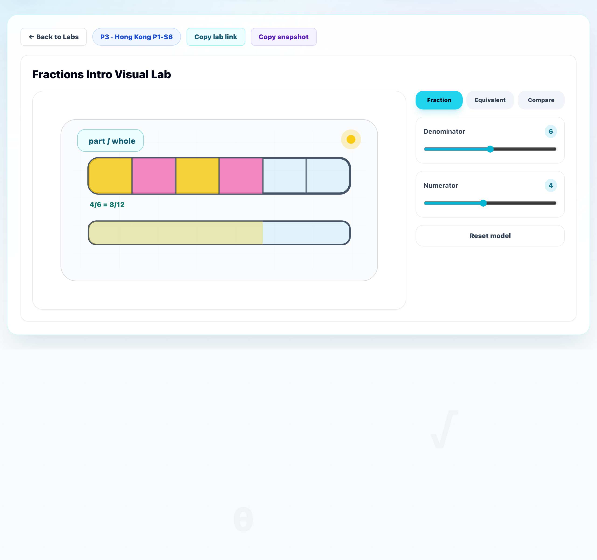
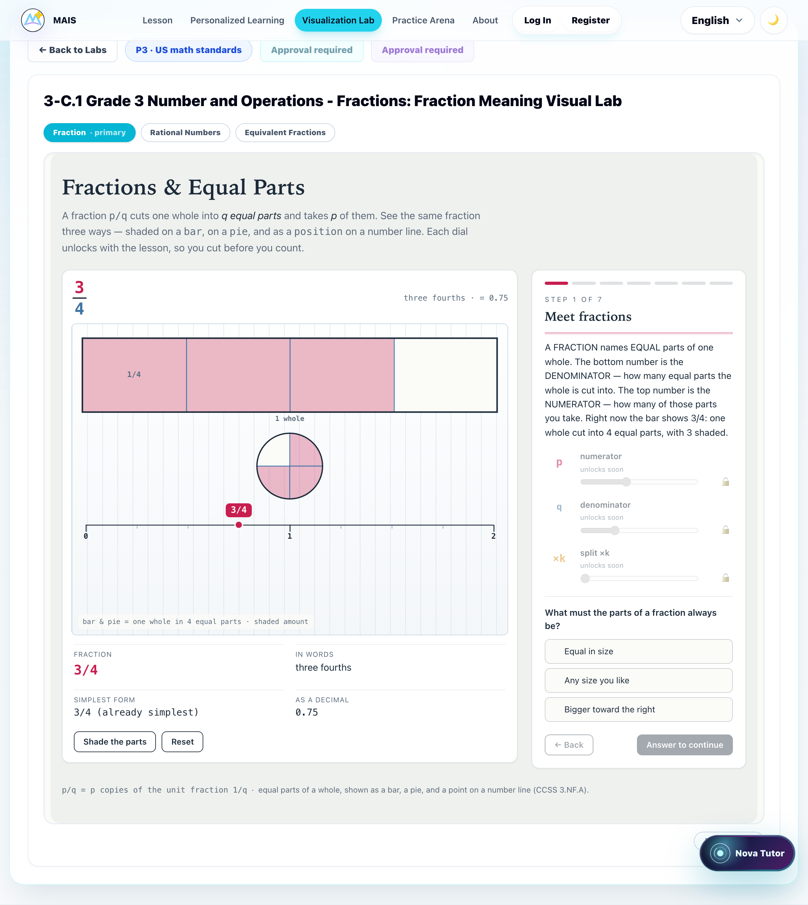
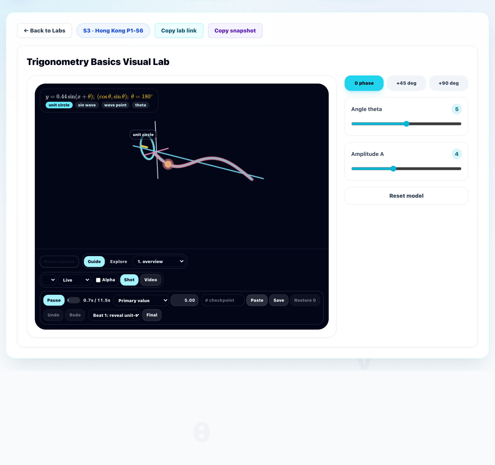
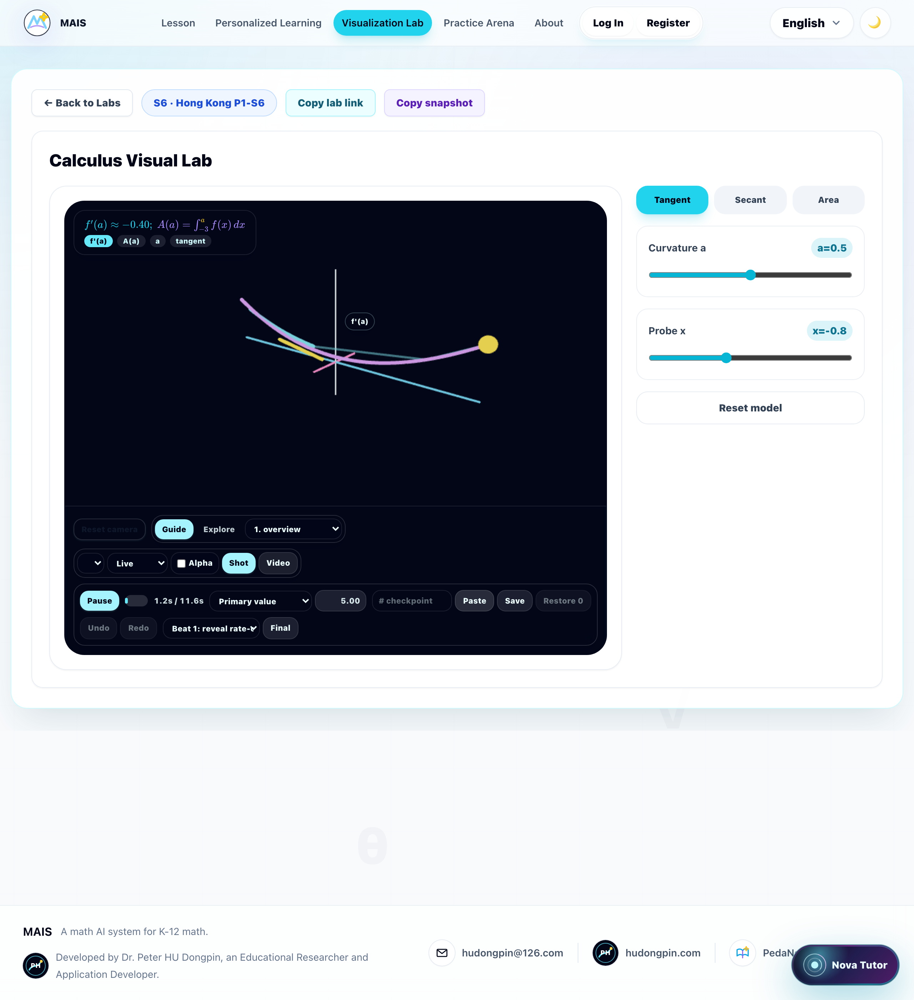
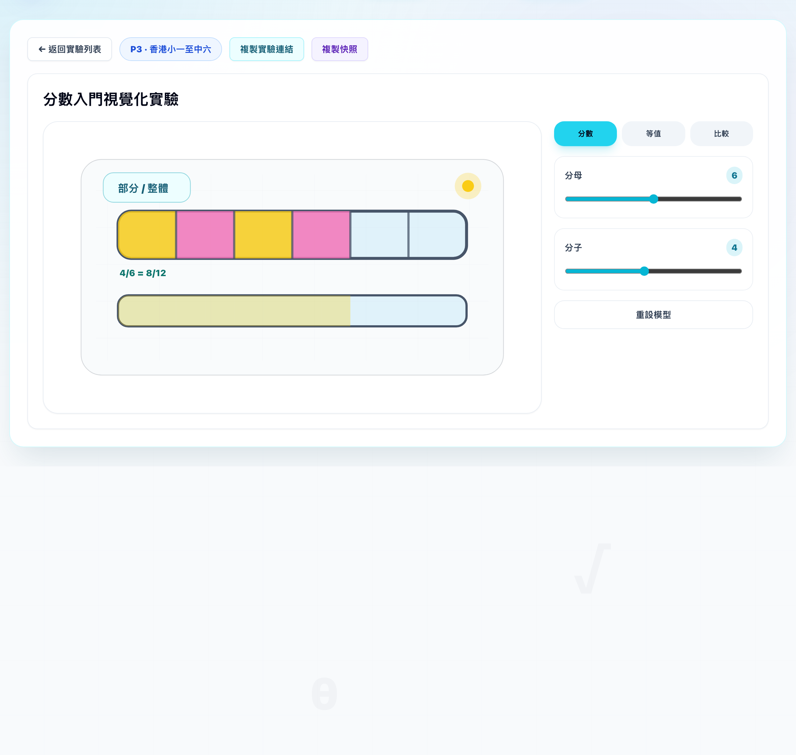

# Claude's Audit of Hong Kong Visualization Labs

**Date:** 2026-08-26
**Author:** Claude (Opus 5)
**Question asked:** California's visualization labs are now more reliable and more beautiful. Are Hong Kong's labs as good?
**Answer:** **No.** On every dimension that the California programme improved, Hong Kong is exactly where California was *before* the replacement — with the additional problem that the one thing HK does better (Traditional-Chinese localization) is precisely the thing that blocks copying California's solution across.

**Scope:** the 49 `curriculumTrack: "HK"` topics (publisher family `HK_*`), their hub labs, their in-lesson embeds, and their 3D routes.
**Verified against:** `origin/main` @ `7f7c485987` (the merge of PR #143, which landed the California programme). ⚠️ The working checkout `codex/edulab-mais` @ `a0a325f18d` is **91 commits behind** and does not contain Phase 1/2a/4 — every number below was re-measured on `origin/main` in a dedicated read-only worktree.
**Method:** `npx tsx` enumeration against the live data layer, direct source reading, a live dev server driven with Playwright for the screenshots, plus a 14-agent audit (7 dimension audits, each adversarially verified by an independent agent; 2.2M tokens, 1,008 tool calls). Claims that verification refuted or narrowed have been corrected or dropped.

---

## 1. The one-paragraph answer

California finished a four-phase programme: all 76 CA topics now render hand-authored "signature benches" in both the hub **and** the lesson, each bench carrying an executable machine proof of its mathematics; the 12 Codex 3D routes were retired. Hong Kong received none of it. **All 49 HK topics — 49 of 49, in the hub and in every lesson that has a lab at all — still render the single 3,787-line generic Codex template**, chosen by keyword heuristic, configured with five text/colour fields, carrying **zero** mathematical proof. Fifteen generic scenes are stretched across 49 topics. Nine HK topics additionally render 3D scenes that ship a **video-production authoring toolbar to students** and state formulas the code does not compute. I verified **eleven distinct mathematical defects** live on the HK surface, including a "reflection" that moves points on its own mirror line, a "probability simulation" containing no randomness, and a lab titled *Place Value to 1000* that cannot represent any number above 99.

---

## 2. The gap at a glance

| Dimension | Hong Kong | California (today) | Verdict |
|---|---|---|---|
| Hub labs on an audited bench | **0 / 49** | 76 / 76 | far behind |
| Lesson embeds on an audited bench | **0 / 49** (and only 29/49 have a lab at all) | 76 / 76 | far behind |
| Machine mathematical proofs | **0** | 192 audits, 33.4M assertions, 50,899 lines | far behind |
| Mutation-tested proofs | **0** | 16 audits · 170 mutants · 170 caught | far behind |
| Quiz / predict-then-check | **none exists in the renderer** | 5 questions + 1 calibration capstone per bench | far behind |
| Verified live math defects | **11** | 0 outstanding | far behind |
| 3D routes serving the track | 14 (9 premium + 5 standard), 0 audits | 0 (descoped 2026-08-25) | far behind |
| Per-topic curriculum metadata | **0 of 49 topics** | 76 / 76 (CCSS ids, safeguard, student note) | far behind |
| Traditional-Chinese localization | **~100% of what the lab renders** | benches are 0% CJK | **HK ahead** |
| Per-PR browser gate in CI | **yes — HK is the default track** | CA labs structurally excluded | **HK ahead** |
| Dedicated e2e specs | 0 | 6 (`california-*.spec.ts`) | behind |
| Last meaningful improvement | lane **archived unmerged** 2026-08-22 | PR #143 merged 2026-08-25 | behind |

---

## 3. What a Hong Kong student actually sees

I ran the app and captured both families side by side. This is the clearest statement of the gap.

### 3.1 Same mathematics, two families — Grade 3 fractions

| Hong Kong — `p3-fractions-intro` | California — `us-ca-math-p3-3-nf-fraction-meaning` |
|---|---|
|  |  |

The HK lab is the **entire lab**: a title, one bar, two sliders, three tabs, a reset button. The whole page text is 24 words.

The California bench for the same standard gives the student: the fraction shown three ways simultaneously (bar, pie, number line); a staged **STEP 1 OF 7** lesson; dials that stay padlocked until the step unlocks them; a predict-then-check question with three options; exact readouts (`FRACTION 3/4`, `IN WORDS three fourths`, `SIMPLEST FORM 3/4 (already simplest)`, `AS A DECIMAL 0.75`); a standards footer citing CCSS 3.NF.A; and two related benches reachable by chip.

### 3.2 The premium-3D surface

HK's nine "premium 3D" topics are the flagship of the HK lab surface. Here are two, exactly as a student receives them:

| `trigonometry-basics` (S3) | `calculus` (S6) |
|---|---|
|  |  |

Three things are visible in both, and they are not cosmetic:

1. **A video-production authoring harness is shipped to students.** `Guide / Explore`, a scene dropdown, `Live`, `Alpha`, `Shot`, `Video`, a `Pause` transport with a `0.7s / 11.5s` timeline scrubber, `Primary value`, `# checkpoint`, `Paste / Save / Restore 0`, `Undo / Redo`, `Beat 1: reveal unit-…`, `Final`. This is the Manim scene-authoring toolchain with no role or environment gate ([ThreeDLabCanvas.tsx:11080](components/visualizations/three/ThreeDLabCanvas.tsx:11080)). The scene selector is populated from all **27** families, so a learner can replace the curriculum scene with an unrelated one **while the formula strip keeps describing the original topic**.
2. **The scenes are near-identical.** Trigonometry and calculus look the same because they *are* the same: **8 of HK's 9 premium-3D topics resolve to one scene variant, `function-ribbon`** (measured below). `Reset camera` is disabled in both.
3. **The readouts contradict the dials.** The trig lab shows `y = 0.44 sin(x + θ); θ = 180°` beside sliders reading `Angle theta 5` and `Amplitude A 4`. The statistics lab shows `x̄ = −0.42; s = 1.02` beside sliders reading `Mean 5` and `Spread 2`.

### 3.3 Where Hong Kong is genuinely better

Switching the app to 繁體中文, the HK lab is **completely localized** — I measured 50 CJK characters and 1 Latin character in the rendered lab: 分數入門視覺化實驗 · 部分/整體 · 分數 · 等值 · 比較 · 分母 · 分子 · 重設模型.

The California bench in the same Chinese session renders its chrome in Chinese and **its entire interior in English**, with a spliced title (`…Fraction Meaning視覺化實驗`):

| HK lab in 繁體中文 (fully localized) | CA bench in 繁體中文 (English interior) |
|---|---|
|  |  |

**This is the central tension of the whole report** and §7 deals with it directly.

---

## 4. Surface-by-surface findings

### 4.1 The hub — 0 of 49 labs are Claude benches

```
visualizationLabCatalog by curriculumTrack × moduleId  (origin/main, npx tsx)
  HK                    {"configured-visualization-lab": 49}     ← zero signature
  US                    {"configured-visualization-lab": 224, "signature-lab": 76}
  MAINLAND_BNU 156 · MAINLAND_HJB 122 · MAINLAND_PEP_* 57 · CAPSTONE 5   (all configured)
```

Of 689 labs in the catalogue, **76 are signature benches and all 76 are California's**. The mechanism is one line — [data/visualizationLabs.ts:2513](data/visualizationLabs.ts:2513) `const moduleId = hasSignatureLab(topic.id) ? signatureModuleId : configuredModuleId;` — keyed on `signatureLabAssignments`, whose 76 keys all begin `us-ca-math-`.

**The 49 HK topics collapse onto 15 generic templates:**

| Template | n | HK topics |
|---|---:|---|
| `fraction-bar` | 6 | p3-fractions-intro, p5-fractions-operations, p6-percentages, p6-ratio-proportion, p6-pre-secondary-problem-solving, ratios |
| `number-line` | 5 | p1-counting-number-bonds, p1-addition-subtraction, p4-large-numbers, p4-decimals, integers |
| `angle-geometry` | 5 | p1-shapes-patterns, p3-geometry-patterns, p4-angles, angles, circles |
| `array-area` | 5 | p2-multiplication-foundations, p3-multiplication-division, p4-perimeter-area, p5-volume, p6-speed |
| `statistics-distribution` | 5 | p5-charts-averages, statistics-s1, data-handling, statistics-s6, exam-revision |
| `function-family` | 4 | polynomials, more-algebra, advanced-functions, mixed-problem-solving |
| `measurement-scale` | 3 | p2-length-data, p3-measurement, p5-rates |
| `coordinate-transform` | 3 | coordinates, transformations, coordinate-geometry |
| `clock-money-data` · `equation-balance` · `probability-simulation` · `function-graph` · `trig-unit-wave` · `calculus-rate-area` | 2 each | |
| `base-ten` | 1 | p2-place-value |

Counting genuinely distinct rendered scenes (template × grade band) gives **23 for 49 topics**. Per-topic differentiation amounts to five fields, of which only two reach a pixel: a decorative formula pill and an accent colour picked by **`palette[sum(charCodes(topic.id)) % 8]`** ([data/visualizationLabs.ts:2499](data/visualizationLabs.ts:2499)). The renderer contains exactly **one** topic-specific behavioural branch in 3,787 lines, and it targets a California topic.

Some template choices are simply wrong for the mathematics — `p5-volume` → `array-area` (area labelled as volume), `p6-speed` → `array-area`, `exam-revision` → `statistics-distribution`, `mixed-problem-solving` → `function-family`. Seven of these are **hand-written overrides** in `topicTemplateOverrides` ([data/visualizationLabs.ts:250](data/visualizationLabs.ts:250)) — someone chose them deliberately, and they are worse than the heuristic they replace.

*(Minor coherence bug found in passing: an HK learner is also shown the 5 CAPSTONE labs, because [VisualizationLabPage.tsx:1879](components/visualizations/VisualizationLabPage.tsx:1879) admits any capstone with `premiumLaunch` before the publisher test. Two pairs share a topic id with a real HK topic and disagree about which model it deserves.)*

### 4.2 Lesson embeds — the biggest single gap

California's Phase 1 flipped all 76 lesson embeds to the bench via a new `LessonSignatureLab`, now live at [LessonView.tsx:622](components/lesson/LessonView.tsx:622) (`"signature-lab": LessonSignatureLab`). Measured on `origin/main`:

| | HK | CA |
|---|---:|---:|
| Topics with a production lesson | 49 / 49 | 76 / 76 |
| Lessons embedding a visualization block | **29 / 49 (59%)** | 76 / 76 (100%) |
| `moduleId` of those blocks | `configured-visualization-lab` × 29 | `signature-lab` × 76 |

So **20 HK lessons contain no visualization at all** — including six 3D-enabled topics whose flagship lab the lesson never surfaces: `trigonometry-basics`, `statistics-s1`, `probability-s5`, `p3-multiplication-division`, `p4-large-numbers`, `p6-ratio-proportion`.

The other 29 carry copy that no longer matches what renders. Commit `175bfa973a` (2026-07-17) rewrote 29 `moduleId` literals to the generic template and changed **zero** lines of copy. At least 11 of 29 now describe a control the template does not have; four are outright false — `quadratic-patterns` tells a student to adjust a coefficient **`b`** that does not exist in the model, `p5-charts-averages` promises "trials" and "averages" on a two-bar chart, `statistics-s6` promises a "z-score", `p6-speed` promises a coordinate plane.

**Fixing that copy is a pure data edit in `data/lessons.ts` with no dependency on anything else in this report, and it should be done immediately** — it is an active, student-facing falsehood that has stood for six weeks.

### 4.3 Mathematical rigor — the core of "reliable"

| | HK | CA |
|---|---:|---:|
| Benches | 0 | 192 |
| Machine audits (`audit-*.mjs`) | **0** | 192 (1:1, 0 orphans, all passing) |
| Assertions executed | 0 | 33,405,610 |
| Mutation testing | 0 | 170 mutants seeded, 170 caught, 0 survivors |
| Quiz / answer keys | **none — the renderer has no assessment at all** | every key re-derived from the executing model |

`grep -cin 'quiz\|answer\|correct\|predict\|question'` over all 3,787 lines of `ConfiguredVisualizationLab.tsx` returns **0**. The file whose name most implies it protects these labs — `configuredVisualizationLabRegressions.test.ts` — reads the `.tsx` as **text** and runs 23 regex assertions against the source string. It can prove a literal is present in the file; it never executes a template's mathematics.

#### Eleven verified defects live on the HK surface

Each was read in source and, where stated, enumerated numerically. Severity is mine.

| # | Defect | HK labs affected | Evidence |
|---|---|---|---|
| 1 | **"Place Value to 1000" caps at 99.** `baseTenState` clamps tens 0–9 and ones 0–9, `total = tens*10 + ones`. The SVG renders only ten-rods and unit-squares — there is no hundreds place. The topic is *"Read, write, order, and decompose **three-digit** numbers"* and the lesson is titled *"Place Value to 1000: **Hundreds**, Tens, Ones"*. | `p2-place-value` | [ConfiguredVisualizationLab.tsx:422](components/visualizations/ConfiguredVisualizationLab.tsx:422), [:1206](components/visualizations/ConfiguredVisualizationLab.tsx:1206); [data/topics.ts:60](data/topics.ts:60) |
| 2 | **"Reflect" is not a reflection.** `(x,y) ↦ (2L − x, y + dy)` — a glide reflection sold under a `Reflect` / `反射` label, so points on the drawn mirror line move. | coordinates, transformations, coordinate-geometry | [:618](components/visualizations/ConfiguredVisualizationLab.tsx:618) |
| 3 | **"Dilate" is not a dilation about the shown centre.** `(x,y) ↦ (kx, ky + dy)` is a dilation about `(0, dy/(1−k))`, not the origin the student sees; at `k = 1` it is a pure translation still labelled *Dilation*. | same three | [:619](components/visualizations/ConfiguredVisualizationLab.tsx:619) |
| 4 | **The "probability simulation" contains no randomness.** `success`/`failure` are two slider integers; `probability = success/trials`. No `Math.random` anywhere in the path. The copy nonetheless speaks of recorded trials. | probability-s2, probability-s5 | [:578](components/visualizations/ConfiguredVisualizationLab.tsx:578) |
| 5 | **The "statistics distribution" has no data.** No dataset, no variance, no standard deviation, no quartiles — a rounded `mean` slider and an undefined quantity named `spread`. | statistics-s1, data-handling, statistics-s6, exam-revision | [:594](components/visualizations/ConfiguredVisualizationLab.tsx:594) |
| 6 | **Angles can only be multiples of 18°**, so **30°, 45° and 60° are unreachable** — the angles HK primary and junior geometry is built on. Reachable set: {0,18,36,54,72,90,108,126,144,162,180}. | p3-geometry-patterns, p4-angles, angles, circles | [:503](components/visualizations/ConfiguredVisualizationLab.tsx:503) |
| 7 | **Improper fractions are unreachable** — the numerator is clamped to the denominator, so no state has numerator > denominator (blocking percentages > 100% and ratios a:b with a>b). Large dead zones: at denominator 2, eight of ten slider positions render identically while the thumb moves. | 6 labs incl. p5-fractions-operations, p6-percentages, p6-ratio-proportion, ratios | [:383](components/visualizations/ConfiguredVisualizationLab.tsx:383) |
| 8 | **A false equality printed to students:** `P(success) = 1/3 = 0.33 = 33%`. Verified for 1/3, 1/7, 1/9, 5/9. | probability labs | [:3283](components/visualizations/ConfiguredVisualizationLab.tsx:3283) |
| 9 | **The quadratic has no linear term.** `y = ax² + c`; the vertex x-coordinate is hard-coded to the origin, so the axis of symmetry can never move. Completing the square and vertex form are unreachable. | quadratic-patterns, functions | [:2015](components/visualizations/ConfiguredVisualizationLab.tsx:2015) |
| 10 | **The "equation balance" contains no equation**, no variable and no solving step — two independent sliders, their difference, and a seesaw tilt. Nothing is unknown, so nothing can be solved for. | algebra-basics, linear-equations | [:740](components/visualizations/ConfiguredVisualizationLab.tsx:740) |
| 11 | **Slider dead zones.** Vertical shift: 6 of 11 positions duplicate. Scale factor: 4 of 11 duplicate. | coordinate-transform labs | [:608](components/visualizations/ConfiguredVisualizationLab.tsx:608) |

Defects 1, 4, 5, 6, 9 and 10 are not polish items: a student who uses the lab as instructed forms a **false belief** — that place value stops at 99, that probability is a slider ratio, that a "spread" is a thing you set rather than measure, that a parabola's axis of symmetry is always the y-axis.

In fairness, the auditing agent tested five further plausible defects (number-line clamping, the calculus derivative, the trig wave, the log-growth formula, defensive guards) and found them **sound**. The template is not uniformly broken; it is unproven, and where it is wrong nothing catches it.

### 4.4 The 3D surface

| | HK | CA |
|---|---:|---:|
| 3D-enabled topics | 14 (9 premium, 5 standard) | **0** — descoped 2026-08-25 |
| Hand-authored lab definitions | **0** — all 9 synthesized from the lab-id string | 1 before descope, 0 after |
| Mathematical audits / mutation tests | **0** | n/a (retired) |
| Route smoke coverage | **1 of 9** (`advanced-functions`, chosen alphabetically) | n/a |
| Coverage band | `hong-kong { min: 8, max: 10 }` | `california { min: 0, max: 0 }` |

**HK's nine premium topics render six distinct scenes between fourteen 3D labs, and eight of the nine premium ones share a single variant:**

```
HK 3D-enabled topics by scene variant (origin/main, npx tsx)
  function-ribbon      8   quadratic-patterns, trigonometry-basics, functions, advanced-functions,
                           trigonometry-s5, differentiation-intro, calculus, mixed-problem-solving
  distribution-machine 2   statistics-s1, probability-s5
  array-blocks 1 · measurement-rail 1 · geometry-axes 1 · fraction-slices 1
```

Trigonometry, quadratics, calculus and "mixed problem solving" are the same ribbon. That is why the screenshots in §3.2 are indistinguishable.

Further verified problems:

- **The integral is not an integral.** The formula strip claims `A(a) = ∫₋₃ᵃ f(x)dx`; the object labelled `area-accumulation` is `max(0, f(x)) * 0.72` — a scaled copy of `f`. No antiderivative is computed anywhere in the tree. Live for HK `calculus` and `differentiation-intro`, and inherited by 7 further Mainland/AR/capstone labs on the same family. ([mathSceneRegistry.ts:748](components/visualizations/three/manim/mathSceneRegistry.ts:748), [:834](components/visualizations/three/manim/mathSceneRegistry.ts:834))
- **The sampling noise grows with n.** The "experimental frequency" is `Math.sin(...) * 0.08 * sampleScale` with `n = 18 + sampleScale*28` — so the wobble **increases** with sample size, the exact inverse of the √(p(1−p)/n) law the S5 topic exists to teach. ([:1574](components/visualizations/three/manim/mathSceneRegistry.ts:1574))
- **The unit-circle ↔ sine-wave correspondence is never established.** Circle radius is a constant `0.72` while wave amplitude is `comparison/9`; they agree only at an unreachable slider value, and the wave is drawn over `x ∈ [0.12, 0.12+2π]` so the `x = 0` point that would carry the correspondence is never drawn. ([:634](components/visualizations/three/manim/mathSceneRegistry.ts:634))
- **Four of nine HK premium routes display the wrong grade.** `inferGradeFromLabId()` guesses from substrings and falls through to a hard-coded `return "S4"` — HK ids are bare (`calculus`, not `us-ca-math-s6-…`), so `quadratic-patterns` and `trigonometry-basics` show S4 (really S3), `differentiation-intro` shows S4 (really S5), `mixed-problem-solving` shows S4 (really S6). ([premiumThreeDDirectLabs.ts:344](components/visualizations/premiumThreeDDirectLabs.ts:344))
- **All 9 ship the same sentence** as their description, with `xLabel="input"` / `yLabel="output"` — including the trigonometry and probability labs.
- **No proof exists.** 213 test files under `three/` assert object counts, ids and source-text regexes. The primitives layer does contain value-level tests, but **no test anywhere evaluates a curriculum scene builder's output against an independently written closed form.** That is what let the false integral ship, and one test literally pins the defective area curve's identity (`/id:\s*"area-accumulation"/`) without ever checking its value.

**Structural consequence:** California could retire its 3D routes because it had 76 benches to redirect to. HK has none, and its coverage band has a **floor of 8** — HK cannot descope without editing the contract. HK now holds 9 of the 68 remaining premium routes; Mainland holds 47. The renderer behind them is a single 656,849-byte / 11,296-line client component.

### 4.5 QA history — the HK lane was archived, not shipped

- The HK visualization lane `codex/a06-hk-visualization-labs-loop` was **converted to a private evidence archive on 2026-08-22 and never PR'd**. 182 paths, 202,564 insertions. Its own decision record says: *"Do not open a PR from this worktree and do not claim exhaustive HK browser or curriculum acceptance,"* and *"Current-turn runtime/browser/content tests: NOT RUN."*
- A further **128 HK visualization contract tests / 4,671 lines** sit unmerged on `codex/a18-hk-ease-v2-qa`. These already re-derive HK mathematics independently — the same technique CA ships. **Harvesting them is far cheaper than rewriting them.**
- **Zero** HK-specific visualization test files and **zero** HK e2e specs exist on `main`. California has six `california-*.spec.ts`.
- The recorded HK browser evidence carries run ids dated **2026-06-28** — but HK lab definitions last changed **2026-07-17**. **The green record is 19 days older than the configuration it certifies.**
- Four HK curriculum-fit questions raised for sign-off on 2026-07-10 (`coordination/content-qa/2026-07-10-A18-lesson-visualization-realignment-review.md`) were **never answered**, and all four mismatches are still live in the data.

**Two things HK is genuinely ahead on**, and they should not be lost in any migration:

1. **HK is the default track in CI's per-run visualization gates.** `.github/workflows/ci.yml` runs a dedicated `visualization-browser` job on every PR against `visualization-contract.spec.ts`, which logs in as the **HK** demo student — so HK labs are the ones actually exercised, and **CA labs are structurally excluded**. (Caveat: the gate samples only **3 of 54** accessible labs per run, so 46 of the 49 HK labs are never touched.)
2. **HK has its own language quality gate** — `check:hk-zh` / `scripts/audit-hk-chinese.mjs`, grounded in the EdB 《數學科常用英漢辭彙》 glossary, covering `data/visualizationLabs.ts`. It runs report-only today (its `--mode=strict` is written but wired into neither `check` nor CI).

---

## 5. Localization: HK's advantage is also the blocker

This is the finding that changes the shape of the recommendation.

| | Codex template (HK today) | Claude benches (CA today) |
|---|---|---|
| CJK in the source | 164 inline `t({en, zh, zhHans})` calls; exactly **1** untranslated DOM string | **0 CJK characters in all 387 signature files** |
| HK catalogue coverage | 49/49 labs carry `zh` title, description, category, gradeLabel, focus, formula | n/a |
| Measured in the running app | **50 CJK chars / 1 Latin char** | English interior inside Chinese chrome |

Porting California's solution to HK unmodified would **replace a fully-localized shallow lab with a deep English-only one** — for a Traditional-Chinese-medium track. Until the benches are localized, an HK flip is a localization *regression*.

And localizing them is not a data project. The 192 benches carry roughly **13,865 English strings / ~145,000 English words**, and the hard half is structural:

- **1,503 `ctx.fillText` canvas draws** across 191 of 192 benches — 520 of them carry English (1,542 words) painted directly onto the canvas, not extractable to a string table.
- **0** of the 192 benches declares a CJK-capable font family.
- **159 of 192 audits assert on the English text** (1,045 string literals: 109 read `step.q`, 106 `.feedback`, 90 index into `choices[...]`). Editing bench strings carelessly **invalidates the very proofs that make the benches trustworthy.**

Two smaller notes for balance: the HK template is not perfectly localized either — 16 English fragments survive in its SVG text layer (`mean = , spread =`, `tens + ones =`, `Re`, `Im`, `cm`) and the entire in-canvas 3D toolbar is English-only. And CA's own generated student note leaks untranslated English into Chinese prose (`Read me first：這個…`, [data/visualizationLabs.ts:2280](data/visualizationLabs.ts:2280)) — a CA-side defect HK never sees, since `studentNote` is CA-gated.

---

## 6. Can Claude benches even be assigned to HK topics?

**Mechanically, yes — and more easily than expected.** The renderer is completely track-agnostic: `hasSignatureLab` and `componentForDirectoryLab` key on **topic id alone**, with no curriculum test. Adding HK keys to `data/signatureLabAssignments.ts` would flip all 49 hub tiles *and* — because Phase 1 already landed — the lesson embeds too, **with no code change**.

Two caveats:
- The 29 lesson blocks' `moduleId` literals must flip **in the same commit**, or `lib/mvpReadiness.test.ts:762` reds CI on 29 rows.
- `safeguard` and `studentNote` are hard-gated on `isCaliforniaTopic`, so HK benches would ship with neither. That generator needs generalizing in the same PR.

**Curricularly, there is no join key.** HK topic records carry nine fields — `id, grade, title, description, status, difficulty, minutes, mastery, curriculumTrack` — **not one of them curricular**. No CCSS tag, no CDC learning-unit code, no strand, no Key Stage, no Compulsory/M1/M2 marker. California's assignments were derived from topic-id parsing plus hand-authored CA-only lookup tables; none of that machinery can be pointed at HK. So an HK mapping is **hand-curation**, exactly as CA's own generator instructs (*"a human still chooses the primary and writes the rationale. Do not auto-generate the assignments file"*).

### The curated 49-row mapping

The audit produced a defensible bench for **48 of 49** HK topics — **42 good fits, 6 stretches, 1 true gap**. Bench-side claims were verified against the shipped `.jsx`; HK-curriculum judgements are the auditor's and need your sign-off.

| Grade | Topic → Bench | Fit |
|---|---|---|
| P1 | `p1-counting-number-bonds` → **NumberBondLab** · `p1-addition-subtraction` → **AddLab** · `p1-shapes-patterns` → **ShapesLab** · `p1-measurement-time` → **LengthComparisonLab** | 4 good |
| P2 | `p2-place-value` → **TwoDigitNumberLab** *(stretch: HK is to 1000)* · `p2-multiplication-foundations` → **MultiplicationLab** · `p2-money-time` → **TimeLab** *(stretch: MoneyLab is US coinage)* · `p2-length-data` → **MeasurementLab** | 2 good, 2 stretch |
| P3 | `p3-multiplication-division` → **MultiplicationLab** · `p3-fractions-intro` → **FractionLab** · `p3-measurement` → **GramsAndLitersLab** · `p3-geometry-patterns` → **SymmetryLab** | 4 good |
| P4 | `p4-large-numbers` → **RoundingLab** · `p4-decimals` → **DecimalLab** · `p4-angles` → **AngleTurnLab** · `p4-perimeter-area` → **RectangleLab** | 4 good |
| P5 | `p5-fractions-operations` → **FractionAdditionLab** · `p5-volume` → **VolumeLab** · `p5-rates` → **ProportionalLab** · `p5-charts-averages` → **MeanLab** | 4 good |
| P6 | `p6-percentages` → **PercentageLab** · `p6-ratio-proportion` → **RatioLab** · `p6-speed` → **GraphStoryLab** *(stretch)* · `p6-pre-secondary-problem-solving` → **TwoStepLab** *(stretch: no bar model)* | 2 good, 2 stretch |
| S1 | `integers` → **IntegerLab** · `algebra-basics` → **VariableLab** · `angles` → **AngleLab** · `ratios` → **ProportionalLab** · `statistics-s1` → **DataLab** | 5 good |
| S2 | `linear-equations` → **EquationLab** · `coordinates` → **PointLab** · `transformations` → **TransformationsLab** · `probability-s2` → **ProbabilityLab** | 4 good |
| S3 | `polynomials` → **PolynomialArithmeticLab** · `quadratic-patterns` → **QuadraticFunctionLab** · `trigonometry-basics` → **TrigRatioLab** · `circles` → **CircleTheoremsLab** | 4 good |
| S4 | `functions` → **FunctionLab** · `coordinate-geometry` → **CoordinateMethodsLab** · `more-algebra` → **ExponentRulesLab** *(stretch)* · `data-handling` → **HistogramLab** | 3 good, 1 stretch |
| S5 | `advanced-functions` → **ExponentialFunctionLab** · `trigonometry-s5` → **UnitCircleLab** · `probability-s5` → **ConditionalLab** · **`differentiation-intro` → DerivativeLab** | 4 good |
| S6 | **`calculus` → IntegralLab** · `statistics-s6` → **NormalDistributionLab** · `mixed-problem-solving` → **OptimizationLab** *(stretch)* · `exam-revision` → **GAP** | 2 good, 1 stretch, 1 gap |

**The headline of this table:** California left four benches homeless — `DerivativeLab`, `IntegralLab`, `LimitLab`, `SeriesLab` — because CCSS-M has no calculus standards. **Hong Kong has calculus.** Assigning `DerivativeLab → differentiation-intro` and `IntegralLab → calculus` gives 222 KB of fully-proven, mutation-audited mathematics a home for the first time and takes library reachability from **188/192 to 192/192**. It is a pure data edit and the highest value-per-byte change in this entire audit.

*One nuance to settle with a curriculum owner:* HKDSE calculus lives in the **Extended Part** (M1/M2), not the Compulsory Part. The repo carries no module tagging, and its own HK metadata is inconsistent (`data/rag/hongKongMathEdB.ts:57-68` treats `differentiation-intro` as Compulsory while excluding `calculus` and `statistics-s6`).

### Nine benches HK genuinely needs

Where HK's curriculum truly diverges from CCSS-M — these are not tagging gaps:

1. **HKD MoneyLab** — `MoneyLab.jsx` is measurably US coinage (61×`¢`, 34 dime, 25 nickel, 22 quarter, 10 penny; **zero** HK$ denominations), yet `p2-money-time` says *"Solve simple Hong Kong money questions."* A parent would spot this in ten seconds.
2. **Bar-model / unitary-method bench** — zero of 192 benches use the representation; it is *the* canonical HK primary problem-solving tool.
3. **Speed bench** (`s = d/t`, km/h ↔ m/s) — `GraphStoryLab` reads distance-time graphs but never derives speed.
4. **Cumulative-frequency / ogive bench** — zero hits across 192 benches; a British-system statistic with no CCSS analogue.
5. **Law of Sines bench** (with the ambiguous case) — only the cosine rule is benched.
6. **Algebraic-fractions bench** — `RationalFunctionLab` graphs rational functions but does not manipulate algebraic fractions.
7. **A.S./G.S. summation topic** — Compulsory Part content with no home in the 49-topic HK model at all.
8–9. Strategy-selection and revision-planning surfaces for `mixed-problem-solving` and `exam-revision` — **or an honest descope.** Assigning either an existing bench would be exactly the generated-alignment dishonesty the Codex family is being replaced for.

---

## 6b. Fixes landed since this audit

Branch [`claude/hk-viz-defect-fixes`](https://github.com/HUDongpin/MAIS-MVP/tree/claude/hk-viz-defect-fixes), seven commits off `origin/main`. `npm run check` exits 0 (type-check, zh-hans strict, analytics, accommodations, content-safety, rag, question-bank, mvp, components, build). No PR opened yet.

**Every engineering item in this report is done** — all of Track A, all four items I initially deferred, and Track C's harvest question is answered below. **One decision remains and it is yours: Track B, the Traditional-Chinese question.** Nothing else is blocked on it.

| # | Defect | Fix |
|---|---|---|
| 7 | Manim authoring harness reachable by students | `presentation` / `threeDPresentation` now default to `"learner"`. Verified in-page: `presentation="learner"`, `authoring-controls-visible="false"`, **0** scene-selector elements, **0** Shot/Video/Paste/Save/Restore/Undo/Redo/Pause buttons |
| 2 | "Reflect" was a glide reflection | A reflection. Vertical dial disabled — the transformation has one parameter |
| 3 | "Dilate" moved its own centre | A dilation about the origin; `k = 1` is the identity, not a translation |
| 6 | Angles limited to multiples of 18° | 15° steps over 0–12: 30/45/60/90/120/135 reachable; model also reports sum + complementary/supplementary |
| 1 | *Place Value to 1000* capped at 99 | Hundreds flats + ten rods + one units, reaching 999. Verified: "3 hundreds + 4 tens + 5 ones = 345" |
| 8 | `P(success) = 1/3 = 0.33` | New `roundedRelation` helper picks `=` or `≈` honestly. Verified: "P(success) = 1/3 ≈ 0.33 ≈ 33%" |
| 11 | Slider dead zones | Every position is now a distinct state on both dials |
| — | Trig amplitude shown rounded | Exact tenths over a 1–10 slider. Verified: `y = 0.40 sin(x + θ)` at `A = 4` — strip and dial agree |
| — | 4 of 9 HK premium routes showed the wrong grade | Correct for all 9; local table, cross-checked against the catalogue by test |
| — | 9 HK routes shared one boilerplate description; every axis "input"/"output" | Per-topic localized copy; axis names follow the template's mathematics |
| — | 3D "integral" was `0.72·f(x)` | The true antiderivative `(a/6)(t³+27) + 0.35(t+3)`, plotted and reported |
| — | Sampling noise grew with `n` | Deviation is now the standard error `√(p(1−p)/n)`, so a bigger sample settles |
| — | Unit circle radius pinned at 0.72 | Radius **is** the amplitude; wave now drawn from `x = 0` so the correspondence point exists |
| — | 29 HK lesson blocks described controls that don't exist | All 29 rewritten in English and Traditional Chinese |

**The structural fix that matters most.** The audit's central criticism was that these labs have *zero* mathematical proof — only source-text greps. That is now false:

- `configuredVisualizationLabModel.ts` — the pure model, extracted so a test can execute it (a `.tsx` compiles to `.jsx` and cannot be required by the node harness).
- `configuredVisualizationLabModel.test.ts` — asserts the *defining property* of each transformation. **8 seeded mutants, 8 caught.**
- `mathSceneCurriculumMath.test.ts` — the first test under `three/` to evaluate what a curriculum scene actually plots, by inverting each scene's declared affine map and comparing against an independently written closed form. **5 seeded mutants, 5 caught.**
- `premiumThreeDDirectLabs.test.ts` — checks all 63 premium routes that name a topic, not just the four repaired.

Worth stating plainly: the first draft of the transformation proof **missed** the glide-reflection mutant, because it pinned the one dial position where the defect is invisible. Mutation testing caught my test, not just the code.

**The four items I first deferred are now closed too:**

| Item | What was done |
|---|---|
| CAPSTONE topic-id collision (§4.1) | All five capstone labs reuse an HK topic id, and three ask for a *different template* than the HK lab. The HK lab does win — capstone labs are `primaryForTopic: false` — but nothing pinned it. `visualizationTopicOwnership.test.ts` makes it a contract; **5 seeded mutants, 5 caught** |
| `gradeSeeds` omitting `angles` | Added to the S1 seed. **49/49** HK topics now reachable through the only HK↔CCSS crosswalk in the repo (was 48/49) |
| Stale 2026-06-28 browser evidence | Re-running needs Playwright, so rather than leave twelve packages reporting a misleading "passed", staleness is now **derived data**: a declared surface revision, a declared capture date, and a flag computed from the two, pinned by `visualizationBrowserRegressionStaleness.test.ts` |
| A18 questions, open since 2026-07-10 | All four answered from what each template *computes*, in `coordination/content-qa/2026-08-26-A18-lesson-visualization-realignment-response.md` |

On the seven `topicTemplateOverrides`: I read each template's model rather than trusting its name, and **recommend no mapping change**. `p6-speed` → `array-area` is defensible — `distance = speed × time` is the same product structure the array computes — and none of the 18 templates plots a distance-time graph, so switching trades one mismatch for another. The real fix is a speed bench. What was wrong was the *copy*, and that is fixed.

**Corrections to this report, found while fixing:**
1. §4.4 said `three/` carries 8 pre-existing failures. Measured on `origin/main`: **47**.
2. **I was wrong about `statistics-s6`.** I reported it as rendering `calculus-rate-area`. It renders `statistics-distribution` — the A18 review had it right. My enumeration built a map keyed on `topicId` without filtering `primaryForTopic`, and the capstone lab sharing that id silently overwrote the real entry. The product was correct; my measurement was not. The lesson copy I wrote from that misreading has been corrected.

**One question genuinely cannot be closed here.** `statistics-s6`'s template shows a centre marker and a spread band — no data set, no standard deviation, no sampling. The natural fix is `NormalDistributionLab`, which already exists with a mutation-tested audit. But assigning it makes that topic's lab English-only, which *is* the Track B decision below. Until that is made, the honest remedy is what shipped: copy that states the limit outright.

---

## 7. What I would do

Three tracks. The first needs no strategic decision and should start now.

### Track A — fix what is wrong, regardless of strategy *(days, no decisions needed)*

These are cheap, isolated, and correct real student-facing errors that persist under **any** future direction:

1. **Re-author the 29 HK lesson blocks' bilingual copy** so it describes what actually renders. Pure `data/lessons.ts` edit. Removes a six-week-old falsehood.
2. **Fix the transformation defects** — drop the `+ dy` from the reflect and dilate branches, or rename the modes and fix the notes.
3. **Change the angle step from 18° to 15°** so 30°/45°/60° become reachable.
4. **Stop printing `=` between exact and rounded values**; introduce an `approx()` helper (CA already has the rule written down).
5. **Remove the slider dead zones** — align clamps to slider bounds in `dy`, `dilationScale`, and the fraction numerator.
6. **Add a hundreds place to `base-ten`**, or retitle the topic.
7. **Gate the Manim authoring harness** behind a non-student flag. A learner can currently swap the curriculum scene while the formula strip keeps describing the original.
8. **Fix HK grade inference** — look the grade up from `topics` by id instead of guessing from the string. One file, blocker-class, user-visible.
9. **Fix or retract the false integral and the false sampling model**, or drop the `∫` and `p̂ₙ → p` claims from the formula strips.
10. **Re-run the 12 HK browser packages** and replace the stale 2026-06-28 run ids; add a test asserting the evidence is not older than the data it certifies.
11. **Answer the four A18 curriculum-fit questions** from 2026-07-10.

### Track B — the strategic decision *(needs you)*

**Should HK move to Claude signature benches, and what happens to Chinese?**

| Option | What HK students get | Cost |
|---|---|---|
| **B1 — Flip now, English benches in Chinese chrome** | Proven mathematics, staged lessons, predict-then-check on 48/49 topics immediately; **loses full Chinese localization** | Small: one curated assignment table + generalize the safeguard/note generators |
| **B2 — Localize first, then flip** | Everything, in Traditional Chinese | Very large: ~13,865 strings incl. 520 canvas draws, plus reworking 159 audits that assert on English text |
| **B3 — Stay on the template, fund its audit debt** | Chinese preserved; caps at "audited Codex quality" — no staged lesson, no assessment, no calibration | Medium-large: an audit per lab, from scratch |
| **B4 — Hybrid** *(my recommendation)* | Benches where the mathematics is language-light and the gain is largest (S3–S6 algebra/trig/calculus/statistics); localized template retained for P1–P3 where reading load is highest and the current labs are least wrong | Moderate, and it lets you learn from a small first slice |

Whichever you choose, note that **California's Phase 1 machinery is already built and track-agnostic** — the expensive part for HK is curation and language, not engineering.

### Track C — harvest before rebuilding · **DONE**

Decided in `coordination/release-intake/2026-08-26-hk-visualization-archive-harvest-disposition.md`, from reading the files rather than the line counts.

I was too optimistic in the first draft of this report. The 128 tests on `codex/a18-hk-ease-v2-qa` are **not** cheap to harvest: every one imports `components/visualizations/hk/*`, an HK-specific renderer that is not on main and is not coming, so rebasing means rewriting every assertion. Part of the oracle also slices component *source text* — the same technique this audit criticised.

**Harvest**: only the renderer-agnostic mathematics in `hkPrimaryFinalCurriculumOracle.test.ts` (independently written `factors` / `factorPairs` / `hcf` / `lcm` and the curriculum values they check). Half a day, no dependency on reopening the archive.
**Everything else**: historical record. Review date **2026-11-26**; if nothing is harvested by then, that is an answer too.

---

## 8. Verification provenance

- **Enumerations** (`npx tsx` against `data/visualizationLabs.ts`, `data/topics.ts`, `data/lessons.ts`, `data/signatureLabAssignments.ts`, `components/visualizations/three/threeDSceneMath.ts`) run in a read-only worktree at `origin/main` @ `7f7c485987`.
- **Screenshots** captured from a dev server on port 3145 with an isolated `NEXT_DIST_DIR`, at 1280×1400 / DPR 2, via Playwright (`PLAYWRIGHT_BROWSER_CHANNEL=""`).
- **Multi-agent audit** `wf_5250e9aa-f39`: 7 dimension audits + 7 adversarial verifications, 14 agents, 2,224,991 tokens, 1,008 tool calls, 0 errors. Every dimension returned `SOME_REFUTED` — corrections were applied and refuted claims dropped, notably: HK's template distribution (the brief's figures summed to 52, not 49 — the corrected distribution is in §4.1); "CA's join is a description regex scrape" (it is topic-id parsing plus hand-authored tables); "the 3D stack is arbitrary layout arithmetic" (the scenes do use real slider semantics — what is absent is **proof**, not implementation); and the `statistics-distribution` / `angle-geometry` defect blast radius, narrowed from 5 HK labs to 4 in each case.
- **Not verified in a browser:** the lesson-embed surface (I read the render path and the data, and captured only hub labs). The `p2-place-value` cap, the scene-variant collapse, the coverage bands and the lesson-embed counts are my own first-hand measurements.

**Housekeeping:** the audit worktree `/Volumes/Starship/MAIS-hk-viz-audit-wt` was created read-only for this report and removed on completion. Nothing in the repository was modified; this file and `hk-viz-audit-evidence-20260826/` are the only additions.
