# Mainland HJB High Lesson Illustrations V1 Review

- Owner/manual review approved on 2026-05-27.

- Generated at: 2026-05-27T11:34:15.087Z
- Generator: Codex built-in image generation after `bl` reported no DashScope API key in the shell.
- Scope: 30 Mainland HJB high-school lessons, 2 candidates per lesson.
- Production status: Approved and integrated for production on 2026-05-27. Owner/manual review approved all 60 candidates.
- Review statuses: all 60 candidates are `approved`.

## Review Criteria

- Mathematical correctness and fit to the HJB lesson objective.
- No copied textbook/page/screenshot look, publisher marks, logos, or watermarks.
- No wrong formulas, unreadable text, stray labels, or misleading geometry/data encoding.
- Clear student learning value and accurate alt/caption text.

## Candidates

### hjb-high-s4-等式与不等式 / concept

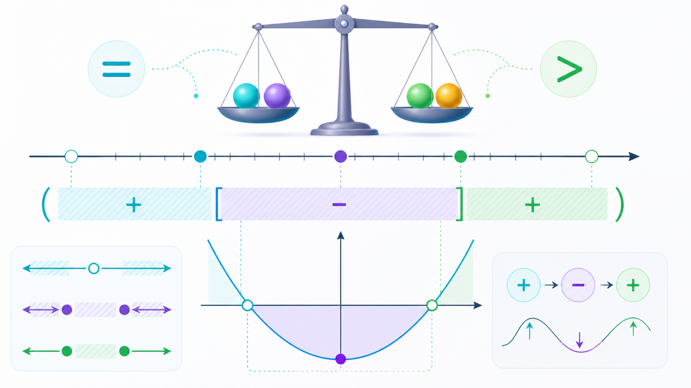

- ID: `hjb-high-s4-等式与不等式-concept`
- Status: `approved`
- Grade: `S4`
- Volume: 必修 第一册
- Chapter: 等式与不等式
- RAG cards: `hjb-high-compulsory-1-equations-inequalities`
- Alt zh-Hans: 天平、数轴和抛物线把等式、不等式、根和符号区间联系起来。
- Caption zh-Hans: 等价变形要保持解集和端点判断不变。

### hjb-high-s4-等式与不等式 / worked-example

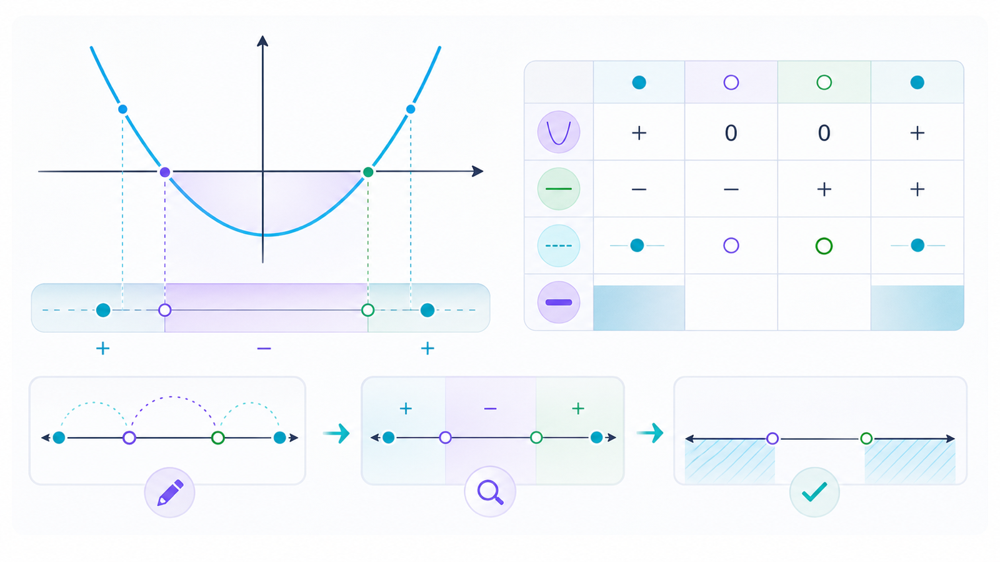

- ID: `hjb-high-s4-等式与不等式-worked-example`
- Status: `approved`
- Grade: `S4`
- Volume: 必修 第一册
- Chapter: 等式与不等式
- RAG cards: `hjb-high-compulsory-1-equations-inequalities`
- Alt zh-Hans: 抛物线旁的符号表突出端点选择和有效解区间。
- Caption zh-Hans: 先标根，再测区间，最后只写满足不等式的部分。

### hjb-high-s4-复数 / concept

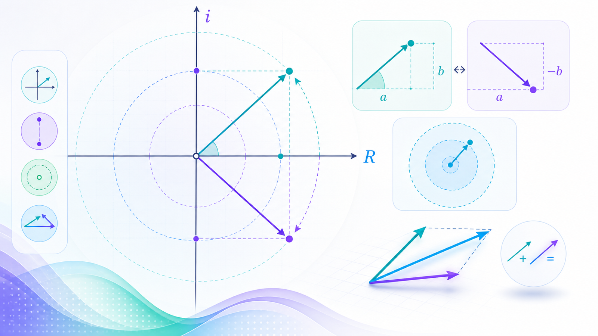

- ID: `hjb-high-s4-复数-concept`
- Status: `approved`
- Grade: `S4`
- Volume: 必修 第二册
- Chapter: 复数
- RAG cards: `hjb-high-compulsory-2-complex-numbers`
- Alt zh-Hans: 复平面展示实部虚部定位、共轭反射、模长圆和箭头运算。
- Caption zh-Hans: 复数可以同时用代数运算和复平面几何来检查。

### hjb-high-s4-复数 / worked-example

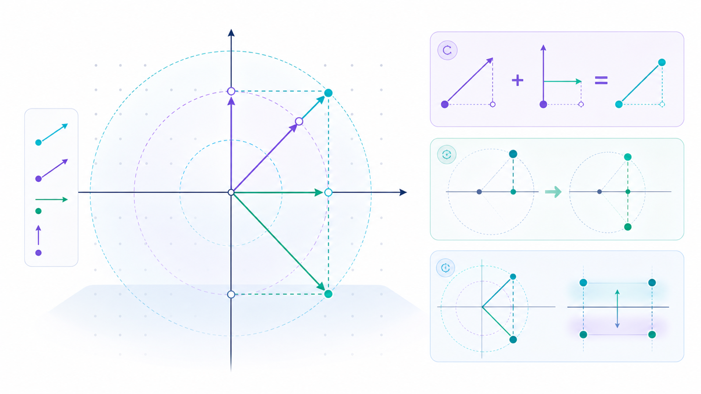

- ID: `hjb-high-s4-复数-worked-example`
- Status: `approved`
- Grade: `S4`
- Volume: 必修 第二册
- Chapter: 复数
- RAG cards: `hjb-high-compulsory-2-complex-numbers`
- Alt zh-Hans: 复平面例题把箭头合成为结果点，并通过反射检查共轭。
- Caption zh-Hans: 分别追踪实部和虚部移动，再用图像检查最终点。

### hjb-high-s4-函数的概念-性质及应用 / concept

- ID: `hjb-high-s4-函数的概念-性质及应用-concept`
- Status: `approved`
- Grade: `S4`
- Volume: 必修 第一册
- Chapter: 函数的概念、性质及应用
- RAG cards: `hjb-high-compulsory-1-function-concepts-applications`
- Alt zh-Hans: 函数机器和图像窗口展示定义域、值域、单调性和对称线索。
- Caption zh-Hans: 先确定允许输入，再分区间读取输出怎样变化。

### hjb-high-s4-函数的概念-性质及应用 / worked-example

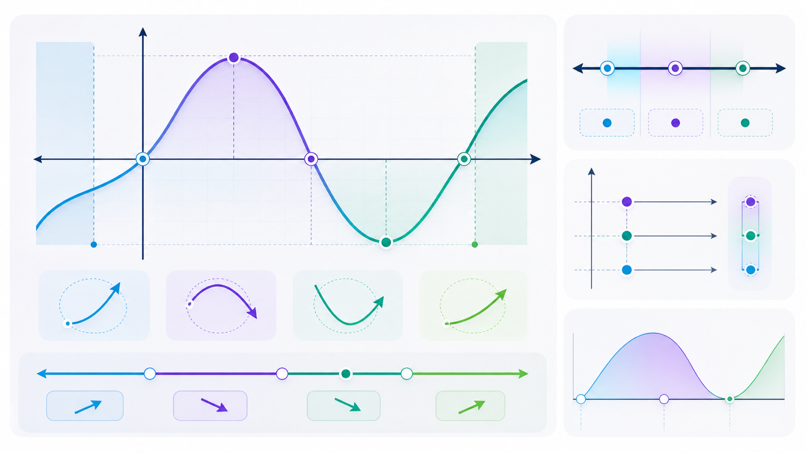

- ID: `hjb-high-s4-函数的概念-性质及应用-worked-example`
- Status: `approved`
- Grade: `S4`
- Volume: 必修 第一册
- Chapter: 函数的概念、性质及应用
- RAG cards: `hjb-high-compulsory-1-function-concepts-applications`
- Alt zh-Hans: 读图板突出输入范围、输出高度、零点和区间箭头。
- Caption zh-Hans: 定义域、零点和单调性要作为不同图像特征分别检查。

### hjb-high-s4-集合与逻辑 / concept

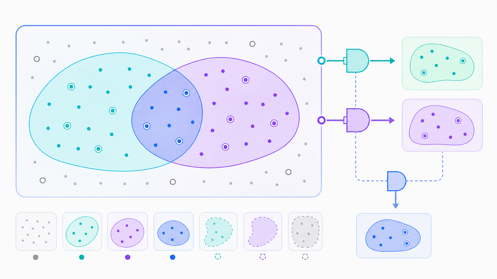

- ID: `hjb-high-s4-集合与逻辑-concept`
- Status: `approved`
- Grade: `S4`
- Volume: 必修 第一册
- Chapter: 集合与逻辑
- RAG cards: `hjb-high-compulsory-1-sets-logic`
- Alt zh-Hans: 全集框中的重叠集合区域展示元素归属、集合运算和条件筛选。
- Caption zh-Hans: 先确定全集，再比较每个条件对应的区域。

### hjb-high-s4-集合与逻辑 / worked-example

- ID: `hjb-high-s4-集合与逻辑-worked-example`
- Status: `approved`
- Grade: `S4`
- Volume: 必修 第一册
- Chapter: 集合与逻辑
- RAG cards: `hjb-high-compulsory-1-sets-logic`
- Alt zh-Hans: 集合运算工作区逐步缩小到交集区域，并用补集区域作目视检查。
- Caption zh-Hans: 用公共区域和补集一起检查，避免把条件方向弄反。

### hjb-high-s4-幂-指数与对数 / concept

- ID: `hjb-high-s4-幂-指数与对数-concept`
- Status: `approved`
- Grade: `S4`
- Volume: 必修 第一册
- Chapter: 幂、指数与对数
- RAG cards: `hjb-high-compulsory-1-powers-exponents-logarithms`
- Alt zh-Hans: 指数方块、根式模块和对数箭头展示幂与对数的可逆关系。
- Caption zh-Hans: 使用幂和对数法则前，必须先检查底数和定义域条件。

### hjb-high-s4-幂-指数与对数 / worked-example

- ID: `hjb-high-s4-幂-指数与对数-worked-example`
- Status: `approved`
- Grade: `S4`
- Volume: 必修 第一册
- Chapter: 幂、指数与对数
- RAG cards: `hjb-high-compulsory-1-powers-exponents-logarithms`
- Alt zh-Hans: 转换板用可逆箭头连接指数式、根式和对数式。
- Caption zh-Hans: 每次只改写一步，并确认不同形式保留相同限制。

### hjb-high-s4-幂函数-指数函数与对数函数 / concept

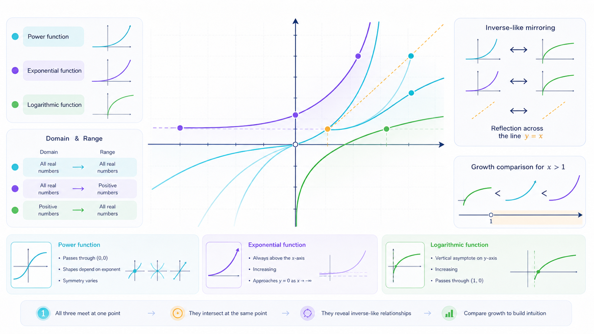

- ID: `hjb-high-s4-幂函数-指数函数与对数函数-concept`
- Status: `approved`
- Grade: `S4`
- Volume: 必修 第一册
- Chapter: 幂函数、指数函数与对数函数
- RAG cards: `hjb-high-compulsory-1-power-exponential-log-functions`
- Alt zh-Hans: 幂函数、指数函数和对数函数曲线比较增长、定义域、值域和互逆结构。
- Caption zh-Hans: 比较函数族时，要同时看形状、定义域、单调性和变换。

### hjb-high-s4-幂函数-指数函数与对数函数 / worked-example

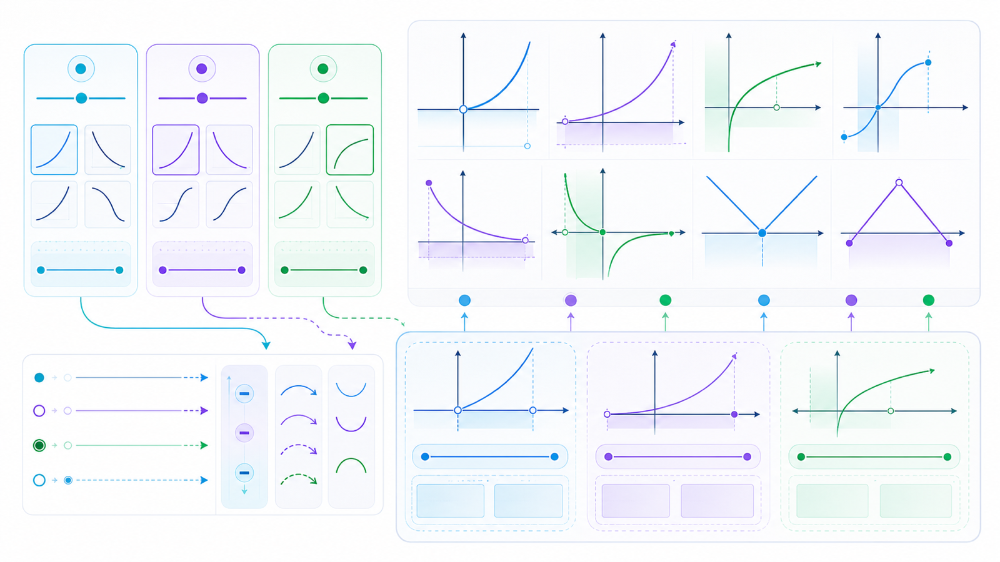

- ID: `hjb-high-s4-幂函数-指数函数与对数函数-worked-example`
- Status: `approved`
- Grade: `S4`
- Volume: 必修 第一册
- Chapter: 幂函数、指数函数与对数函数
- RAG cards: `hjb-high-compulsory-1-power-exponential-log-functions`
- Alt zh-Hans: 读图工作区把曲线形状、参数线索和高亮区间对应起来。
- Caption zh-Hans: 在图像特征和式子选择之间转换时，要重复检查同一限制条件。

### hjb-high-s4-平面向量 / concept

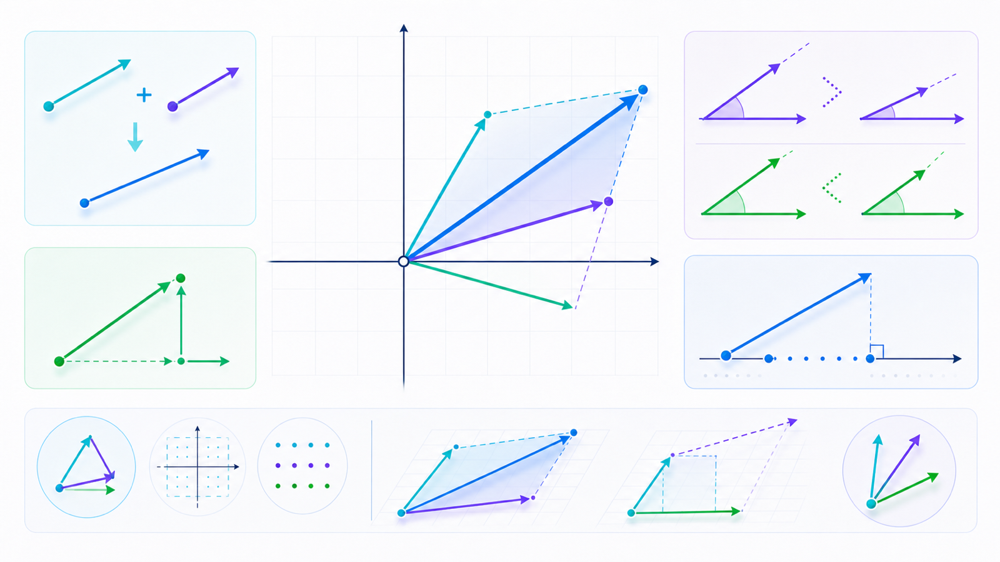

- ID: `hjb-high-s4-平面向量-concept`
- Status: `approved`
- Grade: `S4`
- Volume: 必修 第二册
- Chapter: 平面向量
- RAG cards: `hjb-high-compulsory-2-plane-vectors`
- Alt zh-Hans: 坐标网格上的有向箭头展示向量加法、分解、投影和夹角比较。
- Caption zh-Hans: 向量图示在计算前必须同时保留长度和方向。

### hjb-high-s4-平面向量 / worked-example

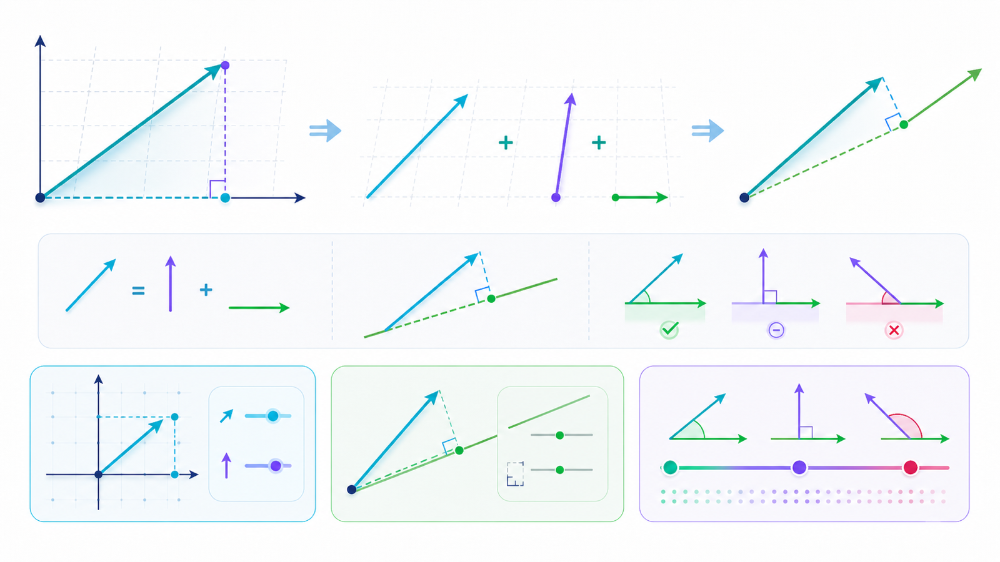

- ID: `hjb-high-s4-平面向量-worked-example`
- Status: `approved`
- Grade: `S4`
- Volume: 必修 第二册
- Chapter: 平面向量
- RAG cards: `hjb-high-compulsory-2-plane-vectors`
- Alt zh-Hans: 向量板把箭头分解为分量，并检查投影方向。
- Caption zh-Hans: 使用投影或数量积前，先把向量分解为清楚分量。

### hjb-high-s4-三角 / concept

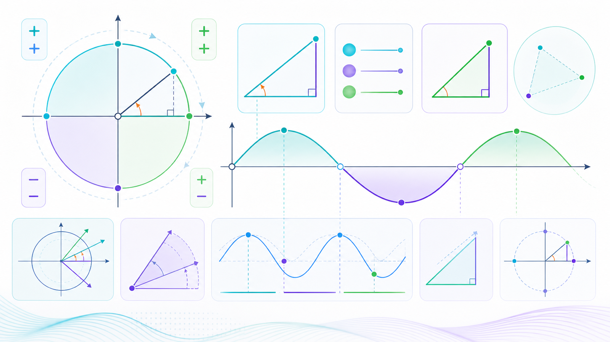

- ID: `hjb-high-s4-三角-concept`
- Status: `approved`
- Grade: `S4`
- Volume: 必修 第二册
- Chapter: 三角
- RAG cards: `hjb-high-compulsory-2-trigonometry-foundations`
- Alt zh-Hans: 单位圆把角的旋转与三角函数波形、符号和周期联系起来。
- Caption zh-Hans: 用单位圆解释符号、参考角和图像周期。

### hjb-high-s4-三角 / worked-example

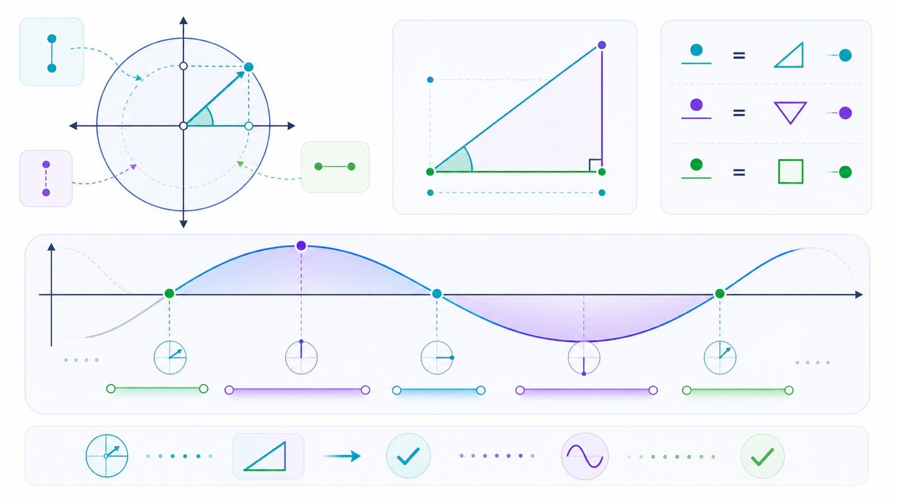

- ID: `hjb-high-s4-三角-worked-example`
- Status: `approved`
- Grade: `S4`
- Volume: 必修 第二册
- Chapter: 三角
- RAG cards: `hjb-high-compulsory-2-trigonometry-foundations`
- Alt zh-Hans: 三角工作区把单位圆上的角与波形中的高亮区间互相检查。
- Caption zh-Hans: 先判断符号和参考角，再利用周期补全解。

### hjb-high-s4-三角函数 / concept

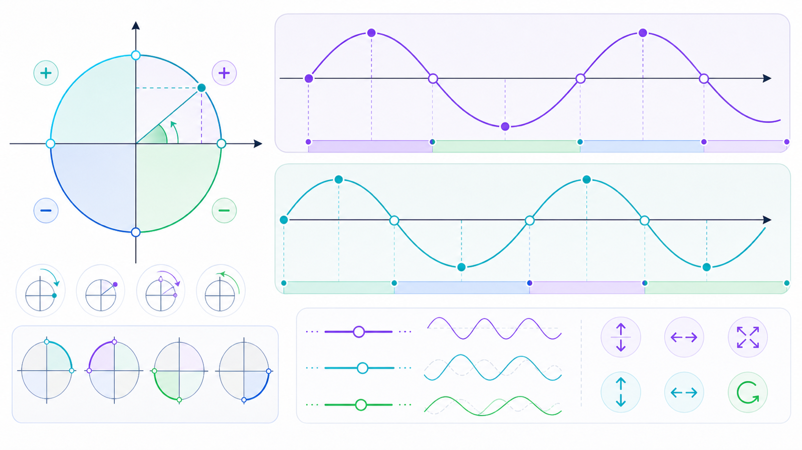

- ID: `hjb-high-s4-三角函数-concept`
- Status: `approved`
- Grade: `S4`
- Volume: 必修 第二册
- Chapter: 三角函数
- RAG cards: `hjb-high-compulsory-2-trigonometric-functions`
- Alt zh-Hans: 函数机器和图像窗口展示定义域、值域、单调性和对称线索。
- Caption zh-Hans: 先确定允许输入，再分区间读取输出怎样变化。

### hjb-high-s4-三角函数 / worked-example

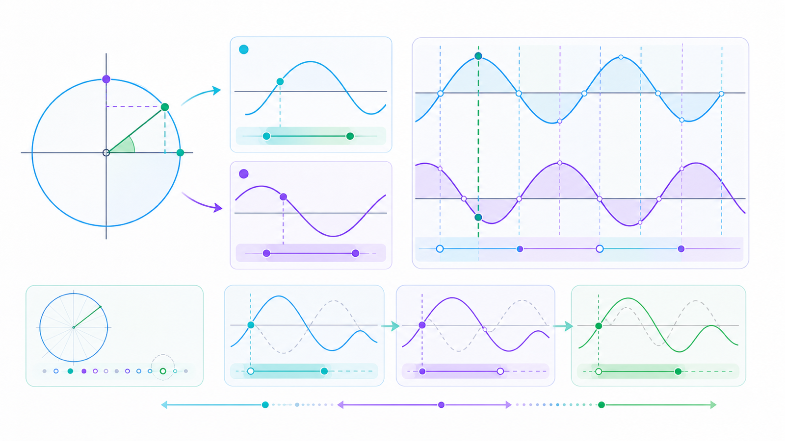

- ID: `hjb-high-s4-三角函数-worked-example`
- Status: `approved`
- Grade: `S4`
- Volume: 必修 第二册
- Chapter: 三角函数
- RAG cards: `hjb-high-compulsory-2-trigonometric-functions`
- Alt zh-Hans: 读图板突出输入范围、输出高度、零点和区间箭头。
- Caption zh-Hans: 定义域、零点和单调性要作为不同图像特征分别检查。

### hjb-high-s5-概率初步 / concept

- ID: `hjb-high-s5-概率初步-concept`
- Status: `approved`
- Grade: `S5`
- Volume: 必修 第三册
- Chapter: 概率初步
- RAG cards: `hjb-high-compulsory-3-probability-foundations`
- Alt zh-Hans: 样本空间网格、事件区域、分支和模拟轨迹展示概率结构。
- Caption zh-Hans: 先确定样本空间，再描述事件及其关系。

### hjb-high-s5-概率初步 / worked-example

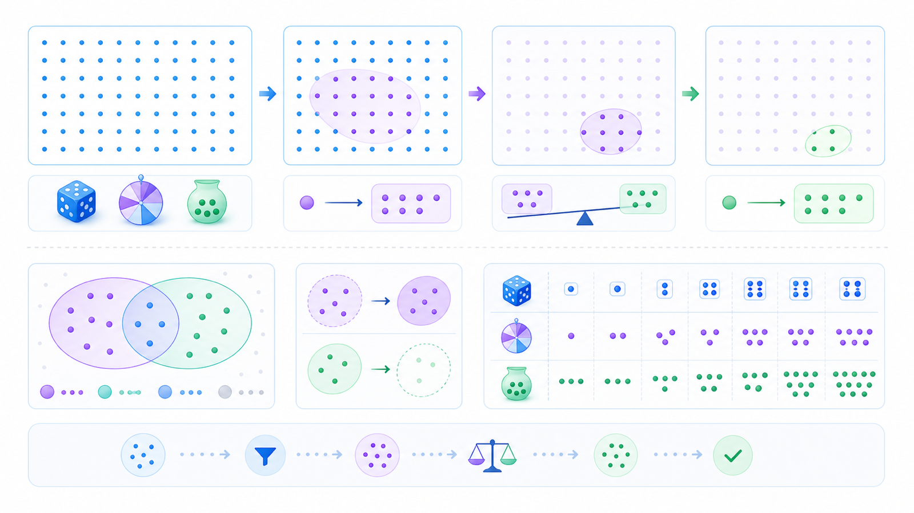

- ID: `hjb-high-s5-概率初步-worked-example`
- Status: `approved`
- Grade: `S5`
- Volume: 必修 第三册
- Chapter: 概率初步
- RAG cards: `hjb-high-compulsory-3-probability-foundations`
- Alt zh-Hans: 概率板从全部结果缩小到高亮事件，并检查补集或分支计数。
- Caption zh-Hans: 先列清所有可能结果，避免漏数或重复计数。

### hjb-high-s5-简单几何体 / concept

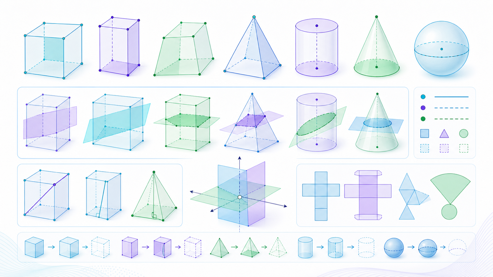

- ID: `hjb-high-s5-简单几何体-concept`
- Status: `approved`
- Grade: `S5`
- Volume: 必修 第三册
- Chapter: 简单几何体
- RAG cards: `hjb-high-compulsory-3-simple-solids`
- Alt zh-Hans: 透明立体和辅助平面展示线面关系、平行、垂直和距离线索。
- Caption zh-Hans: 立体几何要依据明确的线面关系推理，不能只凭外观。

### hjb-high-s5-简单几何体 / worked-example

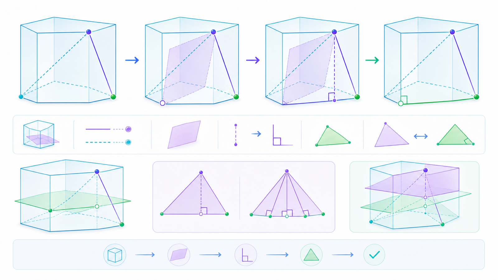

- ID: `hjb-high-s5-简单几何体-worked-example`
- Status: `approved`
- Grade: `S5`
- Volume: 必修 第三册
- Chapter: 简单几何体
- RAG cards: `hjb-high-compulsory-3-simple-solids`
- Alt zh-Hans: 立体几何工作区在透明几何体内加入辅助平面和直角线索。
- Caption zh-Hans: 加入辅助平面或线段，把空间关系转化为可见论证。

### hjb-high-s5-空间向量及其应用 / concept

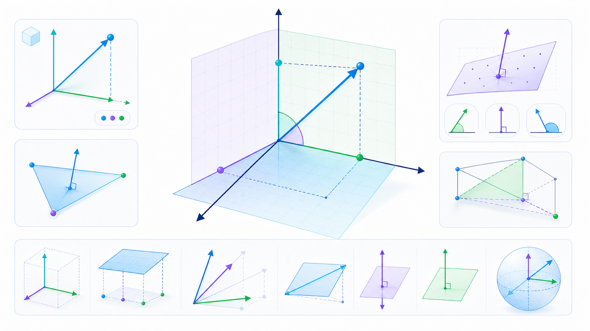

- ID: `hjb-high-s5-空间向量及其应用-concept`
- Status: `approved`
- Grade: `S5`
- Volume: 选择性必修 第一册
- Chapter: 空间向量及其应用
- RAG cards: `hjb-high-selective-1-space-vectors`
- Alt zh-Hans: 三维坐标箭头和分量投影展示空间向量、夹角和平面法向量。
- Caption zh-Hans: 空间向量把几何关系转化为坐标、分量和数量积。

### hjb-high-s5-空间向量及其应用 / worked-example

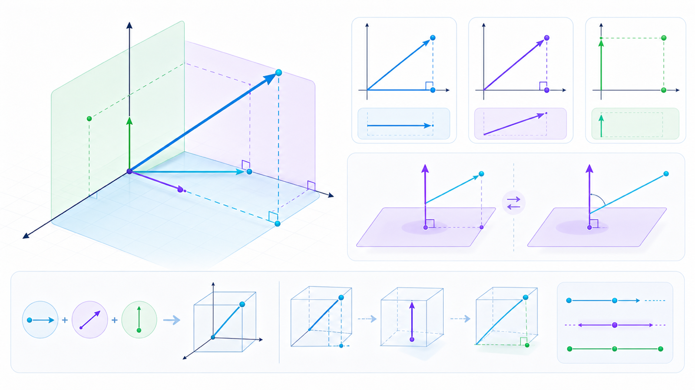

- ID: `hjb-high-s5-空间向量及其应用-worked-example`
- Status: `approved`
- Grade: `S5`
- Volume: 选择性必修 第一册
- Chapter: 空间向量及其应用
- RAG cards: `hjb-high-selective-1-space-vectors`
- Alt zh-Hans: 三维向量工作区投影箭头，并与平面法向量比较。
- Caption zh-Hans: 用分量和法向方向检查夹角、距离或垂直关系。

### hjb-high-s5-空间直线与平面 / concept

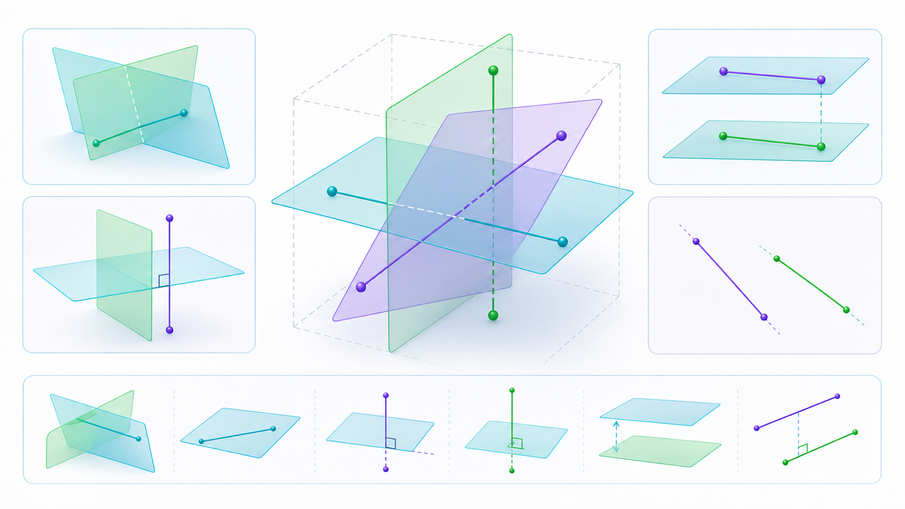

- ID: `hjb-high-s5-空间直线与平面-concept`
- Status: `approved`
- Grade: `S5`
- Volume: 必修 第三册
- Chapter: 空间直线与平面
- RAG cards: `hjb-high-compulsory-3-spatial-lines-planes`
- Alt zh-Hans: 透明立体和辅助平面展示线面关系、平行、垂直和距离线索。
- Caption zh-Hans: 立体几何要依据明确的线面关系推理，不能只凭外观。

### hjb-high-s5-空间直线与平面 / worked-example

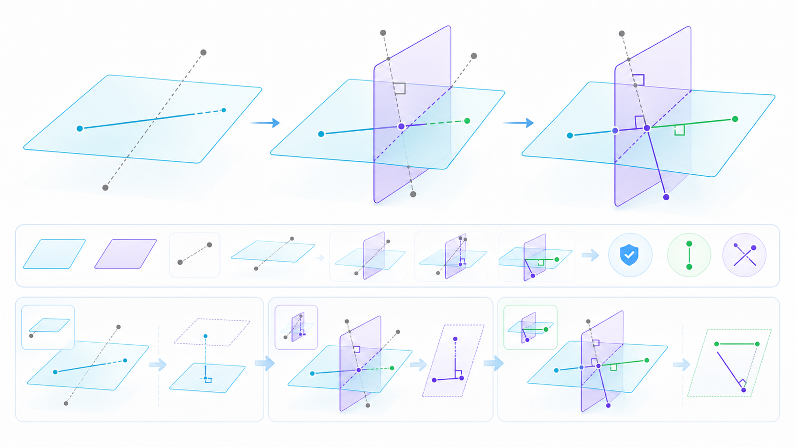

- ID: `hjb-high-s5-空间直线与平面-worked-example`
- Status: `approved`
- Grade: `S5`
- Volume: 必修 第三册
- Chapter: 空间直线与平面
- RAG cards: `hjb-high-compulsory-3-spatial-lines-planes`
- Alt zh-Hans: 立体几何工作区在透明几何体内加入辅助平面和直角线索。
- Caption zh-Hans: 加入辅助平面或线段，把空间关系转化为可见论证。

### hjb-high-s5-平面直角坐标系中的直线 / concept

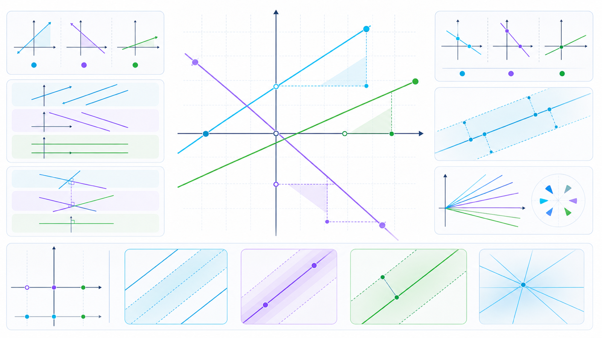

- ID: `hjb-high-s5-平面直角坐标系中的直线-concept`
- Status: `approved`
- Grade: `S5`
- Volume: 选择性必修 第一册
- Chapter: 平面直角坐标系中的直线
- RAG cards: `hjb-high-selective-1-lines`
- Alt zh-Hans: 坐标直线、斜率三角形和截距标记展示解析几何结构。
- Caption zh-Hans: 直线问题要分清斜率、截距、距离和位置关系。

### hjb-high-s5-平面直角坐标系中的直线 / worked-example

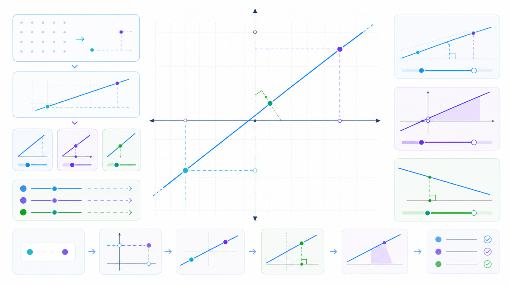

- ID: `hjb-high-s5-平面直角坐标系中的直线-worked-example`
- Status: `approved`
- Grade: `S5`
- Volume: 选择性必修 第一册
- Chapter: 平面直角坐标系中的直线
- RAG cards: `hjb-high-selective-1-lines`
- Alt zh-Hans: 解析几何工作区由点构造直线，并检查斜率和距离。
- Caption zh-Hans: 求解前先把几何条件转化为坐标检查。

### hjb-high-s5-数列 / concept

- ID: `hjb-high-s5-数列-concept`
- Status: `approved`
- Grade: `S5`
- Volume: 选择性必修 第一册
- Chapter: 数列
- RAG cards: `hjb-high-selective-1-sequences`
- Alt zh-Hans: 数列方块、差分箭头、比值弧线和求和模块展示有序增长。
- Caption zh-Hans: 数列要从项的位置、变化规律和求和结构来读。

### hjb-high-s5-数列 / worked-example

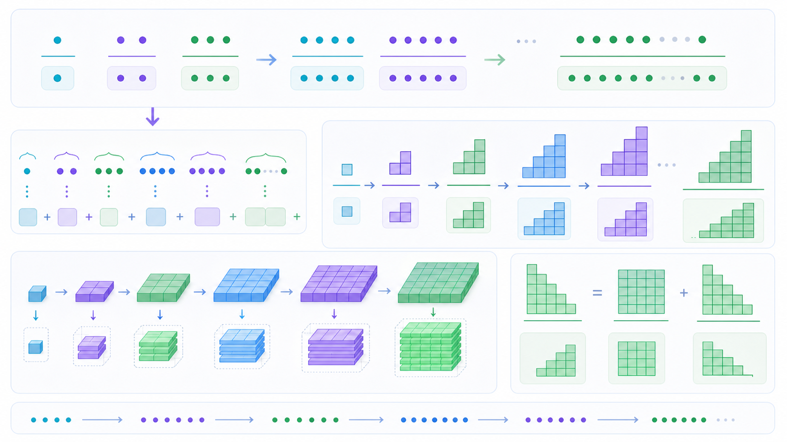

- ID: `hjb-high-s5-数列-worked-example`
- Status: `approved`
- Grade: `S5`
- Volume: 选择性必修 第一册
- Chapter: 数列
- RAG cards: `hjb-high-selective-1-sequences`
- Alt zh-Hans: 数列工作区从前几项推广到一般位置，并检查求和模型。
- Caption zh-Hans: 写通项前，先寻找递推关系或共同变化。

### hjb-high-s5-统计 / concept

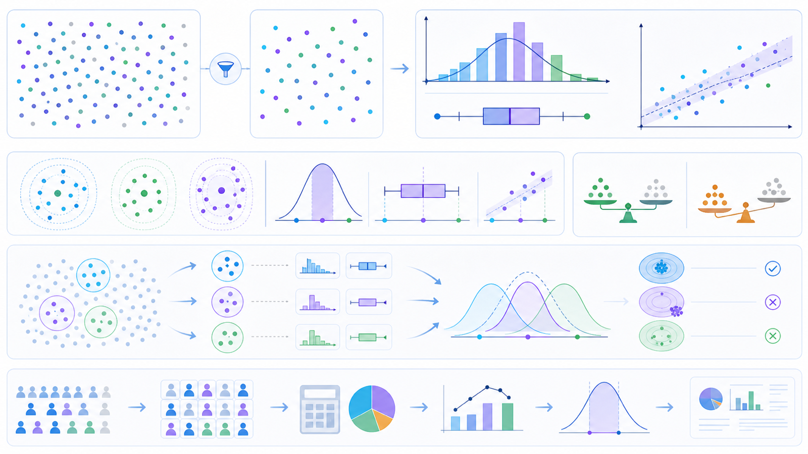

- ID: `hjb-high-s5-统计-concept`
- Status: `approved`
- Grade: `S5`
- Volume: 必修 第三册
- Chapter: 统计
- RAG cards: `hjb-high-compulsory-3-statistics`
- Alt zh-Hans: 数据点转化为分布图和散点图，展示中心、离散和趋势。
- Caption zh-Hans: 统计把数据转化为证据，要描述分布、离散和关系。

### hjb-high-s5-统计 / worked-example

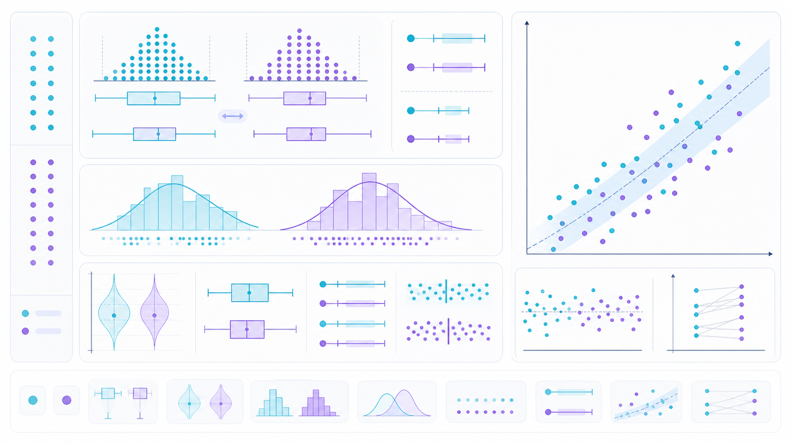

- ID: `hjb-high-s5-统计-worked-example`
- Status: `approved`
- Grade: `S5`
- Volume: 必修 第三册
- Chapter: 统计
- RAG cards: `hjb-high-compulsory-3-statistics`
- Alt zh-Hans: 数据工作区比较两个分布，并用趋势带分析成对数据散点图。
- Caption zh-Hans: 根据数据下结论前，要先比较形状和离散程度。

### hjb-high-s5-圆锥曲线 / concept

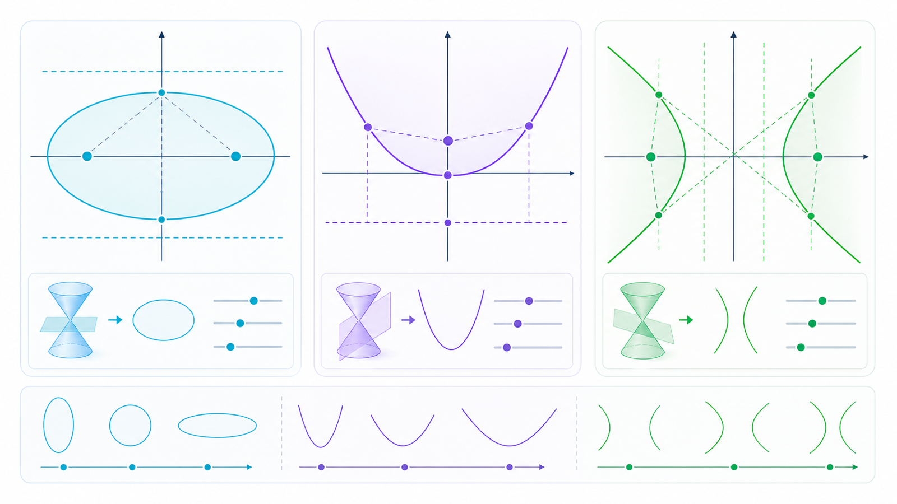

- ID: `hjb-high-s5-圆锥曲线-concept`
- Status: `approved`
- Grade: `S5`
- Volume: 选择性必修 第一册
- Chapter: 圆锥曲线
- RAG cards: `hjb-high-selective-1-conics`
- Alt zh-Hans: 坐标平面上的圆锥曲线轮廓展示轴、焦点和几何约束。
- Caption zh-Hans: 圆锥曲线把方程与焦点、轴和距离关系联系起来。

### hjb-high-s5-圆锥曲线 / worked-example

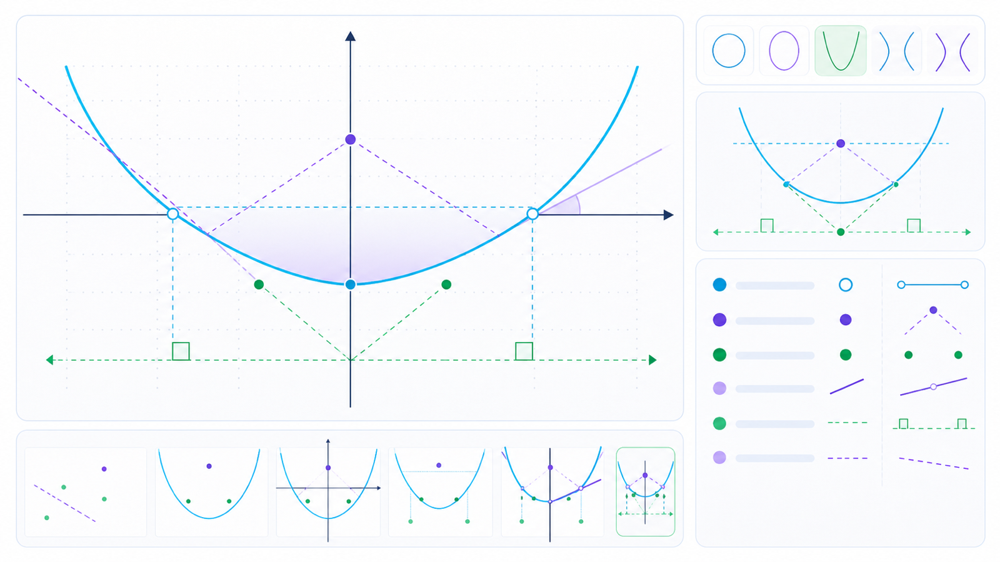

- ID: `hjb-high-s5-圆锥曲线-worked-example`
- Status: `approved`
- Grade: `S5`
- Volume: 选择性必修 第一册
- Chapter: 圆锥曲线
- RAG cards: `hjb-high-selective-1-conics`
- Alt zh-Hans: 圆锥曲线工作区突出一条曲线、焦点、轴线和坐标检查。
- Caption zh-Hans: 计算参数前，先判断曲线类型和关键元素。

### hjb-high-s6-成对数据的统计分析 / concept

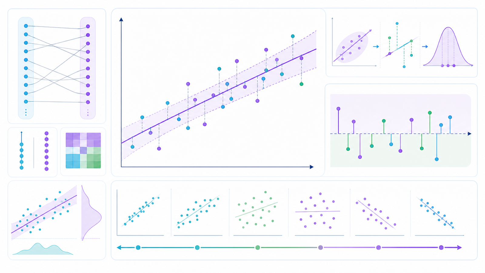

- ID: `hjb-high-s6-成对数据的统计分析-concept`
- Status: `approved`
- Grade: `S6`
- Volume: 选择性必修 第二册
- Chapter: 成对数据的统计分析
- RAG cards: `hjb-high-selective-2-bivariate-data`
- Alt zh-Hans: 数据点转化为分布图和散点图，展示中心、离散和趋势。
- Caption zh-Hans: 统计把数据转化为证据，要描述分布、离散和关系。

### hjb-high-s6-成对数据的统计分析 / worked-example

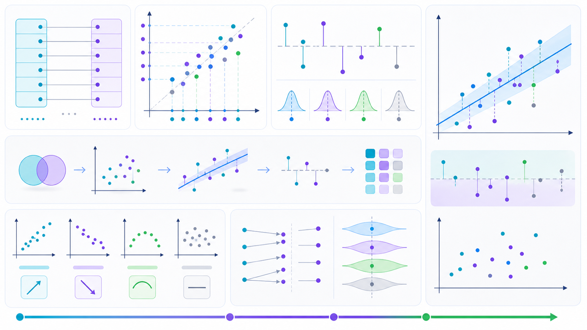

- ID: `hjb-high-s6-成对数据的统计分析-worked-example`
- Status: `approved`
- Grade: `S6`
- Volume: 选择性必修 第二册
- Chapter: 成对数据的统计分析
- RAG cards: `hjb-high-selective-2-bivariate-data`
- Alt zh-Hans: 数据工作区比较两个分布，并用趋势带分析成对数据散点图。
- Caption zh-Hans: 根据数据下结论前，要先比较形状和离散程度。

### hjb-high-s6-导数及其运用 / concept

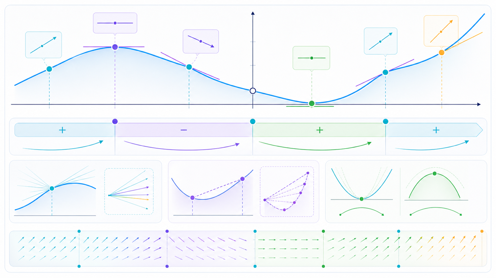

- ID: `hjb-high-s6-导数及其运用-concept`
- Status: `approved`
- Grade: `S6`
- Volume: 选择性必修 第二册
- Chapter: 导数及其运用
- RAG cards: `hjb-high-selective-2-derivatives`
- Alt zh-Hans: 曲线、切线和极值标记展示导数斜率与区间变化。
- Caption zh-Hans: 导数把局部变化转化为斜率信息，用来判断单调性和极值。

### hjb-high-s6-导数及其运用 / worked-example

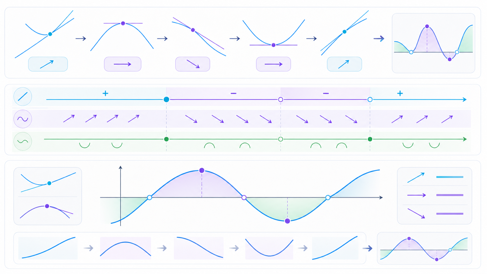

- ID: `hjb-high-s6-导数及其运用-worked-example`
- Status: `approved`
- Grade: `S6`
- Volume: 选择性必修 第二册
- Chapter: 导数及其运用
- RAG cards: `hjb-high-selective-2-derivatives`
- Alt zh-Hans: 导数工作区从切线斜率符号推进到区间表和曲线检查。
- Caption zh-Hans: 用符号变化定位函数行为，再用曲线检查结论。

### hjb-high-s6-概率初步续 / concept

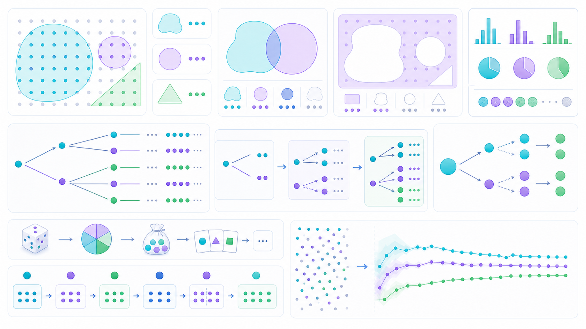

- ID: `hjb-high-s6-概率初步续-concept`
- Status: `approved`
- Grade: `S6`
- Volume: 选择性必修 第二册
- Chapter: 概率初步续
- RAG cards: `hjb-high-selective-2-probability-continuation`
- Alt zh-Hans: 样本空间网格、事件区域、分支和模拟轨迹展示概率结构。
- Caption zh-Hans: 先确定样本空间，再描述事件及其关系。

### hjb-high-s6-概率初步续 / worked-example

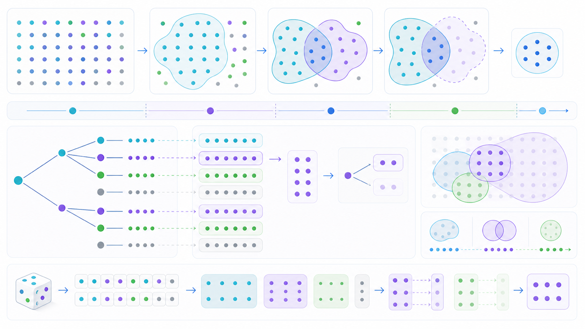

- ID: `hjb-high-s6-概率初步续-worked-example`
- Status: `approved`
- Grade: `S6`
- Volume: 选择性必修 第二册
- Chapter: 概率初步续
- RAG cards: `hjb-high-selective-2-probability-continuation`
- Alt zh-Hans: 概率板从全部结果缩小到高亮事件，并检查补集或分支计数。
- Caption zh-Hans: 先列清所有可能结果，避免漏数或重复计数。

### hjb-high-s6-概率统计综合 / concept

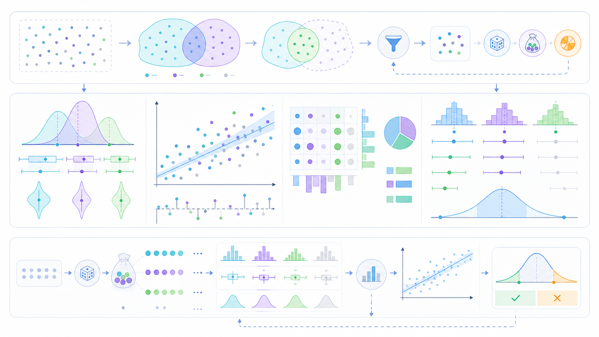

- ID: `hjb-high-s6-概率统计综合-concept`
- Status: `approved`
- Grade: `S6`
- Volume: 跨册综合复习
- Chapter: 跨册综合：概率统计
- RAG cards: `hjb-high-compulsory-3-probability-foundations`, `hjb-high-compulsory-3-statistics`, `hjb-high-selective-2-probability-continuation`, `hjb-high-selective-2-bivariate-data`
- Alt zh-Hans: 样本空间网格、事件区域、分支和模拟轨迹展示概率结构。
- Caption zh-Hans: 先确定样本空间，再描述事件及其关系。

### hjb-high-s6-概率统计综合 / worked-example

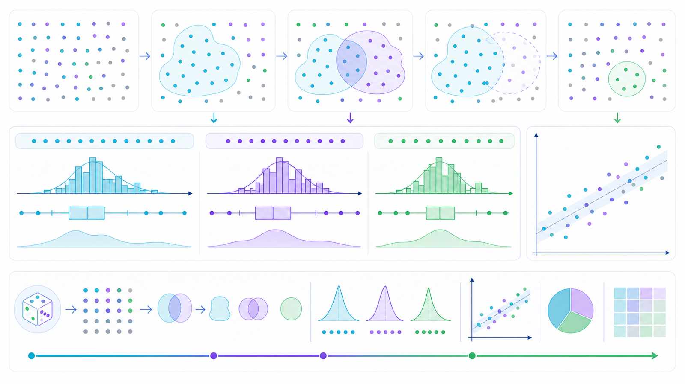

- ID: `hjb-high-s6-概率统计综合-worked-example`
- Status: `approved`
- Grade: `S6`
- Volume: 跨册综合复习
- Chapter: 跨册综合：概率统计
- RAG cards: `hjb-high-compulsory-3-probability-foundations`, `hjb-high-compulsory-3-statistics`, `hjb-high-selective-2-probability-continuation`, `hjb-high-selective-2-bivariate-data`
- Alt zh-Hans: 概率板从全部结果缩小到高亮事件，并检查补集或分支计数。
- Caption zh-Hans: 先列清所有可能结果，避免漏数或重复计数。

### hjb-high-s6-函数-导数与不等式综合 / concept

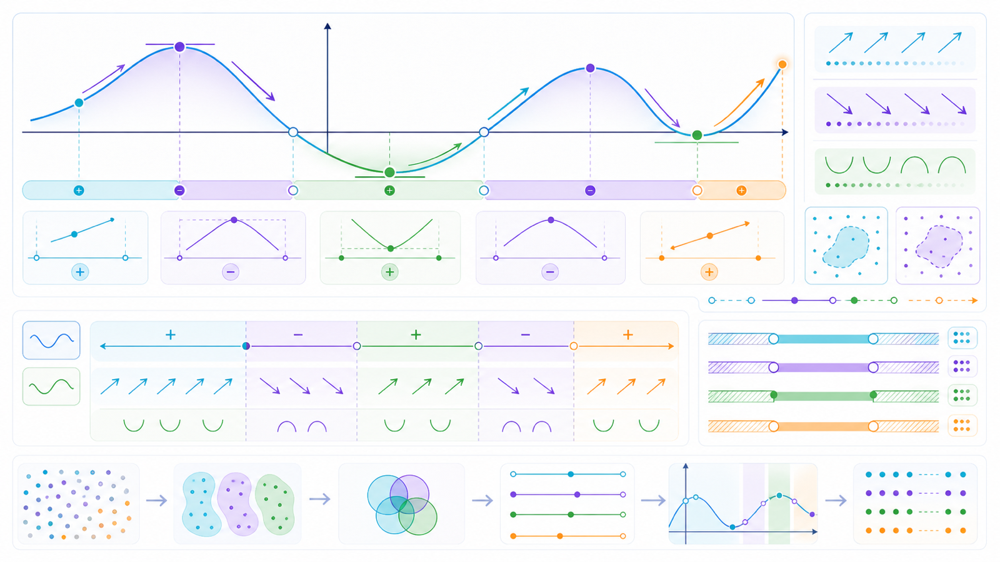

- ID: `hjb-high-s6-函数-导数与不等式综合-concept`
- Status: `approved`
- Grade: `S6`
- Volume: 跨册综合复习
- Chapter: 跨册综合：函数与导数
- RAG cards: `hjb-high-compulsory-1-function-concepts-applications`, `hjb-high-selective-2-derivatives`
- Alt zh-Hans: 天平、数轴和抛物线把等式、不等式、根和符号区间联系起来。
- Caption zh-Hans: 等价变形要保持解集和端点判断不变。

### hjb-high-s6-函数-导数与不等式综合 / worked-example

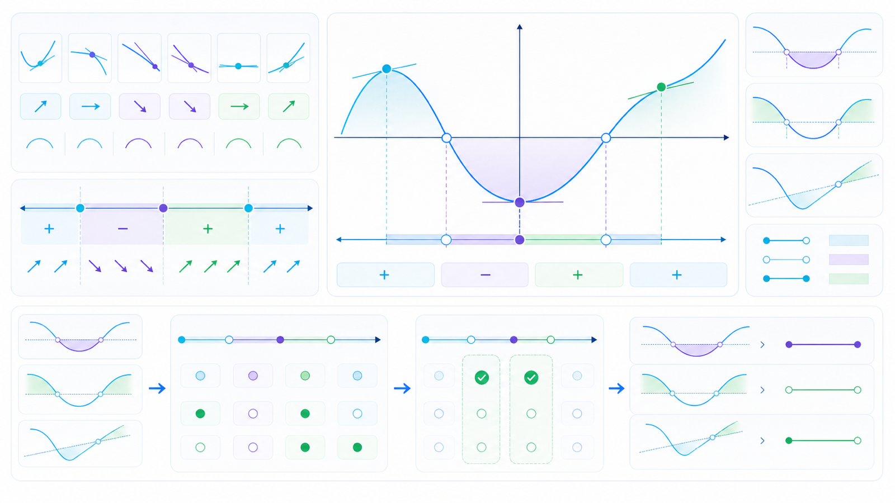

- ID: `hjb-high-s6-函数-导数与不等式综合-worked-example`
- Status: `approved`
- Grade: `S6`
- Volume: 跨册综合复习
- Chapter: 跨册综合：函数与导数
- RAG cards: `hjb-high-compulsory-1-function-concepts-applications`, `hjb-high-selective-2-derivatives`
- Alt zh-Hans: 抛物线旁的符号表突出端点选择和有效解区间。
- Caption zh-Hans: 先标根，再测区间，最后只写满足不等式的部分。

### hjb-high-s6-计数原理 / concept

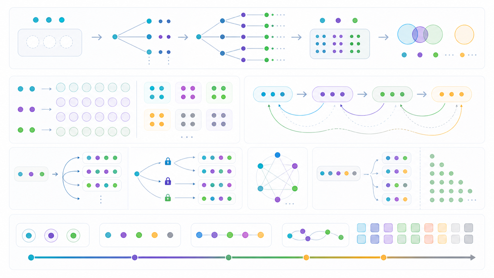

- ID: `hjb-high-s6-计数原理-concept`
- Status: `approved`
- Grade: `S6`
- Volume: 选择性必修 第二册
- Chapter: 计数原理
- RAG cards: `hjb-high-selective-2-counting-principles`
- Alt zh-Hans: 分步分支、排列网格和分组框展示计数原理结构。
- Caption zh-Hans: 计数先要判断选择是有顺序、需分组，还是分步完成。

### hjb-high-s6-计数原理 / worked-example

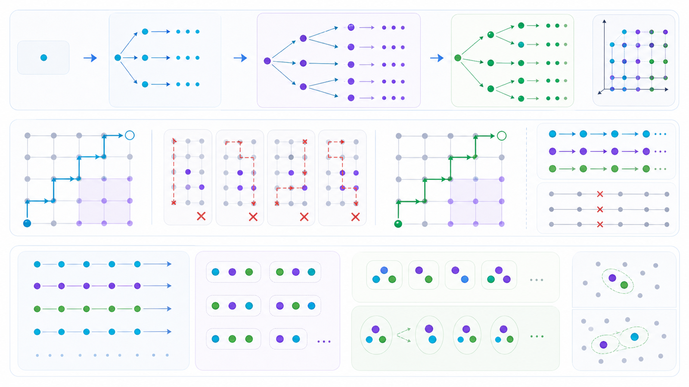

- ID: `hjb-high-s6-计数原理-worked-example`
- Status: `approved`
- Grade: `S6`
- Volume: 选择性必修 第二册
- Chapter: 计数原理
- RAG cards: `hjb-high-selective-2-counting-principles`
- Alt zh-Hans: 计数工作区分离步骤，并比较有序路径和无序分组。
- Caption zh-Hans: 把情况划分清楚，才能避免遗漏或重复计数。

### hjb-high-s6-解析几何直线综合复习 / concept

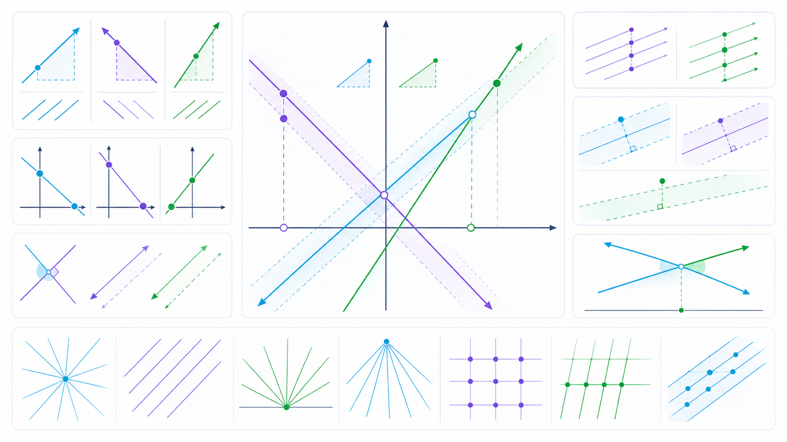

- ID: `hjb-high-s6-解析几何直线综合复习-concept`
- Status: `approved`
- Grade: `S6`
- Volume: 选择性必修 第一册复习
- Chapter: 平面直角坐标系中的直线
- RAG cards: `hjb-high-selective-1-lines`
- Alt zh-Hans: 坐标直线、斜率三角形和截距标记展示解析几何结构。
- Caption zh-Hans: 直线问题要分清斜率、截距、距离和位置关系。

### hjb-high-s6-解析几何直线综合复习 / worked-example

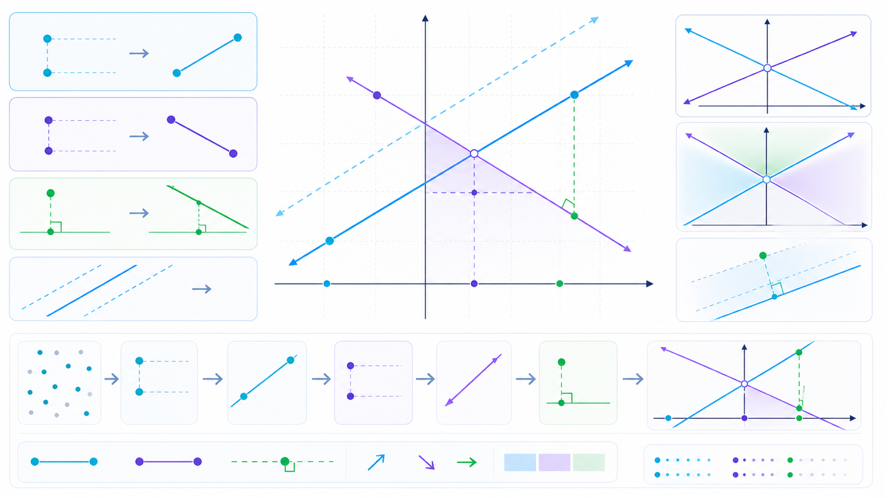

- ID: `hjb-high-s6-解析几何直线综合复习-worked-example`
- Status: `approved`
- Grade: `S6`
- Volume: 选择性必修 第一册复习
- Chapter: 平面直角坐标系中的直线
- RAG cards: `hjb-high-selective-1-lines`
- Alt zh-Hans: 解析几何工作区由点构造直线，并检查斜率和距离。
- Caption zh-Hans: 求解前先把几何条件转化为坐标检查。

### hjb-high-s6-空间向量综合复习 / concept

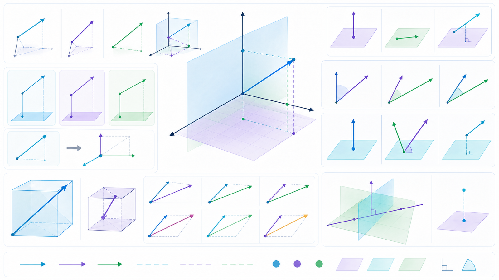

- ID: `hjb-high-s6-空间向量综合复习-concept`
- Status: `approved`
- Grade: `S6`
- Volume: 选择性必修 第一册复习
- Chapter: 空间向量及其应用
- RAG cards: `hjb-high-selective-1-space-vectors`
- Alt zh-Hans: 三维坐标箭头和分量投影展示空间向量、夹角和平面法向量。
- Caption zh-Hans: 空间向量把几何关系转化为坐标、分量和数量积。

### hjb-high-s6-空间向量综合复习 / worked-example

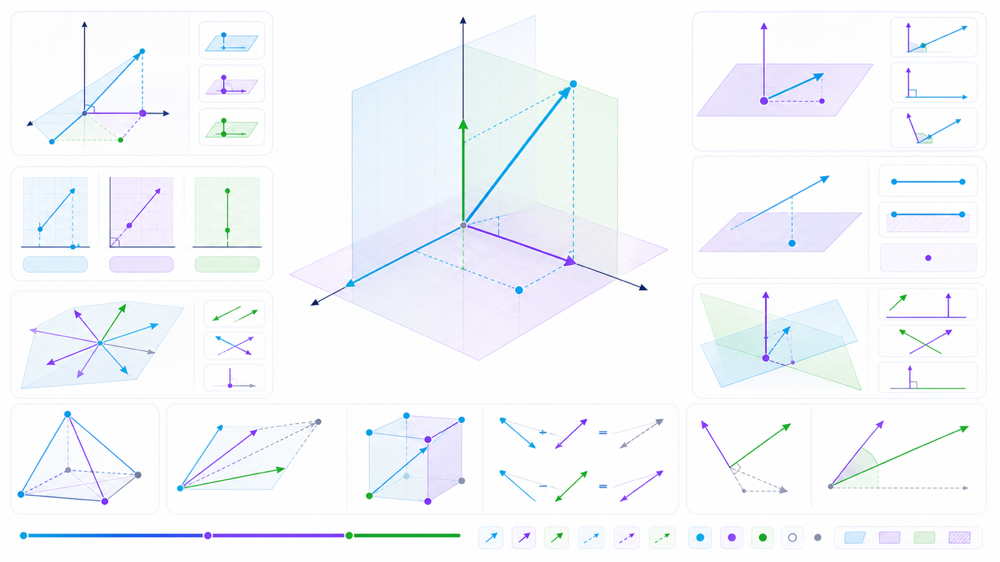

- ID: `hjb-high-s6-空间向量综合复习-worked-example`
- Status: `approved`
- Grade: `S6`
- Volume: 选择性必修 第一册复习
- Chapter: 空间向量及其应用
- RAG cards: `hjb-high-selective-1-space-vectors`
- Alt zh-Hans: 三维向量工作区投影箭头，并与平面法向量比较。
- Caption zh-Hans: 用分量和法向方向检查夹角、距离或垂直关系。

### hjb-high-s6-立体几何与空间向量综合 / concept

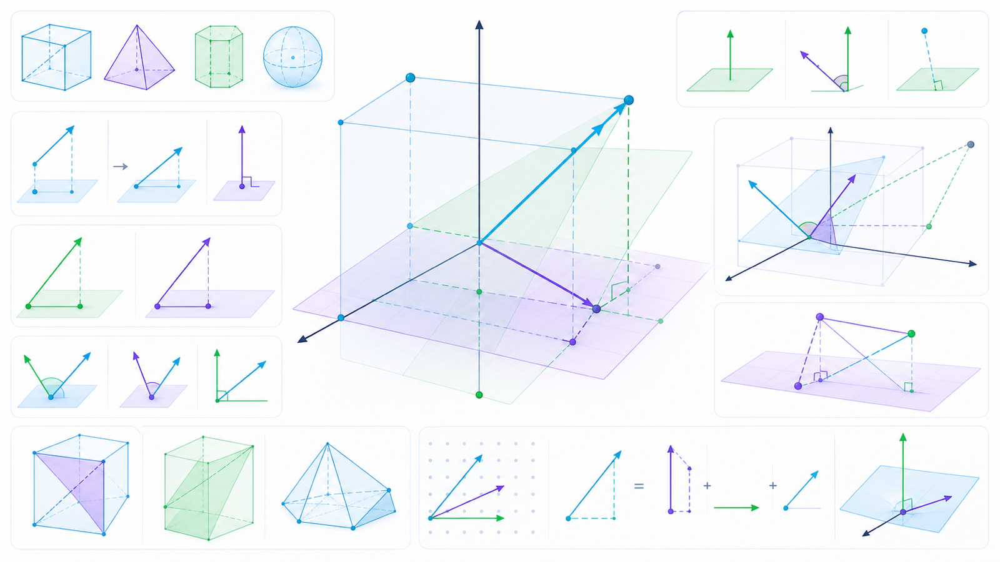

- ID: `hjb-high-s6-立体几何与空间向量综合-concept`
- Status: `approved`
- Grade: `S6`
- Volume: 跨册综合复习
- Chapter: 跨册综合：立体几何与空间向量
- RAG cards: `hjb-high-compulsory-3-spatial-lines-planes`, `hjb-high-selective-1-space-vectors`
- Alt zh-Hans: 透明立体和辅助平面展示线面关系、平行、垂直和距离线索。
- Caption zh-Hans: 立体几何要依据明确的线面关系推理，不能只凭外观。

### hjb-high-s6-立体几何与空间向量综合 / worked-example

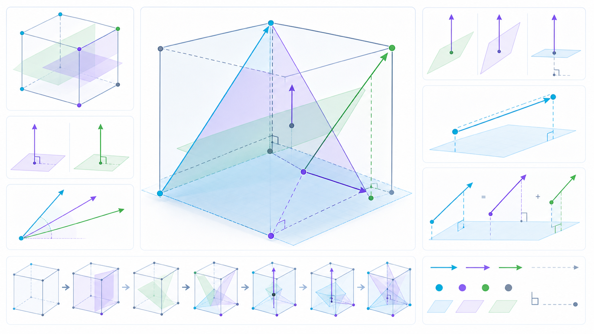

- ID: `hjb-high-s6-立体几何与空间向量综合-worked-example`
- Status: `approved`
- Grade: `S6`
- Volume: 跨册综合复习
- Chapter: 跨册综合：立体几何与空间向量
- RAG cards: `hjb-high-compulsory-3-spatial-lines-planes`, `hjb-high-selective-1-space-vectors`
- Alt zh-Hans: 立体几何工作区在透明几何体内加入辅助平面和直角线索。
- Caption zh-Hans: 加入辅助平面或线段，把空间关系转化为可见论证。

### hjb-high-s6-三角-向量与解析几何综合 / concept

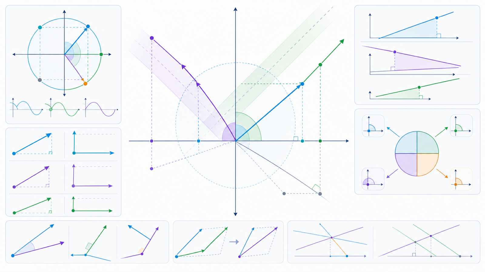

- ID: `hjb-high-s6-三角-向量与解析几何综合-concept`
- Status: `approved`
- Grade: `S6`
- Volume: 跨册综合复习
- Chapter: 跨册综合：三角向量解析几何
- RAG cards: `hjb-high-compulsory-2-trigonometric-functions`, `hjb-high-compulsory-2-plane-vectors`, `hjb-high-selective-1-lines`
- Alt zh-Hans: 单位圆把角的旋转与三角函数波形、符号和周期联系起来。
- Caption zh-Hans: 用单位圆解释符号、参考角和图像周期。

### hjb-high-s6-三角-向量与解析几何综合 / worked-example

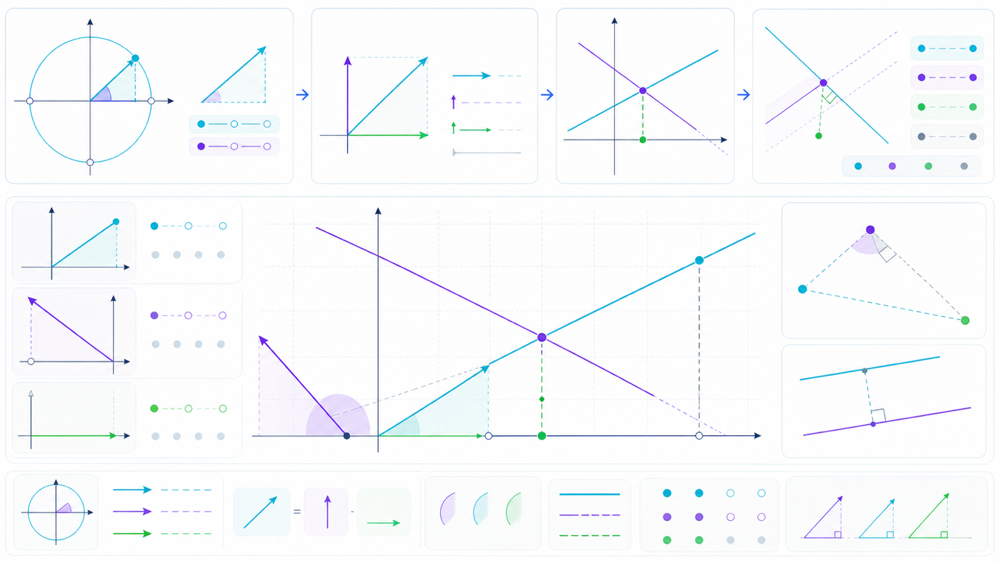

- ID: `hjb-high-s6-三角-向量与解析几何综合-worked-example`
- Status: `approved`
- Grade: `S6`
- Volume: 跨册综合复习
- Chapter: 跨册综合：三角向量解析几何
- RAG cards: `hjb-high-compulsory-2-trigonometric-functions`, `hjb-high-compulsory-2-plane-vectors`, `hjb-high-selective-1-lines`
- Alt zh-Hans: 三角工作区把单位圆上的角与波形中的高亮区间互相检查。
- Caption zh-Hans: 先判断符号和参考角，再利用周期补全解。

### hjb-high-s6-数列与计数综合 / concept

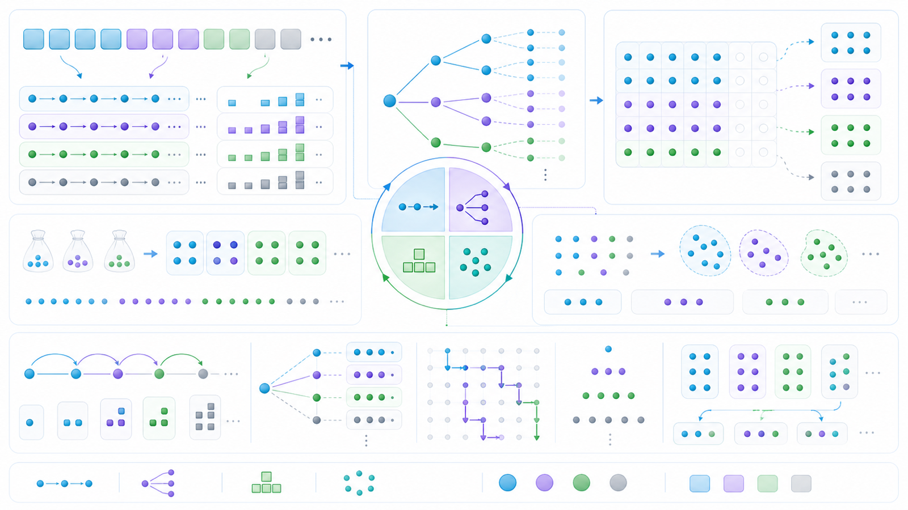

- ID: `hjb-high-s6-数列与计数综合-concept`
- Status: `approved`
- Grade: `S6`
- Volume: 跨册综合复习
- Chapter: 跨册综合：数列与计数
- RAG cards: `hjb-high-selective-1-sequences`, `hjb-high-selective-2-counting-principles`
- Alt zh-Hans: 数列方块、差分箭头、比值弧线和求和模块展示有序增长。
- Caption zh-Hans: 数列要从项的位置、变化规律和求和结构来读。

### hjb-high-s6-数列与计数综合 / worked-example

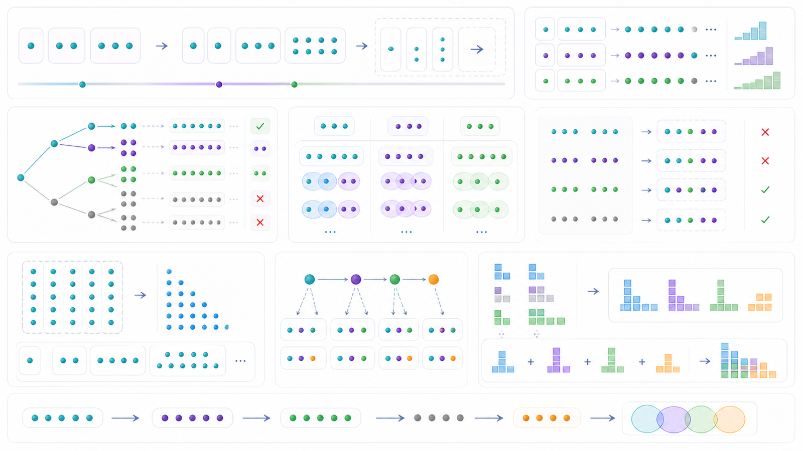

- ID: `hjb-high-s6-数列与计数综合-worked-example`
- Status: `approved`
- Grade: `S6`
- Volume: 跨册综合复习
- Chapter: 跨册综合：数列与计数
- RAG cards: `hjb-high-selective-1-sequences`, `hjb-high-selective-2-counting-principles`
- Alt zh-Hans: 数列工作区从前几项推广到一般位置，并检查求和模型。
- Caption zh-Hans: 写通项前，先寻找递推关系或共同变化。

### hjb-high-s6-数列综合复习 / concept

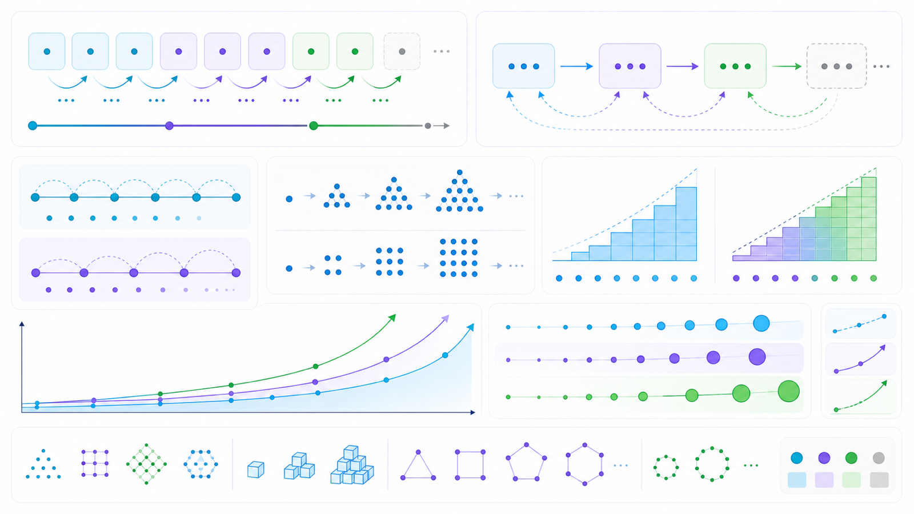

- ID: `hjb-high-s6-数列综合复习-concept`
- Status: `approved`
- Grade: `S6`
- Volume: 选择性必修 第一册复习
- Chapter: 数列
- RAG cards: `hjb-high-selective-1-sequences`
- Alt zh-Hans: 数列方块、差分箭头、比值弧线和求和模块展示有序增长。
- Caption zh-Hans: 数列要从项的位置、变化规律和求和结构来读。

### hjb-high-s6-数列综合复习 / worked-example

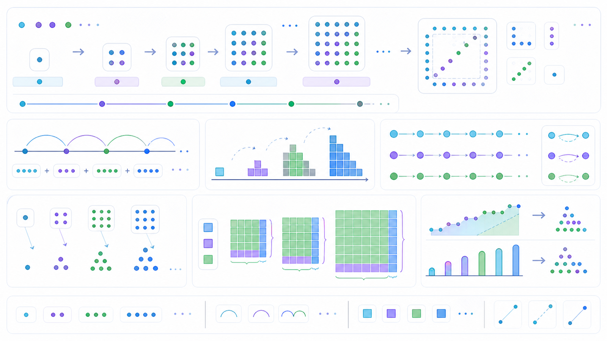

- ID: `hjb-high-s6-数列综合复习-worked-example`
- Status: `approved`
- Grade: `S6`
- Volume: 选择性必修 第一册复习
- Chapter: 数列
- RAG cards: `hjb-high-selective-1-sequences`
- Alt zh-Hans: 数列工作区从前几项推广到一般位置，并检查求和模型。
- Caption zh-Hans: 写通项前，先寻找递推关系或共同变化。

### hjb-high-s6-圆锥曲线综合复习 / concept

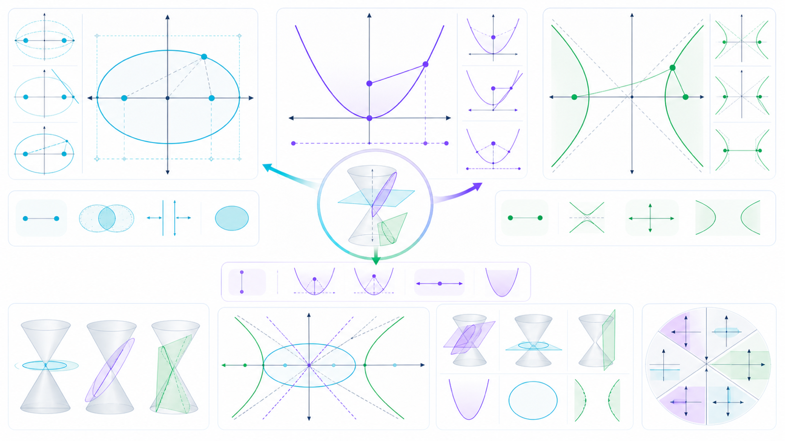

- ID: `hjb-high-s6-圆锥曲线综合复习-concept`
- Status: `approved`
- Grade: `S6`
- Volume: 选择性必修 第一册复习
- Chapter: 圆锥曲线
- RAG cards: `hjb-high-selective-1-conics`
- Alt zh-Hans: 坐标平面上的圆锥曲线轮廓展示轴、焦点和几何约束。
- Caption zh-Hans: 圆锥曲线把方程与焦点、轴和距离关系联系起来。

### hjb-high-s6-圆锥曲线综合复习 / worked-example

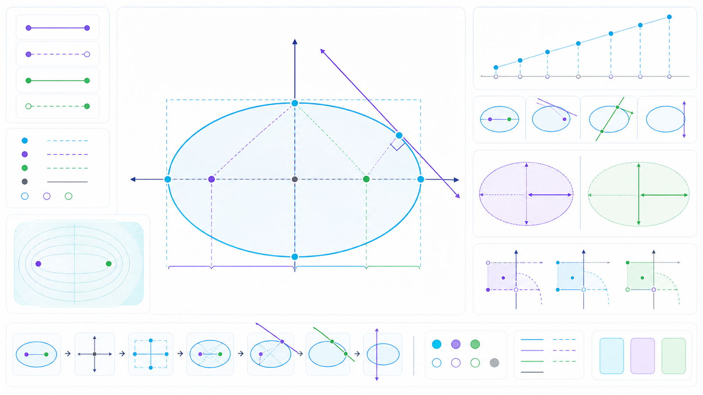

- ID: `hjb-high-s6-圆锥曲线综合复习-worked-example`
- Status: `approved`
- Grade: `S6`
- Volume: 选择性必修 第一册复习
- Chapter: 圆锥曲线
- RAG cards: `hjb-high-selective-1-conics`
- Alt zh-Hans: 圆锥曲线工作区突出一条曲线、焦点、轴线和坐标检查。
- Caption zh-Hans: 计算参数前，先判断曲线类型和关键元素。
