# Mainland HJB Junior Lesson Illustrations V1 Review

- Generated at: 2026-05-27T10:47:45.617Z
- Generator: Codex built-in image generation; approved candidates are now production-integrated.
- Scope: 22 Mainland HJB junior-secondary lessons, 2 candidates per lesson.
- Production status: Approved and integrated into `public/lesson-illustrations/mainland-hjb-junior/`.
- Review statuses: all 44 rows are `approved` as of 2026-05-27.
- Approval note: Approved by owner/S18 manual review for production launch on 2026-05-27.

## Review Criteria

- Mathematical correctness and fit to the lesson objective.
- No copied textbook/page/screenshot look, publisher marks, logos, or watermarks.
- No misleading geometry, graph, data encoding, or unreadable mathematical clutter.
- Clear student learning value and accurate alt/caption text.

## Candidates

### hjb-junior-s1-upper-polynomial-add-subtract / concept

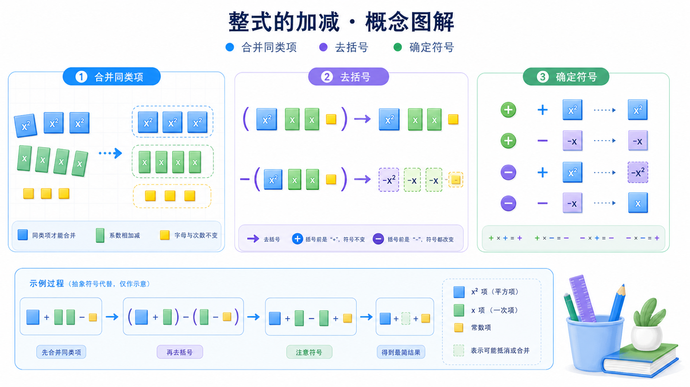

- ID: `hjb-junior-s1-upper-polynomial-add-subtract-concept`
- Status: `approved`
- Production src: `/lesson-illustrations/mainland-hjb-junior/hjb-junior-s1-upper-polynomial-add-subtract/concept.png`
- RAG cards: `hjb-junior-s1-upper-polynomial-add-subtract`
- Alt zh-Hans: 代数块和同色项组展示同类项合并、括号展开和符号处理。
- Caption zh-Hans: 整式加减要先归类同类项，并始终追踪符号。

### hjb-junior-s1-upper-polynomial-add-subtract / worked-example

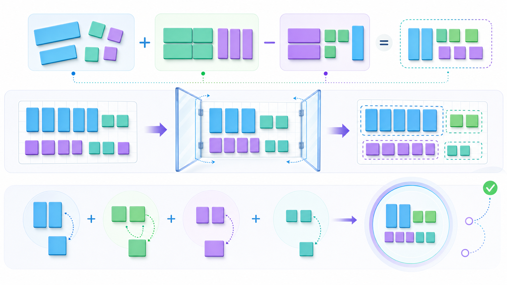

- ID: `hjb-junior-s1-upper-polynomial-add-subtract-worked-example`
- Status: `approved`
- Production src: `/lesson-illustrations/mainland-hjb-junior/hjb-junior-s1-upper-polynomial-add-subtract/worked-example.png`
- RAG cards: `hjb-junior-s1-upper-polynomial-add-subtract`
- Alt zh-Hans: 分步代数块工作区把相同项归组，并用符号检查路径完成化简。
- Caption zh-Hans: 先收集相同结构，再检查每个符号，最后写出化简结果。

### hjb-junior-s1-upper-polynomial-multiply-divide / concept

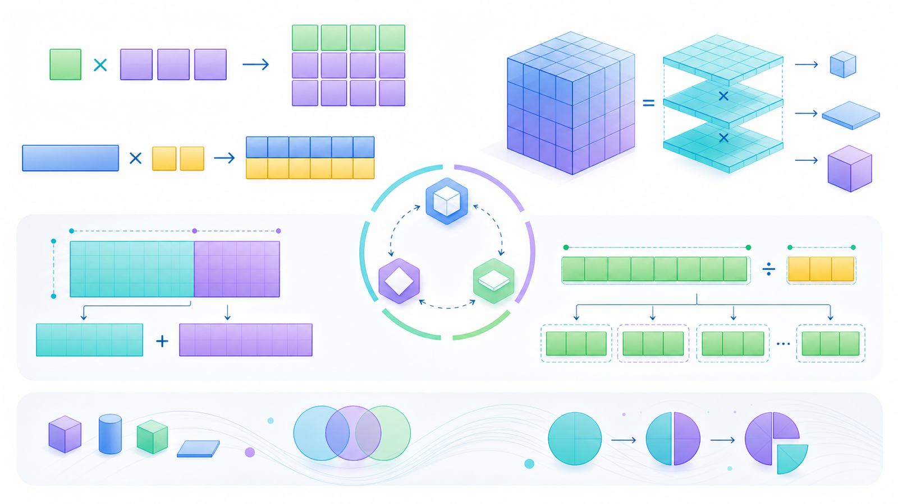

- ID: `hjb-junior-s1-upper-polynomial-multiply-divide-concept`
- Status: `approved`
- Production src: `/lesson-illustrations/mainland-hjb-junior/hjb-junior-s1-upper-polynomial-multiply-divide/concept.png`
- RAG cards: `hjb-junior-s1-upper-polynomial-multiply-divide`
- Alt zh-Hans: 幂运算块、单项式块和面积模型矩形联系整式乘除。
- Caption zh-Hans: 看清结构，才能选择合适的幂运算规则或乘积模型。

### hjb-junior-s1-upper-polynomial-multiply-divide / worked-example

- ID: `hjb-junior-s1-upper-polynomial-multiply-divide-worked-example`
- Status: `approved`
- Production src: `/lesson-illustrations/mainland-hjb-junior/hjb-junior-s1-upper-polynomial-multiply-divide/worked-example.png`
- RAG cards: `hjb-junior-s1-upper-polynomial-multiply-divide`
- Alt zh-Hans: 面积模型展开为彩色小块，再沿除法路径还原为因子块。
- Caption zh-Hans: 用矩形模型检查乘法，再反向理解除法。

### hjb-junior-s1-upper-factorization / concept

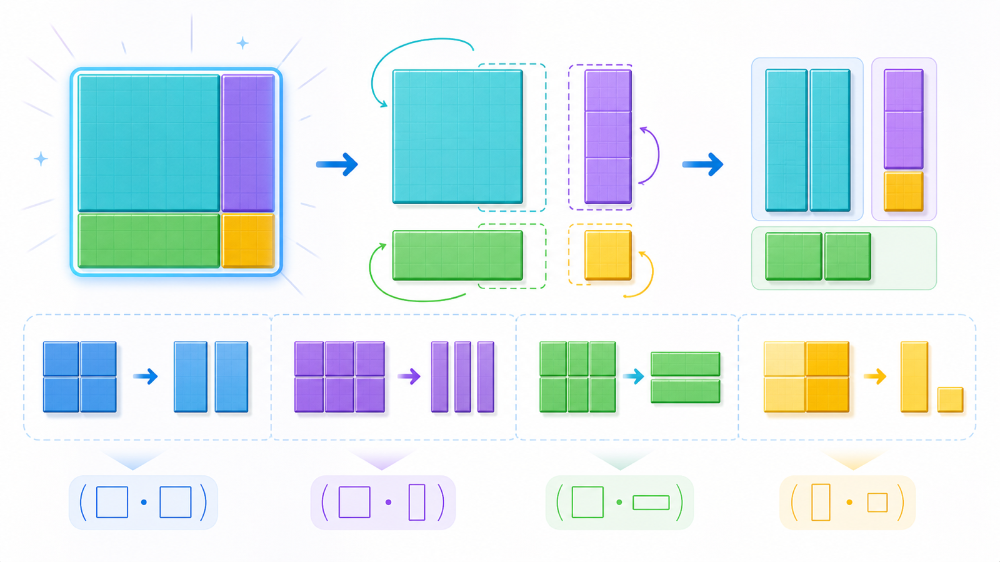

- ID: `hjb-junior-s1-upper-factorization-concept`
- Status: `approved`
- Production src: `/lesson-illustrations/mainland-hjb-junior/hjb-junior-s1-upper-factorization/concept.png`
- RAG cards: `hjb-junior-s1-upper-factorization`
- Alt zh-Hans: 整式块被重组成因式组，并突出公因式条和公式结构。
- Caption zh-Hans: 因式分解就是在整式中找出隐藏的乘积结构。

### hjb-junior-s1-upper-factorization / worked-example

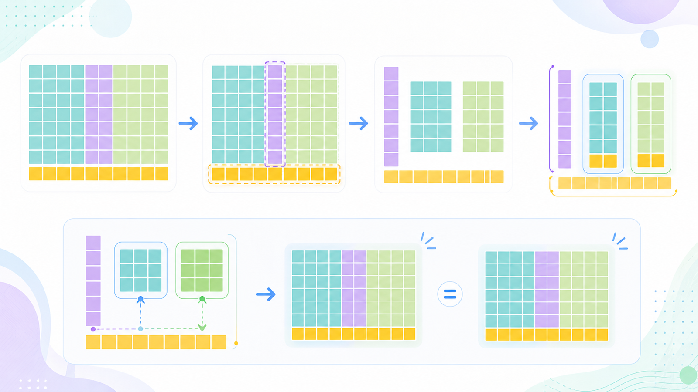

- ID: `hjb-junior-s1-upper-factorization-worked-example`
- Status: `approved`
- Production src: `/lesson-illustrations/mainland-hjb-junior/hjb-junior-s1-upper-factorization/worked-example.png`
- RAG cards: `hjb-junior-s1-upper-factorization`
- Alt zh-Hans: 因式分解板先提出公共部分，再折叠剩余块，并用展开作检查。
- Caption zh-Hans: 先完整提出公因式，再乘回去检查。

### hjb-junior-s1-upper-algebraic-fractions / concept

- ID: `hjb-junior-s1-upper-algebraic-fractions-concept`
- Status: `approved`
- Production src: `/lesson-illustrations/mainland-hjb-junior/hjb-junior-s1-upper-algebraic-fractions/concept.png`
- RAG cards: `hjb-junior-s1-upper-algebraic-fractions`
- Alt zh-Hans: 分层分式卡展示分子、分母、取值限制和等价变形。
- Caption zh-Hans: 分式变形时，分母取值限制必须一直保留。

### hjb-junior-s1-upper-algebraic-fractions / worked-example

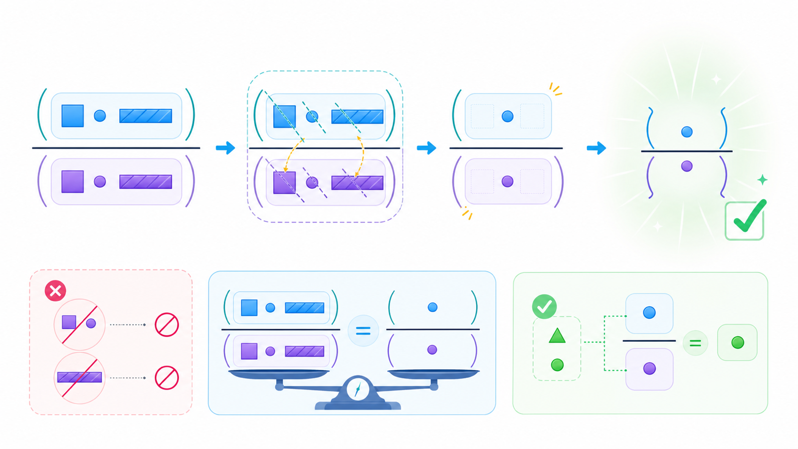

- ID: `hjb-junior-s1-upper-algebraic-fractions-worked-example`
- Status: `approved`
- Production src: `/lesson-illustrations/mainland-hjb-junior/hjb-junior-s1-upper-algebraic-fractions/worked-example.png`
- RAG cards: `hjb-junior-s1-upper-algebraic-fractions`
- Alt zh-Hans: 化简板把分子分母因子配对，同时保留不可取值提示。
- Caption zh-Hans: 约去的是因子，不是项；原来的限制条件要保留。

### hjb-junior-s1-upper-figure-transformations / concept

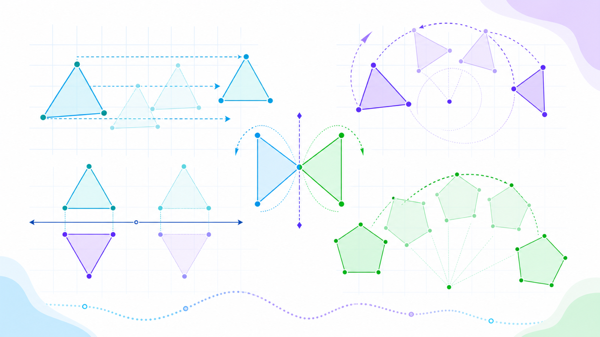

- ID: `hjb-junior-s1-upper-figure-transformations-concept`
- Status: `approved`
- Production src: `/lesson-illustrations/mainland-hjb-junior/hjb-junior-s1-upper-figure-transformations/concept.png`
- RAG cards: `hjb-junior-s1-upper-figure-transformations`
- Alt zh-Hans: 图形经过平移、旋转、翻折和对称运动，对应点留下彩色轨迹。
- Caption zh-Hans: 图形运动改变位置或方向，但关键形状特征保持不变。

### hjb-junior-s1-upper-figure-transformations / worked-example

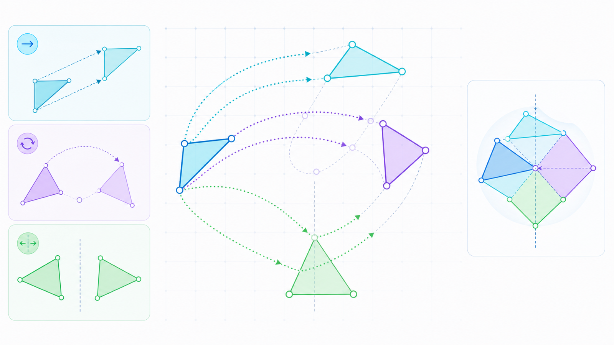

- ID: `hjb-junior-s1-upper-figure-transformations-worked-example`
- Status: `approved`
- Production src: `/lesson-illustrations/mainland-hjb-junior/hjb-junior-s1-upper-figure-transformations/worked-example.png`
- RAG cards: `hjb-junior-s1-upper-figure-transformations`
- Alt zh-Hans: 网格工作区用顶点虚线轨迹和重叠图检查平移、旋转与翻折。
- Caption zh-Hans: 先匹配对应点，再检查大小、方向和朝向。

### hjb-junior-s1-lower-linear-inequalities / concept

- ID: `hjb-junior-s1-lower-linear-inequalities-concept`
- Status: `approved`
- Production src: `/lesson-illustrations/mainland-hjb-junior/hjb-junior-s1-lower-linear-inequalities/concept.png`
- RAG cards: `hjb-junior-s1-lower-linear-inequalities`
- Alt zh-Hans: 数轴、边界点、解集射线和天平面板展示不等式解集。
- Caption zh-Hans: 不等式的解表示一组数，而不只是一个答案。

### hjb-junior-s1-lower-linear-inequalities / worked-example

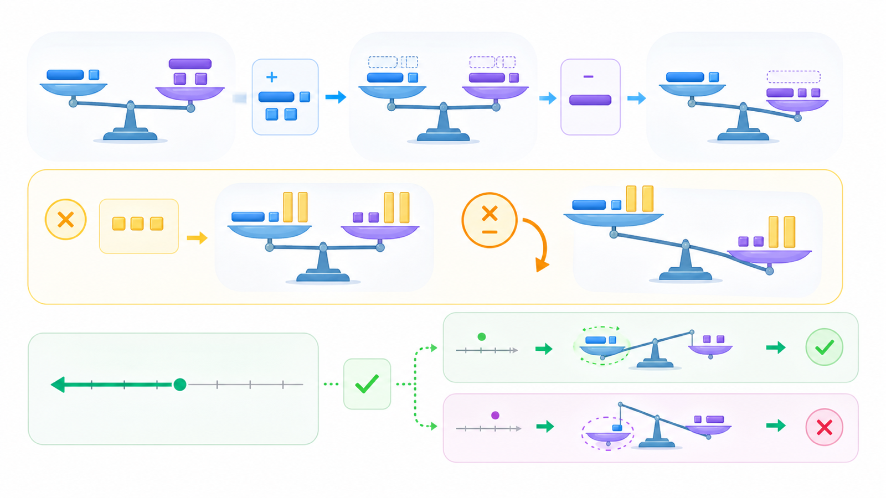

- ID: `hjb-junior-s1-lower-linear-inequalities-worked-example`
- Status: `approved`
- Production src: `/lesson-illustrations/mainland-hjb-junior/hjb-junior-s1-lower-linear-inequalities/worked-example.png`
- RAG cards: `hjb-junior-s1-lower-linear-inequalities`
- Alt zh-Hans: 解题路径展示两边同变、方向翻转线索和最终数轴检查。
- Caption zh-Hans: 两边变形要同步，遇到需要翻转方向的步骤要特别检查。

### hjb-junior-s1-lower-intersecting-parallel-lines / concept

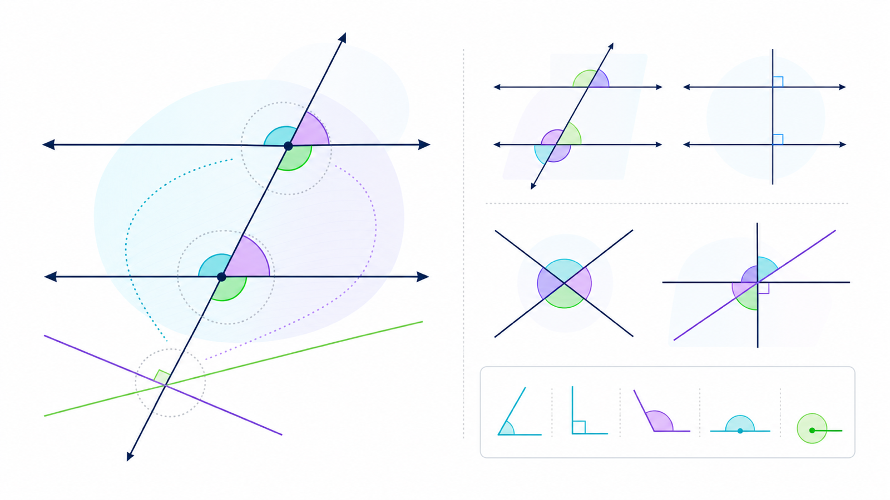

- ID: `hjb-junior-s1-lower-intersecting-parallel-lines-concept`
- Status: `approved`
- Production src: `/lesson-illustrations/mainland-hjb-junior/hjb-junior-s1-lower-intersecting-parallel-lines/concept.png`
- RAG cards: `hjb-junior-s1-lower-intersecting-parallel-lines`
- Alt zh-Hans: 相交线和平行线突出角对、垂直线索和匹配角弧。
- Caption zh-Hans: 角关系结论必须依赖能够支持它的线的位置条件。

### hjb-junior-s1-lower-intersecting-parallel-lines / worked-example

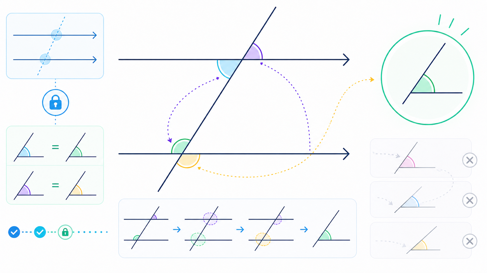

- ID: `hjb-junior-s1-lower-intersecting-parallel-lines-worked-example`
- Status: `approved`
- Production src: `/lesson-illustrations/mainland-hjb-junior/hjb-junior-s1-lower-intersecting-parallel-lines/worked-example.png`
- RAG cards: `hjb-junior-s1-lower-intersecting-parallel-lines`
- Alt zh-Hans: 推理工作区用平行条件开启匹配角弧，并逐步到达目标角。
- Caption zh-Hans: 计算前先说清角关系，避免被图形外观误导。

### hjb-junior-s1-lower-triangles / concept

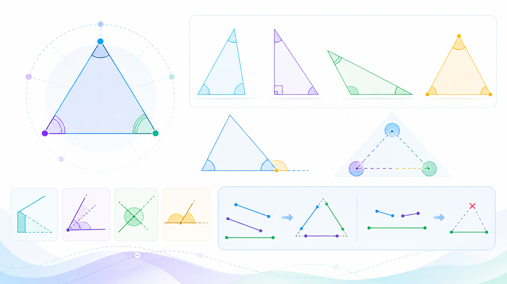

- ID: `hjb-junior-s1-lower-triangles-concept`
- Status: `approved`
- Production src: `/lesson-illustrations/mainland-hjb-junior/hjb-junior-s1-lower-triangles/concept.png`
- RAG cards: `hjb-junior-s1-lower-triangles`
- Alt zh-Hans: 三角形图展示边角关系、内外角线索和边长木棒检查。
- Caption zh-Hans: 三角形推理要先确认哪些边角条件成立。

### hjb-junior-s1-lower-triangles / worked-example

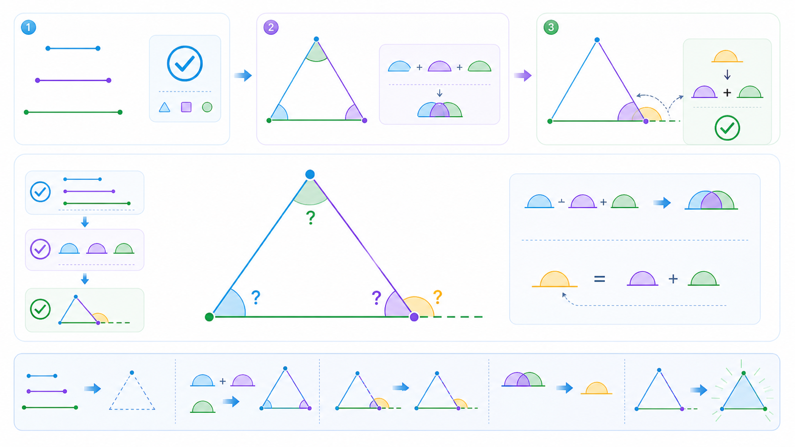

- ID: `hjb-junior-s1-lower-triangles-worked-example`
- Status: `approved`
- Production src: `/lesson-illustrations/mainland-hjb-junior/hjb-junior-s1-lower-triangles/worked-example.png`
- RAG cards: `hjb-junior-s1-lower-triangles`
- Alt zh-Hans: 求未知量工作区先检查边长是否能成三角形，再组合角弧和外角线索。
- Caption zh-Hans: 先确认三角形能成立，再使用角度或周长推理。

### hjb-junior-s1-lower-isosceles-triangles / concept

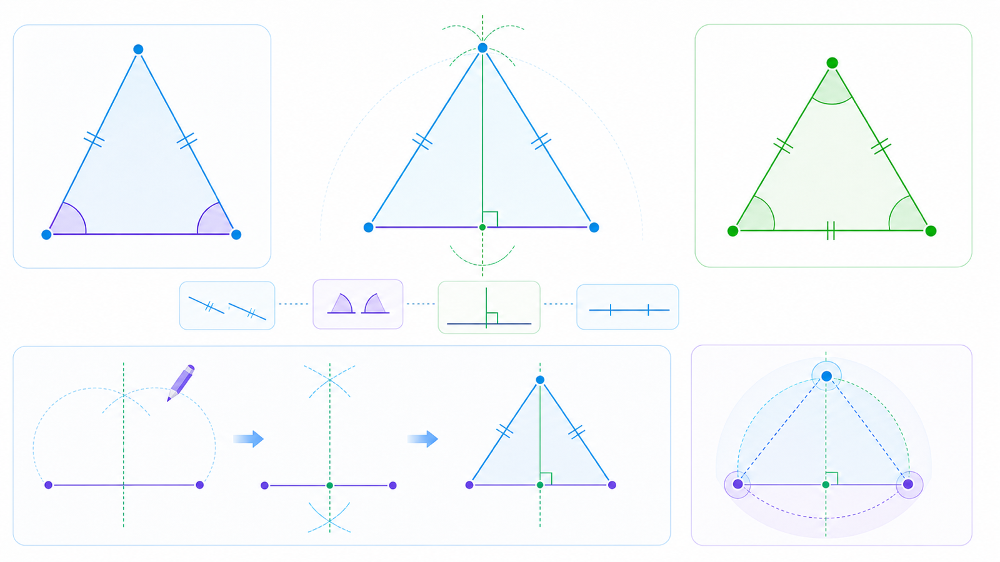

- ID: `hjb-junior-s1-lower-isosceles-triangles-concept`
- Status: `approved`
- Production src: `/lesson-illustrations/mainland-hjb-junior/hjb-junior-s1-lower-isosceles-triangles/concept.png`
- RAG cards: `hjb-junior-s1-lower-isosceles-triangles`
- Alt zh-Hans: 等腰与等边三角形展示对应边、底角和垂直平分线弧迹。
- Caption zh-Hans: 等边、等角和等距离相互关联，但使用时要说明依据。

### hjb-junior-s1-lower-isosceles-triangles / worked-example

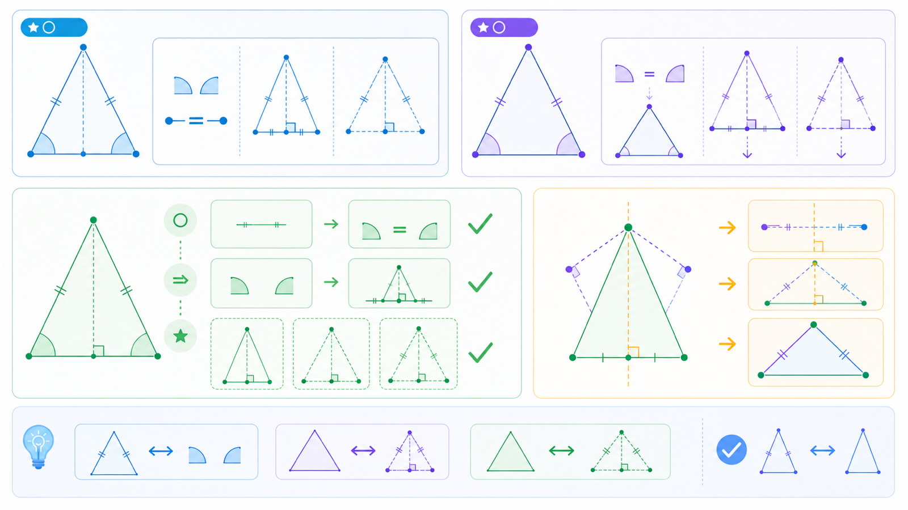

- ID: `hjb-junior-s1-lower-isosceles-triangles-worked-example`
- Status: `approved`
- Production src: `/lesson-illustrations/mainland-hjb-junior/hjb-junior-s1-lower-isosceles-triangles/worked-example.png`
- RAG cards: `hjb-junior-s1-lower-isosceles-triangles`
- Alt zh-Hans: 证明工作区用边记号、角弧和垂直平分线检查区分性质与判定。
- Caption zh-Hans: 先判断自己是在使用已知性质，还是在证明判定条件。

### hjb-junior-s2-upper-real-numbers / concept

- ID: `hjb-junior-s2-upper-real-numbers-concept`
- Status: `approved`
- Production src: `/lesson-illustrations/mainland-hjb-junior/hjb-junior-s2-upper-real-numbers/concept.png`
- RAG cards: `hjb-junior-s2-upper-real-numbers`
- Alt zh-Hans: 数轴连接有理点、根式标记、小数放大镜和实数分类区域。
- Caption zh-Hans: 符号、分类和数轴位置一致时，实数理解才清楚。

### hjb-junior-s2-upper-real-numbers / worked-example

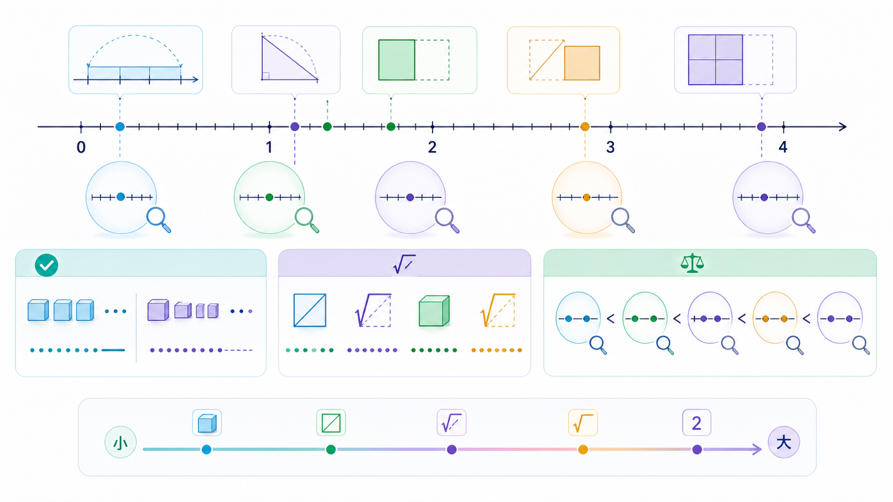

- ID: `hjb-junior-s2-upper-real-numbers-worked-example`
- Status: `approved`
- Production src: `/lesson-illustrations/mainland-hjb-junior/hjb-junior-s2-upper-real-numbers/worked-example.png`
- RAG cards: `hjb-junior-s2-upper-real-numbers`
- Alt zh-Hans: 比较板估计根式数量，区分小数模式，并在数轴上检查大小顺序。
- Caption zh-Hans: 先估计，再放到同一数轴上比较。

### hjb-junior-s2-upper-quadratic-radicals / concept

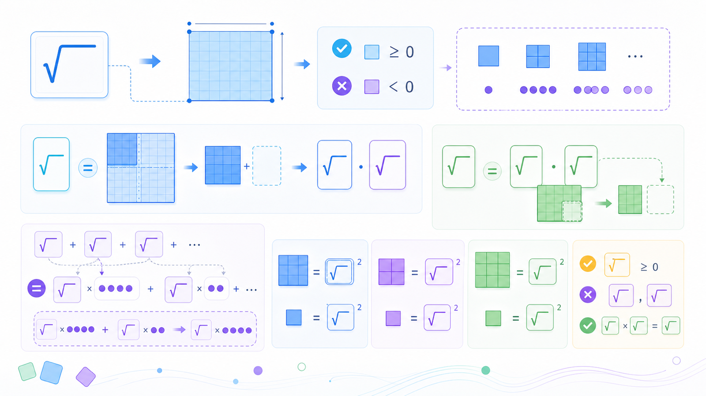

- ID: `hjb-junior-s2-upper-quadratic-radicals-concept`
- Status: `approved`
- Production src: `/lesson-illustrations/mainland-hjb-junior/hjb-junior-s2-upper-quadratic-radicals/concept.png`
- RAG cards: `hjb-junior-s2-upper-quadratic-radicals`
- Alt zh-Hans: 正方形面积卡、非负提示、根式部件和同类根式组展示二次根式结构。
- Caption zh-Hans: 二次根式运算要先保证有意义，再看根式部分是否相同。

### hjb-junior-s2-upper-quadratic-radicals / worked-example

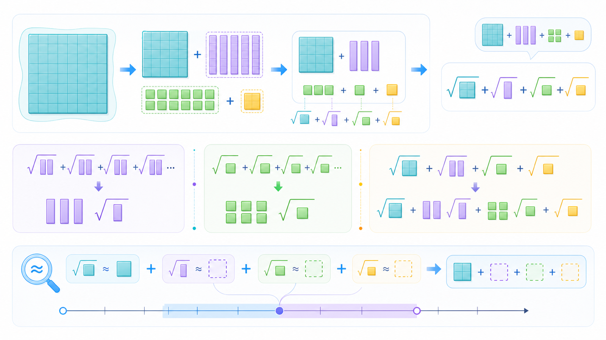

- ID: `hjb-junior-s2-upper-quadratic-radicals-worked-example`
- Status: `approved`
- Production src: `/lesson-illustrations/mainland-hjb-junior/hjb-junior-s2-upper-quadratic-radicals/worked-example.png`
- RAG cards: `hjb-junior-s2-upper-quadratic-radicals`
- Alt zh-Hans: 化简板把面积块拆成完全平方部分，并把不同根式分开处理。
- Caption zh-Hans: 按因子化简，并用估计检查结果是否合理。

### hjb-junior-s2-upper-quadratic-equations / concept

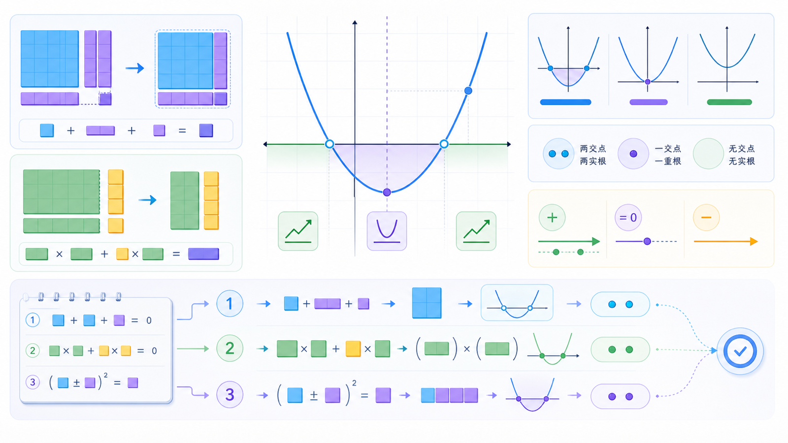

- ID: `hjb-junior-s2-upper-quadratic-equations-concept`
- Status: `approved`
- Production src: `/lesson-illustrations/mainland-hjb-junior/hjb-junior-s2-upper-quadratic-equations/concept.png`
- RAG cards: `hjb-junior-s2-upper-quadratic-equations`
- Alt zh-Hans: 抛物线、根点、配方方块和因式块展示一元二次方程方法。
- Caption zh-Hans: 一元二次方程把代数形式、图像根和面积结构联系起来。

### hjb-junior-s2-upper-quadratic-equations / worked-example

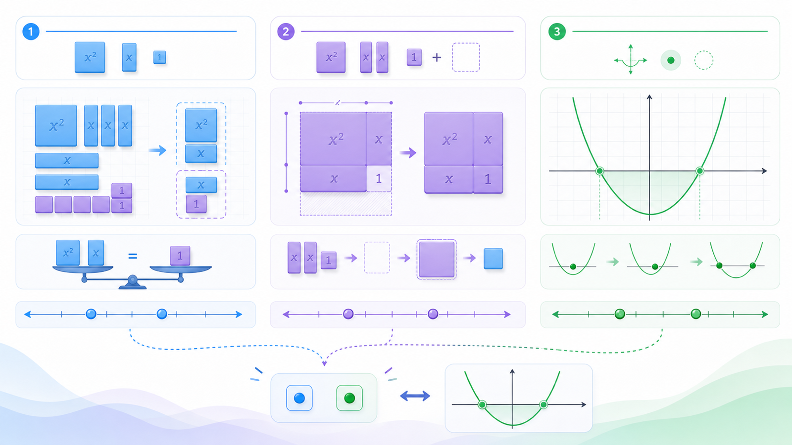

- ID: `hjb-junior-s2-upper-quadratic-equations-worked-example`
- Status: `approved`
- Production src: `/lesson-illustrations/mainland-hjb-junior/hjb-junior-s2-upper-quadratic-equations/worked-example.png`
- RAG cards: `hjb-junior-s2-upper-quadratic-equations`
- Alt zh-Hans: 方法比较工作区并列因式分解、配方和抛物线根点检查。
- Caption zh-Hans: 选定方法后，用图像或面积模型检查根是否合理。

### hjb-junior-s2-upper-right-triangles / concept

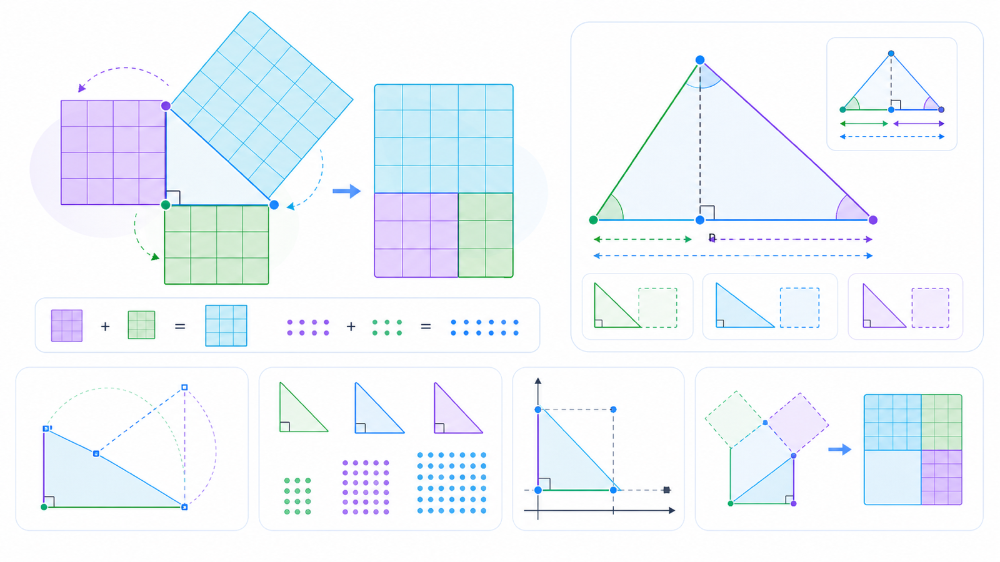

- ID: `hjb-junior-s2-upper-right-triangles-concept`
- Status: `approved`
- Production src: `/lesson-illustrations/mainland-hjb-junior/hjb-junior-s2-upper-right-triangles/concept.png`
- RAG cards: `hjb-junior-s2-upper-right-triangles`
- Alt zh-Hans: 直角三角形展示三边正方形面积、高线线索、投影和距离推理。
- Caption zh-Hans: 直角三角形结构能把距离和面积关系转化为可靠检查。

### hjb-junior-s2-upper-right-triangles / worked-example

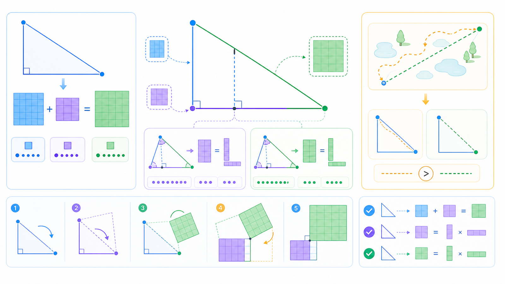

- ID: `hjb-junior-s2-upper-right-triangles-worked-example`
- Status: `approved`
- Production src: `/lesson-illustrations/mainland-hjb-junior/hjb-junior-s2-upper-right-triangles/worked-example.png`
- RAG cards: `hjb-junior-s2-upper-right-triangles`
- Alt zh-Hans: 问题工作区用正方形面积块和直角三角形距离路径验证边的关系。
- Caption zh-Hans: 先找直角，再比较由它控制的边长关系。

### hjb-junior-s2-lower-quadrilaterals / concept

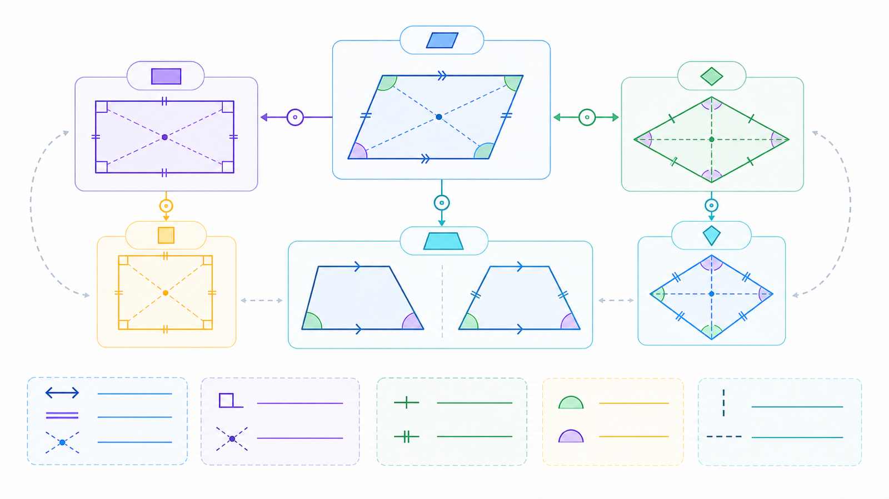

- ID: `hjb-junior-s2-lower-quadrilaterals-concept`
- Status: `approved`
- Production src: `/lesson-illustrations/mainland-hjb-junior/hjb-junior-s2-lower-quadrilaterals/concept.png`
- RAG cards: `hjb-junior-s2-lower-quadrilaterals`
- Alt zh-Hans: 四边形家族通过边、角、平行和对角线性质线索相互联系。
- Caption zh-Hans: 四边形分类依据性质，而不是只看外形。

### hjb-junior-s2-lower-quadrilaterals / worked-example

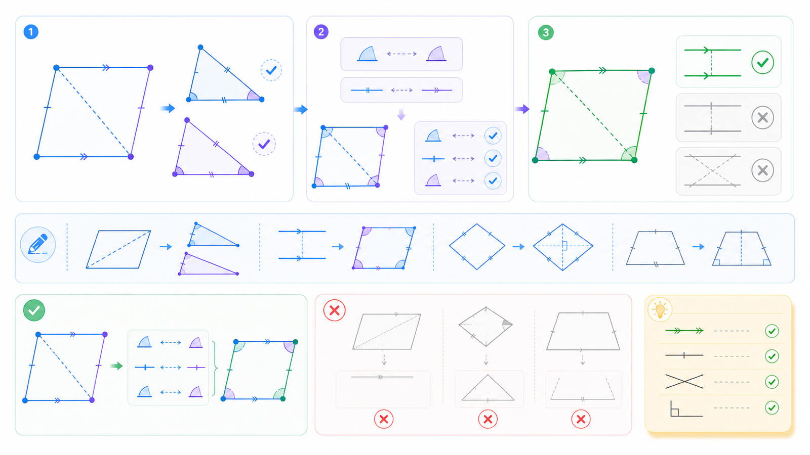

- ID: `hjb-junior-s2-lower-quadrilaterals-worked-example`
- Status: `approved`
- Production src: `/lesson-illustrations/mainland-hjb-junior/hjb-junior-s2-lower-quadrilaterals/worked-example.png`
- RAG cards: `hjb-junior-s2-lower-quadrilaterals`
- Alt zh-Hans: 证明工作区画出对角线，把四边形拆成三角形，并检查性质条件。
- Caption zh-Hans: 用对角线和三角形证据支撑四边形性质。

### hjb-junior-s2-lower-coordinate-plane / concept

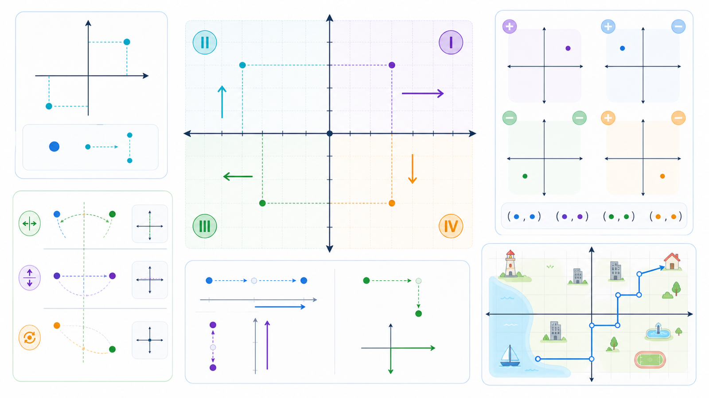

- ID: `hjb-junior-s2-lower-coordinate-plane-concept`
- Status: `approved`
- Production src: `/lesson-illustrations/mainland-hjb-junior/hjb-junior-s2-lower-coordinate-plane/concept.png`
- RAG cards: `hjb-junior-s2-lower-coordinate-plane`
- Alt zh-Hans: 平面直角坐标系展示象限、有序点、移动箭头、对称线索和地图路径。
- Caption zh-Hans: 读坐标要按固定顺序区分横向和纵向信息。

### hjb-junior-s2-lower-coordinate-plane / worked-example

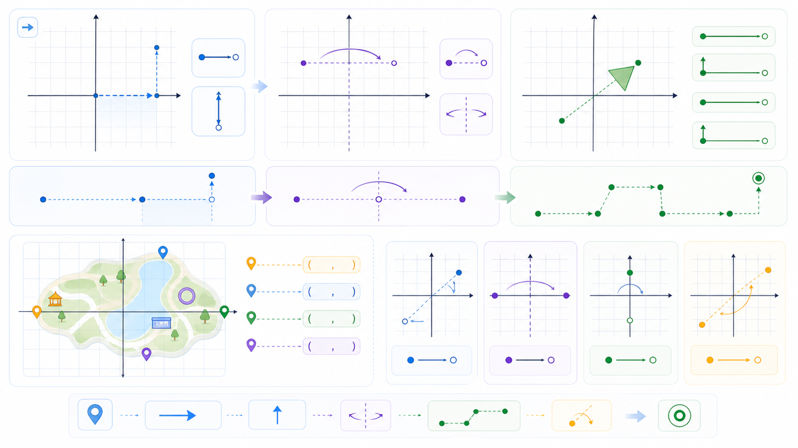

- ID: `hjb-junior-s2-lower-coordinate-plane-worked-example`
- Status: `approved`
- Production src: `/lesson-illustrations/mainland-hjb-junior/hjb-junior-s2-lower-coordinate-plane/worked-example.png`
- RAG cards: `hjb-junior-s2-lower-coordinate-plane`
- Alt zh-Hans: 定位工作区先横向再纵向移动，并在坐标地图上检查路线。
- Caption zh-Hans: 说出点的位置前，先逐方向读取移动。

### hjb-junior-s2-lower-linear-functions / concept

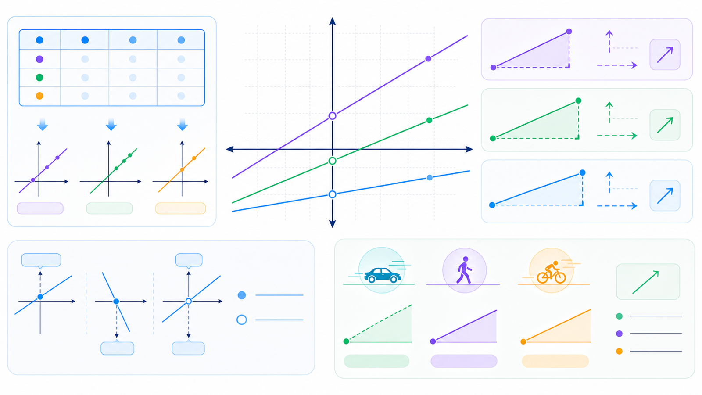

- ID: `hjb-junior-s2-lower-linear-functions-concept`
- Status: `approved`
- Production src: `/lesson-illustrations/mainland-hjb-junior/hjb-junior-s2-lower-linear-functions/concept.png`
- RAG cards: `hjb-junior-s2-lower-linear-functions`
- Alt zh-Hans: 直线图像、斜率三角形、截距点和表格到图像箭头展示一次函数。
- Caption zh-Hans: 一次函数要从变化率、截距和图像方向来读。

### hjb-junior-s2-lower-linear-functions / worked-example

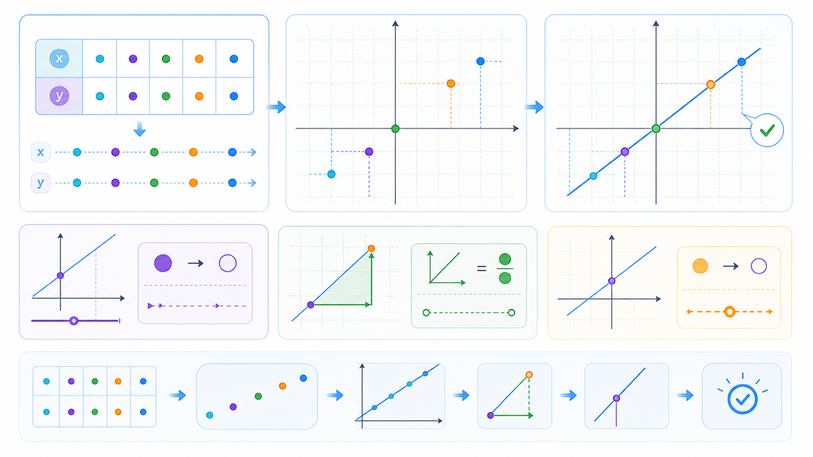

- ID: `hjb-junior-s2-lower-linear-functions-worked-example`
- Status: `approved`
- Production src: `/lesson-illustrations/mainland-hjb-junior/hjb-junior-s2-lower-linear-functions/worked-example.png`
- RAG cards: `hjb-junior-s2-lower-linear-functions`
- Alt zh-Hans: 表格到直线工作区把对应点画成图像，并检查斜率和截距。
- Caption zh-Hans: 先用点画线，再用斜率和截距验证模型。

### hjb-junior-s2-lower-inverse-functions / concept

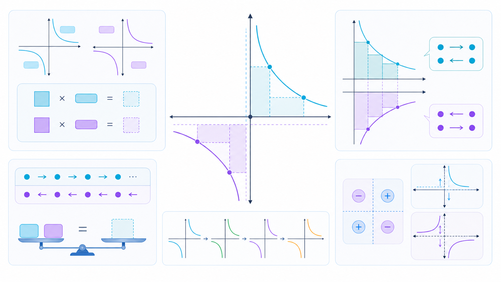

- ID: `hjb-junior-s2-lower-inverse-functions-concept`
- Status: `approved`
- Production src: `/lesson-illustrations/mainland-hjb-junior/hjb-junior-s2-lower-inverse-functions/concept.png`
- RAG cards: `hjb-junior-s2-lower-inverse-functions`
- Alt zh-Hans: 反比例曲线、定面积矩形、渐近线线索和变量反向变化同时呈现。
- Caption zh-Hans: 反比例保持乘积关系，同时两个量常向相反方向变化。

### hjb-junior-s2-lower-inverse-functions / worked-example

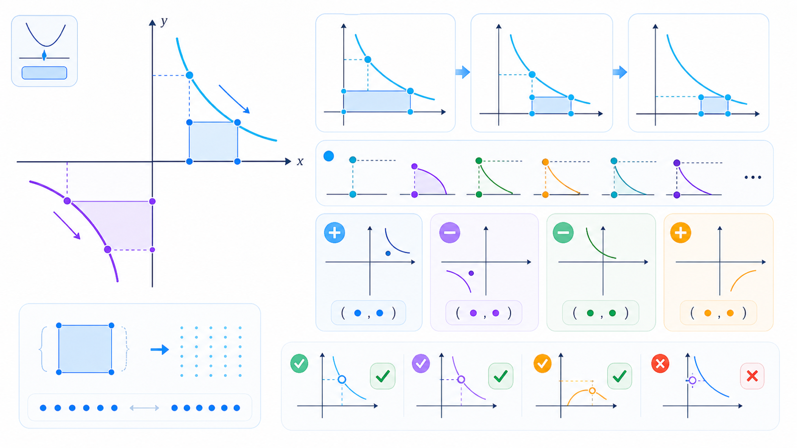

- ID: `hjb-junior-s2-lower-inverse-functions-worked-example`
- Status: `approved`
- Production src: `/lesson-illustrations/mainland-hjb-junior/hjb-junior-s2-lower-inverse-functions/worked-example.png`
- RAG cards: `hjb-junior-s2-lower-inverse-functions`
- Alt zh-Hans: 图像检查工作区让定面积矩形沿反比例曲线移动，并检查象限选择。
- Caption zh-Hans: 读曲线关系前，先检查符号和象限。

### hjb-junior-s3-upper-similar-triangles / concept

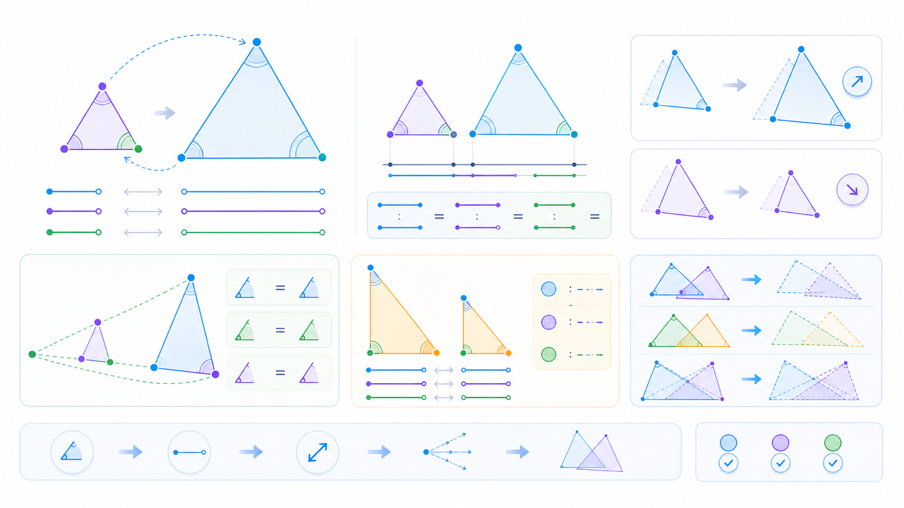

- ID: `hjb-junior-s3-upper-similar-triangles-concept`
- Status: `approved`
- Production src: `/lesson-illustrations/mainland-hjb-junior/hjb-junior-s3-upper-similar-triangles/concept.png`
- RAG cards: `hjb-junior-s3-upper-similar-triangles`
- Alt zh-Hans: 不同大小的相似三角形展示匹配角弧、比例边条和投影射线。
- Caption zh-Hans: 相似保持形状，边长按同一个比例变化。

### hjb-junior-s3-upper-similar-triangles / worked-example

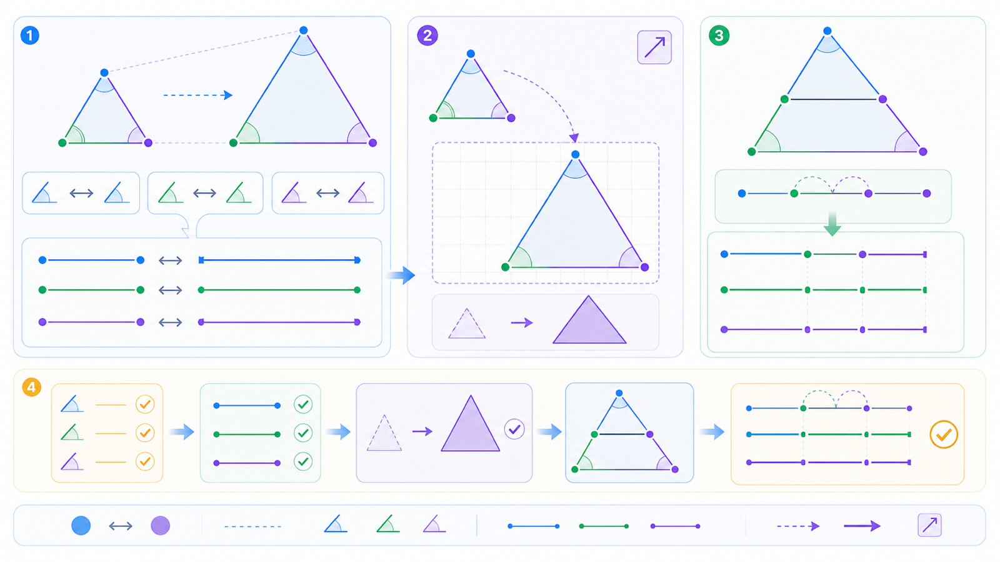

- ID: `hjb-junior-s3-upper-similar-triangles-worked-example`
- Status: `approved`
- Production src: `/lesson-illustrations/mainland-hjb-junior/hjb-junior-s3-upper-similar-triangles/worked-example.png`
- RAG cards: `hjb-junior-s3-upper-similar-triangles`
- Alt zh-Hans: 证明与测量工作区匹配角、配对对应边，并检查缩放后的线段。
- Caption zh-Hans: 建立比例前，先匹配对应部分。

### hjb-junior-s3-upper-acute-trigonometry / concept

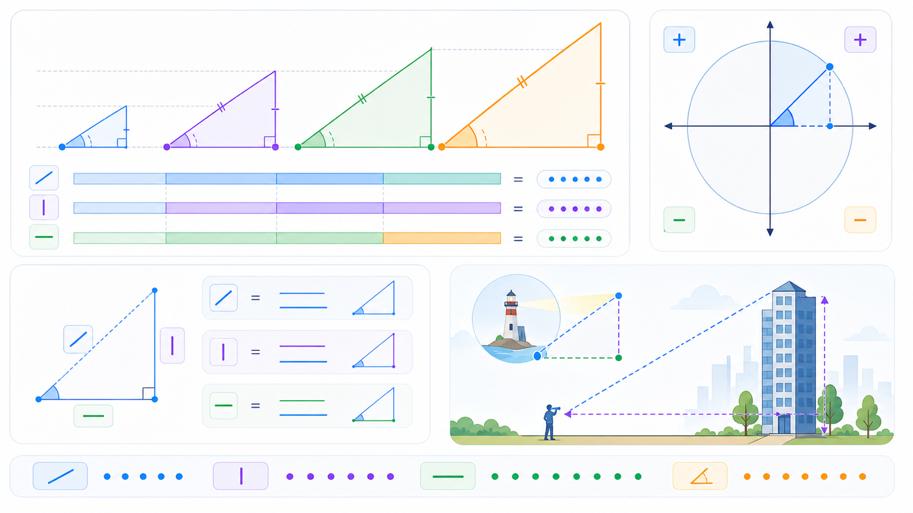

- ID: `hjb-junior-s3-upper-acute-trigonometry-concept`
- Status: `approved`
- Production src: `/lesson-illustrations/mainland-hjb-junior/hjb-junior-s3-upper-acute-trigonometry/concept.png`
- RAG cards: `hjb-junior-s3-upper-acute-trigonometry`
- Alt zh-Hans: 同一锐角的直角三角形族展示边比色带、象限线索和测高情境。
- Caption zh-Hans: 锐角三角比取决于锐角和相关边的位置关系。

### hjb-junior-s3-upper-acute-trigonometry / worked-example

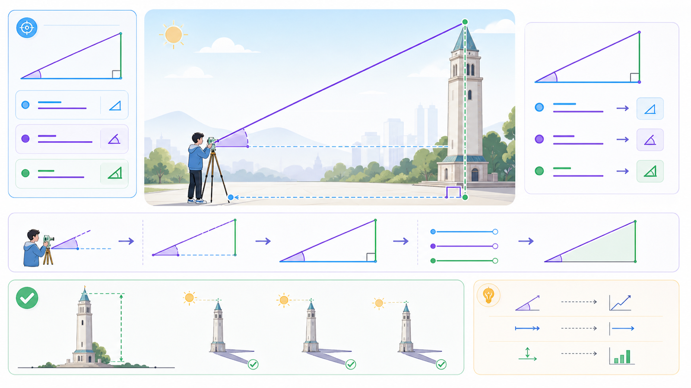

- ID: `hjb-junior-s3-upper-acute-trigonometry-worked-example`
- Status: `approved`
- Production src: `/lesson-illustrations/mainland-hjb-junior/hjb-junior-s3-upper-acute-trigonometry/worked-example.png`
- RAG cards: `hjb-junior-s3-upper-acute-trigonometry`
- Alt zh-Hans: 测高场景叠加直角三角形、视线、边比色带和合理性检查。
- Caption zh-Hans: 选择三角比前，先画出直角三角形模型。

### hjb-junior-s3-upper-quadratic-functions / concept

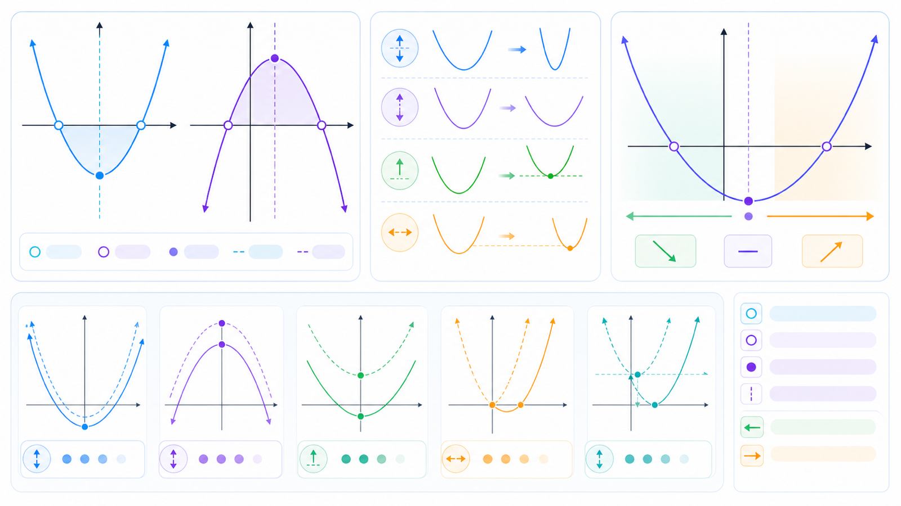

- ID: `hjb-junior-s3-upper-quadratic-functions-concept`
- Status: `approved`
- Production src: `/lesson-illustrations/mainland-hjb-junior/hjb-junior-s3-upper-quadratic-functions/concept.png`
- RAG cards: `hjb-junior-s3-upper-quadratic-functions`
- Alt zh-Hans: 抛物线展示顶点、对称轴、截点、变换和增减区间阴影。
- Caption zh-Hans: 读二次函数要看顶点、对称、开口方向和截点。

### hjb-junior-s3-upper-quadratic-functions / worked-example

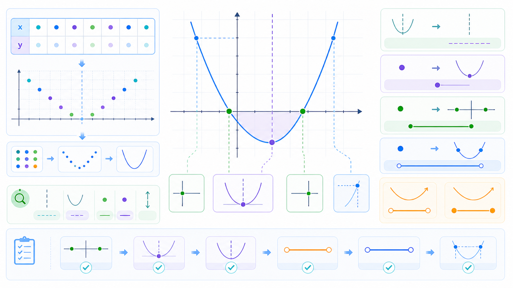

- ID: `hjb-junior-s3-upper-quadratic-functions-worked-example`
- Status: `approved`
- Production src: `/lesson-illustrations/mainland-hjb-junior/hjb-junior-s3-upper-quadratic-functions/worked-example.png`
- RAG cards: `hjb-junior-s3-upper-quadratic-functions`
- Alt zh-Hans: 读图工作区从表格点突出顶点、对称轴、根点和变化区间。
- Caption zh-Hans: 计算后，用图像检查顶点和区间变化。

### hjb-junior-s3-lower-circle-regular-polygons / concept

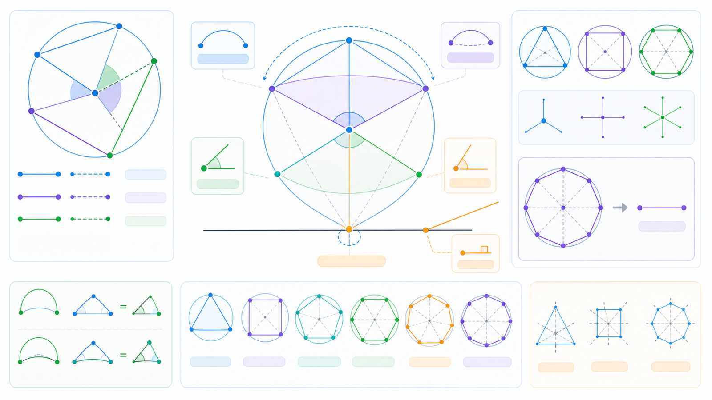

- ID: `hjb-junior-s3-lower-circle-regular-polygons-concept`
- Status: `approved`
- Production src: `/lesson-illustrations/mainland-hjb-junior/hjb-junior-s3-lower-circle-regular-polygons/concept.png`
- RAG cards: `hjb-junior-s3-lower-circle-regular-polygons`
- Alt zh-Hans: 圆把弦、弧、圆心角、切线线索、正多边形和对称半径联系起来。
- Caption zh-Hans: 圆与正多边形推理依赖等弧、半径和对称结构。

### hjb-junior-s3-lower-circle-regular-polygons / worked-example

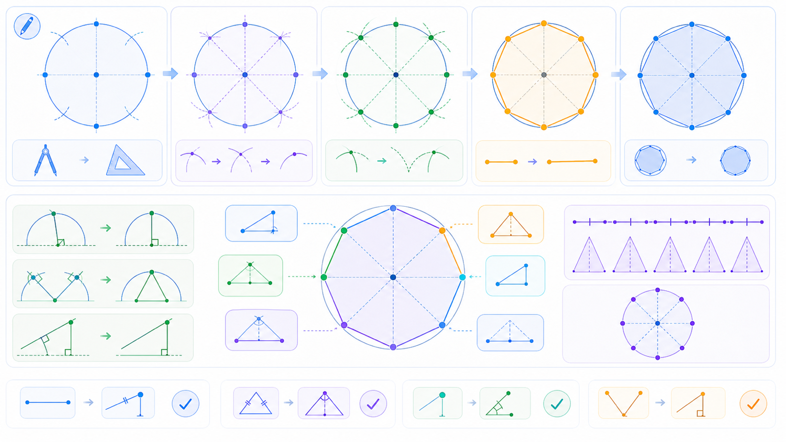

- ID: `hjb-junior-s3-lower-circle-regular-polygons-worked-example`
- Status: `approved`
- Production src: `/lesson-illustrations/mainland-hjb-junior/hjb-junior-s3-lower-circle-regular-polygons/worked-example.png`
- RAG cards: `hjb-junior-s3-lower-circle-regular-polygons`
- Alt zh-Hans: 作图工作区把圆分成等弧，构造正多边形，并检查切线与半径结构。
- Caption zh-Hans: 用等分和半径关系说明作图依据。

### hjb-junior-s3-lower-statistics-introduction / concept

- ID: `hjb-junior-s3-lower-statistics-introduction-concept`
- Status: `approved`
- Production src: `/lesson-illustrations/mainland-hjb-junior/hjb-junior-s3-lower-statistics-introduction/concept.png`
- RAG cards: `hjb-junior-s3-lower-statistics-introduction`
- Alt zh-Hans: 原始数据点转化为图表卡、中心标记、离散带和抽样模型。
- Caption zh-Hans: 统计用中心、离散程度和抽样限制把数据转化为证据。

### hjb-junior-s3-lower-statistics-introduction / worked-example

- ID: `hjb-junior-s3-lower-statistics-introduction-worked-example`
- Status: `approved`
- Production src: `/lesson-illustrations/mainland-hjb-junior/hjb-junior-s3-lower-statistics-introduction/worked-example.png`
- RAG cards: `hjb-junior-s3-lower-statistics-introduction`
- Alt zh-Hans: 比较工作区用点图、条形、中心标记和离散带比较两个分布。
- Caption zh-Hans: 下数据结论前，要同时比较中心和离散程度。

