# Mainland PEP High Lesson Illustrations V1 Review

- Generated at: 2026-05-27T03:57:50.648Z
- Generator: Codex built-in image generation (`image_gen`), not DashScope/bl.
- Scope: 22 Mainland PEP high-school lessons, 2 candidates per lesson.
- Production status: Integrated. Approved images are served from `public/lesson-illustrations/mainland-pep-high/<topicId>/<slot>.png`.
- Review statuses: all 44 candidates have owner approval recorded in `manual-review.csv`.

## Review Criteria

- Mathematical correctness and fit to the lesson objective.
- No copied textbook/page/screenshot look, publisher marks, logos, or watermarks.
- No wrong formulas, unreadable text, stray labels, or misleading geometry/data encoding.
- Clear student learning value and accurate alt/caption text.

## Candidates

### pep-high-s4-sets-logic / concept

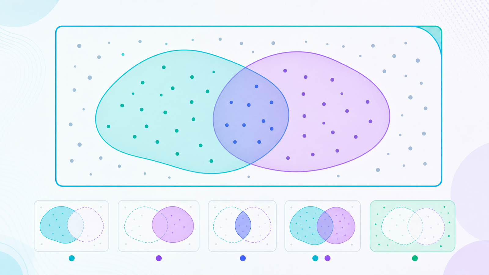

- ID: `pep-high-s4-sets-logic-concept`
- Status: `approved`
- RAG cards: `pep-high-sets-logic`, `pep-high-logic-quantifiers-conditions`
- Alt zh-Hans: 两个半透明集合区域在全集框中相交，展示元素归属、交集、并集和边界意识。
- Caption zh-Hans: 先确定全集，再比较满足不同条件的区域。

### pep-high-s4-sets-logic / worked-example

- ID: `pep-high-s4-sets-logic-worked-example`
- Status: `approved`
- RAG cards: `pep-high-sets-logic`
- Alt zh-Hans: 集合运算工作区突出偶数集合与大于某阈值集合的重叠部分，不使用教材原文。
- Caption zh-Hans: 可视化解法先找共同区域，再扩展到合并区域。

### pep-high-s4-quadratic-inequalities / concept

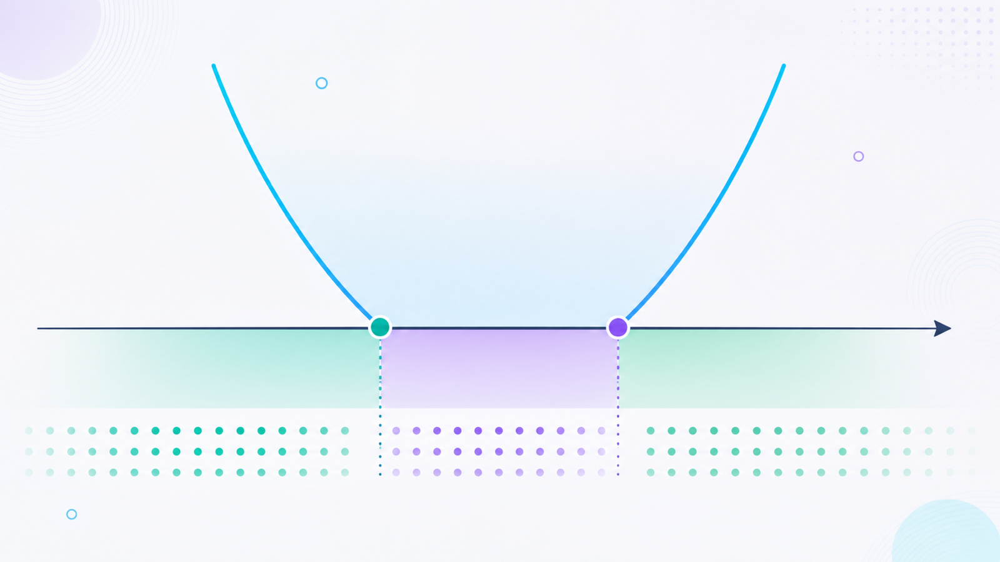

- ID: `pep-high-s4-quadratic-inequalities-concept`
- Status: `approved`
- RAG cards: `pep-high-quadratic-inequalities`, `pep-high-basic-inequality-optimization`
- Alt zh-Hans: 一条抛物线穿过横轴，并用区间阴影联系根、符号与不等式解集。
- Caption zh-Hans: 二次不等式要先用根把数轴分成符号区间。

### pep-high-s4-quadratic-inequalities / worked-example

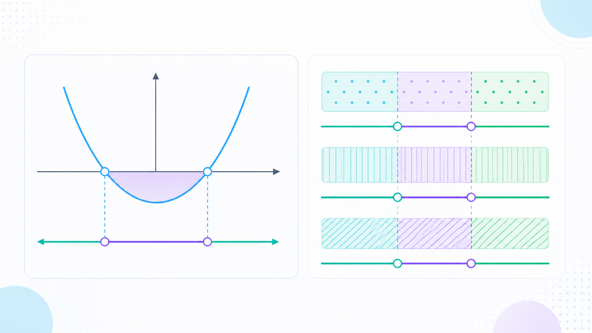

- ID: `pep-high-s4-quadratic-inequalities-worked-example`
- Status: `approved`
- RAG cards: `pep-high-quadratic-inequalities`
- Alt zh-Hans: 例题图把抛物线与符号表并列，帮助目视检查所选解区间。
- Caption zh-Hans: 写最终解集前，先用图像检查区间选择。

### pep-high-s4-function-properties / concept

- ID: `pep-high-s4-function-properties-concept`
- Status: `approved`
- RAG cards: `pep-high-function-concepts-properties`, `pep-high-function-zero-modeling`
- Alt zh-Hans: 函数机器把每个输入对应到一个输出，旁边曲线展示定义域、值域、单调性和对称线索。
- Caption zh-Hans: 函数先是每个允许输入对应唯一输出的规则，再由图像观察性质。

### pep-high-s4-function-properties / worked-example

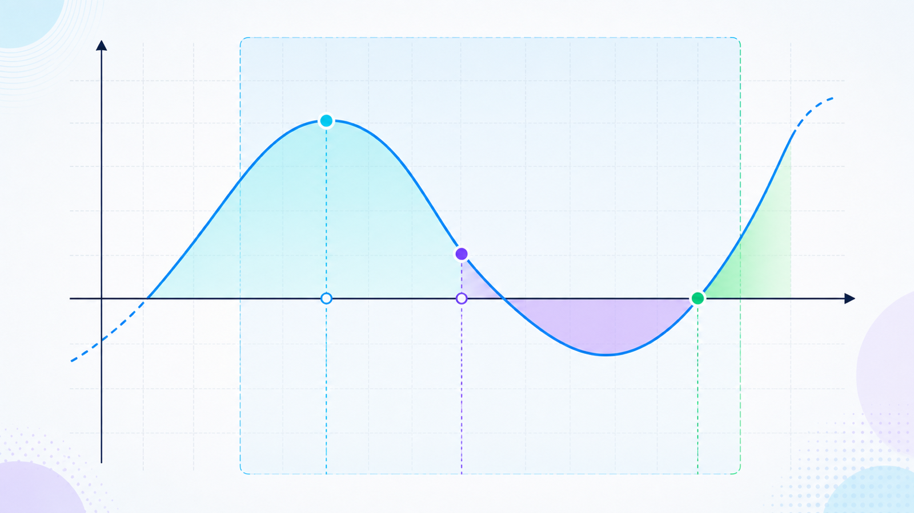

- ID: `pep-high-s4-function-properties-worked-example`
- Status: `approved`
- RAG cards: `pep-high-function-concepts-properties`
- Alt zh-Hans: 读图工作区突出有效输入范围、输出高度和单调区间。
- Caption zh-Hans: 先读定义域，再分区间描述函数值怎样变化。

### pep-high-s4-exp-log / concept

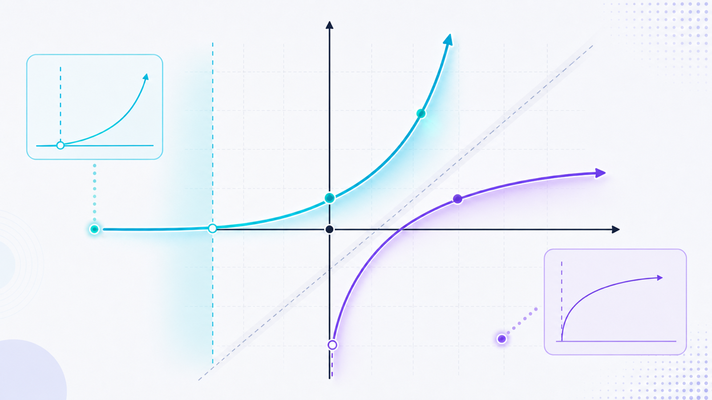

- ID: `pep-high-s4-exp-log-concept`
- Status: `approved`
- RAG cards: `pep-high-exponential-logarithmic-functions`
- Alt zh-Hans: 指数增长和对数增长曲线围绕一条对角镜像线呈现互逆关系。
- Caption zh-Hans: 比较指数与对数函数，要同时看增长形状和互逆结构。

### pep-high-s4-exp-log / worked-example

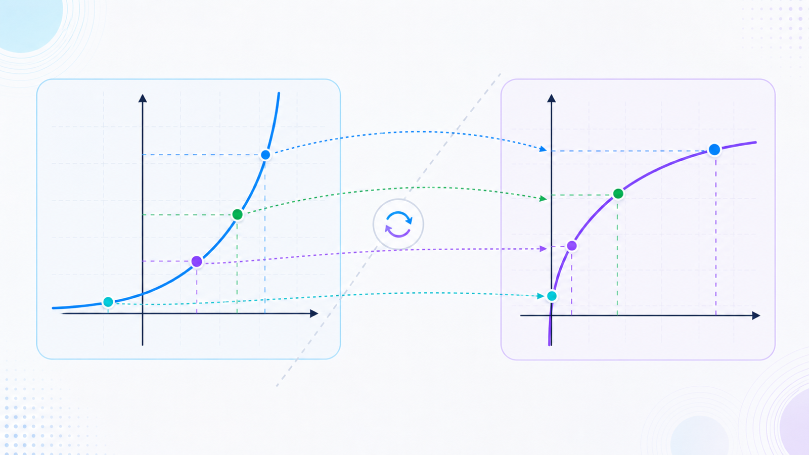

- ID: `pep-high-s4-exp-log-worked-example`
- Status: `approved`
- RAG cards: `pep-high-exponential-logarithmic-functions`
- Alt zh-Hans: 转换工作区用彩色箭头连接指数曲线、对数曲线和对应点。
- Caption zh-Hans: 指数式与对数式转换，本质是从两个视角看同一关系。

### pep-high-s4-trigonometry / concept

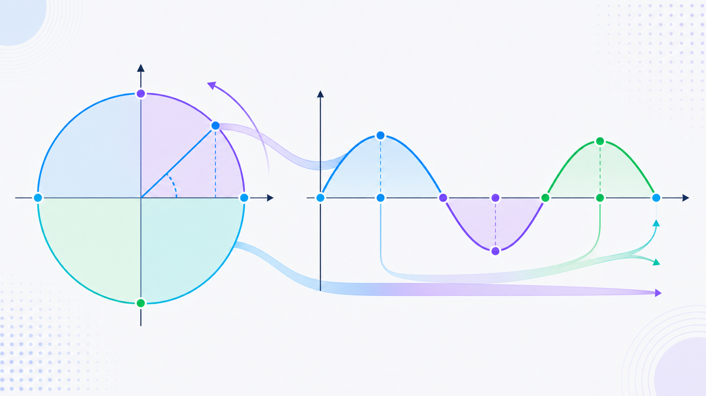

- ID: `pep-high-s4-trigonometry-concept`
- Status: `approved`
- RAG cards: `pep-high-trigonometric-functions`, `pep-high-trigonometric-identities-transformations`
- Alt zh-Hans: 单位圆把旋转角运动连接到波形图，展示符号、周期和图像特征。
- Caption zh-Hans: 单位圆能解释三角函数图像为何按规律重复并呈现不同符号。

### pep-high-s4-trigonometry / worked-example

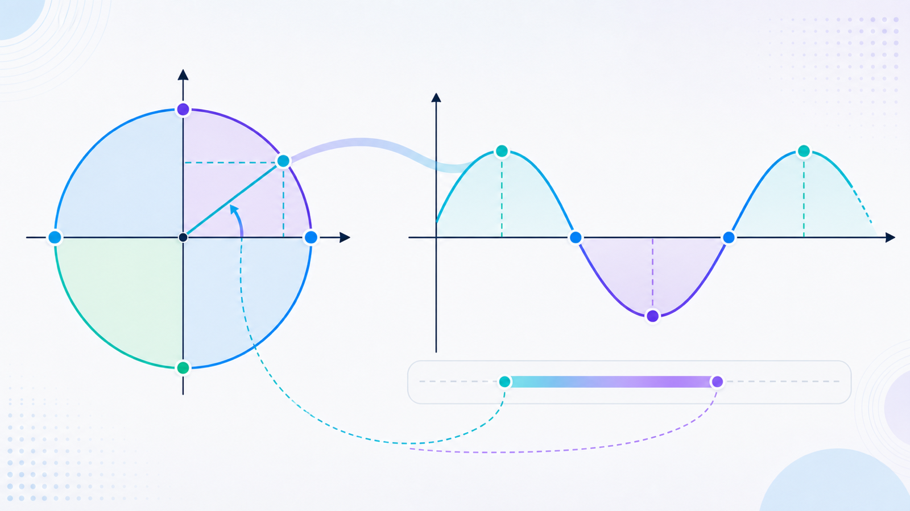

- ID: `pep-high-s4-trigonometry-worked-example`
- Status: `approved`
- RAG cards: `pep-high-trigonometric-functions`, `pep-high-sine-cosine-theorems`
- Alt zh-Hans: 三角例题图用单位圆角度和高亮波形区段检查符号与周期解。
- Caption zh-Hans: 先用单位圆判断符号和参考角，再用波形检查周期。

### pep-high-s4-plane-vectors / concept

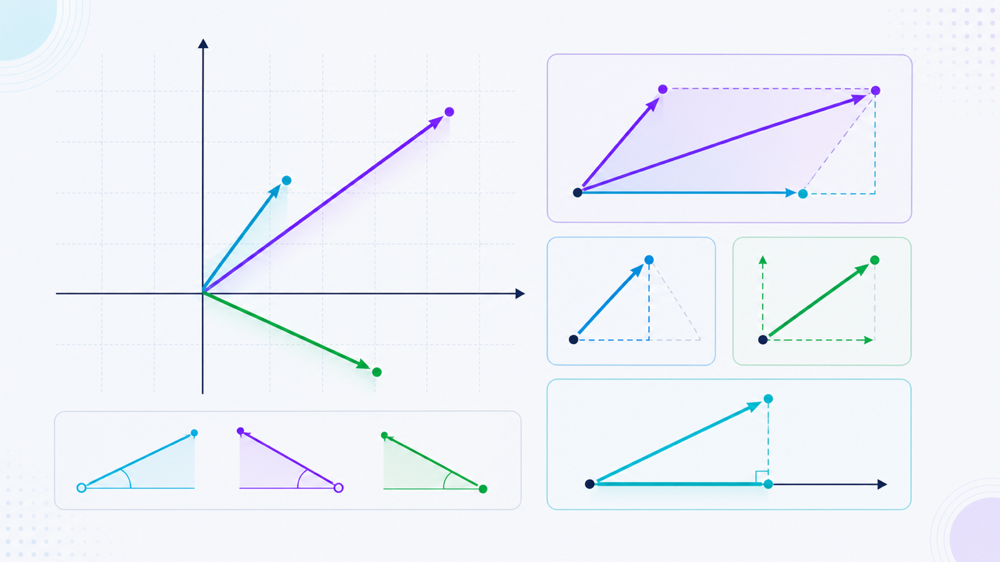

- ID: `pep-high-s4-plane-vectors-concept`
- Status: `approved`
- RAG cards: `pep-high-plane-vectors`
- Alt zh-Hans: 平面向量以网格上的有向箭头呈现，用颜色和投影展示加法、分解与投影。
- Caption zh-Hans: 向量同时包含大小和方向，画图时必须保留方向信息。

### pep-high-s4-plane-vectors / worked-example

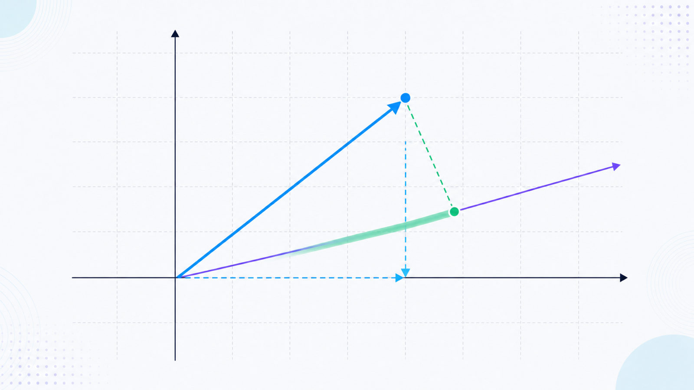

- ID: `pep-high-s4-plane-vectors-worked-example`
- Status: `approved`
- RAG cards: `pep-high-plane-vectors`, `pep-high-sine-cosine-vector-applications`
- Alt zh-Hans: 向量例题图把一个箭头分解为垂直分量，并比较投影方向。
- Caption zh-Hans: 使用数量积或投影前，先把向量分解为清楚的分量。

### pep-high-s4-complex-numbers / concept

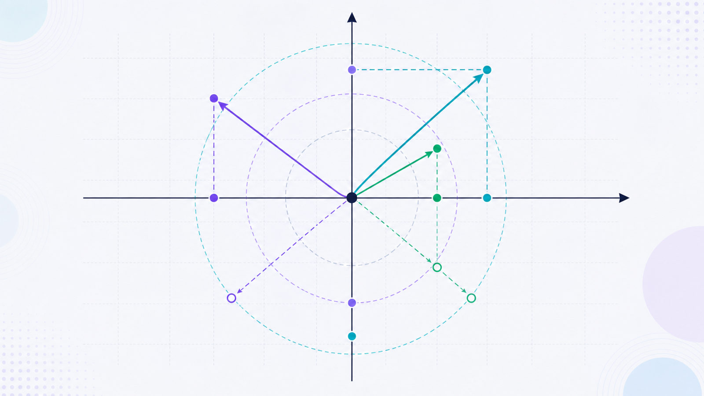

- ID: `pep-high-s4-complex-numbers-concept`
- Status: `approved`
- RAG cards: `pep-high-complex-numbers`
- Alt zh-Hans: 复平面以横向实部和纵向虚部网格呈现，含点、模长圆和共轭对称。
- Caption zh-Hans: 复数既能进行代数运算，也能在复平面中定位。

### pep-high-s4-complex-numbers / worked-example

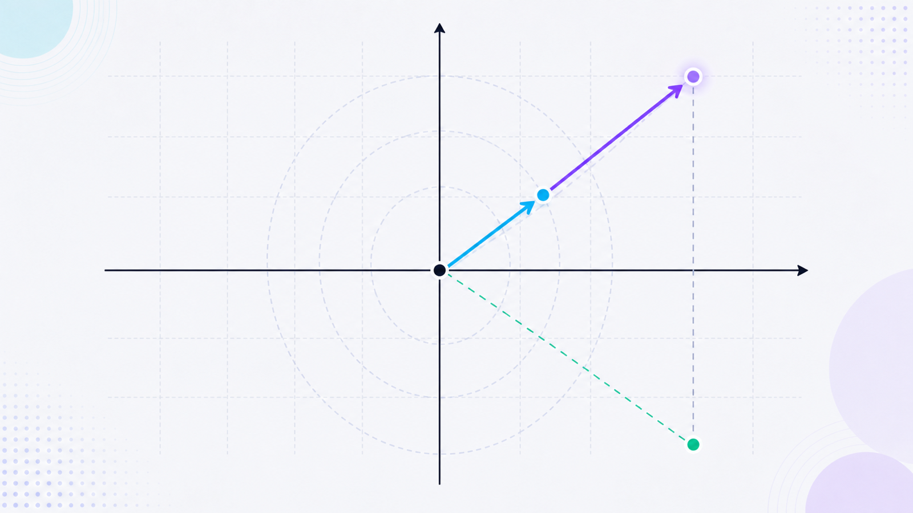

- ID: `pep-high-s4-complex-numbers-worked-example`
- Status: `approved`
- RAG cards: `pep-high-complex-numbers`
- Alt zh-Hans: 复数例题图展示两个复平面箭头合成为结果点，并用共轭反射检查。
- Caption zh-Hans: 分别追踪实部和虚部移动，再用图像检查最终点。

### pep-high-s4-solid-geometry-intro / concept

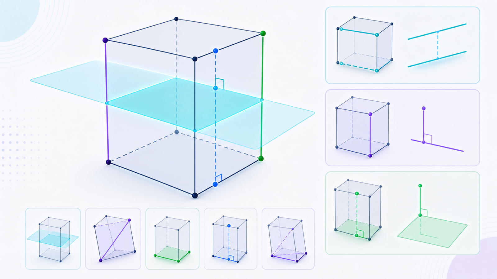

- ID: `pep-high-s4-solid-geometry-intro-concept`
- Status: `approved`
- RAG cards: `pep-high-solid-geometry-intro`
- Alt zh-Hans: 透明棱柱展示点、线、面、平行关系、垂直关系和空间距离线索。
- Caption zh-Hans: 立体几何要依据线面关系推理，不能只凭图形外观。

### pep-high-s4-solid-geometry-intro / worked-example

- ID: `pep-high-s4-solid-geometry-intro-worked-example`
- Status: `approved`
- RAG cards: `pep-high-solid-geometry-intro`
- Alt zh-Hans: 立体几何例题图在透明几何体内标出辅助平面和直角线索。
- Caption zh-Hans: 加入辅助平面或线段，可把空间关系转化为可见的平面论证。

### pep-high-s4-statistics / concept

- ID: `pep-high-s4-statistics-concept`
- Status: `approved`
- RAG cards: `pep-high-statistics`, `pep-high-statistics-sampling-estimation`
- Alt zh-Hans: 统计仪表板展示样本点转化为直方图、箱线图和中心离散概括。
- Caption zh-Hans: 统计把数据转化为证据，要描述分布、中心、离散程度和抽样偏差。

### pep-high-s4-statistics / worked-example

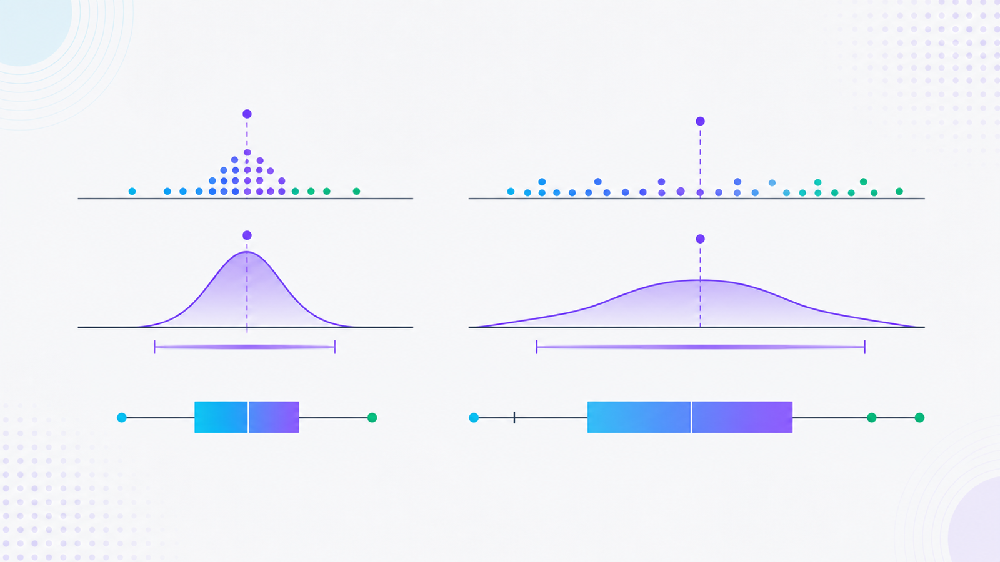

- ID: `pep-high-s4-statistics-worked-example`
- Status: `approved`
- RAG cards: `pep-high-statistics`
- Alt zh-Hans: 统计例题图比较两个中心接近但离散程度不同的分布。
- Caption zh-Hans: 不能只看平均数判断数据，还要比较离散程度和形状。

### pep-high-s4-probability / concept

- ID: `pep-high-s4-probability-concept`
- Status: `approved`
- RAG cards: `pep-high-probability`, `pep-high-probability-event-operations`
- Alt zh-Hans: 概率模型展示样本空间网格、事件区域、对立事件阴影和随机模拟轨迹。
- Caption zh-Hans: 先确定样本空间，再描述事件以及它与其他事件的关系。

### pep-high-s4-probability / worked-example

- ID: `pep-high-s4-probability-worked-example`
- Status: `approved`
- RAG cards: `pep-high-probability`
- Alt zh-Hans: 概率例题图从全部可能结果逐步缩小到高亮事件及其对立事件。
- Caption zh-Hans: 先列全所有可能结果，避免漏数或重复计数有利情况。

### pep-high-s5-space-vectors / concept

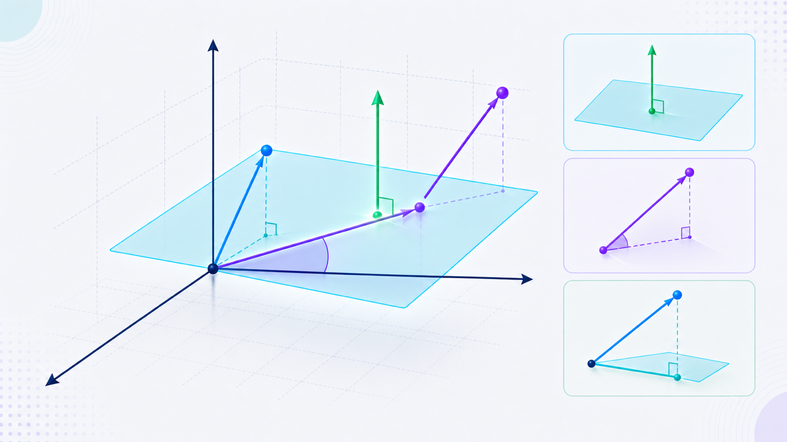

- ID: `pep-high-s5-space-vectors-concept`
- Status: `approved`
- RAG cards: `pep-high-space-vectors-solid-geometry`
- Alt zh-Hans: 三维坐标空间中包含向量、平面法向量以及距离和角度线索，用于立体几何推理。
- Caption zh-Hans: 空间向量能把线面位置问题转化为坐标与数量积推理。

### pep-high-s5-space-vectors / worked-example

- ID: `pep-high-s5-space-vectors-worked-example`
- Status: `approved`
- RAG cards: `pep-high-space-vectors-solid-geometry`, `pep-high-exam-space-vectors-geometry`
- Alt zh-Hans: 空间向量例题图把点投影到平面，并比较方向向量与法向量。
- Caption zh-Hans: 计算角度或距离前，先选定方向向量和法向量。

### pep-high-s5-lines-circles / concept

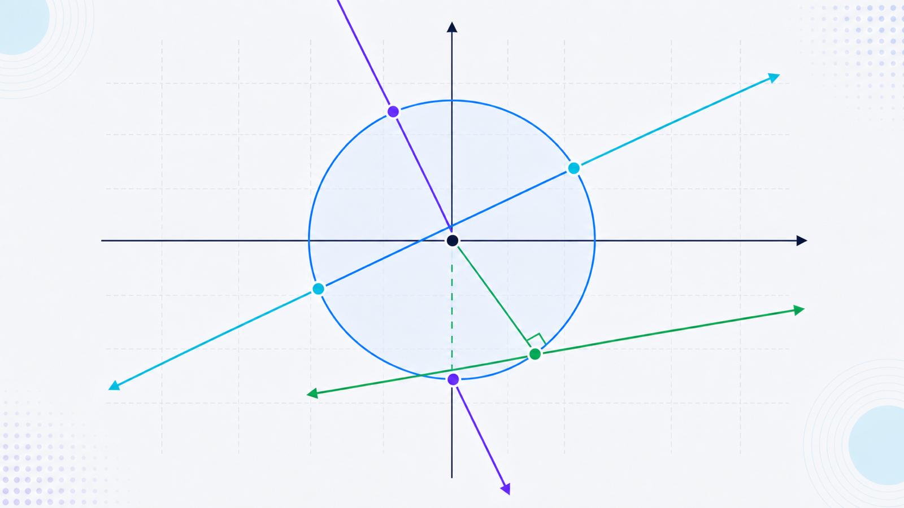

- ID: `pep-high-s5-lines-circles-concept`
- Status: `approved`
- RAG cards: `pep-high-lines-circles`, `pep-high-exam-analytic-lines-circles`
- Alt zh-Hans: 坐标平面展示直线、圆、切线距离、弦关系和交点情况。
- Caption zh-Hans: 直线和圆的方程让几何位置关系可以被计算。

### pep-high-s5-lines-circles / worked-example

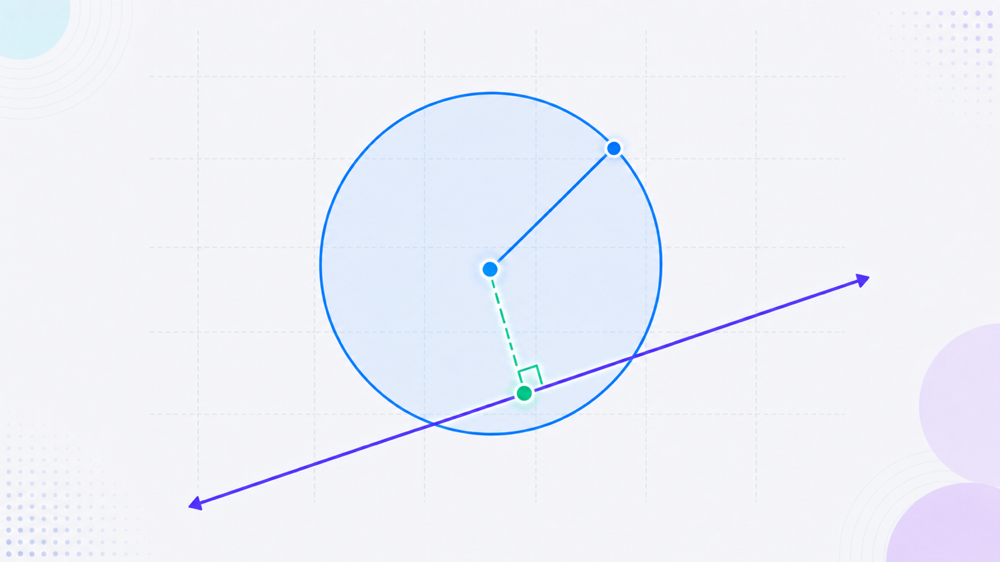

- ID: `pep-high-s5-lines-circles-worked-example`
- Status: `approved`
- RAG cards: `pep-high-lines-circles`
- Alt zh-Hans: 例题图突出圆心到直线的距离，用于判断直线与圆的位置关系。
- Caption zh-Hans: 判断直线与圆的位置关系，要比较圆心到直线距离和半径。

### pep-high-s5-conics / concept

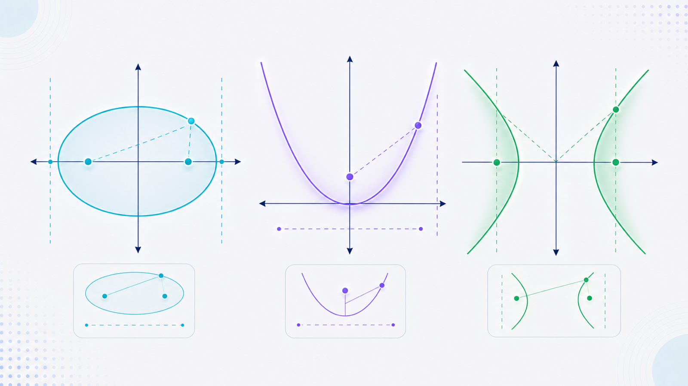

- ID: `pep-high-s5-conics-concept`
- Status: `approved`
- RAG cards: `pep-high-conic-sections`, `pep-high-exam-conics-analytic-geometry`
- Alt zh-Hans: 椭圆、抛物线和双曲线共处坐标空间，展示焦点、准线线索和参数高亮。
- Caption zh-Hans: 圆锥曲线方程同时描述形状、焦点结构和参数约束变化。

### pep-high-s5-conics / worked-example

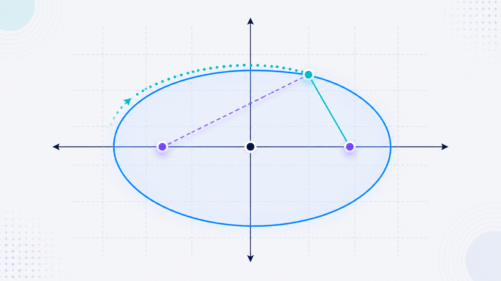

- ID: `pep-high-s5-conics-worked-example`
- Status: `approved`
- RAG cards: `pep-high-conic-sections`
- Alt zh-Hans: 圆锥曲线例题图展示带焦点的椭圆、弦和用于几何约束的动点。
- Caption zh-Hans: 先标清定点和动点，再把几何关系转化为方程。

### pep-high-s5-sequences / concept

- ID: `pep-high-s5-sequences-concept`
- Status: `approved`
- RAG cards: `pep-high-sequences`, `pep-high-sequences-summation-recursion`
- Alt zh-Hans: 数列以有序方块呈现，高度按规律变化，并展示递推箭头和部分和阶梯。
- Caption zh-Hans: 数列是有顺序的规律，求和会把各项累积成新的结构。

### pep-high-s5-sequences / worked-example

- ID: `pep-high-s5-sequences-worked-example`
- Status: `approved`
- RAG cards: `pep-high-sequences`
- Alt zh-Hans: 数列例题图用两个相连阶梯比较项的增长和累积和。
- Caption zh-Hans: 要区分通项规律和累加和规律。

### pep-high-s5-derivatives / concept

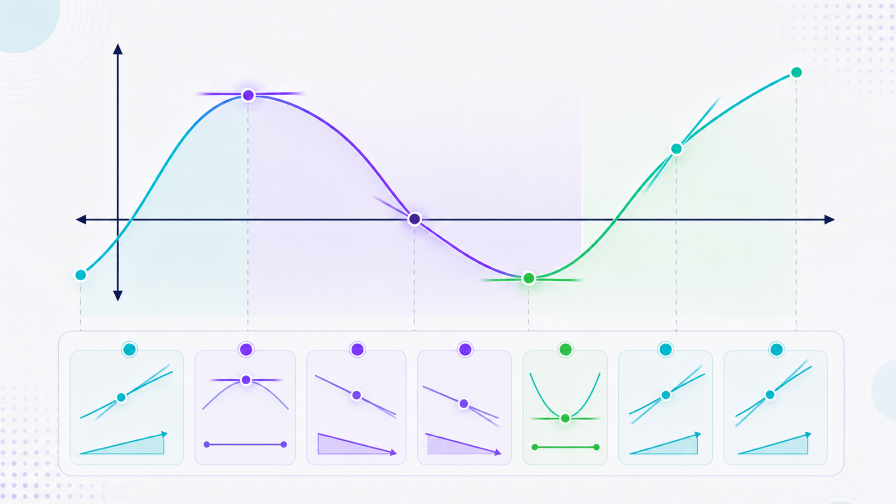

- ID: `pep-high-s5-derivatives-concept`
- Status: `approved`
- RAG cards: `pep-high-derivatives-applications`, `pep-high-exam-derivatives-optimization`
- Alt zh-Hans: 光滑曲线配有切线、斜率指示、增减区间和极值标记。
- Caption zh-Hans: 导数描述局部变化，并进一步揭示单调性、极值和最优化。

### pep-high-s5-derivatives / worked-example

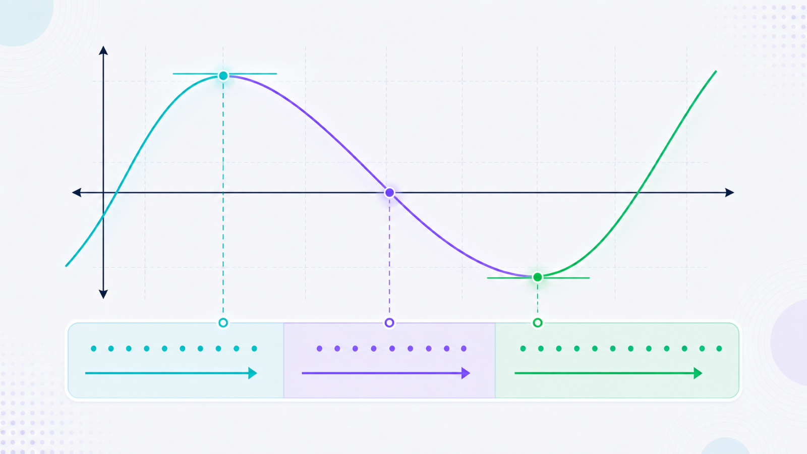

- ID: `pep-high-s5-derivatives-worked-example`
- Status: `approved`
- RAG cards: `pep-high-derivatives-applications`, `pep-high-derivative-tangent-inequality`
- Alt zh-Hans: 导数例题图把曲线、切点、符号区间和最优化目标点对齐展示。
- Caption zh-Hans: 用导数符号变化说明函数增减和极值位置。

### pep-high-s6-counting / concept

- ID: `pep-high-s6-counting-concept`
- Status: `approved`
- RAG cards: `pep-high-counting-principles`, `pep-high-exam-counting-method-taxonomy`
- Alt zh-Hans: 计数原理通过分步分支、有序排列、无序选择和二项式结构图呈现。
- Caption zh-Hans: 计数前先判断顺序是否重要，以及分类是否重叠。

### pep-high-s6-counting / worked-example

- ID: `pep-high-s6-counting-worked-example`
- Status: `approved`
- RAG cards: `pep-high-counting-principles`
- Alt zh-Hans: 计数例题图先把情况分成互不重叠的分支，再填入排列槽位。
- Caption zh-Hans: 可靠的计数解法先分类清楚，再保证每种情况只数一次。

### pep-high-s6-random-variables / concept

- ID: `pep-high-s6-random-variables-concept`
- Status: `approved`
- RAG cards: `pep-high-random-variables-distributions`, `pep-high-conditional-probability-distributions`
- Alt zh-Hans: 随机结果映射到分布图，并展示期望平衡点和方差离散线索。
- Caption zh-Hans: 随机变量把结果转化为数值，分布则描述可能性和离散程度。

### pep-high-s6-random-variables / worked-example

- ID: `pep-high-s6-random-variables-worked-example`
- Status: `approved`
- RAG cards: `pep-high-random-variables-distributions`
- Alt zh-Hans: 随机变量例题图由结果分组建立概率分布，并检查中心与离散程度。
- Caption zh-Hans: 列出取值和概率后，先检查分布完整，再计算期望和方差。

### pep-high-s6-bivariate-data / concept

- ID: `pep-high-s6-bivariate-data-concept`
- Status: `approved`
- RAG cards: `pep-high-bivariate-statistics`, `pep-high-exam-bivariate-data`
- Alt zh-Hans: 散点图配有趋势线、残差箭头和聚类线索，展示相关与回归思想。
- Caption zh-Hans: 成对数据分析要看方向、强弱、模型拟合以及残差透露的信息。

### pep-high-s6-bivariate-data / worked-example

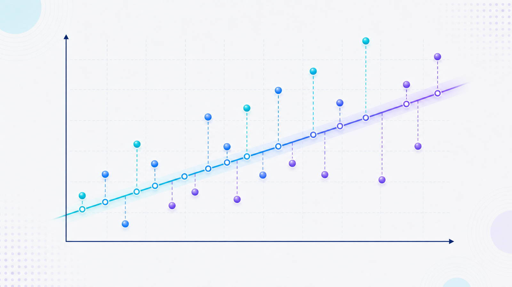

- ID: `pep-high-s6-bivariate-data-worked-example`
- Status: `approved`
- RAG cards: `pep-high-bivariate-statistics`
- Alt zh-Hans: 回归例题图比较观测点和预测点，并突出残差距离。
- Caption zh-Hans: 用回归线预测后，还要观察残差判断模型拟合。

### pep-high-s6-derivative-synthesis / concept

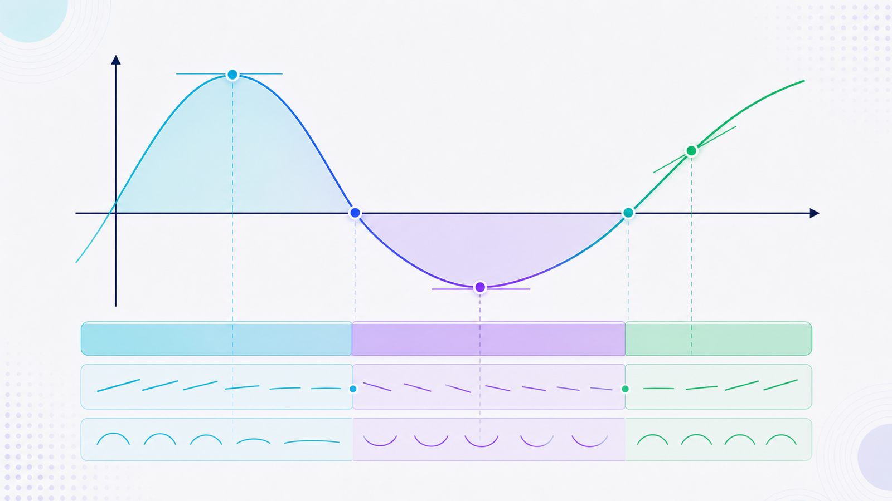

- ID: `pep-high-s6-derivative-synthesis-concept`
- Status: `approved`
- RAG cards: `pep-high-derivatives-tangent-zeros-inequalities`, `pep-high-exam-derivative-tangent-inequality`
- Alt zh-Hans: 导数综合图把曲线性质、切线条件、零点和不等式区域分层展示。
- Caption zh-Hans: 导数综合题常把导数符号、切线约束、零点和不等式推理结合起来。

### pep-high-s6-derivative-synthesis / worked-example

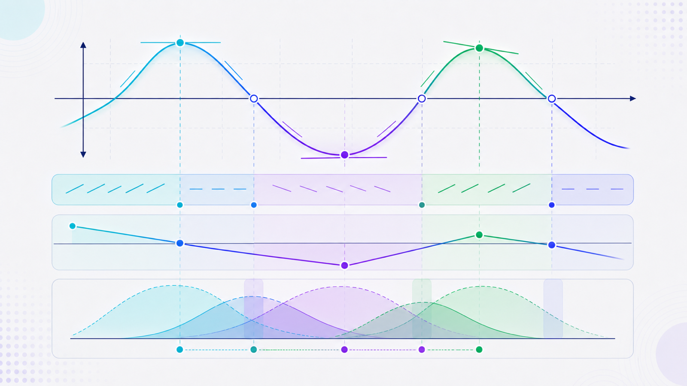

- ID: `pep-high-s6-derivative-synthesis-worked-example`
- Status: `approved`
- RAG cards: `pep-high-derivatives-tangent-zeros-inequalities`
- Alt zh-Hans: 综合例题图对齐曲线、切线约束、导数符号区间和允许参数区域。
- Caption zh-Hans: 先分别追踪每个条件，再取共同满足的区域。

### pep-high-s6-analytic-geometry-synthesis / concept

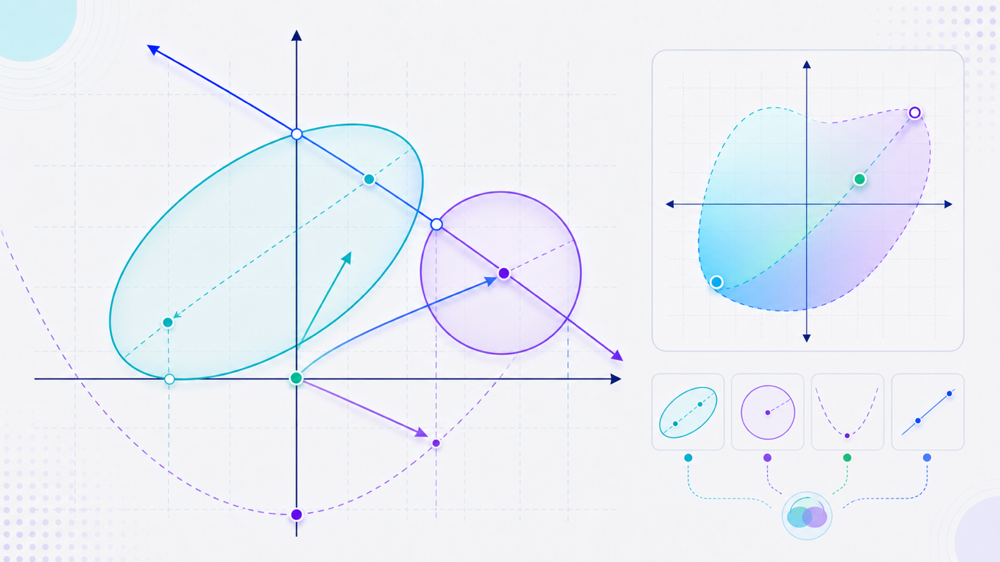

- ID: `pep-high-s6-analytic-geometry-synthesis-concept`
- Status: `approved`
- RAG cards: `pep-high-conic-sections`, `pep-high-exam-conics-analytic-geometry`
- Alt zh-Hans: 解析几何综合图在同一坐标工作区结合圆锥曲线、直线、圆、向量和参数区域。
- Caption zh-Hans: 解析几何综合要把多个几何约束转化为统一的代数计划。

### pep-high-s6-analytic-geometry-synthesis / worked-example

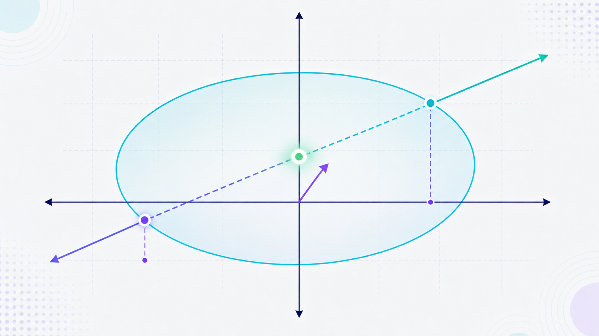

- ID: `pep-high-s6-analytic-geometry-synthesis-worked-example`
- Status: `approved`
- RAG cards: `pep-high-conic-sections`
- Alt zh-Hans: 解析几何例题图展示动直线与圆锥曲线相交，并突出弦中点和向量线索。
- Caption zh-Hans: 先用图像明确动对象，再转化交点和中点条件。

### pep-high-s6-probability-statistics-synthesis / concept

- ID: `pep-high-s6-probability-statistics-synthesis-concept`
- Status: `approved`
- RAG cards: `pep-high-conditional-probability-distributions`, `pep-high-exam-regression-independence`
- Alt zh-Hans: 概率统计综合图连接决策树、分布柱、散点图和推断仪表板。
- Caption zh-Hans: 综合题要先判断情境主要属于计数、概率、分布还是数据解释。

### pep-high-s6-probability-statistics-synthesis / worked-example

- ID: `pep-high-s6-probability-statistics-synthesis-worked-example`
- Status: `approved`
- RAG cards: `pep-high-conditional-probability-distributions`
- Alt zh-Hans: 综合例题图从事件树推进到分布概括，再到基于数据的判断。
- Caption zh-Hans: 先梳理随机过程，再概括分布，最后解释结果。

### pep-high-s6-exam-practice / concept

- ID: `pep-high-s6-exam-practice-concept`
- Status: `approved`
- RAG cards: `pep-high-function-zero-modeling`, `pep-high-exam-legacy-stream-migration`
- Alt zh-Hans: 考试策略图把函数、几何、概率和检验环节连接成一条解题路线。
- Caption zh-Hans: 综合练习先识别主结构并选择策略，再开始计算。

### pep-high-s6-exam-practice / worked-example

- ID: `pep-high-s6-exam-practice-worked-example`
- Status: `approved`
- RAG cards: `pep-high-function-zero-modeling`, `pep-high-exam-derivatives-optimization`
- Alt zh-Hans: 综合例题图展示四步策略：表示、选法、求解和图像检验。
- Caption zh-Hans: 处理综合题时，先把关系表示出来，再进入代数计算。

