# Mainland PEP Junior Lesson Illustrations V1 Review

- Generated at: 2026-05-27T06:47:25.046Z
- Generator: Codex built-in image generation (`image_gen`, GPT Image2-style workflow).
- Scope: 11 人教版初中 lessons, 2 candidates per lesson.
- Production status: Approved for production. Approved assets may be copied into `public/lesson-illustrations/mainland-pep-junior/`.
- Review action: completed by owner/S18 approval; `manual-review.csv` rows are marked `approved`.

## Review Criteria

- Mathematical correctness and fit to the lesson objective.
- No copied textbook/page/screenshot look, publisher marks, logos, or watermarks.
- No wrong formulas, unreadable text, stray labels, or misleading geometry/data encoding.
- Clear student learning value and accurate alt/caption text.

## Candidates

### pep-junior-s1-upper-rational-numbers / concept

- ID: `pep-junior-s1-upper-rational-numbers-concept`
- Status: `approved`
- Decision: `approved`
- RAG cards: `pep-junior-s1-upper-rational-numbers`
- Alt zh-Hans: 数轴以零为中心展开，正负方向、相反数镜像点和到零的距离被不同颜色突出。
- Caption zh-Hans: 有理数学习先把方向、位置和距离放在同一条数轴上理解。

### pep-junior-s1-upper-rational-numbers / worked-example

- ID: `pep-junior-s1-upper-rational-numbers-worked-example`
- Status: `approved`
- Decision: `approved`
- RAG cards: `pep-junior-s1-upper-rational-numbers`
- Alt zh-Hans: 数轴运算工作区用弧形移动箭头表示起点、方向变化、终点和距离检查。
- Caption zh-Hans: 先看移动方向，再用离零距离和终点位置检查有理数运算。

### pep-junior-s1-upper-expressions-linear-equations / concept

- ID: `pep-junior-s1-upper-expressions-linear-equations-concept`
- Status: `approved`
- Decision: `approved`
- RAG cards: `pep-junior-s1-upper-expressions-linear-equations`
- Alt zh-Hans: 天平两侧放置空白代数块，同色块成组，显示数量表达和方程平衡关系。
- Caption zh-Hans: 用字母表示数量时，先看同类结构，再保持等式两边平衡。

### pep-junior-s1-upper-expressions-linear-equations / worked-example

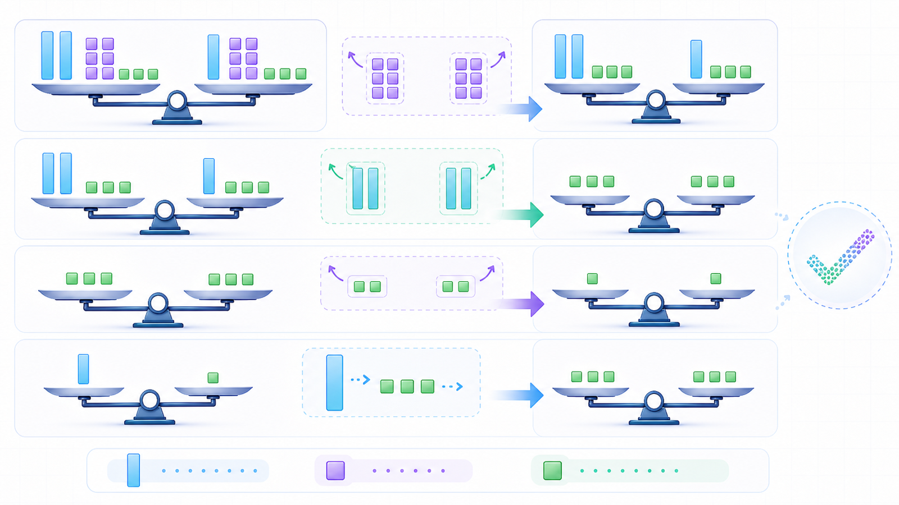

- ID: `pep-junior-s1-upper-expressions-linear-equations-worked-example`
- Status: `approved`
- Decision: `approved`
- RAG cards: `pep-junior-s1-upper-expressions-linear-equations`
- Alt zh-Hans: 解方程视觉流程展示两边同时移去相同空白块，最后留下未知块与单位块的对应。
- Caption zh-Hans: 解一元一次方程的关键是每一步都对等式两边做相同改变。

### pep-junior-s1-upper-geometric-figures / concept

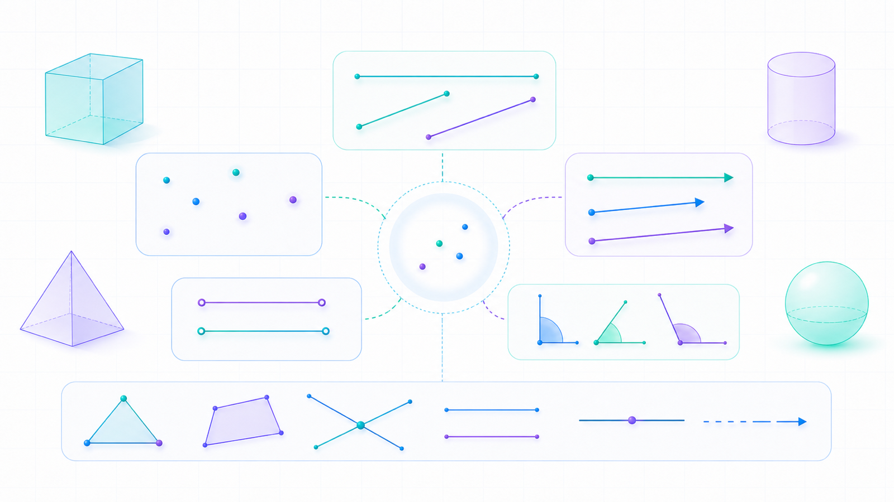

- ID: `pep-junior-s1-upper-geometric-figures-concept`
- Status: `approved`
- Decision: `approved`
- RAG cards: `pep-junior-s1-upper-geometric-figures`
- Alt zh-Hans: 点、线、射线、线段、角和透明立体图形被排列成几何对象学习图。
- Caption zh-Hans: 几何推理从准确识别对象和定义开始，而不是只凭图形外观判断。

### pep-junior-s1-upper-geometric-figures / worked-example

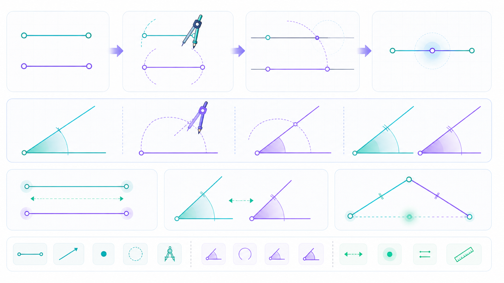

- ID: `pep-junior-s1-upper-geometric-figures-worked-example`
- Status: `approved`
- Decision: `approved`
- RAG cards: `pep-junior-s1-upper-geometric-figures`
- Alt zh-Hans: 几何作图检查区展示线段端点、圆规弧迹、角度弧和长度比较线索。
- Caption zh-Hans: 比较线段或角时，要让测量和作图证据支持结论。

### pep-junior-s1-lower-lines-coordinates / concept

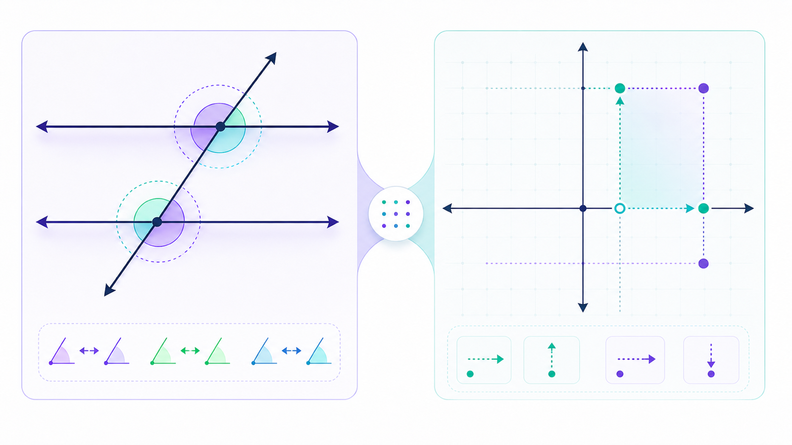

- ID: `pep-junior-s1-lower-lines-coordinates-concept`
- Status: `approved`
- Decision: `approved`
- RAG cards: `pep-junior-s1-lower-lines-coordinates`
- Alt zh-Hans: 平行线被截线穿过并高亮角关系，旁边坐标网格展示点的水平和竖直移动。
- Caption zh-Hans: 角关系需要线的位置条件，坐标移动需要分清横向和纵向变化。

### pep-junior-s1-lower-lines-coordinates / worked-example

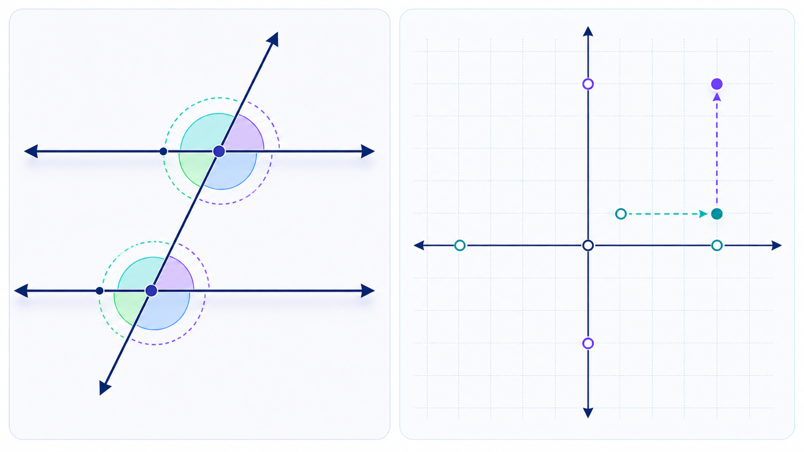

- ID: `pep-junior-s1-lower-lines-coordinates-worked-example`
- Status: `approved`
- Decision: `approved`
- RAG cards: `pep-junior-s1-lower-lines-coordinates`
- Alt zh-Hans: 例题图把同位角弧与坐标点移动并列，用颜色区分角条件和位置变化。
- Caption zh-Hans: 先确认平行条件，再读角；先看横向移动，再看竖向移动。

### pep-junior-s1-lower-equations-inequalities-data / concept

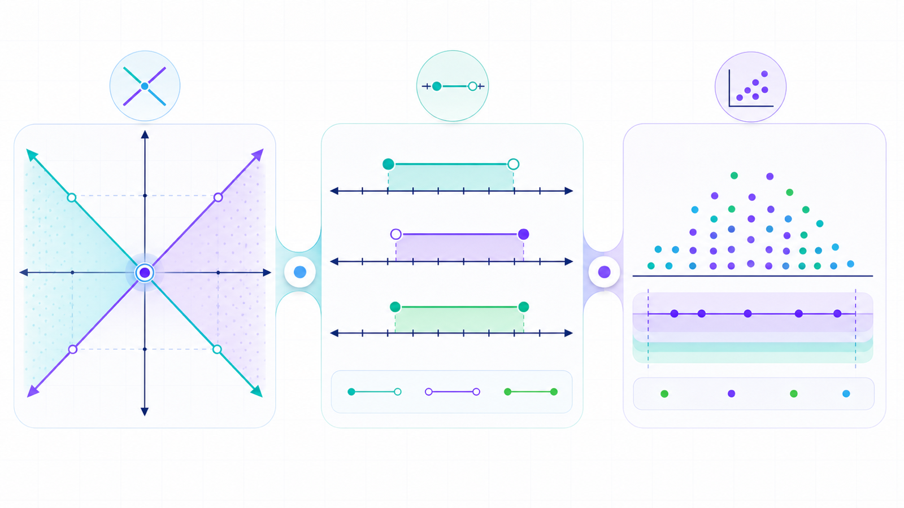

- ID: `pep-junior-s1-lower-equations-inequalities-data-concept`
- Status: `approved`
- Decision: `approved`
- RAG cards: `pep-junior-s1-lower-equations-inequalities-data`
- Alt zh-Hans: 两个约束路径汇合到公共点，不等式区间和数据点云并列显示模型、解集与数据判断。
- Caption zh-Hans: 方程组、不等式和数据分析都在回答条件能支持什么结论。

### pep-junior-s1-lower-equations-inequalities-data / worked-example

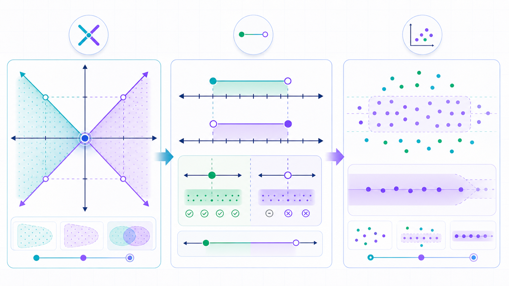

- ID: `pep-junior-s1-lower-equations-inequalities-data-worked-example`
- Status: `approved`
- Decision: `approved`
- RAG cards: `pep-junior-s1-lower-equations-inequalities-data`
- Alt zh-Hans: 解题工作区展示约束收窄、边界点检查和数据点分组形成合理结论。
- Caption zh-Hans: 先定义限制条件，再检查边界，最后让数据结论不过度延伸。

### pep-junior-s2-upper-triangles-congruence / concept

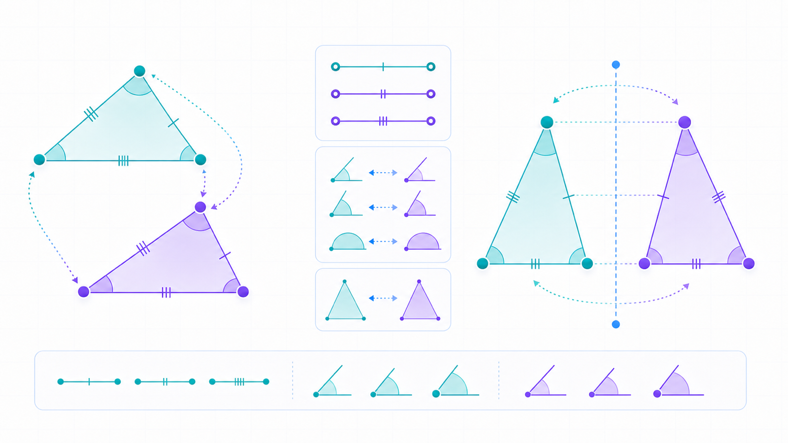

- ID: `pep-junior-s2-upper-triangles-congruence-concept`
- Status: `approved`
- Decision: `approved`
- RAG cards: `pep-junior-s2-upper-triangles-congruence`
- Alt zh-Hans: 两个三角形用对应边角颜色连接，旁边轴对称图形展示镜像和对应点。
- Caption zh-Hans: 全等和对称都要先找清楚对应关系，再使用性质或判定。

### pep-junior-s2-upper-triangles-congruence / worked-example

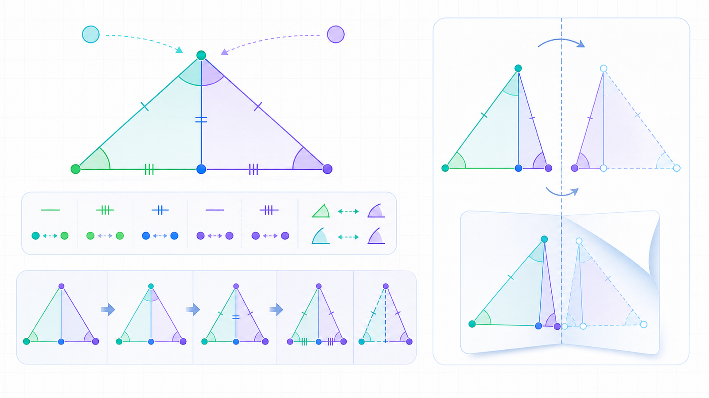

- ID: `pep-junior-s2-upper-triangles-congruence-worked-example`
- Status: `approved`
- Decision: `approved`
- RAG cards: `pep-junior-s2-upper-triangles-congruence`
- Alt zh-Hans: 证明示意图在共享边三角形中标出对应边和角，并用折叠线提示对称关系。
- Caption zh-Hans: 写证明前，先确认对应顶点、对应边角和足够的判定条件。

### pep-junior-s2-upper-polynomials-fractions / concept

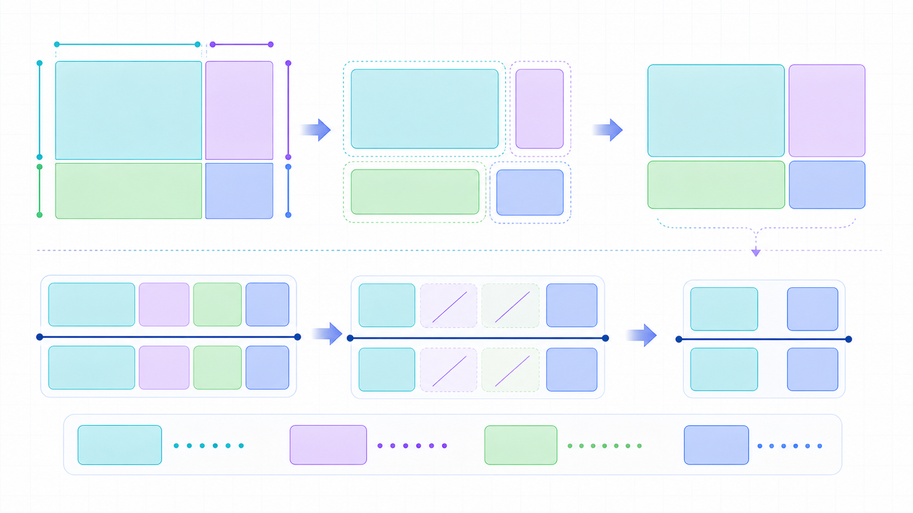

- ID: `pep-junior-s2-upper-polynomials-fractions-concept`
- Status: `approved`
- Decision: `approved`
- RAG cards: `pep-junior-s2-upper-polynomials-fractions`
- Alt zh-Hans: 空白彩色矩形块从面积模型重组为分组结构，并显示上下匹配块的约分线索。
- Caption zh-Hans: 整式运算和分式化简都要先看结构，再进行符号运算。

### pep-junior-s2-upper-polynomials-fractions / worked-example

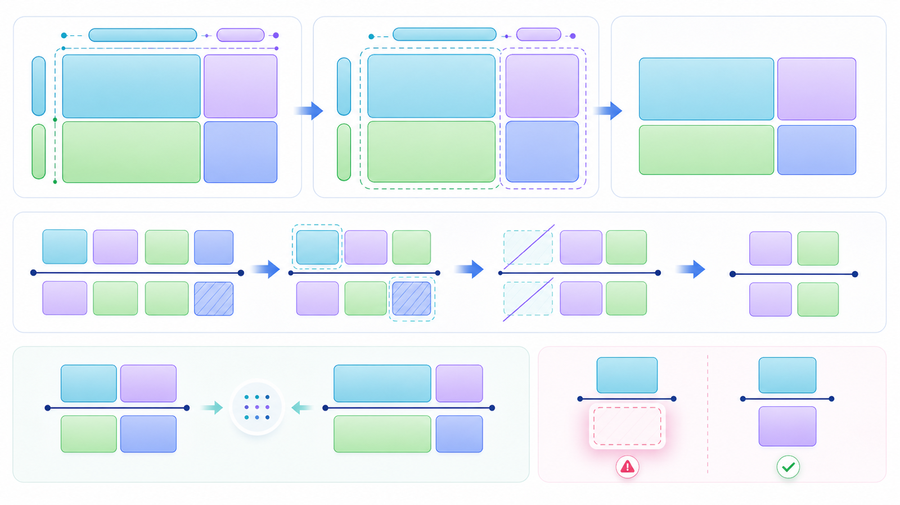

- ID: `pep-junior-s2-upper-polynomials-fractions-worked-example`
- Status: `approved`
- Decision: `approved`
- RAG cards: `pep-junior-s2-upper-polynomials-fractions`
- Alt zh-Hans: 例题图展示展开块、共同分组、匹配块消去和分母限制的视觉提醒。
- Caption zh-Hans: 因式分解要能反向展开检查，分式方程还要检查限制条件。

### pep-junior-s2-lower-roots-pythagorean-quadrilaterals / concept

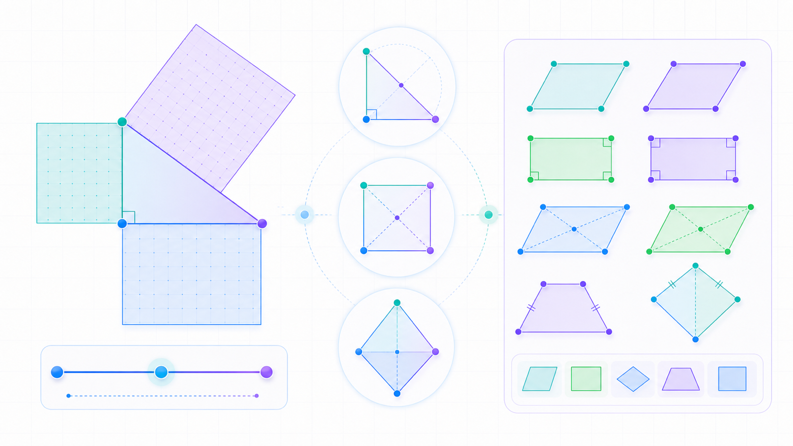

- ID: `pep-junior-s2-lower-roots-pythagorean-quadrilaterals-concept`
- Status: `approved`
- Decision: `approved`
- RAG cards: `pep-junior-s2-lower-roots-pythagorean-quadrilaterals`
- Alt zh-Hans: 直角三角形三边附着半透明面积方块，旁边叠放平行四边形和特殊四边形。
- Caption zh-Hans: 精确长度、直角条件和四边形分类要互相支持，而不能只凭图像猜测。

### pep-junior-s2-lower-roots-pythagorean-quadrilaterals / worked-example

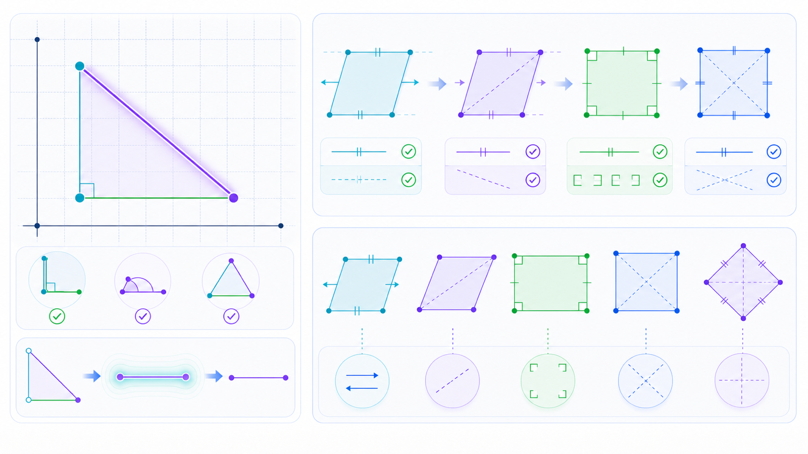

- ID: `pep-junior-s2-lower-roots-pythagorean-quadrilaterals-worked-example`
- Status: `approved`
- Decision: `approved`
- RAG cards: `pep-junior-s2-lower-roots-pythagorean-quadrilaterals`
- Alt zh-Hans: 例题图在网格中高亮直角三角形斜边，并用平行边和对角线检查四边形性质。
- Caption zh-Hans: 用勾股关系前先确认直角，用四边形性质前先确认所属类别。

### pep-junior-s2-lower-linear-functions-data / concept

- ID: `pep-junior-s2-lower-linear-functions-data-concept`
- Status: `approved`
- Decision: `approved`
- RAG cards: `pep-junior-s2-lower-linear-functions-data`
- Alt zh-Hans: 空白点阵、上升直线、运动路径和数据点云相连，展示表、图、情境和统计概括的转换。
- Caption zh-Hans: 一次函数要在表、式、图和情境之间互相解释，数据分析要看中心和离散。

### pep-junior-s2-lower-linear-functions-data / worked-example

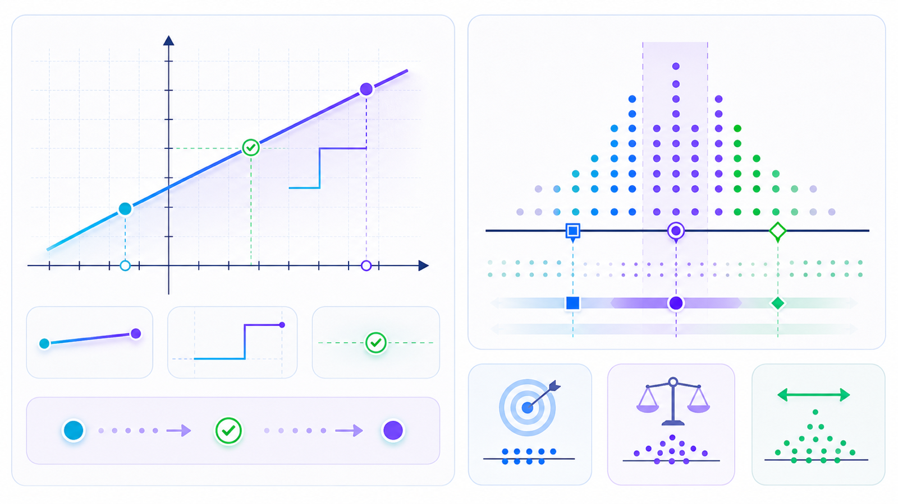

- ID: `pep-junior-s2-lower-linear-functions-data-worked-example`
- Status: `approved`
- Decision: `approved`
- RAG cards: `pep-junior-s2-lower-linear-functions-data`
- Alt zh-Hans: 例题图突出直线上的两个点、斜率阶梯、点的检验和数据摘要标记。
- Caption zh-Hans: 读一次函数时先看变化率，再检查点是否符合关系；读数据时选择合适的代表值。

### pep-junior-s3-upper-quadratics-circle-probability / concept

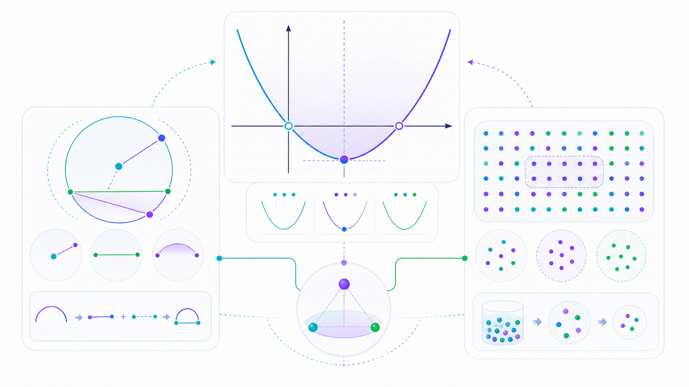

- ID: `pep-junior-s3-upper-quadratics-circle-probability-concept`
- Status: `approved`
- Decision: `approved`
- RAG cards: `pep-junior-s3-upper-quadratics-circle-probability`
- Alt zh-Hans: 抛物线顶点和对称线索、圆的弦弧关系以及概率样本空间点阵组合成综合图。
- Caption zh-Hans: 二次模型、圆的关系和概率模型都需要把图形特征转化为推理依据。

### pep-junior-s3-upper-quadratics-circle-probability / worked-example

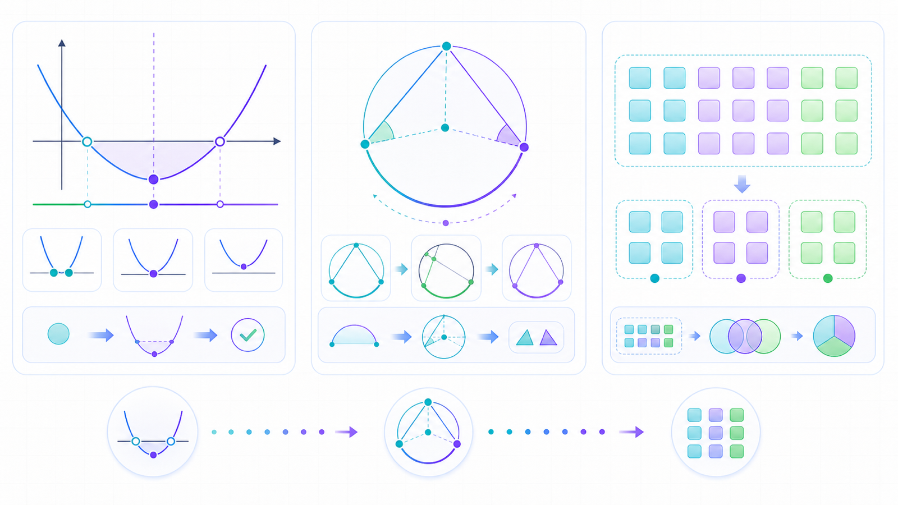

- ID: `pep-junior-s3-upper-quadratics-circle-probability-worked-example`
- Status: `approved`
- Decision: `approved`
- RAG cards: `pep-junior-s3-upper-quadratics-circle-probability`
- Alt zh-Hans: 例题图把抛物线关键点、圆中相关角弧和等可能区域分组并列呈现。
- Caption zh-Hans: 综合题要先提取图像特征，再说明圆的关系和完整样本空间。

### pep-junior-s3-lower-inverse-similarity-trigonometry / concept

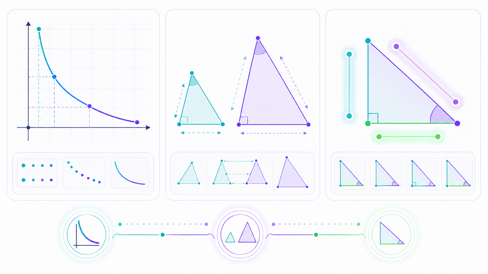

- ID: `pep-junior-s3-lower-inverse-similarity-trigonometry-concept`
- Status: `approved`
- Decision: `approved`
- RAG cards: `pep-junior-s3-lower-inverse-similarity-trigonometry`
- Alt zh-Hans: 反比例曲线、相似三角形缩放箭头和直角三角形边角颜色线索共同展示比例测量。
- Caption zh-Hans: 比例关系可以在函数图像、相似图形和直角三角形测量中互相迁移。

### pep-junior-s3-lower-inverse-similarity-trigonometry / worked-example

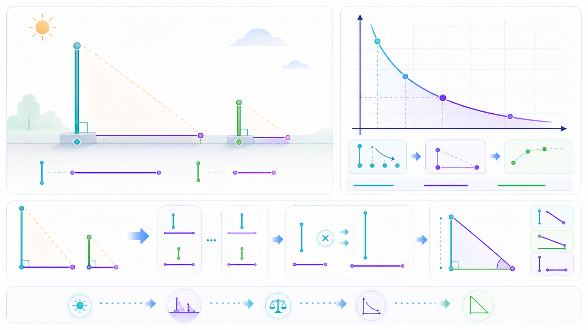

- ID: `pep-junior-s3-lower-inverse-similarity-trigonometry-worked-example`
- Status: `approved`
- Decision: `approved`
- RAG cards: `pep-junior-s3-lower-inverse-similarity-trigonometry`
- Alt zh-Hans: 例题图展示两个相似测量三角形、比例桥、反比例曲线上选点和直角三角形边角关系。
- Caption zh-Hans: 解决测量问题时，先找相似或比例，再选择正确的边角关系。

