# Mainland PEP Primary Lesson Illustrations V1 Review

- Generated at: 2026-05-27T08:58:32.247Z
- Generator: Codex built-in image generation (`image_gen`, GPT Image2-style workflow).
- Scope: 24 人教版小学 lessons, 2 candidates per lesson.
- Production status: Approved for production. Approved assets may be copied into `public/lesson-illustrations/mainland-pep-primary/`.
- Review action: completed by owner/S18 approval; `manual-review.csv` rows are marked `approved`.
- Validation: 48/48 candidates exist; 48/48 pass static validation.

## Review Criteria

- Mathematical correctness and fit to the lesson objective.
- No copied textbook/page/screenshot look, publisher marks, logos, or watermarks.
- No wrong formulas, unreadable text, stray labels, or misleading geometry/data encoding.
- Clear student learning value and accurate alt/caption text.

## Candidates

### pep-primary-p1-upper-number-sense / concept

- ID: `pep-primary-p1-upper-number-sense-concept`
- Status: `approved`
- Decision: `approved`
- Grade/Semester: `P1` / `upper`
- RAG cards: `pep-primary-p1-upper-number-sense-within-20`, `pep-primary-p1-upper-shapes-position-clock`
- Alt zh-Hans: 十格计数片和分组点子展示20以内数的数数、比较和分解组成。
- Caption zh-Hans: 小数目的学习要同时看整体、部分和数数路径。

### pep-primary-p1-upper-number-sense / worked-example

- ID: `pep-primary-p1-upper-number-sense-worked-example`
- Status: `approved`
- Decision: `approved`
- Grade/Semester: `P1` / `upper`
- RAG cards: `pep-primary-p1-upper-number-sense-within-20`, `pep-primary-p1-upper-shapes-position-clock`
- Alt zh-Hans: 凑十工作区把计数片移入完整十格，再把剩余计数片作为下一部分。
- Caption zh-Hans: 先凑成十，再加上剩余部分来检查答案。

### pep-primary-p1-upper-shapes-position-time / concept

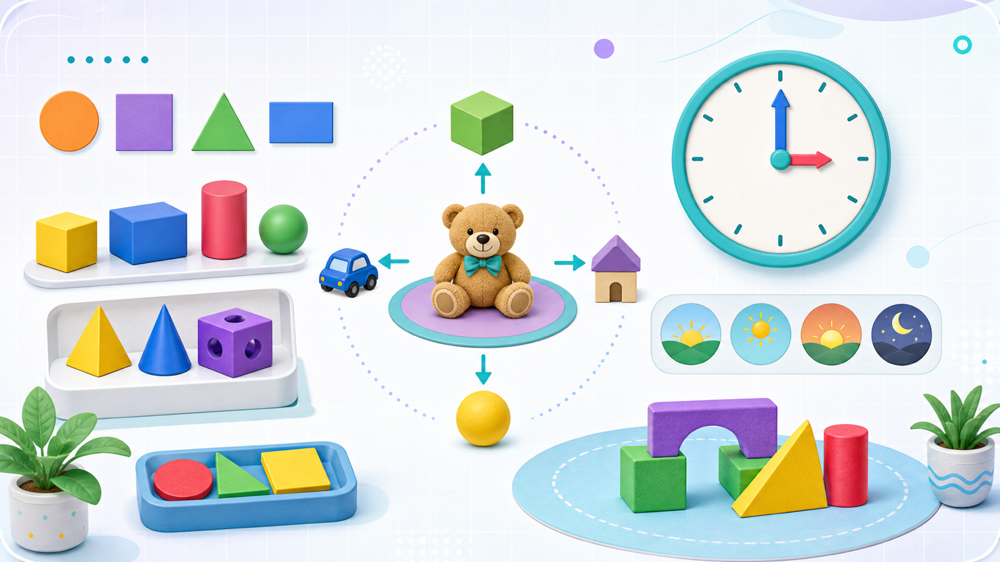

- ID: `pep-primary-p1-upper-shapes-position-time-concept`
- Status: `approved`
- Decision: `approved`
- Grade/Semester: `P1` / `upper`
- RAG cards: `pep-primary-p1-upper-number-sense-within-20`, `pep-primary-p1-upper-shapes-position-clock`
- Alt zh-Hans: 简单图形、位置箭头和整时钟面帮助学生分类图形并表达位置。
- Caption zh-Hans: 先说出物体名称，再描述位置，并仔细观察钟面指针。

### pep-primary-p1-upper-shapes-position-time / worked-example

- ID: `pep-primary-p1-upper-shapes-position-time-worked-example`
- Status: `approved`
- Decision: `approved`
- Grade/Semester: `P1` / `upper`
- RAG cards: `pep-primary-p1-upper-number-sense-within-20`, `pep-primary-p1-upper-shapes-position-clock`
- Alt zh-Hans: 分类垫把图形放在中心物体的上下左右，并加入整时钟面检查。
- Caption zh-Hans: 要把位置词和物体特征结合起来判断，而不能只看单一线索。

### pep-primary-p1-lower-within-100-add-sub / concept

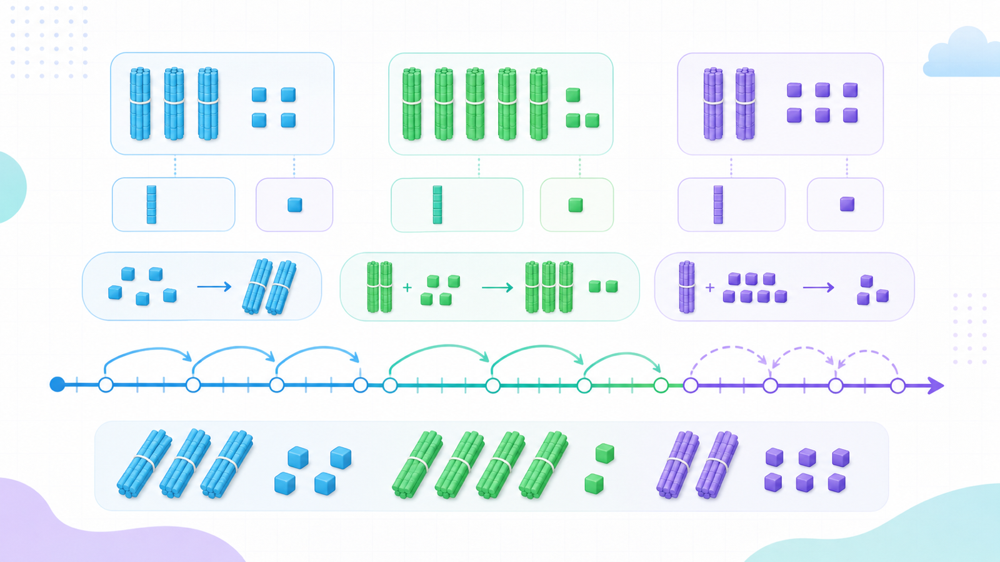

- ID: `pep-primary-p1-lower-within-100-add-sub-concept`
- Status: `approved`
- Decision: `approved`
- Grade/Semester: `P1` / `lower`
- RAG cards: `pep-primary-p1-lower-within-100-add-sub`
- Alt zh-Hans: 十根一捆和散放个位配合数线，把100以内位值与加减法联系起来。
- Caption zh-Hans: 先读十位和个位，再判断情境是在向前增加还是向后减少。

### pep-primary-p1-lower-within-100-add-sub / worked-example

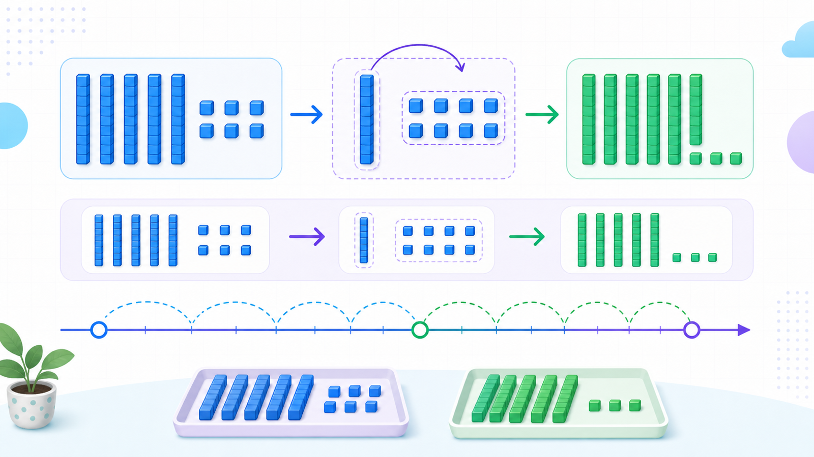

- ID: `pep-primary-p1-lower-within-100-add-sub-worked-example`
- Status: `approved`
- Decision: `approved`
- Grade/Semester: `P1` / `lower`
- RAG cards: `pep-primary-p1-lower-within-100-add-sub`
- Alt zh-Hans: 散放计数片重新组成一捆十，旁边用数线跳步检查答案。
- Caption zh-Hans: 重组的关键是十个一可以换成一个十。

### pep-primary-p1-lower-money-data-review / concept

- ID: `pep-primary-p1-lower-money-data-review-concept`
- Status: `approved`
- Decision: `approved`
- Grade/Semester: `P1` / `lower`
- RAG cards: `pep-primary-p1-lower-within-100-add-sub`
- Alt zh-Hans: 玩具硬币、简单统计图和钟面把人民币、时间和数据表示成日常数量。
- Caption zh-Hans: 生活中的数学要先说清单位，再读懂表示方法。

### pep-primary-p1-lower-money-data-review / worked-example

- ID: `pep-primary-p1-lower-money-data-review-worked-example`
- Status: `approved`
- Decision: `approved`
- Grade/Semester: `P1` / `lower`
- RAG cards: `pep-primary-p1-lower-within-100-add-sub`
- Alt zh-Hans: 计数盘把玩具硬币分组，旁边配有钟面检查和原创图标统计图。
- Caption zh-Hans: 先分组看价值，再读时间，最后认真比较数据。

### pep-primary-p2-upper-multiplication-arrays / concept

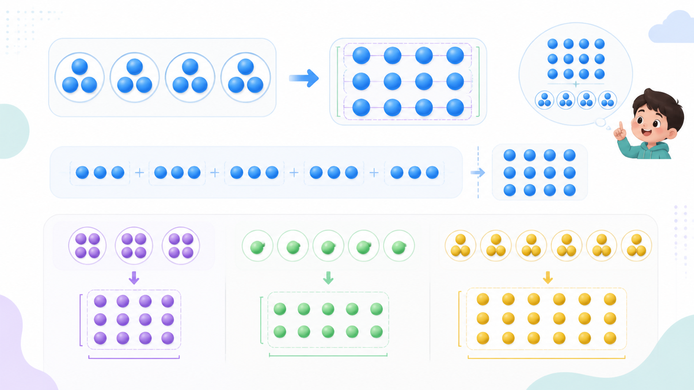

- ID: `pep-primary-p2-upper-multiplication-arrays-concept`
- Status: `approved`
- Decision: `approved`
- Grade/Semester: `P2` / `upper`
- RAG cards: `pep-primary-p2-upper-multiplication-facts`
- Alt zh-Hans: 相同数量的小组转化为阵列，展示乘法的意义。
- Caption zh-Hans: 每组数量相同时，乘法模型才清楚可靠。

### pep-primary-p2-upper-multiplication-arrays / worked-example

- ID: `pep-primary-p2-upper-multiplication-arrays-worked-example`
- Status: `approved`
- Decision: `approved`
- Grade/Semester: `P2` / `upper`
- RAG cards: `pep-primary-p2-upper-multiplication-facts`
- Alt zh-Hans: 阵列工作区逐行高亮，并用相同小组检查总数。
- Caption zh-Hans: 先数行数，再数每行个数，最后用相同小组检查。

### pep-primary-p2-upper-length-angles-observation / concept

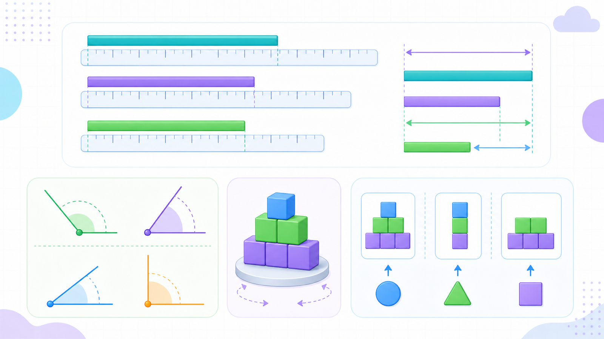

- ID: `pep-primary-p2-upper-length-angles-observation-concept`
- Status: `approved`
- Decision: `approved`
- Grade/Semester: `P2` / `upper`
- RAG cards: `pep-primary-p2-upper-multiplication-facts`
- Alt zh-Hans: 尺子、角的两边和观察卡片联系长度测量、角的认识和观察物体。
- Caption zh-Hans: 先选单位，尺子要对齐，并从正确方向描述看到的样子。

### pep-primary-p2-upper-length-angles-observation / worked-example

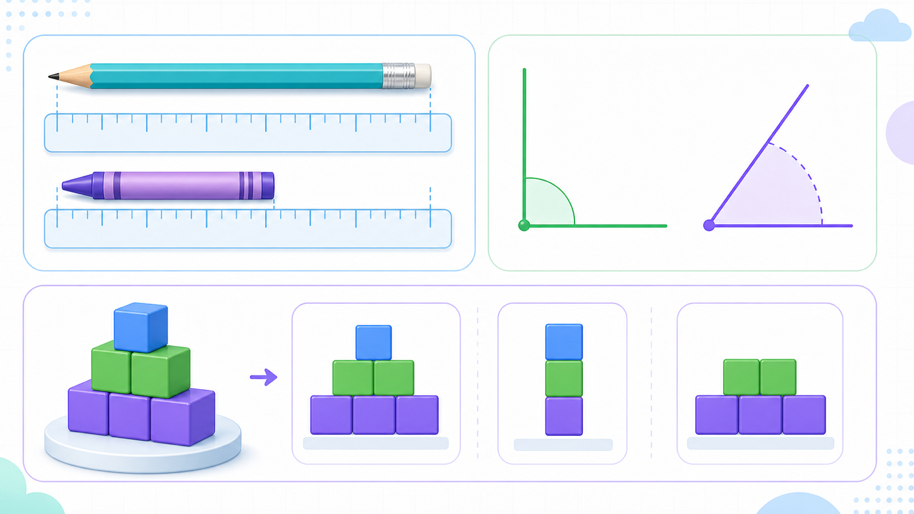

- ID: `pep-primary-p2-upper-length-angles-observation-worked-example`
- Status: `approved`
- Decision: `approved`
- Grade/Semester: `P2` / `upper`
- RAG cards: `pep-primary-p2-upper-multiplication-facts`
- Alt zh-Hans: 测量台把物体与尺子对齐，突出一个角，并比较不同方向的轮廓。
- Caption zh-Hans: 摆放和观察要仔细，才能避免长度、角和视图判断错误。

### pep-primary-p2-lower-division-remainder / concept

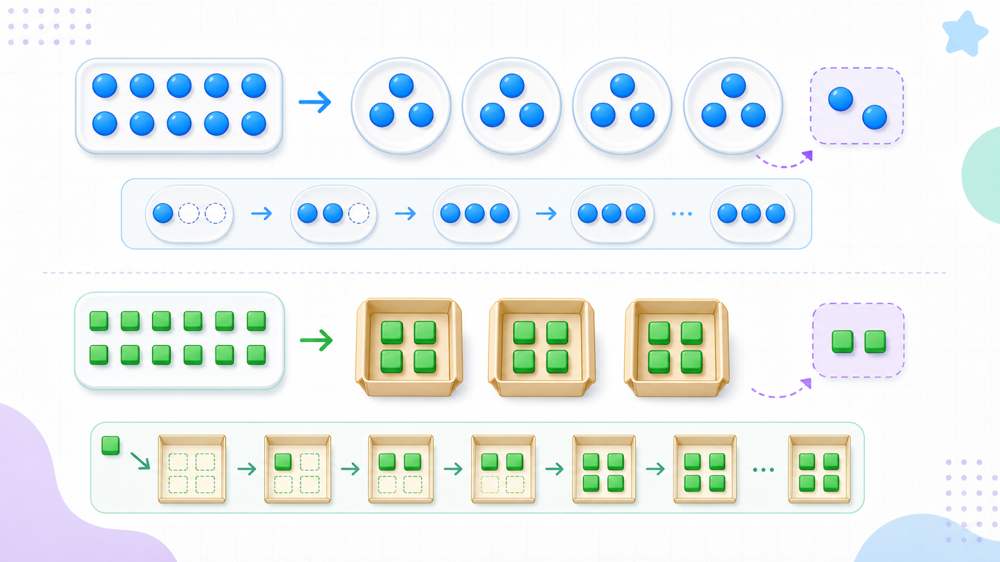

- ID: `pep-primary-p2-lower-division-remainder-concept`
- Status: `approved`
- Decision: `approved`
- Grade/Semester: `P2` / `lower`
- RAG cards: `pep-primary-p2-lower-division-measurement-data`
- Alt zh-Hans: 计数片被平均分到盘子里，也被按固定大小分组，剩余部分清楚可见。
- Caption zh-Hans: 除法可以表示平均分或包含分，余数必须比一组的数量小。

### pep-primary-p2-lower-division-remainder / worked-example

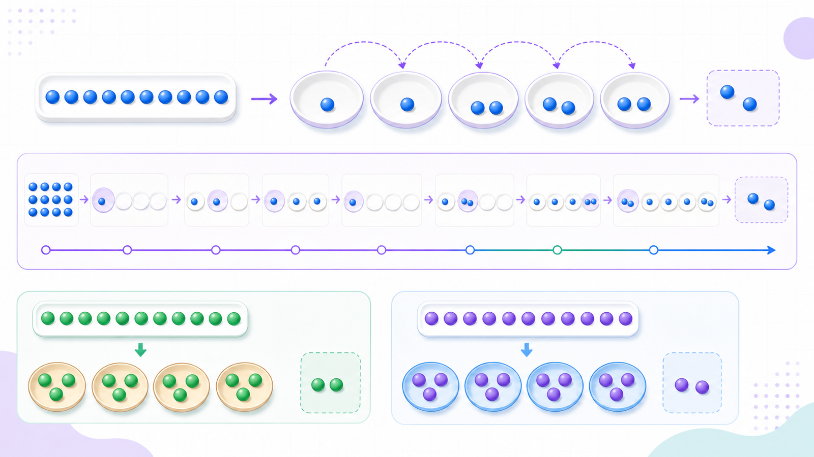

- ID: `pep-primary-p2-lower-division-remainder-worked-example`
- Status: `approved`
- Decision: `approved`
- Grade/Semester: `P2` / `lower`
- RAG cards: `pep-primary-p2-lower-division-measurement-data`
- Alt zh-Hans: 除法工作区把计数片分入相同小组，并把剩余计数片单独检查。
- Caption zh-Hans: 先建立相同小组，再判断剩余部分表示什么。

### pep-primary-p2-lower-place-value-measurement-data / concept

- ID: `pep-primary-p2-lower-place-value-measurement-data-concept`
- Status: `approved`
- Decision: `approved`
- Grade/Semester: `P2` / `lower`
- RAG cards: `pep-primary-p2-lower-division-measurement-data`
- Alt zh-Hans: 位值块、质量线索、时间标记和数据方块联系万以内数、测量和统计。
- Caption zh-Hans: 读大数和读测量结果都要看清单位所在的位置。

### pep-primary-p2-lower-place-value-measurement-data / worked-example

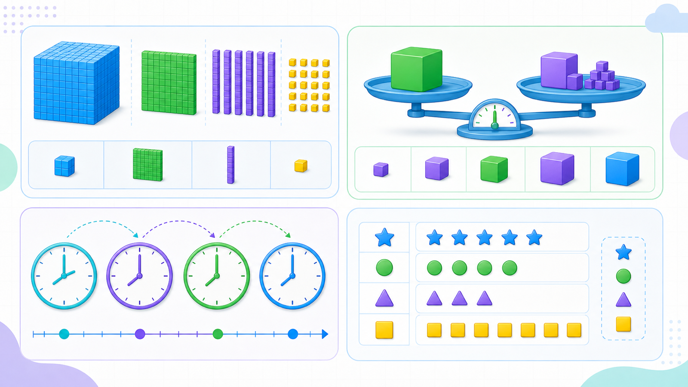

- ID: `pep-primary-p2-lower-place-value-measurement-data-worked-example`
- Status: `approved`
- Decision: `approved`
- Grade/Semester: `P2` / `lower`
- RAG cards: `pep-primary-p2-lower-division-measurement-data`
- Alt zh-Hans: 比较板使用位值块、质量物体、时间间隔和分类数量。
- Caption zh-Hans: 先按位值比较，再用单位解释情境。

### pep-primary-p3-upper-operations-fractions / concept

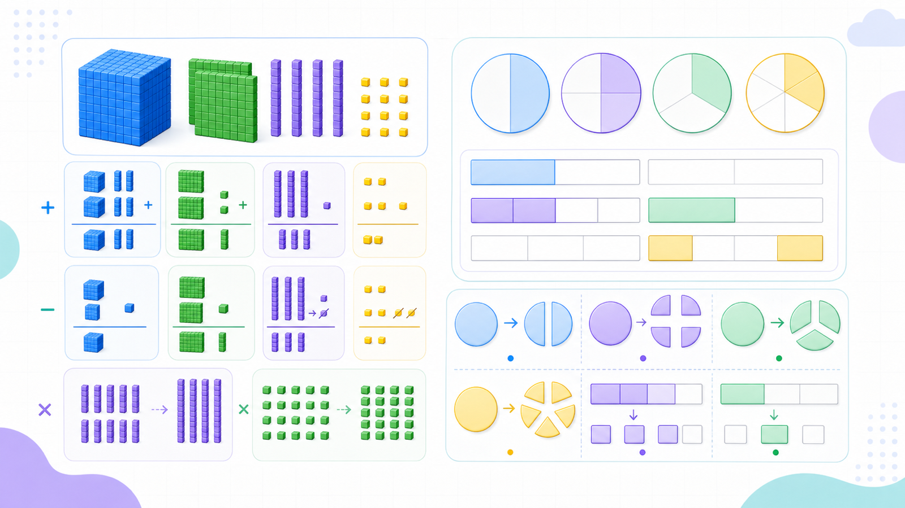

- ID: `pep-primary-p3-upper-operations-fractions-concept`
- Status: `approved`
- Decision: `approved`
- Grade/Semester: `P3` / `upper`
- RAG cards: `pep-primary-p3-upper-multidigit-operations-fractions`
- Alt zh-Hans: 多位数运算卡片和平均分的分数模型联系计算与分数意义。
- Caption zh-Hans: 先估算结果，再确认整体，才能准确说出分数。

### pep-primary-p3-upper-operations-fractions / worked-example

- ID: `pep-primary-p3-upper-operations-fractions-worked-example`
- Status: `approved`
- Decision: `approved`
- Grade/Semester: `P3` / `upper`
- RAG cards: `pep-primary-p3-upper-multidigit-operations-fractions`
- Alt zh-Hans: 对齐的位值栏旁边放着平均分阴影模型，并清楚标出整体。
- Caption zh-Hans: 运算要对齐位值，分数要看清平均分的整体。

### pep-primary-p3-upper-measurement-time-geometry / concept

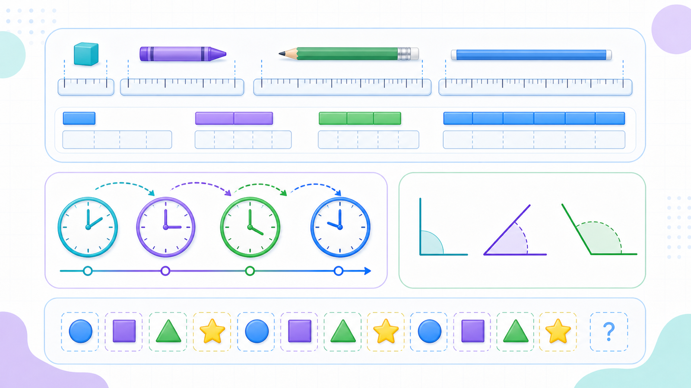

- ID: `pep-primary-p3-upper-measurement-time-geometry-concept`
- Status: `approved`
- Decision: `approved`
- Grade/Semester: `P3` / `upper`
- RAG cards: `pep-primary-p3-upper-multidigit-operations-fractions`
- Alt zh-Hans: 计量单位、钟面弧线、角和规律方块展示测量、时间与几何推理。
- Caption zh-Hans: 测量时要看清单位、起点和几何特征。

### pep-primary-p3-upper-measurement-time-geometry / worked-example

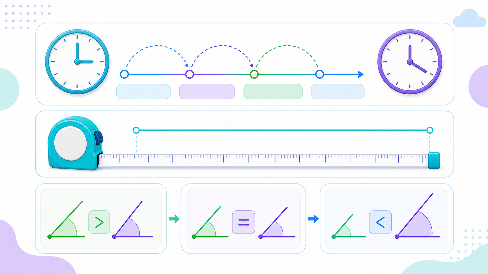

- ID: `pep-primary-p3-upper-measurement-time-geometry-worked-example`
- Status: `approved`
- Decision: `approved`
- Grade/Semester: `P3` / `upper`
- RAG cards: `pep-primary-p3-upper-multidigit-operations-fractions`
- Alt zh-Hans: 经过时间路径连接两个钟面，并配有卷尺和角的比较卡。
- Caption zh-Hans: 先标起点，再追踪变化，最后检查单位。

### pep-primary-p3-lower-area-decimals / concept

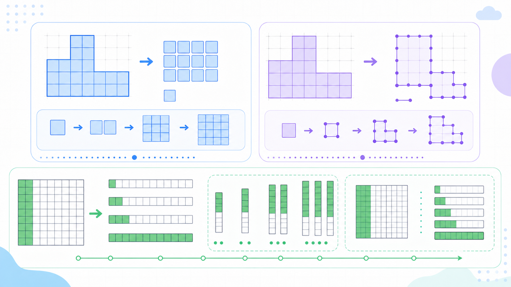

- ID: `pep-primary-p3-lower-area-decimals-concept`
- Status: `approved`
- Decision: `approved`
- Grade/Semester: `P3` / `lower`
- RAG cards: `pep-primary-p3-lower-area-decimal-data`
- Alt zh-Hans: 单位方格、边界高亮和十分位测量条区分面积、周长和小数意义。
- Caption zh-Hans: 面积数覆盖的方格，周长沿外边界计算。

### pep-primary-p3-lower-area-decimals / worked-example

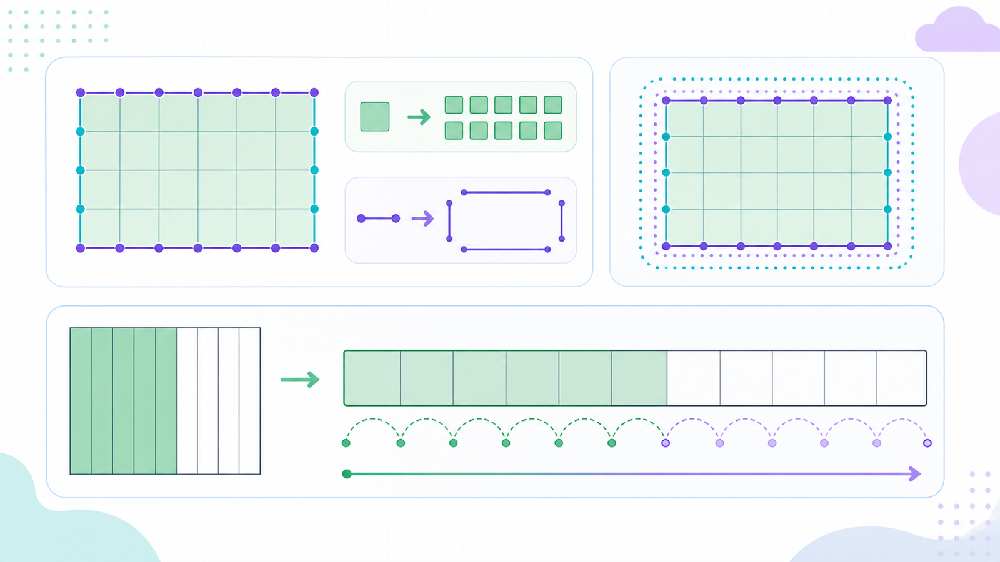

- ID: `pep-primary-p3-lower-area-decimals-worked-example`
- Status: `approved`
- Decision: `approved`
- Grade/Semester: `P3` / `lower`
- RAG cards: `pep-primary-p3-lower-area-decimal-data`
- Alt zh-Hans: 长方形方格填充内部方格、描出边界，并在测量条上表示小数。
- Caption zh-Hans: 要检查自己数的是方格、边线还是小数单位。

### pep-primary-p3-lower-statistics-review / concept

- ID: `pep-primary-p3-lower-statistics-review-concept`
- Status: `approved`
- Decision: `approved`
- Grade/Semester: `P3` / `lower`
- RAG cards: `pep-primary-p3-lower-area-decimal-data`
- Alt zh-Hans: 小型条形图、图标统计和复习卡片展示数据读取与综合比较。
- Caption zh-Hans: 读数据要先把每个数值和对应类别配对。

### pep-primary-p3-lower-statistics-review / worked-example

- ID: `pep-primary-p3-lower-statistics-review-worked-example`
- Status: `approved`
- Decision: `approved`
- Grade/Semester: `P3` / `lower`
- RAG cards: `pep-primary-p3-lower-area-decimal-data`
- Alt zh-Hans: 数据读取板高亮比较两条彩色条形和对应类别图标。
- Caption zh-Hans: 先读刻度，再比较条形，最后说出结论。

### pep-primary-p4-upper-large-numbers-multiplication / concept

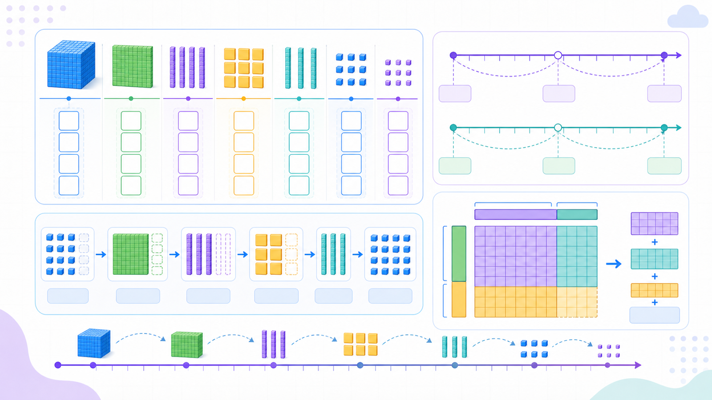

- ID: `pep-primary-p4-upper-large-numbers-multiplication-concept`
- Status: `approved`
- Decision: `approved`
- Grade/Semester: `P4` / `upper`
- RAG cards: `pep-primary-p4-upper-large-numbers-angles`
- Alt zh-Hans: 数位栏、取近似数标记和部分积方块帮助理解大数和多位数乘法。
- Caption zh-Hans: 大数学习要依靠位值、估算和部分积。

### pep-primary-p4-upper-large-numbers-multiplication / worked-example

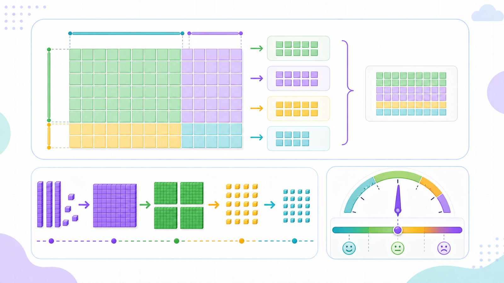

- ID: `pep-primary-p4-upper-large-numbers-multiplication-worked-example`
- Status: `approved`
- Decision: `approved`
- Grade/Semester: `P4` / `upper`
- RAG cards: `pep-primary-p4-upper-large-numbers-angles`
- Alt zh-Hans: 乘法面积模型分成多个部分矩形，并用估算仪表检查合理性。
- Caption zh-Hans: 先把积拆成部分，再检查结果大小是否合理。

### pep-primary-p4-upper-angles-geometry / concept

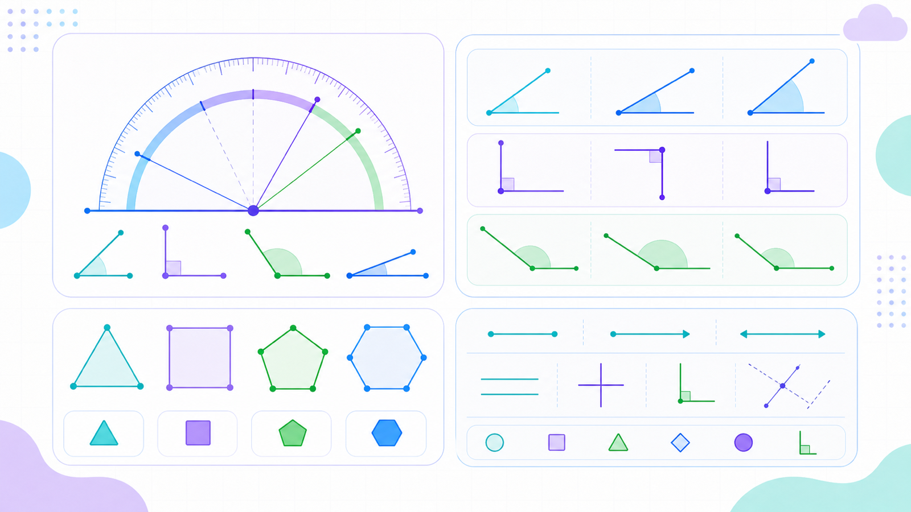

- ID: `pep-primary-p4-upper-angles-geometry-concept`
- Status: `approved`
- Decision: `approved`
- Grade/Semester: `P4` / `upper`
- RAG cards: `pep-primary-p4-upper-large-numbers-angles`
- Alt zh-Hans: 角的两边和量角弧线展示如何估计、度量和分类角。
- Caption zh-Hans: 角的大小看张开的程度，不看边画得有多长。

### pep-primary-p4-upper-angles-geometry / worked-example

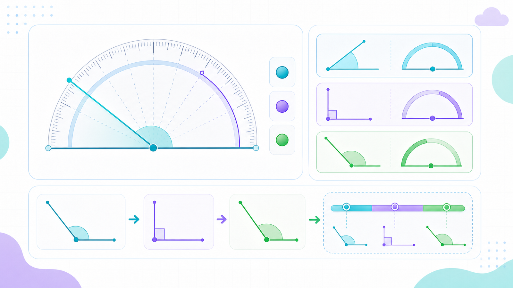

- ID: `pep-primary-p4-upper-angles-geometry-worked-example`
- Status: `approved`
- Decision: `approved`
- Grade/Semester: `P4` / `upper`
- RAG cards: `pep-primary-p4-upper-large-numbers-angles`
- Alt zh-Hans: 几何板把一个角与量角弧线对齐，并和常见角进行比较。
- Caption zh-Hans: 先对准顶点和基准边，再判断角的类型。

### pep-primary-p4-lower-decimals-average / concept

- ID: `pep-primary-p4-lower-decimals-average-concept`
- Status: `approved`
- Decision: `approved`
- Grade/Semester: `P4` / `lower`
- RAG cards: `pep-primary-p4-lower-decimal-operations-average`
- Alt zh-Hans: 小数位值条、对齐标记、单位换算箭头和平均数天平解释小数与平均数。
- Caption zh-Hans: 比较小数要看位值，平均数可以理解为平衡后的数值。

### pep-primary-p4-lower-decimals-average / worked-example

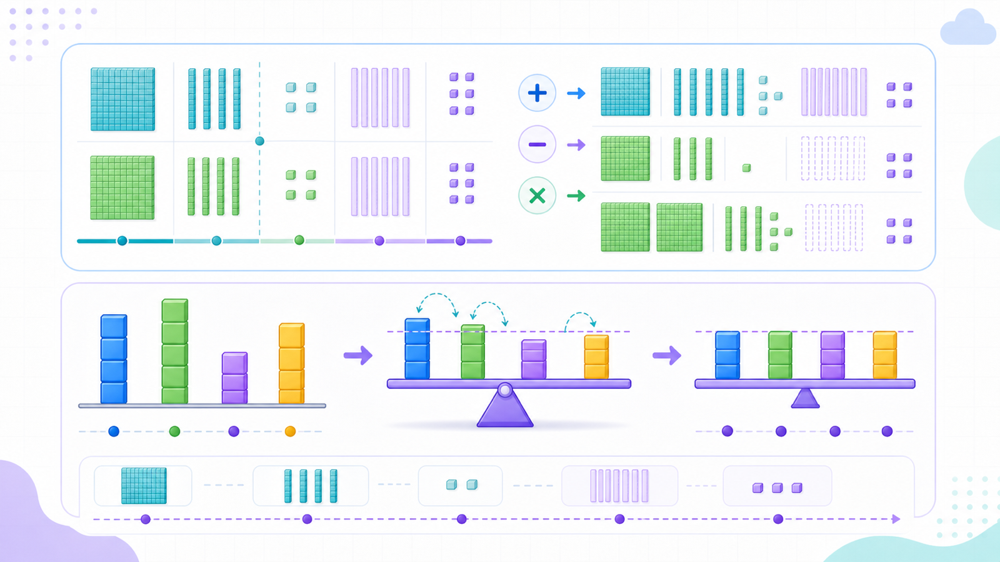

- ID: `pep-primary-p4-lower-decimals-average-worked-example`
- Status: `approved`
- Decision: `approved`
- Grade/Semester: `P4` / `lower`
- RAG cards: `pep-primary-p4-lower-decimal-operations-average`
- Alt zh-Hans: 小数运算工作区对齐位值，并把数据块调整到同一高度表示平均。
- Caption zh-Hans: 计算前先对齐，再解释平均数代表什么。

### pep-primary-p4-lower-perimeter-area-lines / concept

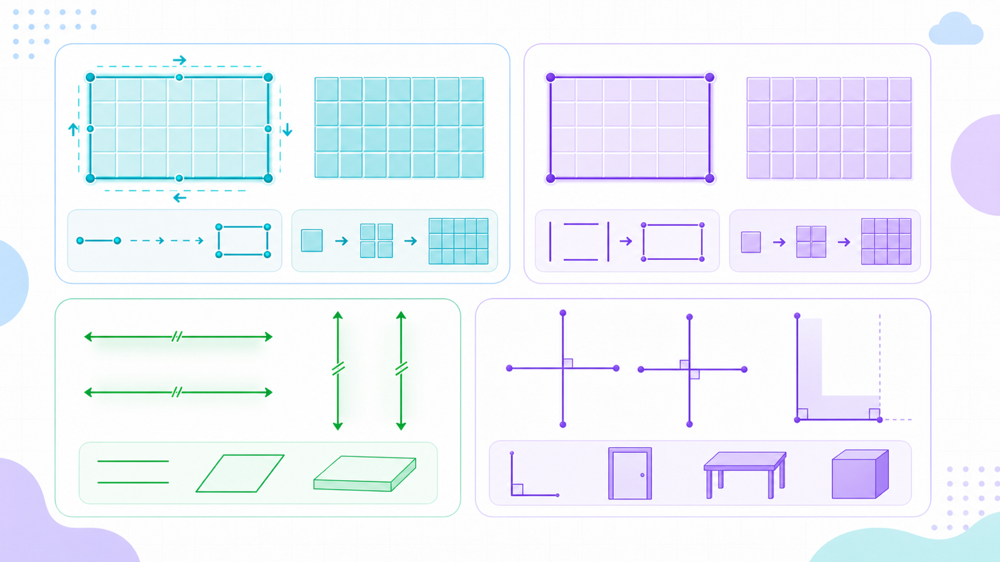

- ID: `pep-primary-p4-lower-perimeter-area-lines-concept`
- Status: `approved`
- Decision: `approved`
- Grade/Semester: `P4` / `lower`
- RAG cards: `pep-primary-p4-lower-decimal-operations-average`
- Alt zh-Hans: 描边、填充方格和平行垂直线组区分周长、面积、平行与垂直。
- Caption zh-Hans: 周长沿边走，面积看内部覆盖，线的位置关系要有明确条件。

### pep-primary-p4-lower-perimeter-area-lines / worked-example

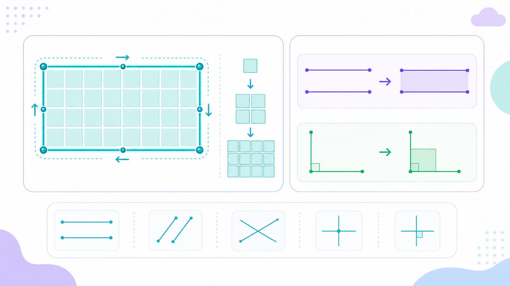

- ID: `pep-primary-p4-lower-perimeter-area-lines-worked-example`
- Status: `approved`
- Decision: `approved`
- Grade/Semester: `P4` / `lower`
- RAG cards: `pep-primary-p4-lower-decimal-operations-average`
- Alt zh-Hans: 长方形卡片把发光边界和内部方格分开显示，旁边配有线组关系卡。
- Caption zh-Hans: 套公式前先判断题目问的是哪一种特征。

### pep-primary-p5-upper-decimals-equations / concept

- ID: `pep-primary-p5-upper-decimals-equations-concept`
- Status: `approved`
- Decision: `approved`
- Grade/Semester: `P5` / `upper`
- RAG cards: `pep-primary-p5-upper-decimals-equations-polygons`
- Alt zh-Hans: 小数运算条和带未知块的天平把小数乘除与简易方程联系起来。
- Caption zh-Hans: 先估计小数结果大小，再写出等量关系并求解。

### pep-primary-p5-upper-decimals-equations / worked-example

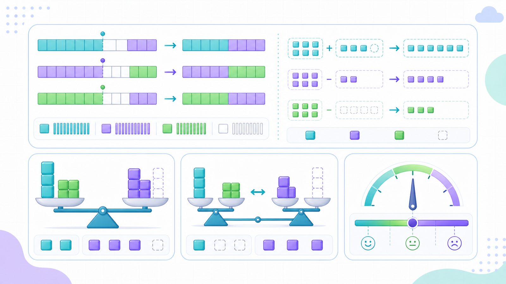

- ID: `pep-primary-p5-upper-decimals-equations-worked-example`
- Status: `approved`
- Decision: `approved`
- Grade/Semester: `P5` / `upper`
- RAG cards: `pep-primary-p5-upper-decimals-equations-polygons`
- Alt zh-Hans: 缩放的小数条和等式天平展示求解过程，并用合理性检查收尾。
- Caption zh-Hans: 求解时保持两边平衡，同时追踪小数位值。

### pep-primary-p5-upper-polygon-area / concept

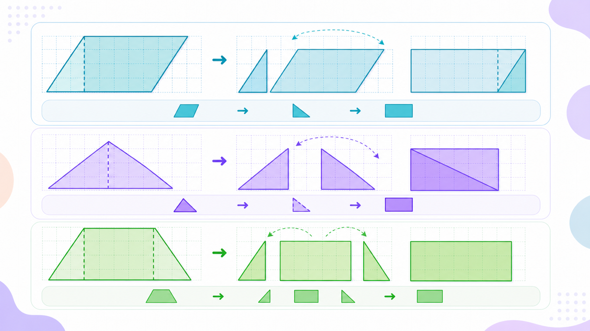

- ID: `pep-primary-p5-upper-polygon-area-concept`
- Status: `approved`
- Decision: `approved`
- Grade/Semester: `P5` / `upper`
- RAG cards: `pep-primary-p5-upper-decimals-equations-polygons`
- Alt zh-Hans: 多边形在方格上被分割和重组，显示转化为长方形的面积思路。
- Caption zh-Hans: 多边形面积公式来自图形的分割和转化。

### pep-primary-p5-upper-polygon-area / worked-example

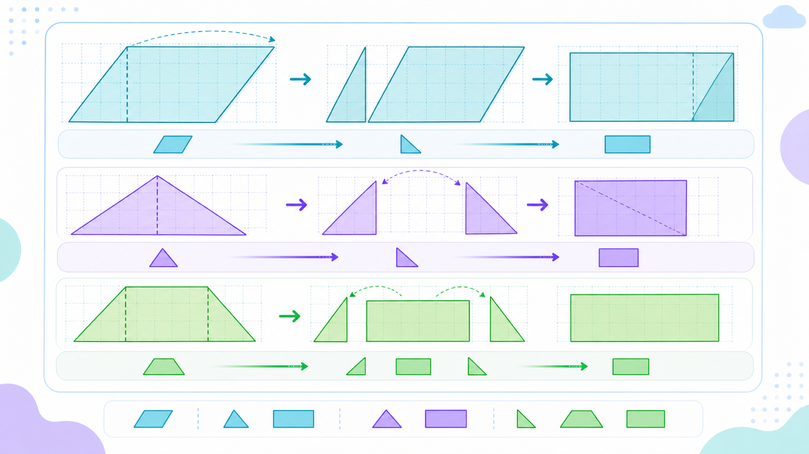

- ID: `pep-primary-p5-upper-polygon-area-worked-example`
- Status: `approved`
- Decision: `approved`
- Grade/Semester: `P5` / `upper`
- RAG cards: `pep-primary-p5-upper-decimals-equations-polygons`
- Alt zh-Hans: 面积转化板把平行四边形平移成长方形，并把三角形半块配对。
- Caption zh-Hans: 移动图形部件时面积不变，再和熟悉的长方形比较。

### pep-primary-p5-lower-factors-fractions / concept

- ID: `pep-primary-p5-lower-factors-fractions-concept`
- Status: `approved`
- Decision: `approved`
- Grade/Semester: `P5` / `lower`
- RAG cards: `pep-primary-p5-lower-fractions-factors-volume`
- Alt zh-Hans: 数块和分数条联系因数、倍数、约分和等值分数。
- Caption zh-Hans: 因数帮助整理整数关系，等值分数保持同一个大小。

### pep-primary-p5-lower-factors-fractions / worked-example

- ID: `pep-primary-p5-lower-factors-fractions-worked-example`
- Status: `approved`
- Decision: `approved`
- Grade/Semester: `P5` / `lower`
- RAG cards: `pep-primary-p5-lower-fractions-factors-volume`
- Alt zh-Hans: 数块被分入因数组，对齐的分数条显示共同单位。
- Caption zh-Hans: 分数加减前要先找到共同的单位。

### pep-primary-p5-lower-volume-data / concept

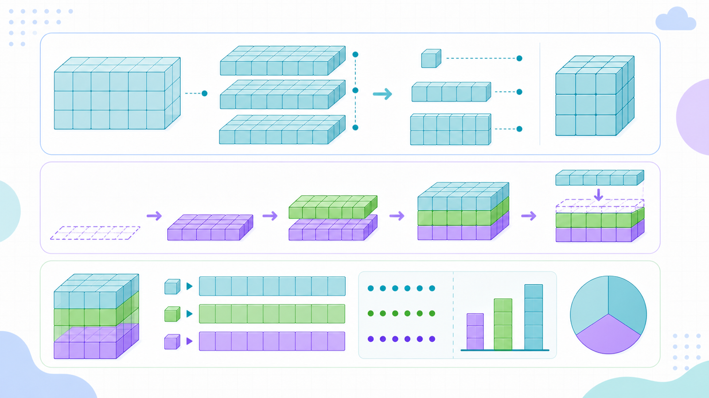

- ID: `pep-primary-p5-lower-volume-data-concept`
- Status: `approved`
- Decision: `approved`
- Grade/Semester: `P5` / `lower`
- RAG cards: `pep-primary-p5-lower-fractions-factors-volume`
- Alt zh-Hans: 由单位立方体组成的透明长方体展示体积层数，旁边配有小型数据图。
- Caption zh-Hans: 体积数的是一层层立方单位，不只是外表面。

### pep-primary-p5-lower-volume-data / worked-example

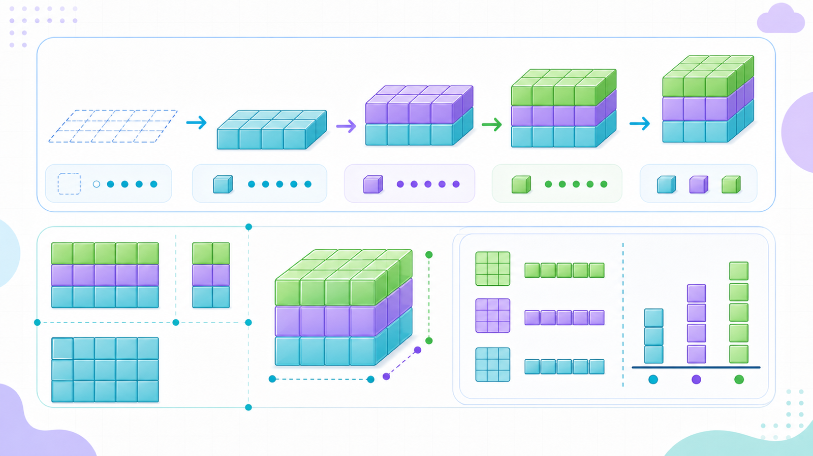

- ID: `pep-primary-p5-lower-volume-data-worked-example`
- Status: `approved`
- Decision: `approved`
- Grade/Semester: `P5` / `lower`
- RAG cards: `pep-primary-p5-lower-fractions-factors-volume`
- Alt zh-Hans: 长方体搭建板逐层堆叠单位立方体，并用数据卡记录层数。
- Caption zh-Hans: 先数一层有多少，再乘以层数。

### pep-primary-p6-upper-percent-fractions / concept

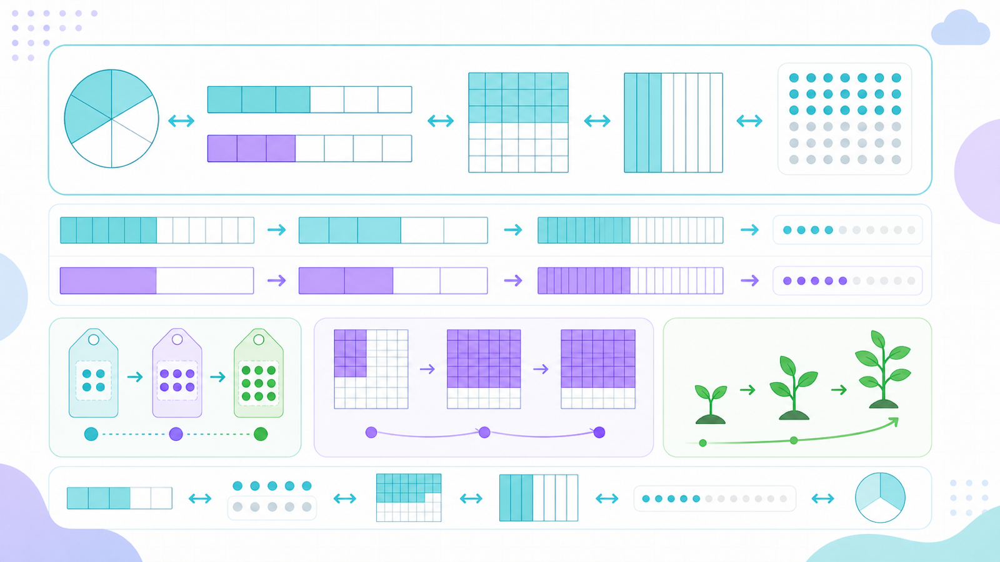

- ID: `pep-primary-p6-upper-percent-fractions-concept`
- Status: `approved`
- Decision: `approved`
- Grade/Semester: `P6` / `upper`
- RAG cards: `pep-primary-p6-upper-percent-position-data`
- Alt zh-Hans: 分数条、小数条、百分格、折扣线索和增长箭头展示等值表示。
- Caption zh-Hans: 分数、小数和百分数是同一数量的不同表示。

### pep-primary-p6-upper-percent-fractions / worked-example

- ID: `pep-primary-p6-upper-percent-fractions-worked-example`
- Status: `approved`
- Decision: `approved`
- Grade/Semester: `P6` / `upper`
- RAG cards: `pep-primary-p6-upper-percent-position-data`
- Alt zh-Hans: 同一阴影数量同时出现在分数条、小数条和百分格中。
- Caption zh-Hans: 先完成表示转换，再解释折扣或增长情境。

### pep-primary-p6-upper-coordinate-data / concept

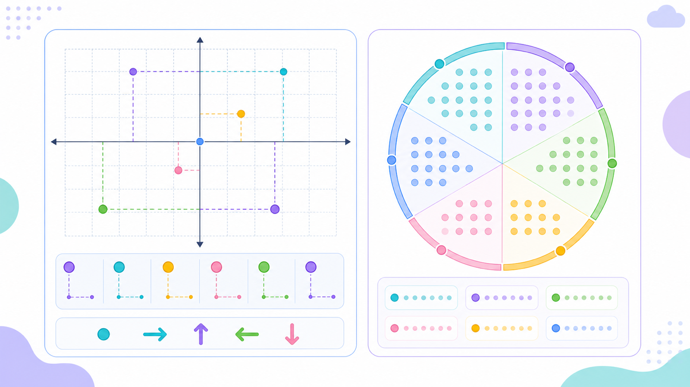

- ID: `pep-primary-p6-upper-coordinate-data-concept`
- Status: `approved`
- Decision: `approved`
- Grade/Semester: `P6` / `upper`
- RAG cards: `pep-primary-p6-upper-percent-position-data`
- Alt zh-Hans: 坐标网格、方向箭头和扇形数据圆把位置与数据表达联系起来。
- Caption zh-Hans: 位置要用有顺序的数对，数据图要先看清整体。

### pep-primary-p6-upper-coordinate-data / worked-example

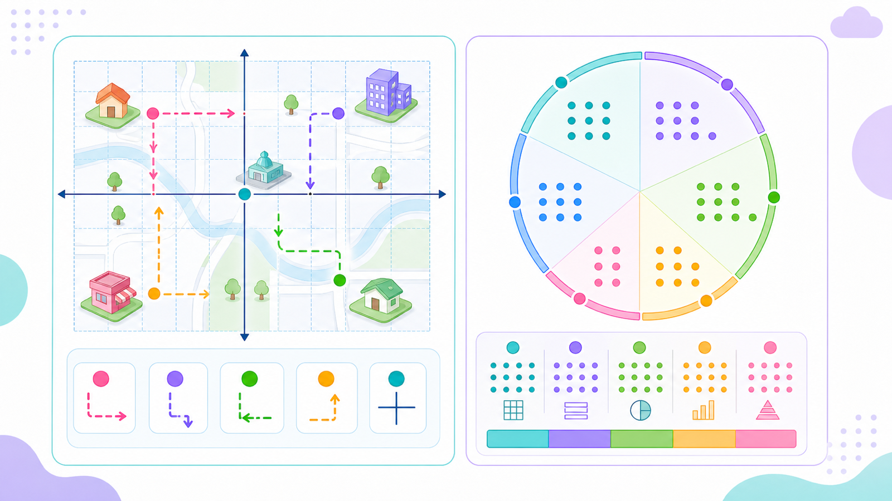

- ID: `pep-primary-p6-upper-coordinate-data-worked-example`
- Status: `approved`
- Decision: `approved`
- Grade/Semester: `P6` / `upper`
- RAG cards: `pep-primary-p6-upper-percent-position-data`
- Alt zh-Hans: 地图式坐标板展示路线箭头，旁边用数据圆比较整体中的部分。
- Caption zh-Hans: 按顺序读横向和纵向移动，再把每个数据部分与整体比较。

### pep-primary-p6-lower-ratio-proportion-scale / concept

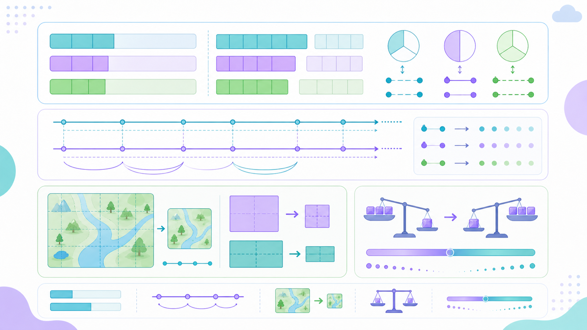

- ID: `pep-primary-p6-lower-ratio-proportion-scale-concept`
- Status: `approved`
- Decision: `approved`
- Grade/Semester: `P6` / `lower`
- RAG cards: `pep-primary-p6-lower-proportion-negative-review`
- Alt zh-Hans: 比值条、双数线、比例尺地图块和平衡线索建立比与比例模型。
- Caption zh-Hans: 比用于比较数量，比例表示这种比较保持一致。

### pep-primary-p6-lower-ratio-proportion-scale / worked-example

- ID: `pep-primary-p6-lower-ratio-proportion-scale-worked-example`
- Status: `approved`
- Decision: `approved`
- Grade/Semester: `P6` / `lower`
- RAG cards: `pep-primary-p6-lower-proportion-negative-review`
- Alt zh-Hans: 成对数量条按相同倍数变化，旁边配有比例尺小地图。
- Caption zh-Hans: 相关的两个数量要使用同一个倍数变化。

### pep-primary-p6-lower-negative-review / concept

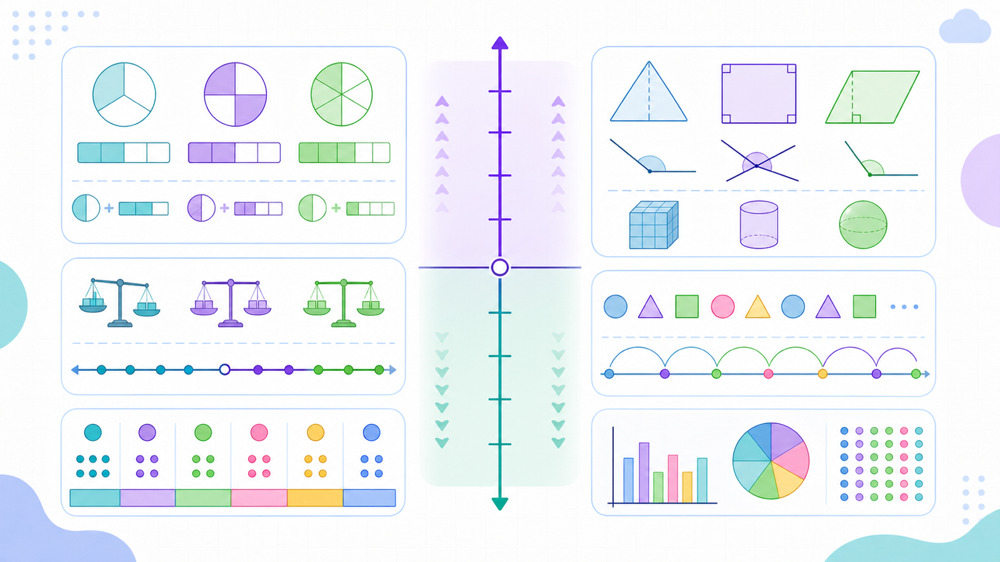

- ID: `pep-primary-p6-lower-negative-review-concept`
- Status: `approved`
- Decision: `approved`
- Grade/Semester: `P6` / `lower`
- RAG cards: `pep-primary-p6-lower-proportion-negative-review`
- Alt zh-Hans: 竖直数线用正负区域把负数意义和小学综合复习联系起来。
- Caption zh-Hans: 负数表示相对于零的方向或位置。

### pep-primary-p6-lower-negative-review / worked-example

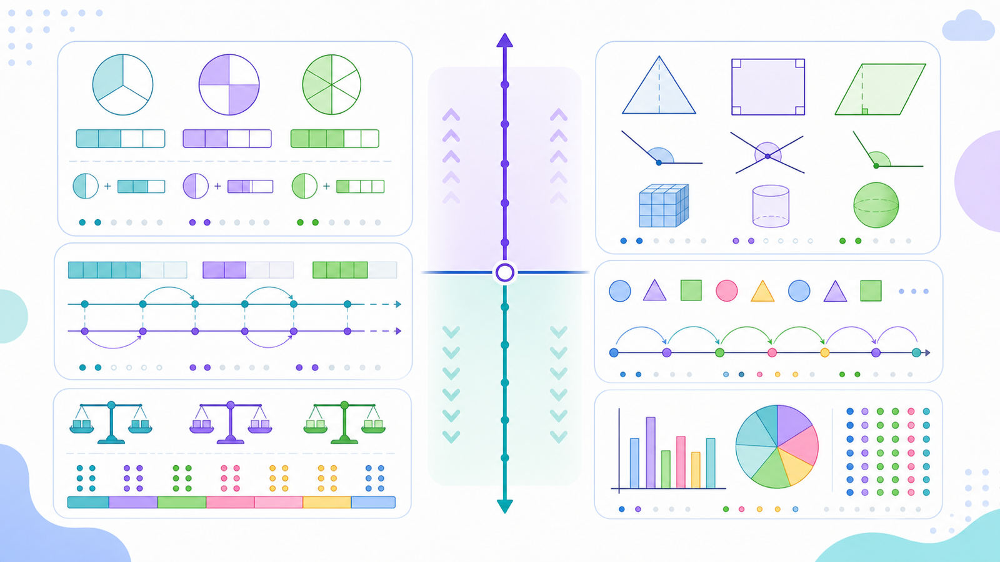

- ID: `pep-primary-p6-lower-negative-review-worked-example`
- Status: `approved`
- Decision: `approved`
- Grade/Semester: `P6` / `lower`
- RAG cards: `pep-primary-p6-lower-proportion-negative-review`
- Alt zh-Hans: 复习面板使用以零为中心的数线、上下移动箭头和综合模型卡。
- Caption zh-Hans: 先确定零的位置，再判断方向，最后解决综合问题。

