# Mainland PEP Primary Question Illustrations V1

- Generated at: 2026-05-28T04:00:48.368Z
- Mode: `smoke`
- Dry run: `false`
- Model: `gpt-image-2`
- Quality/size: `medium` / `1024x1024`
- Source queue: `coordination/content-qa/2026-05-27-S18-mainland-pep-primary-question-illustration-queue.jsonl`
- Selected questions: 1200

Review decisions in `manual-review.csv` should use `pending`, `approved`, `revise`, or `reject`.

## P1 / number-sense

### pep-primary-p1-u-mc-001

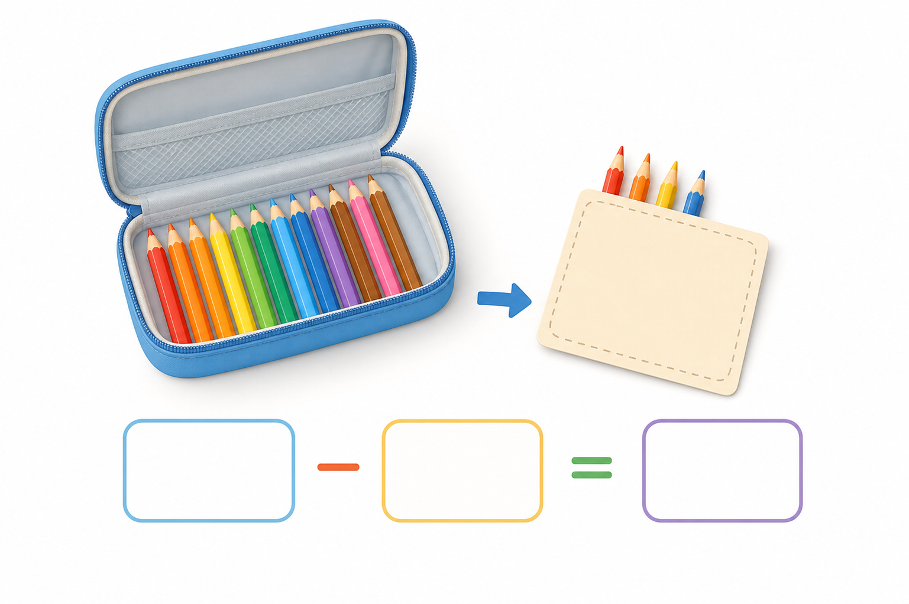

- Status: `generated`
- Grade/family: `P1` / `number-sense`
- Need/kind: `core` / `ten-frame`
- Prompt: 乐乐有14枚彩笔，已经用掉11枚，还剩多少枚？

### pep-primary-p1-u-mc-002

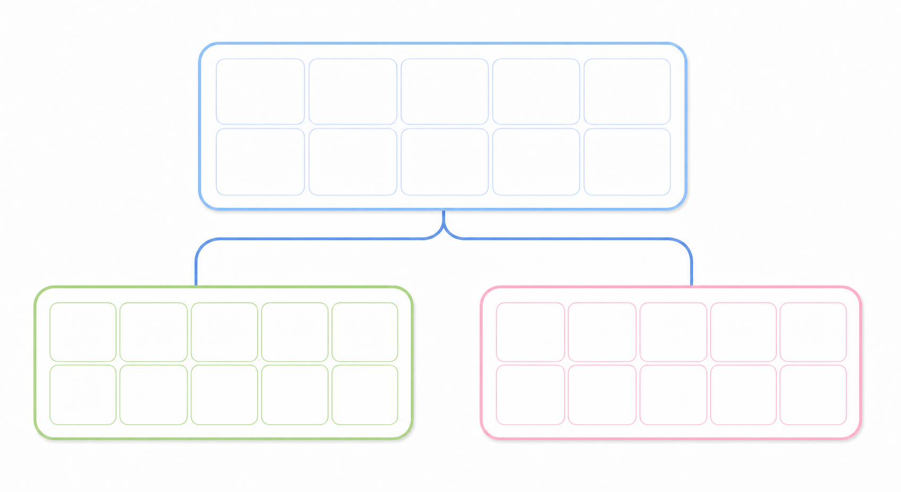

- Status: `generated`
- Grade/family: `P1` / `number-sense`
- Need/kind: `core` / `ten-frame`
- Prompt: 第2小组：一个数的组成中，总数是10，其中一部分是7，另一部分是多少？

### pep-primary-p1-u-mc-003

- Status: `generated`
- Grade/family: `P1` / `number-sense`
- Need/kind: `core` / `ten-frame`
- Prompt: 第3小组：一个数的组成中，总数是11，其中一部分是10，另一部分是多少？

### pep-primary-p1-u-mc-004

- Status: `generated`
- Grade/family: `P1` / `number-sense`
- Need/kind: `core` / `ten-frame`
- Prompt: 第4小组：一个数的组成中，总数是12，其中一部分是2，另一部分是多少？

### pep-primary-p1-u-mc-005

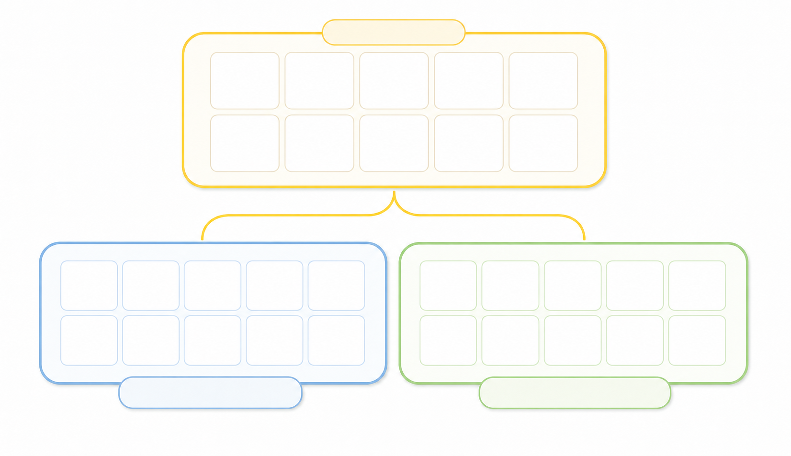

- Status: `generated`
- Grade/family: `P1` / `number-sense`
- Need/kind: `core` / `ten-frame`
- Prompt: 第5小组：一个数的组成中，总数是13，其中一部分是4，另一部分是多少？

### pep-primary-p1-u-mc-006

- Status: `generated`
- Grade/family: `P1` / `number-sense`
- Need/kind: `core` / `ten-frame`
- Prompt: 第6小组：一个数的组成中，总数是14，其中一部分是6，另一部分是多少？

### pep-primary-p1-u-mc-007

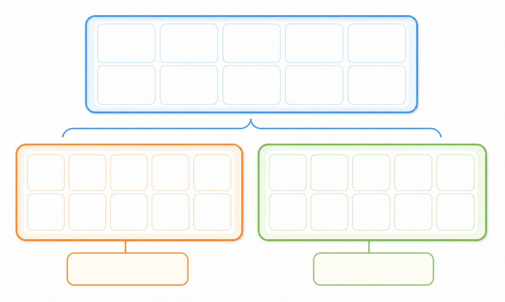

- Status: `generated`
- Grade/family: `P1` / `number-sense`
- Need/kind: `core` / `ten-frame`
- Prompt: 第7小组：一个数的组成中，总数是15，其中一部分是8，另一部分是多少？

### pep-primary-p1-u-mc-008

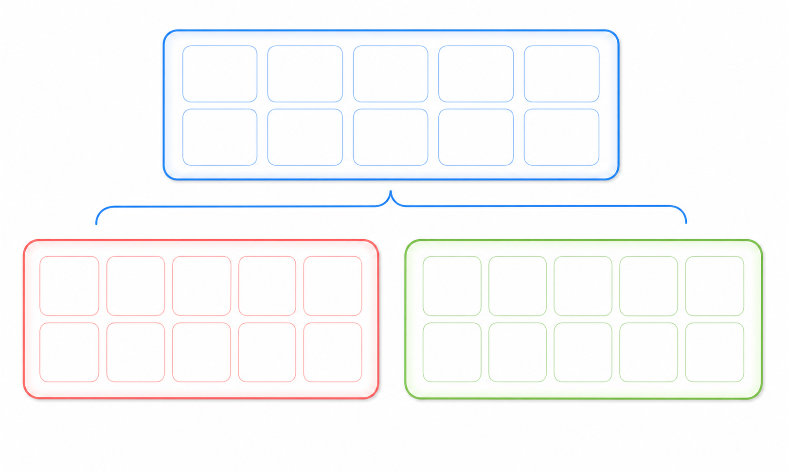

- Status: `generated`
- Grade/family: `P1` / `number-sense`
- Need/kind: `core` / `ten-frame`
- Prompt: 第8小组：一个数的组成中，总数是16，其中一部分是10，另一部分是多少？

### pep-primary-p1-u-mc-009

- Status: `generated`
- Grade/family: `P1` / `number-sense`
- Need/kind: `core` / `ten-frame`
- Prompt: 第9小组：一个数的组成中，总数是17，其中一部分是12，另一部分是多少？

### pep-primary-p1-u-mc-010

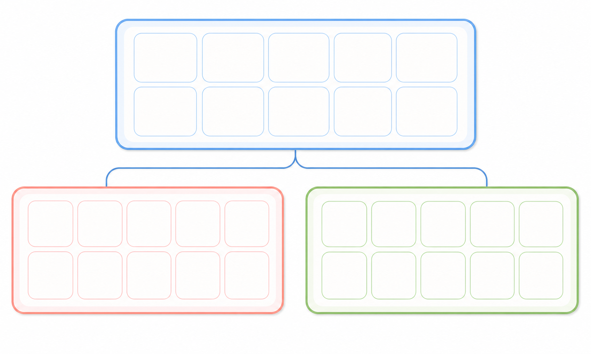

- Status: `generated`
- Grade/family: `P1` / `number-sense`
- Need/kind: `core` / `ten-frame`
- Prompt: 第10小组：一个数的组成中，总数是18，其中一部分是14，另一部分是多少？

### pep-primary-p1-u-mc-011

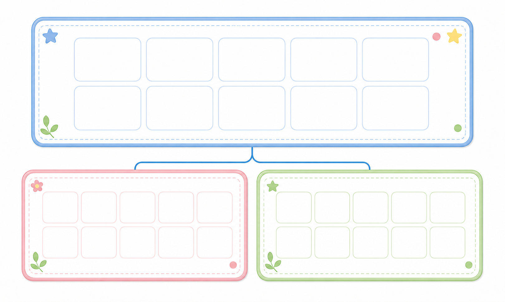

- Status: `generated`
- Grade/family: `P1` / `number-sense`
- Need/kind: `core` / `ten-frame`
- Prompt: 第11小组：一个数的组成中，总数是19，其中一部分是16，另一部分是多少？

### pep-primary-p1-u-mc-012

- Status: `generated`
- Grade/family: `P1` / `number-sense`
- Need/kind: `core` / `ten-frame`
- Prompt: 第12小组：一个数的组成中，总数是8，其中一部分是2，另一部分是多少？

### pep-primary-p1-u-mc-013

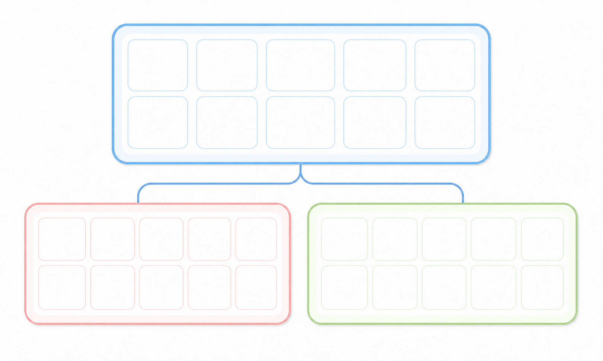

- Status: `generated`
- Grade/family: `P1` / `number-sense`
- Need/kind: `core` / `ten-frame`
- Prompt: 第13小组：一个数的组成中，总数是9，其中一部分是8，另一部分是多少？

### pep-primary-p1-u-mc-014

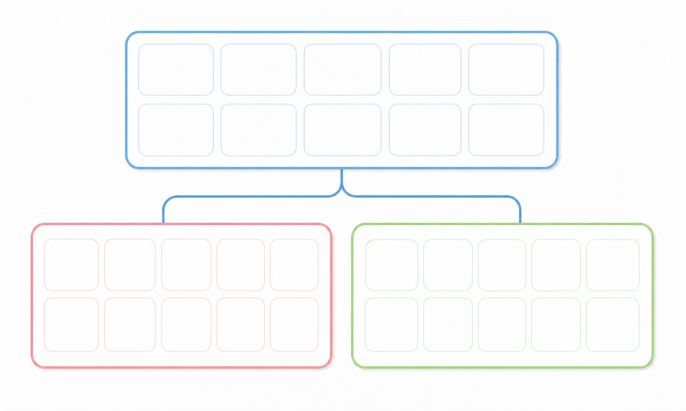

- Status: `generated`
- Grade/family: `P1` / `number-sense`
- Need/kind: `core` / `ten-frame`
- Prompt: 第14小组：一个数的组成中，总数是10，其中一部分是7，另一部分是多少？

### pep-primary-p1-u-mc-015

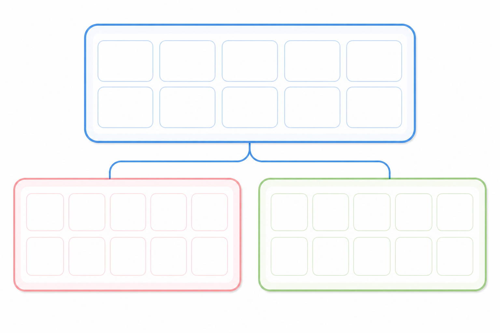

- Status: `generated`
- Grade/family: `P1` / `number-sense`
- Need/kind: `core` / `ten-frame`
- Prompt: 第15小组：一个数的组成中，总数是11，其中一部分是6，另一部分是多少？

### pep-primary-p1-u-mc-016

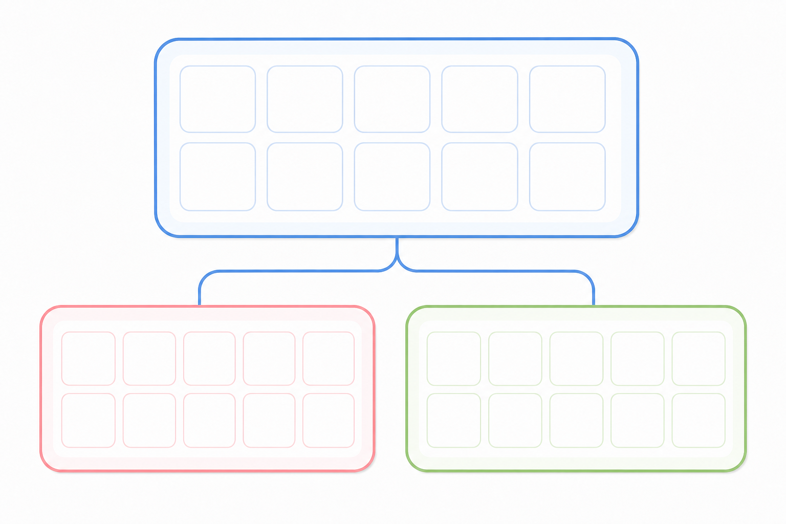

- Status: `generated`
- Grade/family: `P1` / `number-sense`
- Need/kind: `core` / `ten-frame`
- Prompt: 第16小组：一个数的组成中，总数是12，其中一部分是5，另一部分是多少？

### pep-primary-p1-u-mc-017

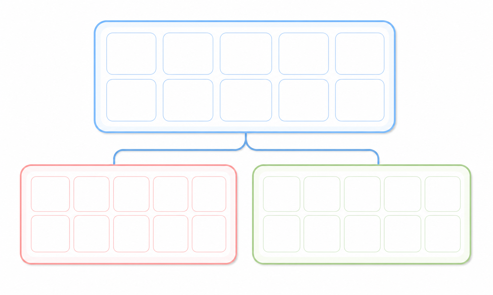

- Status: `generated`
- Grade/family: `P1` / `number-sense`
- Need/kind: `core` / `ten-frame`
- Prompt: 第17小组：一个数的组成中，总数是13，其中一部分是4，另一部分是多少？

### pep-primary-p1-u-mc-018

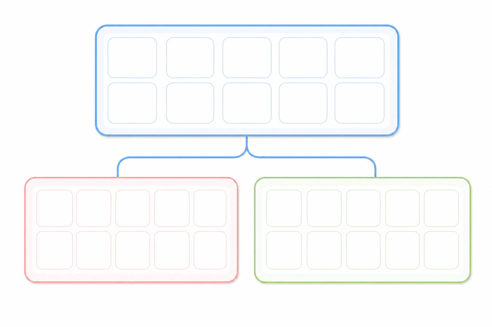

- Status: `generated`
- Grade/family: `P1` / `number-sense`
- Need/kind: `core` / `ten-frame`
- Prompt: 第18小组：一个数的组成中，总数是14，其中一部分是3，另一部分是多少？

### pep-primary-p1-u-mc-019

- Status: `generated`
- Grade/family: `P1` / `number-sense`
- Need/kind: `core` / `ten-frame`
- Prompt: 第19小组：一个数的组成中，总数是15，其中一部分是2，另一部分是多少？

### pep-primary-p1-u-mc-020

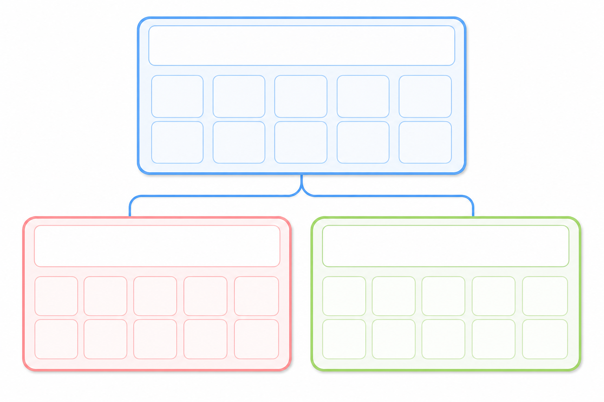

- Status: `generated`
- Grade/family: `P1` / `number-sense`
- Need/kind: `core` / `ten-frame`
- Prompt: 第20小组：一个数的组成中，总数是16，其中一部分是1，另一部分是多少？

### pep-primary-p1-u-mc-021

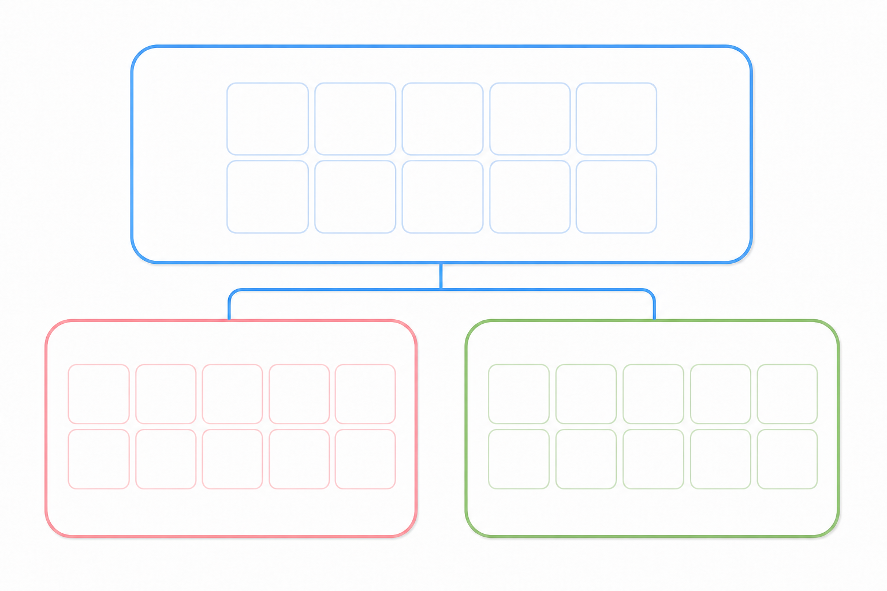

- Status: `generated`
- Grade/family: `P1` / `number-sense`
- Need/kind: `core` / `ten-frame`
- Prompt: 第21小组：一个数的组成中，总数是17，其中一部分是16，另一部分是多少？

### pep-primary-p1-u-mc-022

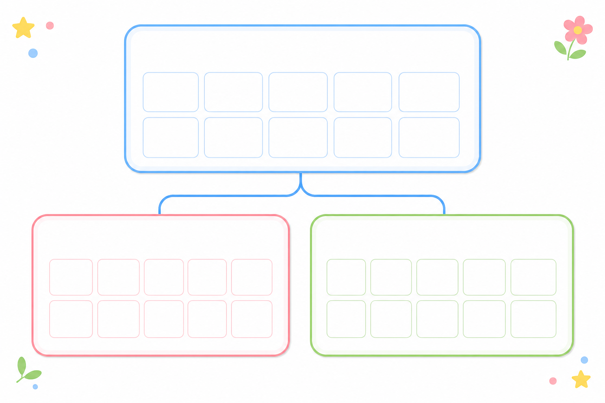

- Status: `generated`
- Grade/family: `P1` / `number-sense`
- Need/kind: `core` / `ten-frame`
- Prompt: 第22小组：一个数的组成中，总数是18，其中一部分是16，另一部分是多少？

### pep-primary-p1-u-mc-023

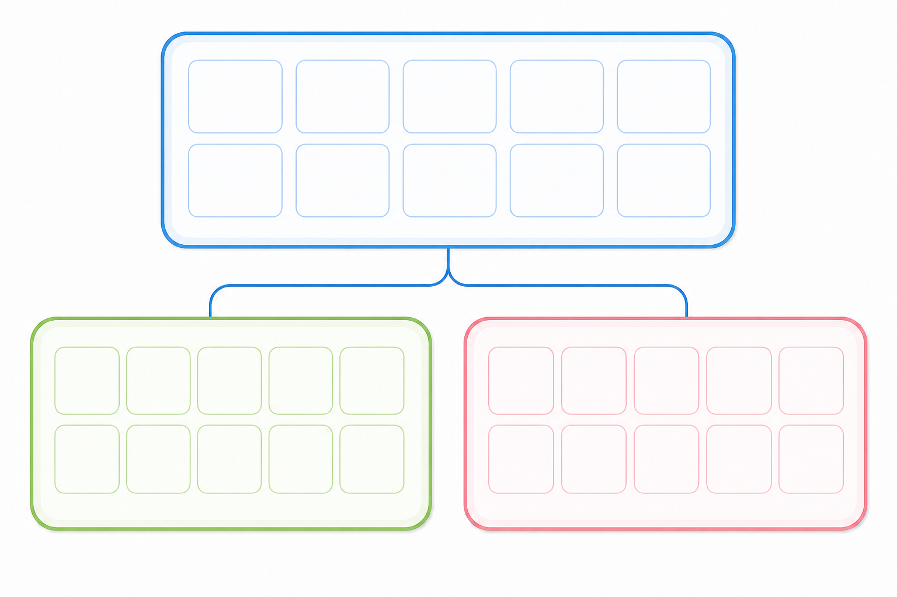

- Status: `generated`
- Grade/family: `P1` / `number-sense`
- Need/kind: `core` / `ten-frame`
- Prompt: 第23小组：一个数的组成中，总数是19，其中一部分是16，另一部分是多少？

### pep-primary-p1-u-mc-024

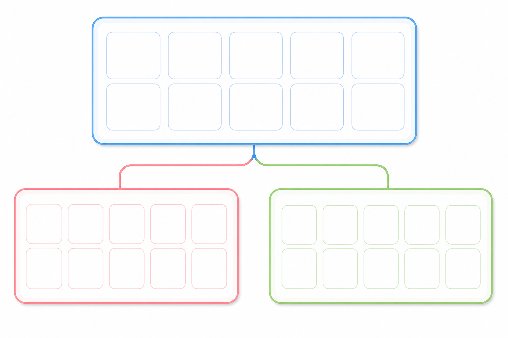

- Status: `generated`
- Grade/family: `P1` / `number-sense`
- Need/kind: `core` / `ten-frame`
- Prompt: 第24小组：一个数的组成中，总数是8，其中一部分是3，另一部分是多少？

### pep-primary-p1-u-mc-025

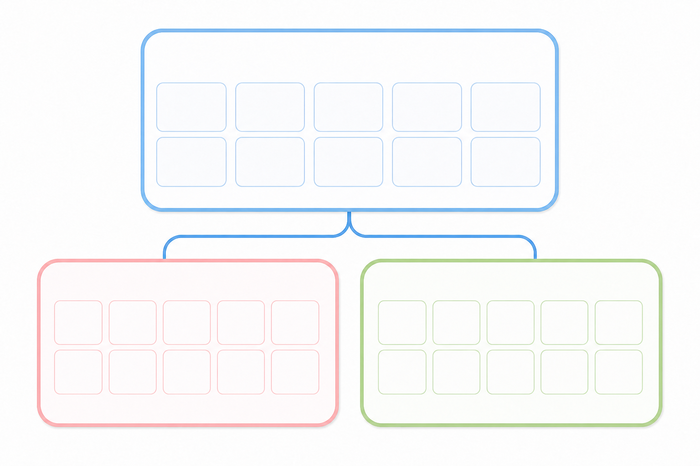

- Status: `generated`
- Grade/family: `P1` / `number-sense`
- Need/kind: `core` / `ten-frame`
- Prompt: 第25小组：一个数的组成中，总数是9，其中一部分是4，另一部分是多少？

### pep-primary-p1-u-mc-026

Image pending: `candidates/P1/number-sense/pep-primary-p1-u-mc-026.png`

- Status: `missing`
- Grade/family: `P1` / `number-sense`
- Need/kind: `core` / `ten-frame`
- Prompt: 第26小组：一个数的组成中，总数是10，其中一部分是7，另一部分是多少？

### pep-primary-p1-u-mc-027

Image pending: `candidates/P1/number-sense/pep-primary-p1-u-mc-027.png`

- Status: `missing`
- Grade/family: `P1` / `number-sense`
- Need/kind: `core` / `ten-frame`
- Prompt: 第27小组：一个数的组成中，总数是11，其中一部分是2，另一部分是多少？

### pep-primary-p1-u-mc-028

Image pending: `candidates/P1/number-sense/pep-primary-p1-u-mc-028.png`

- Status: `missing`
- Grade/family: `P1` / `number-sense`
- Need/kind: `core` / `ten-frame`
- Prompt: 第28小组：一个数的组成中，总数是12，其中一部分是8，另一部分是多少？

### pep-primary-p1-u-mc-029

Image pending: `candidates/P1/number-sense/pep-primary-p1-u-mc-029.png`

- Status: `missing`
- Grade/family: `P1` / `number-sense`
- Need/kind: `core` / `ten-frame`
- Prompt: 第29小组：一个数的组成中，总数是13，其中一部分是4，另一部分是多少？

### pep-primary-p1-u-mc-030

Image pending: `candidates/P1/number-sense/pep-primary-p1-u-mc-030.png`

- Status: `missing`
- Grade/family: `P1` / `number-sense`
- Need/kind: `core` / `ten-frame`
- Prompt: 第30小组：一个数的组成中，总数是14，其中一部分是13，另一部分是多少？

### pep-primary-p1-u-mc-031

Image pending: `candidates/P1/number-sense/pep-primary-p1-u-mc-031.png`

- Status: `missing`
- Grade/family: `P1` / `number-sense`
- Need/kind: `core` / `ten-frame`
- Prompt: 运动场准备了9张数卡，先发给同学4张，还剩几张？

### pep-primary-p1-u-mc-032

Image pending: `candidates/P1/number-sense/pep-primary-p1-u-mc-032.png`

- Status: `missing`
- Grade/family: `P1` / `number-sense`
- Need/kind: `core` / `ten-frame`
- Prompt: 第32小组：一个数的组成中，总数是16，其中一部分是7，另一部分是多少？

### pep-primary-p1-u-mc-033

Image pending: `candidates/P1/number-sense/pep-primary-p1-u-mc-033.png`

- Status: `missing`
- Grade/family: `P1` / `number-sense`
- Need/kind: `core` / `ten-frame`
- Prompt: 第33小组：一个数的组成中，总数是17，其中一部分是4，另一部分是多少？

### pep-primary-p1-u-mc-034

Image pending: `candidates/P1/number-sense/pep-primary-p1-u-mc-034.png`

- Status: `missing`
- Grade/family: `P1` / `number-sense`
- Need/kind: `core` / `ten-frame`
- Prompt: 第34小组：一个数的组成中，总数是18，其中一部分是1，另一部分是多少？

### pep-primary-p1-u-mc-035

Image pending: `candidates/P1/number-sense/pep-primary-p1-u-mc-035.png`

- Status: `missing`
- Grade/family: `P1` / `number-sense`
- Need/kind: `core` / `ten-frame`
- Prompt: 第35小组：一个数的组成中，总数是19，其中一部分是16，另一部分是多少？

### pep-primary-p1-u-mc-036

Image pending: `candidates/P1/number-sense/pep-primary-p1-u-mc-036.png`

- Status: `missing`
- Grade/family: `P1` / `number-sense`
- Need/kind: `core` / `ten-frame`
- Prompt: 第36小组：一个数的组成中，总数是8，其中一部分是4，另一部分是多少？

### pep-primary-p1-u-mc-037

Image pending: `candidates/P1/number-sense/pep-primary-p1-u-mc-037.png`

- Status: `missing`
- Grade/family: `P1` / `number-sense`
- Need/kind: `core` / `ten-frame`
- Prompt: 第37小组：一个数的组成中，总数是9，其中一部分是8，另一部分是多少？

### pep-primary-p1-u-mc-038

Image pending: `candidates/P1/number-sense/pep-primary-p1-u-mc-038.png`

- Status: `missing`
- Grade/family: `P1` / `number-sense`
- Need/kind: `core` / `ten-frame`
- Prompt: 第38小组：一个数的组成中，总数是10，其中一部分是7，另一部分是多少？

### pep-primary-p1-u-mc-039

Image pending: `candidates/P1/number-sense/pep-primary-p1-u-mc-039.png`

- Status: `missing`
- Grade/family: `P1` / `number-sense`
- Need/kind: `core` / `ten-frame`
- Prompt: 第39小组：一个数的组成中，总数是11，其中一部分是8，另一部分是多少？

### pep-primary-p1-u-mc-040

Image pending: `candidates/P1/number-sense/pep-primary-p1-u-mc-040.png`

- Status: `missing`
- Grade/family: `P1` / `number-sense`
- Need/kind: `core` / `ten-frame`
- Prompt: 第40小组：一个数的组成中，总数是12，其中一部分是11，另一部分是多少？

### pep-primary-p1-u-mc-041

Image pending: `candidates/P1/number-sense/pep-primary-p1-u-mc-041.png`

- Status: `missing`
- Grade/family: `P1` / `number-sense`
- Need/kind: `core` / `ten-frame`
- Prompt: 第41小组：一个数的组成中，总数是13，其中一部分是4，另一部分是多少？

### pep-primary-p1-u-mc-042

Image pending: `candidates/P1/number-sense/pep-primary-p1-u-mc-042.png`

- Status: `missing`
- Grade/family: `P1` / `number-sense`
- Need/kind: `core` / `ten-frame`
- Prompt: 第42小组：一个数的组成中，总数是14，其中一部分是10，另一部分是多少？

### pep-primary-p1-u-mc-043

Image pending: `candidates/P1/number-sense/pep-primary-p1-u-mc-043.png`

- Status: `missing`
- Grade/family: `P1` / `number-sense`
- Need/kind: `core` / `ten-frame`
- Prompt: 第43小组：一个数的组成中，总数是15，其中一部分是4，另一部分是多少？

### pep-primary-p1-u-mc-044

Image pending: `candidates/P1/number-sense/pep-primary-p1-u-mc-044.png`

- Status: `missing`
- Grade/family: `P1` / `number-sense`
- Need/kind: `core` / `ten-frame`
- Prompt: 第44小组：一个数的组成中，总数是16，其中一部分是13，另一部分是多少？

### pep-primary-p1-u-mc-045

Image pending: `candidates/P1/number-sense/pep-primary-p1-u-mc-045.png`

- Status: `missing`
- Grade/family: `P1` / `number-sense`
- Need/kind: `core` / `ten-frame`
- Prompt: 第45小组：一个数的组成中，总数是17，其中一部分是8，另一部分是多少？

### pep-primary-p1-u-mc-046

Image pending: `candidates/P1/number-sense/pep-primary-p1-u-mc-046.png`

- Status: `missing`
- Grade/family: `P1` / `number-sense`
- Need/kind: `core` / `ten-frame`
- Prompt: 第46小组：一个数的组成中，总数是18，其中一部分是3，另一部分是多少？

### pep-primary-p1-u-mc-047

Image pending: `candidates/P1/number-sense/pep-primary-p1-u-mc-047.png`

- Status: `missing`
- Grade/family: `P1` / `number-sense`
- Need/kind: `core` / `ten-frame`
- Prompt: 第47小组：一个数的组成中，总数是19，其中一部分是16，另一部分是多少？

### pep-primary-p1-u-mc-048

Image pending: `candidates/P1/number-sense/pep-primary-p1-u-mc-048.png`

- Status: `missing`
- Grade/family: `P1` / `number-sense`
- Need/kind: `core` / `ten-frame`
- Prompt: 第48小组：一个数的组成中，总数是8，其中一部分是5，另一部分是多少？

### pep-primary-p1-u-mc-049

Image pending: `candidates/P1/number-sense/pep-primary-p1-u-mc-049.png`

- Status: `missing`
- Grade/family: `P1` / `number-sense`
- Need/kind: `core` / `ten-frame`
- Prompt: 第49小组：一个数的组成中，总数是9，其中一部分是4，另一部分是多少？

### pep-primary-p1-u-mc-050

Image pending: `candidates/P1/number-sense/pep-primary-p1-u-mc-050.png`

- Status: `missing`
- Grade/family: `P1` / `number-sense`
- Need/kind: `core` / `ten-frame`
- Prompt: 第50小组：一个数的组成中，总数是10，其中一部分是7，另一部分是多少？

## P1 / geometry-position

### pep-primary-p1-u-fi-091

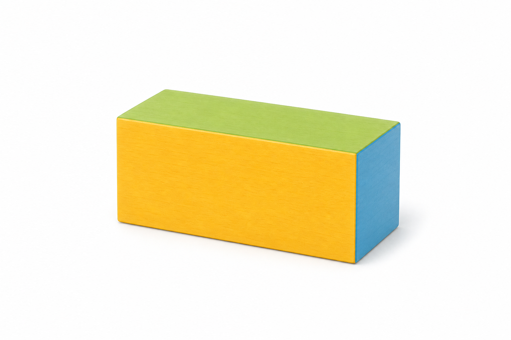

- Status: `generated`
- Grade/family: `P1` / `geometry-position`
- Need/kind: `core` / `solid`
- Prompt: 观察一个积木：相对的面形状相同，多数面是长方形。这个积木属于哪种立体图形？

### pep-primary-p1-u-fi-092

Image pending: `candidates/P1/geometry-position/pep-primary-p1-u-fi-092.png`

- Status: `missing`
- Grade/family: `P1` / `geometry-position`
- Need/kind: `core` / `solid`
- Prompt: 第92小组：下面描述的是哪种立体图形：相对的面是长方形？

### pep-primary-p1-u-fi-093

Image pending: `candidates/P1/geometry-position/pep-primary-p1-u-fi-093.png`

- Status: `missing`
- Grade/family: `P1` / `geometry-position`
- Need/kind: `core` / `solid`
- Prompt: 第93小组：下面描述的是哪种立体图形：每个面都是正方形？

### pep-primary-p1-u-fi-094

Image pending: `candidates/P1/geometry-position/pep-primary-p1-u-fi-094.png`

- Status: `missing`
- Grade/family: `P1` / `geometry-position`
- Need/kind: `core` / `solid`
- Prompt: 观察一个积木：上下两个面都是圆形。这个积木属于哪种立体图形？

### pep-primary-p1-u-fi-095

Image pending: `candidates/P1/geometry-position/pep-primary-p1-u-fi-095.png`

- Status: `missing`
- Grade/family: `P1` / `geometry-position`
- Need/kind: `core` / `solid`
- Prompt: 浩浩摸到一个立体图形，它每个面都是正方形。这个图形最可能是什么？

### pep-primary-p1-u-fi-096

Image pending: `candidates/P1/geometry-position/pep-primary-p1-u-fi-096.png`

- Status: `missing`
- Grade/family: `P1` / `geometry-position`
- Need/kind: `core` / `solid`
- Prompt: 第96小组：下面描述的是哪种立体图形：相对的面是长方形？

### pep-primary-p1-u-fi-097

Image pending: `candidates/P1/geometry-position/pep-primary-p1-u-fi-097.png`

- Status: `missing`
- Grade/family: `P1` / `geometry-position`
- Need/kind: `core` / `solid`
- Prompt: 第97小组：下面描述的是哪种立体图形：每个面都是正方形？

### pep-primary-p1-u-fi-098

Image pending: `candidates/P1/geometry-position/pep-primary-p1-u-fi-098.png`

- Status: `missing`
- Grade/family: `P1` / `geometry-position`
- Need/kind: `core` / `solid`
- Prompt: 第98小组：下面描述的是哪种立体图形：有两个圆形的面？

### pep-primary-p1-u-fi-099

Image pending: `candidates/P1/geometry-position/pep-primary-p1-u-fi-099.png`

- Status: `missing`
- Grade/family: `P1` / `geometry-position`
- Need/kind: `core` / `solid`
- Prompt: 图书角摆着一个模型，特点是：上下两个面都是圆形。请选择它的名称。

### pep-primary-p1-u-fi-100

Image pending: `candidates/P1/geometry-position/pep-primary-p1-u-fi-100.png`

- Status: `missing`
- Grade/family: `P1` / `geometry-position`
- Need/kind: `core` / `solid`
- Prompt: 第100小组：下面描述的是哪种立体图形：相对的面是长方形？

### pep-primary-p1-u-mc-051

Image pending: `candidates/P1/geometry-position/pep-primary-p1-u-mc-051.png`

- Status: `missing`
- Grade/family: `P1` / `geometry-position`
- Need/kind: `core` / `solid`
- Prompt: 小林摸到一个立体图形，它从各个方向都能滚动。这个图形最可能是什么？

### pep-primary-p1-u-mc-052

Image pending: `candidates/P1/geometry-position/pep-primary-p1-u-mc-052.png`

- Status: `missing`
- Grade/family: `P1` / `geometry-position`
- Need/kind: `core` / `solid`
- Prompt: 第52小组：下面描述的是哪种立体图形：相对的面是长方形？

### pep-primary-p1-u-mc-053

Image pending: `candidates/P1/geometry-position/pep-primary-p1-u-mc-053.png`

- Status: `missing`
- Grade/family: `P1` / `geometry-position`
- Need/kind: `core` / `solid`
- Prompt: 第53小组：下面描述的是哪种立体图形：每个面都是正方形？

### pep-primary-p1-u-mc-054

Image pending: `candidates/P1/geometry-position/pep-primary-p1-u-mc-054.png`

- Status: `missing`
- Grade/family: `P1` / `geometry-position`
- Need/kind: `core` / `solid`
- Prompt: 第54小组：下面描述的是哪种立体图形：有两个圆形的面？

### pep-primary-p1-u-mc-055

Image pending: `candidates/P1/geometry-position/pep-primary-p1-u-mc-055.png`

- Status: `missing`
- Grade/family: `P1` / `geometry-position`
- Need/kind: `core` / `solid`
- Prompt: 美术柜摆着一个模型，特点是：相对的面形状相同，多数面是长方形。请选择它的名称。

### pep-primary-p1-u-mc-056

Image pending: `candidates/P1/geometry-position/pep-primary-p1-u-mc-056.png`

- Status: `missing`
- Grade/family: `P1` / `geometry-position`
- Need/kind: `core` / `solid`
- Prompt: 第56小组：下面描述的是哪种立体图形：相对的面是长方形？

### pep-primary-p1-u-mc-057

Image pending: `candidates/P1/geometry-position/pep-primary-p1-u-mc-057.png`

- Status: `missing`
- Grade/family: `P1` / `geometry-position`
- Need/kind: `core` / `solid`
- Prompt: 第57小组：下面描述的是哪种立体图形：每个面都是正方形？

### pep-primary-p1-u-mc-058

Image pending: `candidates/P1/geometry-position/pep-primary-p1-u-mc-058.png`

- Status: `missing`
- Grade/family: `P1` / `geometry-position`
- Need/kind: `core` / `solid`
- Prompt: 第58小组：下面描述的是哪种立体图形：有两个圆形的面？

### pep-primary-p1-u-mc-059

Image pending: `candidates/P1/geometry-position/pep-primary-p1-u-mc-059.png`

- Status: `missing`
- Grade/family: `P1` / `geometry-position`
- Need/kind: `core` / `solid`
- Prompt: 观察一个积木：每个面都是正方形。这个积木属于哪种立体图形？

### pep-primary-p1-u-mc-060

Image pending: `candidates/P1/geometry-position/pep-primary-p1-u-mc-060.png`

- Status: `missing`
- Grade/family: `P1` / `geometry-position`
- Need/kind: `core` / `solid`
- Prompt: 第60小组：下面描述的是哪种立体图形：相对的面是长方形？

### pep-primary-p1-u-mc-061

Image pending: `candidates/P1/geometry-position/pep-primary-p1-u-mc-061.png`

- Status: `missing`
- Grade/family: `P1` / `geometry-position`
- Need/kind: `core` / `solid`
- Prompt: 第61小组：下面描述的是哪种立体图形：每个面都是正方形？

### pep-primary-p1-u-mc-062

Image pending: `candidates/P1/geometry-position/pep-primary-p1-u-mc-062.png`

- Status: `missing`
- Grade/family: `P1` / `geometry-position`
- Need/kind: `core` / `solid`
- Prompt: 第62小组：下面描述的是哪种立体图形：有两个圆形的面？

### pep-primary-p1-u-mc-063

Image pending: `candidates/P1/geometry-position/pep-primary-p1-u-mc-063.png`

- Status: `missing`
- Grade/family: `P1` / `geometry-position`
- Need/kind: `core` / `solid`
- Prompt: 第63小组：下面描述的是哪种立体图形：能向各个方向滚动？

### pep-primary-p1-u-mc-064

Image pending: `candidates/P1/geometry-position/pep-primary-p1-u-mc-064.png`

- Status: `missing`
- Grade/family: `P1` / `geometry-position`
- Need/kind: `core` / `solid`
- Prompt: 第64小组：下面描述的是哪种立体图形：相对的面是长方形？

### pep-primary-p1-u-mc-065

Image pending: `candidates/P1/geometry-position/pep-primary-p1-u-mc-065.png`

- Status: `missing`
- Grade/family: `P1` / `geometry-position`
- Need/kind: `core` / `solid`
- Prompt: 第65小组：下面描述的是哪种立体图形：每个面都是正方形？

### pep-primary-p1-u-mc-066

Image pending: `candidates/P1/geometry-position/pep-primary-p1-u-mc-066.png`

- Status: `missing`
- Grade/family: `P1` / `geometry-position`
- Need/kind: `core` / `solid`
- Prompt: 第66小组：下面描述的是哪种立体图形：有两个圆形的面？

### pep-primary-p1-u-mc-067

Image pending: `candidates/P1/geometry-position/pep-primary-p1-u-mc-067.png`

- Status: `missing`
- Grade/family: `P1` / `geometry-position`
- Need/kind: `core` / `solid`
- Prompt: 第67小组：下面描述的是哪种立体图形：能向各个方向滚动？

### pep-primary-p1-u-mc-068

Image pending: `candidates/P1/geometry-position/pep-primary-p1-u-mc-068.png`

- Status: `missing`
- Grade/family: `P1` / `geometry-position`
- Need/kind: `core` / `solid`
- Prompt: 第68小组：下面描述的是哪种立体图形：相对的面是长方形？

### pep-primary-p1-u-mc-069

Image pending: `candidates/P1/geometry-position/pep-primary-p1-u-mc-069.png`

- Status: `missing`
- Grade/family: `P1` / `geometry-position`
- Need/kind: `core` / `solid`
- Prompt: 第69小组：下面描述的是哪种立体图形：每个面都是正方形？

### pep-primary-p1-u-mc-070

Image pending: `candidates/P1/geometry-position/pep-primary-p1-u-mc-070.png`

- Status: `missing`
- Grade/family: `P1` / `geometry-position`
- Need/kind: `core` / `solid`
- Prompt: 第70小组：下面描述的是哪种立体图形：有两个圆形的面？

### pep-primary-p1-u-mc-071

Image pending: `candidates/P1/geometry-position/pep-primary-p1-u-mc-071.png`

- Status: `missing`
- Grade/family: `P1` / `geometry-position`
- Need/kind: `core` / `solid`
- Prompt: 第71小组：下面描述的是哪种立体图形：能向各个方向滚动？

### pep-primary-p1-u-mc-072

Image pending: `candidates/P1/geometry-position/pep-primary-p1-u-mc-072.png`

- Status: `missing`
- Grade/family: `P1` / `geometry-position`
- Need/kind: `core` / `solid`
- Prompt: 第72小组：下面描述的是哪种立体图形：相对的面是长方形？

### pep-primary-p1-u-mc-073

Image pending: `candidates/P1/geometry-position/pep-primary-p1-u-mc-073.png`

- Status: `missing`
- Grade/family: `P1` / `geometry-position`
- Need/kind: `core` / `solid`
- Prompt: 第73小组：下面描述的是哪种立体图形：每个面都是正方形？

### pep-primary-p1-u-mc-074

Image pending: `candidates/P1/geometry-position/pep-primary-p1-u-mc-074.png`

- Status: `missing`
- Grade/family: `P1` / `geometry-position`
- Need/kind: `core` / `solid`
- Prompt: 第74小组：下面描述的是哪种立体图形：有两个圆形的面？

### pep-primary-p1-u-mc-075

Image pending: `candidates/P1/geometry-position/pep-primary-p1-u-mc-075.png`

- Status: `missing`
- Grade/family: `P1` / `geometry-position`
- Need/kind: `core` / `solid`
- Prompt: 第75小组：下面描述的是哪种立体图形：能向各个方向滚动？

### pep-primary-p1-u-mc-076

Image pending: `candidates/P1/geometry-position/pep-primary-p1-u-mc-076.png`

- Status: `missing`
- Grade/family: `P1` / `geometry-position`
- Need/kind: `core` / `solid`
- Prompt: 第76小组：下面描述的是哪种立体图形：相对的面是长方形？

### pep-primary-p1-u-mc-077

Image pending: `candidates/P1/geometry-position/pep-primary-p1-u-mc-077.png`

- Status: `missing`
- Grade/family: `P1` / `geometry-position`
- Need/kind: `core` / `solid`
- Prompt: 第77小组：下面描述的是哪种立体图形：每个面都是正方形？

### pep-primary-p1-u-mc-078

Image pending: `candidates/P1/geometry-position/pep-primary-p1-u-mc-078.png`

- Status: `missing`
- Grade/family: `P1` / `geometry-position`
- Need/kind: `core` / `solid`
- Prompt: 第78小组：下面描述的是哪种立体图形：有两个圆形的面？

### pep-primary-p1-u-mc-079

Image pending: `candidates/P1/geometry-position/pep-primary-p1-u-mc-079.png`

- Status: `missing`
- Grade/family: `P1` / `geometry-position`
- Need/kind: `core` / `solid`
- Prompt: 第79小组：下面描述的是哪种立体图形：能向各个方向滚动？

### pep-primary-p1-u-mc-080

Image pending: `candidates/P1/geometry-position/pep-primary-p1-u-mc-080.png`

- Status: `missing`
- Grade/family: `P1` / `geometry-position`
- Need/kind: `core` / `solid`
- Prompt: 第80小组：下面描述的是哪种立体图形：相对的面是长方形？

### pep-primary-p1-u-mc-081

Image pending: `candidates/P1/geometry-position/pep-primary-p1-u-mc-081.png`

- Status: `missing`
- Grade/family: `P1` / `geometry-position`
- Need/kind: `core` / `solid`
- Prompt: 第81小组：下面描述的是哪种立体图形：每个面都是正方形？

### pep-primary-p1-u-mc-082

Image pending: `candidates/P1/geometry-position/pep-primary-p1-u-mc-082.png`

- Status: `missing`
- Grade/family: `P1` / `geometry-position`
- Need/kind: `core` / `solid`
- Prompt: 第82小组：下面描述的是哪种立体图形：有两个圆形的面？

### pep-primary-p1-u-mc-083

Image pending: `candidates/P1/geometry-position/pep-primary-p1-u-mc-083.png`

- Status: `missing`
- Grade/family: `P1` / `geometry-position`
- Need/kind: `core` / `solid`
- Prompt: 第83小组：下面描述的是哪种立体图形：能向各个方向滚动？

### pep-primary-p1-u-mc-084

Image pending: `candidates/P1/geometry-position/pep-primary-p1-u-mc-084.png`

- Status: `missing`
- Grade/family: `P1` / `geometry-position`
- Need/kind: `core` / `solid`
- Prompt: 第84小组：下面描述的是哪种立体图形：相对的面是长方形？

### pep-primary-p1-u-mc-085

Image pending: `candidates/P1/geometry-position/pep-primary-p1-u-mc-085.png`

- Status: `missing`
- Grade/family: `P1` / `geometry-position`
- Need/kind: `core` / `solid`
- Prompt: 第85小组：下面描述的是哪种立体图形：每个面都是正方形？

### pep-primary-p1-u-mc-086

Image pending: `candidates/P1/geometry-position/pep-primary-p1-u-mc-086.png`

- Status: `missing`
- Grade/family: `P1` / `geometry-position`
- Need/kind: `core` / `solid`
- Prompt: 第86小组：下面描述的是哪种立体图形：有两个圆形的面？

### pep-primary-p1-u-mc-087

Image pending: `candidates/P1/geometry-position/pep-primary-p1-u-mc-087.png`

- Status: `missing`
- Grade/family: `P1` / `geometry-position`
- Need/kind: `core` / `solid`
- Prompt: 第87小组：下面描述的是哪种立体图形：能向各个方向滚动？

### pep-primary-p1-u-mc-088

Image pending: `candidates/P1/geometry-position/pep-primary-p1-u-mc-088.png`

- Status: `missing`
- Grade/family: `P1` / `geometry-position`
- Need/kind: `core` / `solid`
- Prompt: 第88小组：下面描述的是哪种立体图形：相对的面是长方形？

### pep-primary-p1-u-mc-089

Image pending: `candidates/P1/geometry-position/pep-primary-p1-u-mc-089.png`

- Status: `missing`
- Grade/family: `P1` / `geometry-position`
- Need/kind: `core` / `solid`
- Prompt: 第89小组：下面描述的是哪种立体图形：每个面都是正方形？

### pep-primary-p1-u-mc-090

Image pending: `candidates/P1/geometry-position/pep-primary-p1-u-mc-090.png`

- Status: `missing`
- Grade/family: `P1` / `geometry-position`
- Need/kind: `core` / `solid`
- Prompt: 第90小组：下面描述的是哪种立体图形：有两个圆形的面？

## P1 / time-data

### pep-primary-p1-l-fi-151

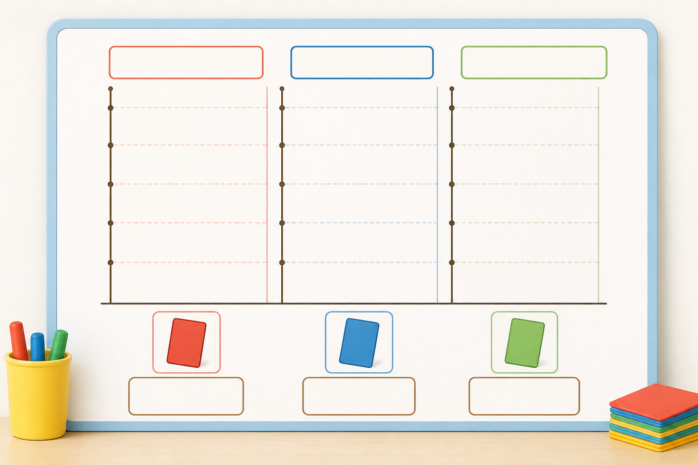

- Status: `generated`
- Grade/family: `P1` / `time-data`
- Need/kind: `core` / `bar-chart`
- Prompt: 第151小组：班级统计红卡4张、蓝卡7张、绿卡7张，数量最多的是几张？

### pep-primary-p1-l-fi-152

Image pending: `candidates/P1/time-data/pep-primary-p1-l-fi-152.png`

- Status: `missing`
- Grade/family: `P1` / `time-data`
- Need/kind: `core` / `bar-chart`
- Prompt: 第152小组：班级统计红卡5张、蓝卡9张、绿卡5张，数量最多的是几张？

### pep-primary-p1-l-fi-153

Image pending: `candidates/P1/time-data/pep-primary-p1-l-fi-153.png`

- Status: `missing`
- Grade/family: `P1` / `time-data`
- Need/kind: `core` / `bar-chart`
- Prompt: 第153小组：班级统计红卡6张、蓝卡5张、绿卡8张，数量最多的是几张？

### pep-primary-p1-l-fi-154

Image pending: `candidates/P1/time-data/pep-primary-p1-l-fi-154.png`

- Status: `missing`
- Grade/family: `P1` / `time-data`
- Need/kind: `core` / `bar-chart`
- Prompt: 第154小组：班级统计红卡7张、蓝卡7张、绿卡6张，数量最多的是几张？

### pep-primary-p1-l-fi-155

Image pending: `candidates/P1/time-data/pep-primary-p1-l-fi-155.png`

- Status: `missing`
- Grade/family: `P1` / `time-data`
- Need/kind: `core` / `bar-chart`
- Prompt: 第155小组：班级统计红卡3张、蓝卡9张、绿卡4张，数量最多的是几张？

### pep-primary-p1-l-fi-156

Image pending: `candidates/P1/time-data/pep-primary-p1-l-fi-156.png`

- Status: `missing`
- Grade/family: `P1` / `time-data`
- Need/kind: `core` / `bar-chart`
- Prompt: 第156小组：班级统计红卡4张、蓝卡5张、绿卡7张，数量最多的是几张？

### pep-primary-p1-l-fi-157

Image pending: `candidates/P1/time-data/pep-primary-p1-l-fi-157.png`

- Status: `missing`
- Grade/family: `P1` / `time-data`
- Need/kind: `core` / `bar-chart`
- Prompt: 第157小组：班级统计红卡5张、蓝卡7张、绿卡5张，数量最多的是几张？

### pep-primary-p1-l-fi-158

Image pending: `candidates/P1/time-data/pep-primary-p1-l-fi-158.png`

- Status: `missing`
- Grade/family: `P1` / `time-data`
- Need/kind: `core` / `bar-chart`
- Prompt: 第158小组：班级统计红卡6张、蓝卡9张、绿卡8张，数量最多的是几张？

### pep-primary-p1-l-fi-159

Image pending: `candidates/P1/time-data/pep-primary-p1-l-fi-159.png`

- Status: `missing`
- Grade/family: `P1` / `time-data`
- Need/kind: `core` / `bar-chart`
- Prompt: 第159小组：班级统计红卡7张、蓝卡5张、绿卡6张，数量最多的是几张？

### pep-primary-p1-l-fi-160

Image pending: `candidates/P1/time-data/pep-primary-p1-l-fi-160.png`

- Status: `missing`
- Grade/family: `P1` / `time-data`
- Need/kind: `core` / `bar-chart`
- Prompt: 第160小组：班级统计红卡3张、蓝卡7张、绿卡4张，数量最多的是几张？

### pep-primary-p1-l-fi-161

Image pending: `candidates/P1/time-data/pep-primary-p1-l-fi-161.png`

- Status: `missing`
- Grade/family: `P1` / `time-data`
- Need/kind: `core` / `bar-chart`
- Prompt: 第161小组：班级统计红卡4张、蓝卡9张、绿卡7张，数量最多的是几张？

### pep-primary-p1-l-fi-162

Image pending: `candidates/P1/time-data/pep-primary-p1-l-fi-162.png`

- Status: `missing`
- Grade/family: `P1` / `time-data`
- Need/kind: `core` / `bar-chart`
- Prompt: 第162小组：班级统计红卡5张、蓝卡5张、绿卡5张，数量最多的是几张？

### pep-primary-p1-l-fi-163

Image pending: `candidates/P1/time-data/pep-primary-p1-l-fi-163.png`

- Status: `missing`
- Grade/family: `P1` / `time-data`
- Need/kind: `core` / `bar-chart`
- Prompt: 第163小组：班级统计红卡6张、蓝卡7张、绿卡8张，数量最多的是几张？

### pep-primary-p1-l-fi-164

Image pending: `candidates/P1/time-data/pep-primary-p1-l-fi-164.png`

- Status: `missing`
- Grade/family: `P1` / `time-data`
- Need/kind: `core` / `bar-chart`
- Prompt: 第164小组：班级统计红卡7张、蓝卡9张、绿卡6张，数量最多的是几张？

### pep-primary-p1-l-fi-165

Image pending: `candidates/P1/time-data/pep-primary-p1-l-fi-165.png`

- Status: `missing`
- Grade/family: `P1` / `time-data`
- Need/kind: `core` / `bar-chart`
- Prompt: 第165小组：班级统计红卡3张、蓝卡5张、绿卡4张，数量最多的是几张？

### pep-primary-p1-l-fi-166

Image pending: `candidates/P1/time-data/pep-primary-p1-l-fi-166.png`

- Status: `missing`
- Grade/family: `P1` / `time-data`
- Need/kind: `core` / `bar-chart`
- Prompt: 第166小组：班级统计红卡4张、蓝卡7张、绿卡7张，数量最多的是几张？

### pep-primary-p1-l-fi-167

Image pending: `candidates/P1/time-data/pep-primary-p1-l-fi-167.png`

- Status: `missing`
- Grade/family: `P1` / `time-data`
- Need/kind: `core` / `bar-chart`
- Prompt: 第167小组：班级统计红卡5张、蓝卡9张、绿卡5张，数量最多的是几张？

### pep-primary-p1-l-fi-168

Image pending: `candidates/P1/time-data/pep-primary-p1-l-fi-168.png`

- Status: `missing`
- Grade/family: `P1` / `time-data`
- Need/kind: `core` / `bar-chart`
- Prompt: 第168小组：班级统计红卡6张、蓝卡5张、绿卡8张，数量最多的是几张？

### pep-primary-p1-l-fi-169

Image pending: `candidates/P1/time-data/pep-primary-p1-l-fi-169.png`

- Status: `missing`
- Grade/family: `P1` / `time-data`
- Need/kind: `core` / `bar-chart`
- Prompt: 第169小组：班级统计红卡7张、蓝卡7张、绿卡6张，数量最多的是几张？

### pep-primary-p1-l-fi-170

Image pending: `candidates/P1/time-data/pep-primary-p1-l-fi-170.png`

- Status: `missing`
- Grade/family: `P1` / `time-data`
- Need/kind: `core` / `bar-chart`
- Prompt: 活动表上写着三组人数分别是8人、6人、9人，哪一个数量最大？

### pep-primary-p1-l-sa-171

Image pending: `candidates/P1/time-data/pep-primary-p1-l-sa-171.png`

- Status: `missing`
- Grade/family: `P1` / `time-data`
- Need/kind: `core` / `bar-chart`
- Prompt: 图书角统计红色5个、蓝色9个、绿色8个，最多的是几个？

### pep-primary-p1-l-sa-172

Image pending: `candidates/P1/time-data/pep-primary-p1-l-sa-172.png`

- Status: `missing`
- Grade/family: `P1` / `time-data`
- Need/kind: `core` / `bar-chart`
- Prompt: 小辰整理三类卡片：甲类7个、乙类6个、丙类7个。最大数量是多少？

### pep-primary-p1-l-sa-173

Image pending: `candidates/P1/time-data/pep-primary-p1-l-sa-173.png`

- Status: `missing`
- Grade/family: `P1` / `time-data`
- Need/kind: `core` / `bar-chart`
- Prompt: 活动表上写着三组人数分别是4人、9人、6人，哪一个数量最大？

### pep-primary-p1-l-sa-174

Image pending: `candidates/P1/time-data/pep-primary-p1-l-sa-174.png`

- Status: `missing`
- Grade/family: `P1` / `time-data`
- Need/kind: `core` / `bar-chart`
- Prompt: 第174小组：班级统计红卡7张、蓝卡5张、绿卡6张，数量最多的是几张？

### pep-primary-p1-l-sa-175

Image pending: `candidates/P1/time-data/pep-primary-p1-l-sa-175.png`

- Status: `missing`
- Grade/family: `P1` / `time-data`
- Need/kind: `core` / `bar-chart`
- Prompt: 第175小组：班级统计红卡3张、蓝卡7张、绿卡4张，数量最多的是几张？

### pep-primary-p1-l-sa-176

Image pending: `candidates/P1/time-data/pep-primary-p1-l-sa-176.png`

- Status: `missing`
- Grade/family: `P1` / `time-data`
- Need/kind: `core` / `bar-chart`
- Prompt: 第176小组：班级统计红卡4张、蓝卡9张、绿卡7张，数量最多的是几张？

### pep-primary-p1-l-sa-177

Image pending: `candidates/P1/time-data/pep-primary-p1-l-sa-177.png`

- Status: `missing`
- Grade/family: `P1` / `time-data`
- Need/kind: `core` / `bar-chart`
- Prompt: 第177小组：班级统计红卡5张、蓝卡5张、绿卡5张，数量最多的是几张？

### pep-primary-p1-l-sa-178

Image pending: `candidates/P1/time-data/pep-primary-p1-l-sa-178.png`

- Status: `missing`
- Grade/family: `P1` / `time-data`
- Need/kind: `core` / `bar-chart`
- Prompt: 第178小组：班级统计红卡6张、蓝卡7张、绿卡8张，数量最多的是几张？

### pep-primary-p1-l-sa-179

Image pending: `candidates/P1/time-data/pep-primary-p1-l-sa-179.png`

- Status: `missing`
- Grade/family: `P1` / `time-data`
- Need/kind: `core` / `bar-chart`
- Prompt: 第179小组：班级统计红卡7张、蓝卡9张、绿卡6张，数量最多的是几张？

### pep-primary-p1-l-sa-180

Image pending: `candidates/P1/time-data/pep-primary-p1-l-sa-180.png`

- Status: `missing`
- Grade/family: `P1` / `time-data`
- Need/kind: `core` / `bar-chart`
- Prompt: 第180小组：班级统计红卡3张、蓝卡5张、绿卡4张，数量最多的是几张？

### pep-primary-p1-l-sa-181

Image pending: `candidates/P1/time-data/pep-primary-p1-l-sa-181.png`

- Status: `missing`
- Grade/family: `P1` / `time-data`
- Need/kind: `core` / `bar-chart`
- Prompt: 种植区统计红色8个、蓝色8个、绿色6个，最多的是几个？

### pep-primary-p1-l-sa-182

Image pending: `candidates/P1/time-data/pep-primary-p1-l-sa-182.png`

- Status: `missing`
- Grade/family: `P1` / `time-data`
- Need/kind: `core` / `bar-chart`
- Prompt: 第182小组：班级统计红卡5张、蓝卡9张、绿卡5张，数量最多的是几张？

### pep-primary-p1-l-sa-183

Image pending: `candidates/P1/time-data/pep-primary-p1-l-sa-183.png`

- Status: `missing`
- Grade/family: `P1` / `time-data`
- Need/kind: `core` / `bar-chart`
- Prompt: 第183小组：班级统计红卡6张、蓝卡5张、绿卡8张，数量最多的是几张？

### pep-primary-p1-l-sa-184

Image pending: `candidates/P1/time-data/pep-primary-p1-l-sa-184.png`

- Status: `missing`
- Grade/family: `P1` / `time-data`
- Need/kind: `core` / `bar-chart`
- Prompt: 第184小组：班级统计红卡7张、蓝卡7张、绿卡6张，数量最多的是几张？

### pep-primary-p1-l-sa-185

Image pending: `candidates/P1/time-data/pep-primary-p1-l-sa-185.png`

- Status: `missing`
- Grade/family: `P1` / `time-data`
- Need/kind: `core` / `bar-chart`
- Prompt: 第185小组：班级统计红卡3张、蓝卡9张、绿卡4张，数量最多的是几张？

### pep-primary-p1-l-sa-186

Image pending: `candidates/P1/time-data/pep-primary-p1-l-sa-186.png`

- Status: `missing`
- Grade/family: `P1` / `time-data`
- Need/kind: `core` / `bar-chart`
- Prompt: 第186小组：班级统计红卡4张、蓝卡5张、绿卡7张，数量最多的是几张？

### pep-primary-p1-l-sa-187

Image pending: `candidates/P1/time-data/pep-primary-p1-l-sa-187.png`

- Status: `missing`
- Grade/family: `P1` / `time-data`
- Need/kind: `core` / `bar-chart`
- Prompt: 第187小组：班级统计红卡5张、蓝卡7张、绿卡5张，数量最多的是几张？

### pep-primary-p1-l-sa-188

Image pending: `candidates/P1/time-data/pep-primary-p1-l-sa-188.png`

- Status: `missing`
- Grade/family: `P1` / `time-data`
- Need/kind: `core` / `bar-chart`
- Prompt: 第188小组：班级统计红卡6张、蓝卡9张、绿卡8张，数量最多的是几张？

### pep-primary-p1-l-sa-189

Image pending: `candidates/P1/time-data/pep-primary-p1-l-sa-189.png`

- Status: `missing`
- Grade/family: `P1` / `time-data`
- Need/kind: `core` / `bar-chart`
- Prompt: 第189小组：班级统计红卡7张、蓝卡5张、绿卡6张，数量最多的是几张？

### pep-primary-p1-l-sa-190

Image pending: `candidates/P1/time-data/pep-primary-p1-l-sa-190.png`

- Status: `missing`
- Grade/family: `P1` / `time-data`
- Need/kind: `core` / `bar-chart`
- Prompt: 第190小组：班级统计红卡3张、蓝卡7张、绿卡4张，数量最多的是几张？

### pep-primary-p1-l-sa-191

Image pending: `candidates/P1/time-data/pep-primary-p1-l-sa-191.png`

- Status: `missing`
- Grade/family: `P1` / `time-data`
- Need/kind: `core` / `bar-chart`
- Prompt: 安安整理三类积木：甲类4个、乙类11个、丙类7个。最大数量是多少？

### pep-primary-p1-l-sa-192

Image pending: `candidates/P1/time-data/pep-primary-p1-l-sa-192.png`

- Status: `missing`
- Grade/family: `P1` / `time-data`
- Need/kind: `core` / `bar-chart`
- Prompt: 第192小组：班级统计红卡5张、蓝卡5张、绿卡5张，数量最多的是几张？

### pep-primary-p1-l-sa-193

Image pending: `candidates/P1/time-data/pep-primary-p1-l-sa-193.png`

- Status: `missing`
- Grade/family: `P1` / `time-data`
- Need/kind: `core` / `bar-chart`
- Prompt: 第193小组：班级统计红卡6张、蓝卡7张、绿卡8张，数量最多的是几张？

### pep-primary-p1-l-sa-194

Image pending: `candidates/P1/time-data/pep-primary-p1-l-sa-194.png`

- Status: `missing`
- Grade/family: `P1` / `time-data`
- Need/kind: `core` / `bar-chart`
- Prompt: 第194小组：班级统计红卡7张、蓝卡9张、绿卡6张，数量最多的是几张？

### pep-primary-p1-l-sa-195

Image pending: `candidates/P1/time-data/pep-primary-p1-l-sa-195.png`

- Status: `missing`
- Grade/family: `P1` / `time-data`
- Need/kind: `core` / `bar-chart`
- Prompt: 第195小组：班级统计红卡3张、蓝卡5张、绿卡4张，数量最多的是几张？

### pep-primary-p1-l-sa-196

Image pending: `candidates/P1/time-data/pep-primary-p1-l-sa-196.png`

- Status: `missing`
- Grade/family: `P1` / `time-data`
- Need/kind: `core` / `bar-chart`
- Prompt: 第196小组：班级统计红卡4张、蓝卡7张、绿卡7张，数量最多的是几张？

### pep-primary-p1-l-sa-197

Image pending: `candidates/P1/time-data/pep-primary-p1-l-sa-197.png`

- Status: `missing`
- Grade/family: `P1` / `time-data`
- Need/kind: `core` / `bar-chart`
- Prompt: 第197小组：班级统计红卡5张、蓝卡9张、绿卡5张，数量最多的是几张？

### pep-primary-p1-l-sa-198

Image pending: `candidates/P1/time-data/pep-primary-p1-l-sa-198.png`

- Status: `missing`
- Grade/family: `P1` / `time-data`
- Need/kind: `core` / `bar-chart`
- Prompt: 第198小组：班级统计红卡6张、蓝卡5张、绿卡8张，数量最多的是几张？

### pep-primary-p1-l-sa-199

Image pending: `candidates/P1/time-data/pep-primary-p1-l-sa-199.png`

- Status: `missing`
- Grade/family: `P1` / `time-data`
- Need/kind: `core` / `bar-chart`
- Prompt: 第199小组：班级统计红卡7张、蓝卡7张、绿卡6张，数量最多的是几张？

### pep-primary-p1-l-sa-200

Image pending: `candidates/P1/time-data/pep-primary-p1-l-sa-200.png`

- Status: `missing`
- Grade/family: `P1` / `time-data`
- Need/kind: `core` / `bar-chart`
- Prompt: 活动表上写着三组人数分别是4人、6人、5人，哪一个数量最大？

## P2 / multiplication

### pep-primary-p2-u-mc-001

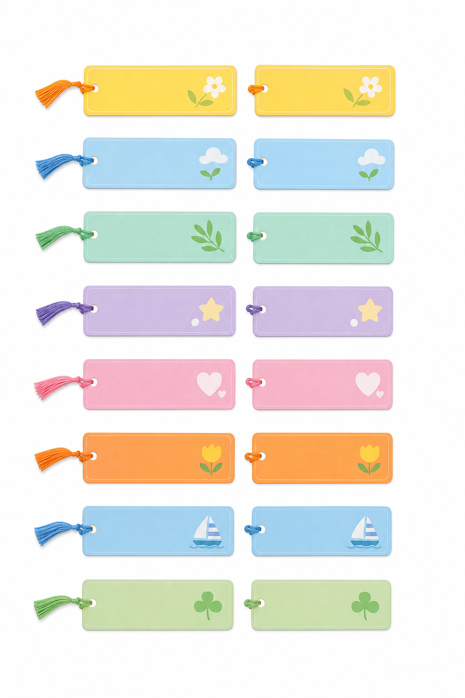

- Status: `generated`
- Grade/family: `P2` / `multiplication`
- Need/kind: `core` / `array`
- Prompt: 晨晨摆了8行书签，每行2个，一共有多少个？

### pep-primary-p2-u-mc-002

Image pending: `candidates/P2/multiplication/pep-primary-p2-u-mc-002.png`

- Status: `missing`
- Grade/family: `P2` / `multiplication`
- Need/kind: `core` / `array`
- Prompt: 科学桌有2个托盘，每个托盘放6个模型，一共放了多少个模型？

### pep-primary-p2-u-mc-003

Image pending: `candidates/P2/multiplication/pep-primary-p2-u-mc-003.png`

- Status: `missing`
- Grade/family: `P2` / `multiplication`
- Need/kind: `core` / `array`
- Prompt: 手工课分成4组，每组做2个作品，一共做多少个作品？

### pep-primary-p2-u-mc-004

Image pending: `candidates/P2/multiplication/pep-primary-p2-u-mc-004.png`

- Status: `missing`
- Grade/family: `P2` / `multiplication`
- Need/kind: `core` / `array`
- Prompt: 第4小组：有6组，每组6个，一共有多少个？

### pep-primary-p2-u-mc-005

Image pending: `candidates/P2/multiplication/pep-primary-p2-u-mc-005.png`

- Status: `missing`
- Grade/family: `P2` / `multiplication`
- Need/kind: `core` / `array`
- Prompt: 第5小组：有7组，每组9个，一共有多少个？

### pep-primary-p2-u-mc-006

Image pending: `candidates/P2/multiplication/pep-primary-p2-u-mc-006.png`

- Status: `missing`
- Grade/family: `P2` / `multiplication`
- Need/kind: `core` / `array`
- Prompt: 第6小组：有8组，每组4个，一共有多少个？

### pep-primary-p2-u-mc-007

Image pending: `candidates/P2/multiplication/pep-primary-p2-u-mc-007.png`

- Status: `missing`
- Grade/family: `P2` / `multiplication`
- Need/kind: `core` / `array`
- Prompt: 第7小组：有9组，每组7个，一共有多少个？

### pep-primary-p2-u-mc-008

Image pending: `candidates/P2/multiplication/pep-primary-p2-u-mc-008.png`

- Status: `missing`
- Grade/family: `P2` / `multiplication`
- Need/kind: `core` / `array`
- Prompt: 第8小组：有2组，每组2个，一共有多少个？

### pep-primary-p2-u-mc-009

Image pending: `candidates/P2/multiplication/pep-primary-p2-u-mc-009.png`

- Status: `missing`
- Grade/family: `P2` / `multiplication`
- Need/kind: `core` / `array`
- Prompt: 第9小组：有3组，每组5个，一共有多少个？

### pep-primary-p2-u-mc-010

Image pending: `candidates/P2/multiplication/pep-primary-p2-u-mc-010.png`

- Status: `missing`
- Grade/family: `P2` / `multiplication`
- Need/kind: `core` / `array`
- Prompt: 第10小组：有4组，每组8个，一共有多少个？

### pep-primary-p2-u-mc-011

Image pending: `candidates/P2/multiplication/pep-primary-p2-u-mc-011.png`

- Status: `missing`
- Grade/family: `P2` / `multiplication`
- Need/kind: `core` / `array`
- Prompt: 第11小组：有5组，每组3个，一共有多少个？

### pep-primary-p2-u-mc-012

Image pending: `candidates/P2/multiplication/pep-primary-p2-u-mc-012.png`

- Status: `missing`
- Grade/family: `P2` / `multiplication`
- Need/kind: `core` / `array`
- Prompt: 第12小组：有6组，每组6个，一共有多少个？

### pep-primary-p2-u-mc-013

Image pending: `candidates/P2/multiplication/pep-primary-p2-u-mc-013.png`

- Status: `missing`
- Grade/family: `P2` / `multiplication`
- Need/kind: `core` / `array`
- Prompt: 第13小组：有7组，每组9个，一共有多少个？

### pep-primary-p2-u-mc-014

Image pending: `candidates/P2/multiplication/pep-primary-p2-u-mc-014.png`

- Status: `missing`
- Grade/family: `P2` / `multiplication`
- Need/kind: `core` / `array`
- Prompt: 第14小组：有8组，每组4个，一共有多少个？

### pep-primary-p2-u-mc-015

Image pending: `candidates/P2/multiplication/pep-primary-p2-u-mc-015.png`

- Status: `missing`
- Grade/family: `P2` / `multiplication`
- Need/kind: `core` / `array`
- Prompt: 第15小组：有9组，每组7个，一共有多少个？

### pep-primary-p2-u-mc-016

Image pending: `candidates/P2/multiplication/pep-primary-p2-u-mc-016.png`

- Status: `missing`
- Grade/family: `P2` / `multiplication`
- Need/kind: `core` / `array`
- Prompt: 第16小组：有2组，每组2个，一共有多少个？

### pep-primary-p2-u-mc-017

Image pending: `candidates/P2/multiplication/pep-primary-p2-u-mc-017.png`

- Status: `missing`
- Grade/family: `P2` / `multiplication`
- Need/kind: `core` / `array`
- Prompt: 第17小组：有3组，每组5个，一共有多少个？

### pep-primary-p2-u-mc-018

Image pending: `candidates/P2/multiplication/pep-primary-p2-u-mc-018.png`

- Status: `missing`
- Grade/family: `P2` / `multiplication`
- Need/kind: `core` / `array`
- Prompt: 第18小组：有4组，每组8个，一共有多少个？

### pep-primary-p2-u-mc-019

Image pending: `candidates/P2/multiplication/pep-primary-p2-u-mc-019.png`

- Status: `missing`
- Grade/family: `P2` / `multiplication`
- Need/kind: `core` / `array`
- Prompt: 第19小组：有5组，每组3个，一共有多少个？

### pep-primary-p2-u-mc-020

Image pending: `candidates/P2/multiplication/pep-primary-p2-u-mc-020.png`

- Status: `missing`
- Grade/family: `P2` / `multiplication`
- Need/kind: `core` / `array`
- Prompt: 第20小组：有6组，每组6个，一共有多少个？

### pep-primary-p2-u-mc-021

Image pending: `candidates/P2/multiplication/pep-primary-p2-u-mc-021.png`

- Status: `missing`
- Grade/family: `P2` / `multiplication`
- Need/kind: `core` / `array`
- Prompt: 第21小组：有7组，每组9个，一共有多少个？

### pep-primary-p2-u-mc-022

Image pending: `candidates/P2/multiplication/pep-primary-p2-u-mc-022.png`

- Status: `missing`
- Grade/family: `P2` / `multiplication`
- Need/kind: `core` / `array`
- Prompt: 第22小组：有8组，每组4个，一共有多少个？

### pep-primary-p2-u-mc-023

Image pending: `candidates/P2/multiplication/pep-primary-p2-u-mc-023.png`

- Status: `missing`
- Grade/family: `P2` / `multiplication`
- Need/kind: `core` / `array`
- Prompt: 第23小组：有9组，每组7个，一共有多少个？

### pep-primary-p2-u-mc-024

Image pending: `candidates/P2/multiplication/pep-primary-p2-u-mc-024.png`

- Status: `missing`
- Grade/family: `P2` / `multiplication`
- Need/kind: `core` / `array`
- Prompt: 第24小组：有2组，每组2个，一共有多少个？

### pep-primary-p2-u-mc-025

Image pending: `candidates/P2/multiplication/pep-primary-p2-u-mc-025.png`

- Status: `missing`
- Grade/family: `P2` / `multiplication`
- Need/kind: `core` / `array`
- Prompt: 第25小组：有3组，每组5个，一共有多少个？

### pep-primary-p2-u-mc-026

Image pending: `candidates/P2/multiplication/pep-primary-p2-u-mc-026.png`

- Status: `missing`
- Grade/family: `P2` / `multiplication`
- Need/kind: `core` / `array`
- Prompt: 第26小组：有4组，每组8个，一共有多少个？

### pep-primary-p2-u-mc-027

Image pending: `candidates/P2/multiplication/pep-primary-p2-u-mc-027.png`

- Status: `missing`
- Grade/family: `P2` / `multiplication`
- Need/kind: `core` / `array`
- Prompt: 第27小组：有5组，每组3个，一共有多少个？

### pep-primary-p2-u-mc-028

Image pending: `candidates/P2/multiplication/pep-primary-p2-u-mc-028.png`

- Status: `missing`
- Grade/family: `P2` / `multiplication`
- Need/kind: `core` / `array`
- Prompt: 第28小组：有6组，每组6个，一共有多少个？

### pep-primary-p2-u-mc-029

Image pending: `candidates/P2/multiplication/pep-primary-p2-u-mc-029.png`

- Status: `missing`
- Grade/family: `P2` / `multiplication`
- Need/kind: `core` / `array`
- Prompt: 第29小组：有7组，每组9个，一共有多少个？

### pep-primary-p2-u-mc-030

Image pending: `candidates/P2/multiplication/pep-primary-p2-u-mc-030.png`

- Status: `missing`
- Grade/family: `P2` / `multiplication`
- Need/kind: `core` / `array`
- Prompt: 第30小组：有8组，每组4个，一共有多少个？

### pep-primary-p2-u-mc-031

Image pending: `candidates/P2/multiplication/pep-primary-p2-u-mc-031.png`

- Status: `missing`
- Grade/family: `P2` / `multiplication`
- Need/kind: `core` / `array`
- Prompt: 小林摆了9行纸条，每行7个，一共有多少个？

### pep-primary-p2-u-mc-032

Image pending: `candidates/P2/multiplication/pep-primary-p2-u-mc-032.png`

- Status: `missing`
- Grade/family: `P2` / `multiplication`
- Need/kind: `core` / `array`
- Prompt: 第32小组：有2组，每组2个，一共有多少个？

### pep-primary-p2-u-mc-033

Image pending: `candidates/P2/multiplication/pep-primary-p2-u-mc-033.png`

- Status: `missing`
- Grade/family: `P2` / `multiplication`
- Need/kind: `core` / `array`
- Prompt: 第33小组：有3组，每组5个，一共有多少个？

### pep-primary-p2-u-mc-034

Image pending: `candidates/P2/multiplication/pep-primary-p2-u-mc-034.png`

- Status: `missing`
- Grade/family: `P2` / `multiplication`
- Need/kind: `core` / `array`
- Prompt: 第34小组：有4组，每组8个，一共有多少个？

### pep-primary-p2-u-mc-035

Image pending: `candidates/P2/multiplication/pep-primary-p2-u-mc-035.png`

- Status: `missing`
- Grade/family: `P2` / `multiplication`
- Need/kind: `core` / `array`
- Prompt: 第35小组：有5组，每组3个，一共有多少个？

### pep-primary-p2-u-mc-036

Image pending: `candidates/P2/multiplication/pep-primary-p2-u-mc-036.png`

- Status: `missing`
- Grade/family: `P2` / `multiplication`
- Need/kind: `core` / `array`
- Prompt: 第36小组：有6组，每组6个，一共有多少个？

### pep-primary-p2-u-mc-037

Image pending: `candidates/P2/multiplication/pep-primary-p2-u-mc-037.png`

- Status: `missing`
- Grade/family: `P2` / `multiplication`
- Need/kind: `core` / `array`
- Prompt: 第37小组：有7组，每组9个，一共有多少个？

### pep-primary-p2-u-mc-038

Image pending: `candidates/P2/multiplication/pep-primary-p2-u-mc-038.png`

- Status: `missing`
- Grade/family: `P2` / `multiplication`
- Need/kind: `core` / `array`
- Prompt: 第38小组：有8组，每组4个，一共有多少个？

### pep-primary-p2-u-mc-039

Image pending: `candidates/P2/multiplication/pep-primary-p2-u-mc-039.png`

- Status: `missing`
- Grade/family: `P2` / `multiplication`
- Need/kind: `core` / `array`
- Prompt: 第39小组：有9组，每组7个，一共有多少个？

### pep-primary-p2-u-mc-040

Image pending: `candidates/P2/multiplication/pep-primary-p2-u-mc-040.png`

- Status: `missing`
- Grade/family: `P2` / `multiplication`
- Need/kind: `core` / `array`
- Prompt: 第40小组：有2组，每组2个，一共有多少个？

### pep-primary-p2-u-mc-041

Image pending: `candidates/P2/multiplication/pep-primary-p2-u-mc-041.png`

- Status: `missing`
- Grade/family: `P2` / `multiplication`
- Need/kind: `core` / `array`
- Prompt: 第41小组：有3组，每组5个，一共有多少个？

### pep-primary-p2-u-mc-042

Image pending: `candidates/P2/multiplication/pep-primary-p2-u-mc-042.png`

- Status: `missing`
- Grade/family: `P2` / `multiplication`
- Need/kind: `core` / `array`
- Prompt: 第42小组：有4组，每组8个，一共有多少个？

### pep-primary-p2-u-mc-043

Image pending: `candidates/P2/multiplication/pep-primary-p2-u-mc-043.png`

- Status: `missing`
- Grade/family: `P2` / `multiplication`
- Need/kind: `core` / `array`
- Prompt: 第43小组：有5组，每组3个，一共有多少个？

### pep-primary-p2-u-mc-044

Image pending: `candidates/P2/multiplication/pep-primary-p2-u-mc-044.png`

- Status: `missing`
- Grade/family: `P2` / `multiplication`
- Need/kind: `core` / `array`
- Prompt: 第44小组：有6组，每组6个，一共有多少个？

### pep-primary-p2-u-mc-045

Image pending: `candidates/P2/multiplication/pep-primary-p2-u-mc-045.png`

- Status: `missing`
- Grade/family: `P2` / `multiplication`
- Need/kind: `core` / `array`
- Prompt: 第45小组：有7组，每组9个，一共有多少个？

### pep-primary-p2-u-mc-046

Image pending: `candidates/P2/multiplication/pep-primary-p2-u-mc-046.png`

- Status: `missing`
- Grade/family: `P2` / `multiplication`
- Need/kind: `core` / `array`
- Prompt: 第46小组：有8组，每组4个，一共有多少个？

### pep-primary-p2-u-mc-047

Image pending: `candidates/P2/multiplication/pep-primary-p2-u-mc-047.png`

- Status: `missing`
- Grade/family: `P2` / `multiplication`
- Need/kind: `core` / `array`
- Prompt: 第47小组：有9组，每组7个，一共有多少个？

### pep-primary-p2-u-mc-048

Image pending: `candidates/P2/multiplication/pep-primary-p2-u-mc-048.png`

- Status: `missing`
- Grade/family: `P2` / `multiplication`
- Need/kind: `core` / `array`
- Prompt: 第48小组：有2组，每组2个，一共有多少个？

### pep-primary-p2-u-mc-049

Image pending: `candidates/P2/multiplication/pep-primary-p2-u-mc-049.png`

- Status: `missing`
- Grade/family: `P2` / `multiplication`
- Need/kind: `core` / `array`
- Prompt: 第49小组：有3组，每组5个，一共有多少个？

### pep-primary-p2-u-mc-050

Image pending: `candidates/P2/multiplication/pep-primary-p2-u-mc-050.png`

- Status: `missing`
- Grade/family: `P2` / `multiplication`
- Need/kind: `core` / `array`
- Prompt: 第50小组：有4组，每组8个，一共有多少个？

## P2 / measurement-geometry

### pep-primary-p2-u-fi-091

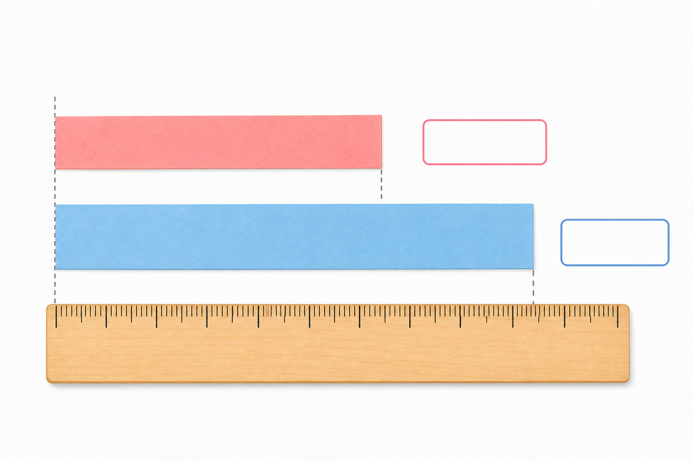

- Status: `generated`
- Grade/family: `P2` / `measurement-geometry`
- Need/kind: `core` / `ruler`
- Prompt: 乐乐量到一条纸带长23厘米，另一条比它长16厘米。另一条长多少厘米？

### pep-primary-p2-u-fi-092

Image pending: `candidates/P2/measurement-geometry/pep-primary-p2-u-fi-092.png`

- Status: `missing`
- Grade/family: `P2` / `measurement-geometry`
- Need/kind: `core` / `ruler`
- Prompt: 运动场有一根绳子长28厘米，新绳子比它长6厘米，新绳子长多少厘米？

### pep-primary-p2-u-fi-093

Image pending: `candidates/P2/measurement-geometry/pep-primary-p2-u-fi-093.png`

- Status: `missing`
- Grade/family: `P2` / `measurement-geometry`
- Need/kind: `core` / `ruler`
- Prompt: 手工桌上的蓝条长33厘米，红条比蓝条长8厘米。红条长多少厘米？

### pep-primary-p2-u-fi-094

Image pending: `candidates/P2/measurement-geometry/pep-primary-p2-u-fi-094.png`

- Status: `missing`
- Grade/family: `P2` / `measurement-geometry`
- Need/kind: `core` / `ruler`
- Prompt: 浩浩量到一条纸带长38厘米，另一条比它长10厘米。另一条长多少厘米？

### pep-primary-p2-u-fi-095

Image pending: `candidates/P2/measurement-geometry/pep-primary-p2-u-fi-095.png`

- Status: `missing`
- Grade/family: `P2` / `measurement-geometry`
- Need/kind: `core` / `ruler`
- Prompt: 第95小组：一根彩带长50厘米，另一根比它长16厘米。另一根长多少厘米？

### pep-primary-p2-u-fi-096

Image pending: `candidates/P2/measurement-geometry/pep-primary-p2-u-fi-096.png`

- Status: `missing`
- Grade/family: `P2` / `measurement-geometry`
- Need/kind: `core` / `ruler`
- Prompt: 第96小组：一根彩带长54厘米，另一根比它长5厘米。另一根长多少厘米？

### pep-primary-p2-u-fi-097

Image pending: `candidates/P2/measurement-geometry/pep-primary-p2-u-fi-097.png`

- Status: `missing`
- Grade/family: `P2` / `measurement-geometry`
- Need/kind: `core` / `ruler`
- Prompt: 图书角有一根绳子长51厘米，新绳子比它长14厘米，新绳子长多少厘米？

### pep-primary-p2-u-fi-098

Image pending: `candidates/P2/measurement-geometry/pep-primary-p2-u-fi-098.png`

- Status: `missing`
- Grade/family: `P2` / `measurement-geometry`
- Need/kind: `core` / `ruler`
- Prompt: 第98小组：一根彩带长62厘米，另一根比它长7厘米。另一根长多少厘米？

### pep-primary-p2-u-fi-099

Image pending: `candidates/P2/measurement-geometry/pep-primary-p2-u-fi-099.png`

- Status: `missing`
- Grade/family: `P2` / `measurement-geometry`
- Need/kind: `core` / `ruler`
- Prompt: 第99小组：一根彩带长66厘米，另一根比它长8厘米。另一根长多少厘米？

### pep-primary-p2-u-fi-100

Image pending: `candidates/P2/measurement-geometry/pep-primary-p2-u-fi-100.png`

- Status: `missing`
- Grade/family: `P2` / `measurement-geometry`
- Need/kind: `core` / `ruler`
- Prompt: 手工桌上的蓝条长64厘米，红条比蓝条长6厘米。红条长多少厘米？

### pep-primary-p2-u-mc-051

Image pending: `candidates/P2/measurement-geometry/pep-primary-p2-u-mc-051.png`

- Status: `missing`
- Grade/family: `P2` / `measurement-geometry`
- Need/kind: `core` / `ruler`
- Prompt: 第51小组：一根彩带长84厘米，另一根比它长8厘米。另一根长多少厘米？

### pep-primary-p2-u-mc-052

Image pending: `candidates/P2/measurement-geometry/pep-primary-p2-u-mc-052.png`

- Status: `missing`
- Grade/family: `P2` / `measurement-geometry`
- Need/kind: `core` / `ruler`
- Prompt: 第52小组：一根彩带长88厘米，另一根比它长9厘米。另一根长多少厘米？

### pep-primary-p2-u-mc-053

Image pending: `candidates/P2/measurement-geometry/pep-primary-p2-u-mc-053.png`

- Status: `missing`
- Grade/family: `P2` / `measurement-geometry`
- Need/kind: `core` / `ruler`
- Prompt: 第53小组：一根彩带长22厘米，另一根比它长10厘米。另一根长多少厘米？

### pep-primary-p2-u-mc-054

Image pending: `candidates/P2/measurement-geometry/pep-primary-p2-u-mc-054.png`

- Status: `missing`
- Grade/family: `P2` / `measurement-geometry`
- Need/kind: `core` / `ruler`
- Prompt: 第54小组：一根彩带长26厘米，另一根比它长11厘米。另一根长多少厘米？

### pep-primary-p2-u-mc-055

Image pending: `candidates/P2/measurement-geometry/pep-primary-p2-u-mc-055.png`

- Status: `missing`
- Grade/family: `P2` / `measurement-geometry`
- Need/kind: `core` / `ruler`
- Prompt: 第55小组：一根彩带长30厘米，另一根比它长12厘米。另一根长多少厘米？

### pep-primary-p2-u-mc-056

Image pending: `candidates/P2/measurement-geometry/pep-primary-p2-u-mc-056.png`

- Status: `missing`
- Grade/family: `P2` / `measurement-geometry`
- Need/kind: `core` / `ruler`
- Prompt: 第56小组：一根彩带长34厘米，另一根比它长13厘米。另一根长多少厘米？

### pep-primary-p2-u-mc-057

Image pending: `candidates/P2/measurement-geometry/pep-primary-p2-u-mc-057.png`

- Status: `missing`
- Grade/family: `P2` / `measurement-geometry`
- Need/kind: `core` / `ruler`
- Prompt: 第57小组：一根彩带长38厘米，另一根比它长14厘米。另一根长多少厘米？

### pep-primary-p2-u-mc-058

Image pending: `candidates/P2/measurement-geometry/pep-primary-p2-u-mc-058.png`

- Status: `missing`
- Grade/family: `P2` / `measurement-geometry`
- Need/kind: `core` / `ruler`
- Prompt: 第58小组：一根彩带长42厘米，另一根比它长15厘米。另一根长多少厘米？

### pep-primary-p2-u-mc-059

Image pending: `candidates/P2/measurement-geometry/pep-primary-p2-u-mc-059.png`

- Status: `missing`
- Grade/family: `P2` / `measurement-geometry`
- Need/kind: `core` / `ruler`
- Prompt: 第59小组：一根彩带长46厘米，另一根比它长16厘米。另一根长多少厘米？

### pep-primary-p2-u-mc-060

Image pending: `candidates/P2/measurement-geometry/pep-primary-p2-u-mc-060.png`

- Status: `missing`
- Grade/family: `P2` / `measurement-geometry`
- Need/kind: `core` / `ruler`
- Prompt: 第60小组：一根彩带长50厘米，另一根比它长5厘米。另一根长多少厘米？

### pep-primary-p2-u-mc-061

Image pending: `candidates/P2/measurement-geometry/pep-primary-p2-u-mc-061.png`

- Status: `missing`
- Grade/family: `P2` / `measurement-geometry`
- Need/kind: `core` / `ruler`
- Prompt: 美术柜有一根绳子长31厘米，新绳子比它长8厘米，新绳子长多少厘米？

### pep-primary-p2-u-mc-062

Image pending: `candidates/P2/measurement-geometry/pep-primary-p2-u-mc-062.png`

- Status: `missing`
- Grade/family: `P2` / `measurement-geometry`
- Need/kind: `core` / `ruler`
- Prompt: 第62小组：一根彩带长58厘米，另一根比它长7厘米。另一根长多少厘米？

### pep-primary-p2-u-mc-063

Image pending: `candidates/P2/measurement-geometry/pep-primary-p2-u-mc-063.png`

- Status: `missing`
- Grade/family: `P2` / `measurement-geometry`
- Need/kind: `core` / `ruler`
- Prompt: 第63小组：一根彩带长62厘米，另一根比它长8厘米。另一根长多少厘米？

### pep-primary-p2-u-mc-064

Image pending: `candidates/P2/measurement-geometry/pep-primary-p2-u-mc-064.png`

- Status: `missing`
- Grade/family: `P2` / `measurement-geometry`
- Need/kind: `core` / `ruler`
- Prompt: 第64小组：一根彩带长66厘米，另一根比它长9厘米。另一根长多少厘米？

### pep-primary-p2-u-mc-065

Image pending: `candidates/P2/measurement-geometry/pep-primary-p2-u-mc-065.png`

- Status: `missing`
- Grade/family: `P2` / `measurement-geometry`
- Need/kind: `core` / `ruler`
- Prompt: 第65小组：一根彩带长70厘米，另一根比它长10厘米。另一根长多少厘米？

### pep-primary-p2-u-mc-066

Image pending: `candidates/P2/measurement-geometry/pep-primary-p2-u-mc-066.png`

- Status: `missing`
- Grade/family: `P2` / `measurement-geometry`
- Need/kind: `core` / `ruler`
- Prompt: 第66小组：一根彩带长74厘米，另一根比它长11厘米。另一根长多少厘米？

### pep-primary-p2-u-mc-067

Image pending: `candidates/P2/measurement-geometry/pep-primary-p2-u-mc-067.png`

- Status: `missing`
- Grade/family: `P2` / `measurement-geometry`
- Need/kind: `core` / `ruler`
- Prompt: 第67小组：一根彩带长78厘米，另一根比它长12厘米。另一根长多少厘米？

### pep-primary-p2-u-mc-068

Image pending: `candidates/P2/measurement-geometry/pep-primary-p2-u-mc-068.png`

- Status: `missing`
- Grade/family: `P2` / `measurement-geometry`
- Need/kind: `core` / `ruler`
- Prompt: 第68小组：一根彩带长82厘米，另一根比它长13厘米。另一根长多少厘米？

### pep-primary-p2-u-mc-069

Image pending: `candidates/P2/measurement-geometry/pep-primary-p2-u-mc-069.png`

- Status: `missing`
- Grade/family: `P2` / `measurement-geometry`
- Need/kind: `core` / `ruler`
- Prompt: 第69小组：一根彩带长86厘米，另一根比它长14厘米。另一根长多少厘米？

### pep-primary-p2-u-mc-070

Image pending: `candidates/P2/measurement-geometry/pep-primary-p2-u-mc-070.png`

- Status: `missing`
- Grade/family: `P2` / `measurement-geometry`
- Need/kind: `core` / `ruler`
- Prompt: 第70小组：一根彩带长20厘米，另一根比它长15厘米。另一根长多少厘米？

### pep-primary-p2-u-mc-071

Image pending: `candidates/P2/measurement-geometry/pep-primary-p2-u-mc-071.png`

- Status: `missing`
- Grade/family: `P2` / `measurement-geometry`
- Need/kind: `core` / `ruler`
- Prompt: 第71小组：一根彩带长24厘米，另一根比它长16厘米。另一根长多少厘米？

### pep-primary-p2-u-mc-072

Image pending: `candidates/P2/measurement-geometry/pep-primary-p2-u-mc-072.png`

- Status: `missing`
- Grade/family: `P2` / `measurement-geometry`
- Need/kind: `core` / `ruler`
- Prompt: 第72小组：一根彩带长28厘米，另一根比它长5厘米。另一根长多少厘米？

### pep-primary-p2-u-mc-073

Image pending: `candidates/P2/measurement-geometry/pep-primary-p2-u-mc-073.png`

- Status: `missing`
- Grade/family: `P2` / `measurement-geometry`
- Need/kind: `core` / `ruler`
- Prompt: 第73小组：一根彩带长32厘米，另一根比它长6厘米。另一根长多少厘米？

### pep-primary-p2-u-mc-074

Image pending: `candidates/P2/measurement-geometry/pep-primary-p2-u-mc-074.png`

- Status: `missing`
- Grade/family: `P2` / `measurement-geometry`
- Need/kind: `core` / `ruler`
- Prompt: 第74小组：一根彩带长36厘米，另一根比它长7厘米。另一根长多少厘米？

### pep-primary-p2-u-mc-075

Image pending: `candidates/P2/measurement-geometry/pep-primary-p2-u-mc-075.png`

- Status: `missing`
- Grade/family: `P2` / `measurement-geometry`
- Need/kind: `core` / `ruler`
- Prompt: 第75小组：一根彩带长40厘米，另一根比它长8厘米。另一根长多少厘米？

### pep-primary-p2-u-mc-076

Image pending: `candidates/P2/measurement-geometry/pep-primary-p2-u-mc-076.png`

- Status: `missing`
- Grade/family: `P2` / `measurement-geometry`
- Need/kind: `core` / `ruler`
- Prompt: 第76小组：一根彩带长44厘米，另一根比它长9厘米。另一根长多少厘米？

### pep-primary-p2-u-mc-077

Image pending: `candidates/P2/measurement-geometry/pep-primary-p2-u-mc-077.png`

- Status: `missing`
- Grade/family: `P2` / `measurement-geometry`
- Need/kind: `core` / `ruler`
- Prompt: 第77小组：一根彩带长48厘米，另一根比它长10厘米。另一根长多少厘米？

### pep-primary-p2-u-mc-078

Image pending: `candidates/P2/measurement-geometry/pep-primary-p2-u-mc-078.png`

- Status: `missing`
- Grade/family: `P2` / `measurement-geometry`
- Need/kind: `core` / `ruler`
- Prompt: 第78小组：一根彩带长52厘米，另一根比它长11厘米。另一根长多少厘米？

### pep-primary-p2-u-mc-079

Image pending: `candidates/P2/measurement-geometry/pep-primary-p2-u-mc-079.png`

- Status: `missing`
- Grade/family: `P2` / `measurement-geometry`
- Need/kind: `core` / `ruler`
- Prompt: 第79小组：一根彩带长56厘米，另一根比它长12厘米。另一根长多少厘米？

### pep-primary-p2-u-mc-080

Image pending: `candidates/P2/measurement-geometry/pep-primary-p2-u-mc-080.png`

- Status: `missing`
- Grade/family: `P2` / `measurement-geometry`
- Need/kind: `core` / `ruler`
- Prompt: 第80小组：一根彩带长60厘米，另一根比它长13厘米。另一根长多少厘米？

### pep-primary-p2-u-mc-081

Image pending: `candidates/P2/measurement-geometry/pep-primary-p2-u-mc-081.png`

- Status: `missing`
- Grade/family: `P2` / `measurement-geometry`
- Need/kind: `core` / `ruler`
- Prompt: 第81小组：一根彩带长64厘米，另一根比它长14厘米。另一根长多少厘米？

### pep-primary-p2-u-mc-082

Image pending: `candidates/P2/measurement-geometry/pep-primary-p2-u-mc-082.png`

- Status: `missing`
- Grade/family: `P2` / `measurement-geometry`
- Need/kind: `core` / `ruler`
- Prompt: 第82小组：一根彩带长68厘米，另一根比它长15厘米。另一根长多少厘米？

### pep-primary-p2-u-mc-083

Image pending: `candidates/P2/measurement-geometry/pep-primary-p2-u-mc-083.png`

- Status: `missing`
- Grade/family: `P2` / `measurement-geometry`
- Need/kind: `core` / `ruler`
- Prompt: 第83小组：一根彩带长72厘米，另一根比它长16厘米。另一根长多少厘米？

### pep-primary-p2-u-mc-084

Image pending: `candidates/P2/measurement-geometry/pep-primary-p2-u-mc-084.png`

- Status: `missing`
- Grade/family: `P2` / `measurement-geometry`
- Need/kind: `core` / `ruler`
- Prompt: 第84小组：一根彩带长76厘米，另一根比它长5厘米。另一根长多少厘米？

### pep-primary-p2-u-mc-085

Image pending: `candidates/P2/measurement-geometry/pep-primary-p2-u-mc-085.png`

- Status: `missing`
- Grade/family: `P2` / `measurement-geometry`
- Need/kind: `core` / `ruler`
- Prompt: 第85小组：一根彩带长80厘米，另一根比它长6厘米。另一根长多少厘米？

### pep-primary-p2-u-mc-086

Image pending: `candidates/P2/measurement-geometry/pep-primary-p2-u-mc-086.png`

- Status: `missing`
- Grade/family: `P2` / `measurement-geometry`
- Need/kind: `core` / `ruler`
- Prompt: 第86小组：一根彩带长84厘米，另一根比它长7厘米。另一根长多少厘米？

### pep-primary-p2-u-mc-087

Image pending: `candidates/P2/measurement-geometry/pep-primary-p2-u-mc-087.png`

- Status: `missing`
- Grade/family: `P2` / `measurement-geometry`
- Need/kind: `core` / `ruler`
- Prompt: 第87小组：一根彩带长88厘米，另一根比它长8厘米。另一根长多少厘米？

### pep-primary-p2-u-mc-088

Image pending: `candidates/P2/measurement-geometry/pep-primary-p2-u-mc-088.png`

- Status: `missing`
- Grade/family: `P2` / `measurement-geometry`
- Need/kind: `core` / `ruler`
- Prompt: 第88小组：一根彩带长22厘米，另一根比它长9厘米。另一根长多少厘米？

### pep-primary-p2-u-mc-089

Image pending: `candidates/P2/measurement-geometry/pep-primary-p2-u-mc-089.png`

- Status: `missing`
- Grade/family: `P2` / `measurement-geometry`
- Need/kind: `core` / `ruler`
- Prompt: 第89小组：一根彩带长26厘米，另一根比它长10厘米。另一根长多少厘米？

### pep-primary-p2-u-mc-090

Image pending: `candidates/P2/measurement-geometry/pep-primary-p2-u-mc-090.png`

- Status: `missing`
- Grade/family: `P2` / `measurement-geometry`
- Need/kind: `core` / `ruler`
- Prompt: 手工桌上的蓝条长83厘米，红条比蓝条长14厘米。红条长多少厘米？

## P2 / place-value-measurement

### pep-primary-p2-l-fi-151

- Status: `generated`
- Grade/family: `P2` / `place-value-measurement`
- Need/kind: `core` / `blocks`
- Prompt: 第151小组：在数8357中，百位上的数字是几？

### pep-primary-p2-l-fi-152

Image pending: `candidates/P2/place-value-measurement/pep-primary-p2-l-fi-152.png`

- Status: `missing`
- Grade/family: `P2` / `place-value-measurement`
- Need/kind: `core` / `blocks`
- Prompt: 第152小组：在数1604中，百位上的数字是几？

### pep-primary-p2-l-fi-153

Image pending: `candidates/P2/place-value-measurement/pep-primary-p2-l-fi-153.png`

- Status: `missing`
- Grade/family: `P2` / `place-value-measurement`
- Need/kind: `core` / `blocks`
- Prompt: 第153小组：在数2951中，百位上的数字是几？

### pep-primary-p2-l-fi-154

Image pending: `candidates/P2/place-value-measurement/pep-primary-p2-l-fi-154.png`

- Status: `missing`
- Grade/family: `P2` / `place-value-measurement`
- Need/kind: `core` / `blocks`
- Prompt: 第154小组：在数3208中，百位上的数字是几？

### pep-primary-p2-l-fi-155

Image pending: `candidates/P2/place-value-measurement/pep-primary-p2-l-fi-155.png`

- Status: `missing`
- Grade/family: `P2` / `place-value-measurement`
- Need/kind: `core` / `blocks`
- Prompt: 第155小组：在数4555中，百位上的数字是几？

### pep-primary-p2-l-fi-156

Image pending: `candidates/P2/place-value-measurement/pep-primary-p2-l-fi-156.png`

- Status: `missing`
- Grade/family: `P2` / `place-value-measurement`
- Need/kind: `core` / `blocks`
- Prompt: 第156小组：在数5802中，百位上的数字是几？

### pep-primary-p2-l-fi-157

Image pending: `candidates/P2/place-value-measurement/pep-primary-p2-l-fi-157.png`

- Status: `missing`
- Grade/family: `P2` / `place-value-measurement`
- Need/kind: `core` / `blocks`
- Prompt: 第157小组：在数6159中，百位上的数字是几？

### pep-primary-p2-l-fi-158

Image pending: `candidates/P2/place-value-measurement/pep-primary-p2-l-fi-158.png`

- Status: `missing`
- Grade/family: `P2` / `place-value-measurement`
- Need/kind: `core` / `blocks`
- Prompt: 第158小组：在数7406中，百位上的数字是几？

### pep-primary-p2-l-fi-159

Image pending: `candidates/P2/place-value-measurement/pep-primary-p2-l-fi-159.png`

- Status: `missing`
- Grade/family: `P2` / `place-value-measurement`
- Need/kind: `core` / `blocks`
- Prompt: 第159小组：在数8753中，百位上的数字是几？

### pep-primary-p2-l-fi-160

Image pending: `candidates/P2/place-value-measurement/pep-primary-p2-l-fi-160.png`

- Status: `missing`
- Grade/family: `P2` / `place-value-measurement`
- Need/kind: `core` / `blocks`
- Prompt: 第160小组：在数1000中，百位上的数字是几？

### pep-primary-p2-l-fi-161

Image pending: `candidates/P2/place-value-measurement/pep-primary-p2-l-fi-161.png`

- Status: `missing`
- Grade/family: `P2` / `place-value-measurement`
- Need/kind: `core` / `blocks`
- Prompt: 第161小组：在数2357中，百位上的数字是几？

### pep-primary-p2-l-fi-162

Image pending: `candidates/P2/place-value-measurement/pep-primary-p2-l-fi-162.png`

- Status: `missing`
- Grade/family: `P2` / `place-value-measurement`
- Need/kind: `core` / `blocks`
- Prompt: 第162小组：在数3604中，百位上的数字是几？

### pep-primary-p2-l-fi-163

Image pending: `candidates/P2/place-value-measurement/pep-primary-p2-l-fi-163.png`

- Status: `missing`
- Grade/family: `P2` / `place-value-measurement`
- Need/kind: `core` / `blocks`
- Prompt: 第163小组：在数4951中，百位上的数字是几？

### pep-primary-p2-l-fi-164

Image pending: `candidates/P2/place-value-measurement/pep-primary-p2-l-fi-164.png`

- Status: `missing`
- Grade/family: `P2` / `place-value-measurement`
- Need/kind: `core` / `blocks`
- Prompt: 第164小组：在数5208中，百位上的数字是几？

### pep-primary-p2-l-fi-165

Image pending: `candidates/P2/place-value-measurement/pep-primary-p2-l-fi-165.png`

- Status: `missing`
- Grade/family: `P2` / `place-value-measurement`
- Need/kind: `core` / `blocks`
- Prompt: 第165小组：在数6555中，百位上的数字是几？

### pep-primary-p2-l-fi-166

Image pending: `candidates/P2/place-value-measurement/pep-primary-p2-l-fi-166.png`

- Status: `missing`
- Grade/family: `P2` / `place-value-measurement`
- Need/kind: `core` / `blocks`
- Prompt: 第166小组：在数7802中，百位上的数字是几？

### pep-primary-p2-l-fi-167

Image pending: `candidates/P2/place-value-measurement/pep-primary-p2-l-fi-167.png`

- Status: `missing`
- Grade/family: `P2` / `place-value-measurement`
- Need/kind: `core` / `blocks`
- Prompt: 第167小组：在数8159中，百位上的数字是几？

### pep-primary-p2-l-fi-168

Image pending: `candidates/P2/place-value-measurement/pep-primary-p2-l-fi-168.png`

- Status: `missing`
- Grade/family: `P2` / `place-value-measurement`
- Need/kind: `core` / `blocks`
- Prompt: 第168小组：在数1406中，百位上的数字是几？

### pep-primary-p2-l-fi-169

Image pending: `candidates/P2/place-value-measurement/pep-primary-p2-l-fi-169.png`

- Status: `missing`
- Grade/family: `P2` / `place-value-measurement`
- Need/kind: `core` / `blocks`
- Prompt: 第169小组：在数2753中，百位上的数字是几？

### pep-primary-p2-l-fi-170

Image pending: `candidates/P2/place-value-measurement/pep-primary-p2-l-fi-170.png`

- Status: `missing`
- Grade/family: `P2` / `place-value-measurement`
- Need/kind: `core` / `blocks`
- Prompt: 第170小组：在数3000中，百位上的数字是几？

### pep-primary-p2-l-sa-171

Image pending: `candidates/P2/place-value-measurement/pep-primary-p2-l-sa-171.png`

- Status: `missing`
- Grade/family: `P2` / `place-value-measurement`
- Need/kind: `core` / `blocks`
- Prompt: 乐乐读到数3246，这个数百位上的数字是几？

### pep-primary-p2-l-sa-172

Image pending: `candidates/P2/place-value-measurement/pep-primary-p2-l-sa-172.png`

- Status: `missing`
- Grade/family: `P2` / `place-value-measurement`
- Need/kind: `core` / `blocks`
- Prompt: 统计表中有一个数5604，请写出它百位上的数字。

### pep-primary-p2-l-sa-173

Image pending: `candidates/P2/place-value-measurement/pep-primary-p2-l-sa-173.png`

- Status: `missing`
- Grade/family: `P2` / `place-value-measurement`
- Need/kind: `core` / `blocks`
- Prompt: 美术柜的编号是7062，编号中百位数字是多少？

### pep-primary-p2-l-sa-174

Image pending: `candidates/P2/place-value-measurement/pep-primary-p2-l-sa-174.png`

- Status: `missing`
- Grade/family: `P2` / `place-value-measurement`
- Need/kind: `core` / `blocks`
- Prompt: 第174小组：在数7208中，百位上的数字是几？

### pep-primary-p2-l-sa-175

Image pending: `candidates/P2/place-value-measurement/pep-primary-p2-l-sa-175.png`

- Status: `missing`
- Grade/family: `P2` / `place-value-measurement`
- Need/kind: `core` / `blocks`
- Prompt: 第175小组：在数8555中，百位上的数字是几？

### pep-primary-p2-l-sa-176

Image pending: `candidates/P2/place-value-measurement/pep-primary-p2-l-sa-176.png`

- Status: `missing`
- Grade/family: `P2` / `place-value-measurement`
- Need/kind: `core` / `blocks`
- Prompt: 第176小组：在数1802中，百位上的数字是几？

### pep-primary-p2-l-sa-177

Image pending: `candidates/P2/place-value-measurement/pep-primary-p2-l-sa-177.png`

- Status: `missing`
- Grade/family: `P2` / `place-value-measurement`
- Need/kind: `core` / `blocks`
- Prompt: 第177小组：在数2159中，百位上的数字是几？

### pep-primary-p2-l-sa-178

Image pending: `candidates/P2/place-value-measurement/pep-primary-p2-l-sa-178.png`

- Status: `missing`
- Grade/family: `P2` / `place-value-measurement`
- Need/kind: `core` / `blocks`
- Prompt: 第178小组：在数3406中，百位上的数字是几？

### pep-primary-p2-l-sa-179

Image pending: `candidates/P2/place-value-measurement/pep-primary-p2-l-sa-179.png`

- Status: `missing`
- Grade/family: `P2` / `place-value-measurement`
- Need/kind: `core` / `blocks`
- Prompt: 第179小组：在数4753中，百位上的数字是几？

### pep-primary-p2-l-sa-180

Image pending: `candidates/P2/place-value-measurement/pep-primary-p2-l-sa-180.png`

- Status: `missing`
- Grade/family: `P2` / `place-value-measurement`
- Need/kind: `core` / `blocks`
- Prompt: 第180小组：在数5000中，百位上的数字是几？

### pep-primary-p2-l-sa-181

Image pending: `candidates/P2/place-value-measurement/pep-primary-p2-l-sa-181.png`

- Status: `missing`
- Grade/family: `P2` / `place-value-measurement`
- Need/kind: `core` / `blocks`
- Prompt: 浩浩读到数8579，这个数百位上的数字是几？

### pep-primary-p2-l-sa-182

Image pending: `candidates/P2/place-value-measurement/pep-primary-p2-l-sa-182.png`

- Status: `missing`
- Grade/family: `P2` / `place-value-measurement`
- Need/kind: `core` / `blocks`
- Prompt: 第182小组：在数7604中，百位上的数字是几？

### pep-primary-p2-l-sa-183

Image pending: `candidates/P2/place-value-measurement/pep-primary-p2-l-sa-183.png`

- Status: `missing`
- Grade/family: `P2` / `place-value-measurement`
- Need/kind: `core` / `blocks`
- Prompt: 第183小组：在数8951中，百位上的数字是几？

### pep-primary-p2-l-sa-184

Image pending: `candidates/P2/place-value-measurement/pep-primary-p2-l-sa-184.png`

- Status: `missing`
- Grade/family: `P2` / `place-value-measurement`
- Need/kind: `core` / `blocks`
- Prompt: 第184小组：在数1208中，百位上的数字是几？

### pep-primary-p2-l-sa-185

Image pending: `candidates/P2/place-value-measurement/pep-primary-p2-l-sa-185.png`

- Status: `missing`
- Grade/family: `P2` / `place-value-measurement`
- Need/kind: `core` / `blocks`
- Prompt: 第185小组：在数2555中，百位上的数字是几？

### pep-primary-p2-l-sa-186

Image pending: `candidates/P2/place-value-measurement/pep-primary-p2-l-sa-186.png`

- Status: `missing`
- Grade/family: `P2` / `place-value-measurement`
- Need/kind: `core` / `blocks`
- Prompt: 第186小组：在数3802中，百位上的数字是几？

### pep-primary-p2-l-sa-187

Image pending: `candidates/P2/place-value-measurement/pep-primary-p2-l-sa-187.png`

- Status: `missing`
- Grade/family: `P2` / `place-value-measurement`
- Need/kind: `core` / `blocks`
- Prompt: 第187小组：在数4159中，百位上的数字是几？

### pep-primary-p2-l-sa-188

Image pending: `candidates/P2/place-value-measurement/pep-primary-p2-l-sa-188.png`

- Status: `missing`
- Grade/family: `P2` / `place-value-measurement`
- Need/kind: `core` / `blocks`
- Prompt: 第188小组：在数5406中，百位上的数字是几？

### pep-primary-p2-l-sa-189

Image pending: `candidates/P2/place-value-measurement/pep-primary-p2-l-sa-189.png`

- Status: `missing`
- Grade/family: `P2` / `place-value-measurement`
- Need/kind: `core` / `blocks`
- Prompt: 第189小组：在数6753中，百位上的数字是几？

### pep-primary-p2-l-sa-190

Image pending: `candidates/P2/place-value-measurement/pep-primary-p2-l-sa-190.png`

- Status: `missing`
- Grade/family: `P2` / `place-value-measurement`
- Need/kind: `core` / `blocks`
- Prompt: 第190小组：在数7000中，百位上的数字是几？

### pep-primary-p2-l-sa-191

Image pending: `candidates/P2/place-value-measurement/pep-primary-p2-l-sa-191.png`

- Status: `missing`
- Grade/family: `P2` / `place-value-measurement`
- Need/kind: `core` / `blocks`
- Prompt: 统计表中有一个数3680，请写出它百位上的数字。

### pep-primary-p2-l-sa-192

Image pending: `candidates/P2/place-value-measurement/pep-primary-p2-l-sa-192.png`

- Status: `missing`
- Grade/family: `P2` / `place-value-measurement`
- Need/kind: `core` / `blocks`
- Prompt: 第192小组：在数1604中，百位上的数字是几？

### pep-primary-p2-l-sa-193

Image pending: `candidates/P2/place-value-measurement/pep-primary-p2-l-sa-193.png`

- Status: `missing`
- Grade/family: `P2` / `place-value-measurement`
- Need/kind: `core` / `blocks`
- Prompt: 第193小组：在数2951中，百位上的数字是几？

### pep-primary-p2-l-sa-194

Image pending: `candidates/P2/place-value-measurement/pep-primary-p2-l-sa-194.png`

- Status: `missing`
- Grade/family: `P2` / `place-value-measurement`
- Need/kind: `core` / `blocks`
- Prompt: 第194小组：在数3208中，百位上的数字是几？

### pep-primary-p2-l-sa-195

Image pending: `candidates/P2/place-value-measurement/pep-primary-p2-l-sa-195.png`

- Status: `missing`
- Grade/family: `P2` / `place-value-measurement`
- Need/kind: `core` / `blocks`
- Prompt: 第195小组：在数4555中，百位上的数字是几？

### pep-primary-p2-l-sa-196

Image pending: `candidates/P2/place-value-measurement/pep-primary-p2-l-sa-196.png`

- Status: `missing`
- Grade/family: `P2` / `place-value-measurement`
- Need/kind: `core` / `blocks`
- Prompt: 第196小组：在数5802中，百位上的数字是几？

### pep-primary-p2-l-sa-197

Image pending: `candidates/P2/place-value-measurement/pep-primary-p2-l-sa-197.png`

- Status: `missing`
- Grade/family: `P2` / `place-value-measurement`
- Need/kind: `core` / `blocks`
- Prompt: 第197小组：在数6159中，百位上的数字是几？

### pep-primary-p2-l-sa-198

Image pending: `candidates/P2/place-value-measurement/pep-primary-p2-l-sa-198.png`

- Status: `missing`
- Grade/family: `P2` / `place-value-measurement`
- Need/kind: `core` / `blocks`
- Prompt: 第198小组：在数7406中，百位上的数字是几？

### pep-primary-p2-l-sa-199

Image pending: `candidates/P2/place-value-measurement/pep-primary-p2-l-sa-199.png`

- Status: `missing`
- Grade/family: `P2` / `place-value-measurement`
- Need/kind: `core` / `blocks`
- Prompt: 第199小组：在数8753中，百位上的数字是几？

### pep-primary-p2-l-sa-200

Image pending: `candidates/P2/place-value-measurement/pep-primary-p2-l-sa-200.png`

- Status: `missing`
- Grade/family: `P2` / `place-value-measurement`
- Need/kind: `core` / `blocks`
- Prompt: 运动场的编号是5444，编号中百位数字是多少？

## P3 / operations-fractions

### pep-primary-p3-u-mc-001

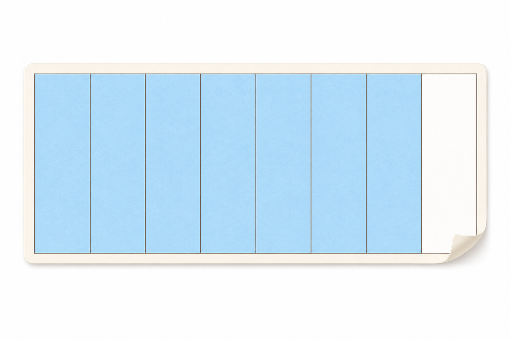

- Status: `generated`
- Grade/family: `P3` / `operations-fractions`
- Need/kind: `core` / `fraction-area`
- Prompt: 小林把一张纸平均分成8份，涂色7份。涂色部分占几分之几？

### pep-primary-p3-u-mc-002

Image pending: `candidates/P3/operations-fractions/pep-primary-p3-u-mc-002.png`

- Status: `missing`
- Grade/family: `P3` / `operations-fractions`
- Need/kind: `core` / `fraction-area`
- Prompt: 第2小组：把一个整体平均分成6份，其中涂色3份。涂色部分占几分之几？

### pep-primary-p3-u-mc-003

Image pending: `candidates/P3/operations-fractions/pep-primary-p3-u-mc-003.png`

- Status: `missing`
- Grade/family: `P3` / `operations-fractions`
- Need/kind: `core` / `fraction-area`
- Prompt: 第3小组：把一个整体平均分成7份，其中涂色4份。涂色部分占几分之几？

### pep-primary-p3-u-mc-004

Image pending: `candidates/P3/operations-fractions/pep-primary-p3-u-mc-004.png`

- Status: `missing`
- Grade/family: `P3` / `operations-fractions`
- Need/kind: `core` / `fraction-area`
- Prompt: 第4小组：把一个整体平均分成8份，其中涂色5份。涂色部分占几分之几？

### pep-primary-p3-u-mc-005

Image pending: `candidates/P3/operations-fractions/pep-primary-p3-u-mc-005.png`

- Status: `missing`
- Grade/family: `P3` / `operations-fractions`
- Need/kind: `core` / `fraction-area`
- Prompt: 第5小组：把一个整体平均分成4份，其中涂色3份。涂色部分占几分之几？

### pep-primary-p3-u-mc-006

Image pending: `candidates/P3/operations-fractions/pep-primary-p3-u-mc-006.png`

- Status: `missing`
- Grade/family: `P3` / `operations-fractions`
- Need/kind: `core` / `fraction-area`
- Prompt: 第6小组：把一个整体平均分成5份，其中涂色3份。涂色部分占几分之几？

### pep-primary-p3-u-mc-007

Image pending: `candidates/P3/operations-fractions/pep-primary-p3-u-mc-007.png`

- Status: `missing`
- Grade/family: `P3` / `operations-fractions`
- Need/kind: `core` / `fraction-area`
- Prompt: 第7小组：把一个整体平均分成6份，其中涂色3份。涂色部分占几分之几？

### pep-primary-p3-u-mc-008

Image pending: `candidates/P3/operations-fractions/pep-primary-p3-u-mc-008.png`

- Status: `missing`
- Grade/family: `P3` / `operations-fractions`
- Need/kind: `core` / `fraction-area`
- Prompt: 第8小组：把一个整体平均分成7份，其中涂色3份。涂色部分占几分之几？

### pep-primary-p3-u-mc-009

Image pending: `candidates/P3/operations-fractions/pep-primary-p3-u-mc-009.png`

- Status: `missing`
- Grade/family: `P3` / `operations-fractions`
- Need/kind: `core` / `fraction-area`
- Prompt: 第9小组：把一个整体平均分成8份，其中涂色3份。涂色部分占几分之几？

### pep-primary-p3-u-mc-010

Image pending: `candidates/P3/operations-fractions/pep-primary-p3-u-mc-010.png`

- Status: `missing`
- Grade/family: `P3` / `operations-fractions`
- Need/kind: `core` / `fraction-area`
- Prompt: 第10小组：把一个整体平均分成4份，其中涂色2份。涂色部分占几分之几？

### pep-primary-p3-u-mc-011

Image pending: `candidates/P3/operations-fractions/pep-primary-p3-u-mc-011.png`

- Status: `missing`
- Grade/family: `P3` / `operations-fractions`
- Need/kind: `core` / `fraction-area`
- Prompt: 第11小组：把一个整体平均分成5份，其中涂色4份。涂色部分占几分之几？

### pep-primary-p3-u-mc-012

Image pending: `candidates/P3/operations-fractions/pep-primary-p3-u-mc-012.png`

- Status: `missing`
- Grade/family: `P3` / `operations-fractions`
- Need/kind: `core` / `fraction-area`
- Prompt: 第12小组：把一个整体平均分成6份，其中涂色3份。涂色部分占几分之几？

### pep-primary-p3-u-mc-013

Image pending: `candidates/P3/operations-fractions/pep-primary-p3-u-mc-013.png`

- Status: `missing`
- Grade/family: `P3` / `operations-fractions`
- Need/kind: `core` / `fraction-area`
- Prompt: 第13小组：把一个整体平均分成7份，其中涂色2份。涂色部分占几分之几？

### pep-primary-p3-u-mc-014

Image pending: `candidates/P3/operations-fractions/pep-primary-p3-u-mc-014.png`

- Status: `missing`
- Grade/family: `P3` / `operations-fractions`
- Need/kind: `core` / `fraction-area`
- Prompt: 第14小组：把一个整体平均分成8份，其中涂色1份。涂色部分占几分之几？

### pep-primary-p3-u-mc-015

Image pending: `candidates/P3/operations-fractions/pep-primary-p3-u-mc-015.png`

- Status: `missing`
- Grade/family: `P3` / `operations-fractions`
- Need/kind: `core` / `fraction-area`
- Prompt: 第15小组：把一个整体平均分成4份，其中涂色1份。涂色部分占几分之几？

### pep-primary-p3-u-mc-016

Image pending: `candidates/P3/operations-fractions/pep-primary-p3-u-mc-016.png`

- Status: `missing`
- Grade/family: `P3` / `operations-fractions`
- Need/kind: `core` / `fraction-area`
- Prompt: 第16小组：把一个整体平均分成5份，其中涂色1份。涂色部分占几分之几？

### pep-primary-p3-u-mc-017

Image pending: `candidates/P3/operations-fractions/pep-primary-p3-u-mc-017.png`

- Status: `missing`
- Grade/family: `P3` / `operations-fractions`
- Need/kind: `core` / `fraction-area`
- Prompt: 第17小组：把一个整体平均分成6份，其中涂色3份。涂色部分占几分之几？

### pep-primary-p3-u-mc-018

Image pending: `candidates/P3/operations-fractions/pep-primary-p3-u-mc-018.png`

- Status: `missing`
- Grade/family: `P3` / `operations-fractions`
- Need/kind: `core` / `fraction-area`
- Prompt: 第18小组：把一个整体平均分成7份，其中涂色1份。涂色部分占几分之几？

### pep-primary-p3-u-mc-019

Image pending: `candidates/P3/operations-fractions/pep-primary-p3-u-mc-019.png`

- Status: `missing`
- Grade/family: `P3` / `operations-fractions`
- Need/kind: `core` / `fraction-area`
- Prompt: 第19小组：把一个整体平均分成8份，其中涂色6份。涂色部分占几分之几？

### pep-primary-p3-u-mc-020

Image pending: `candidates/P3/operations-fractions/pep-primary-p3-u-mc-020.png`

- Status: `missing`
- Grade/family: `P3` / `operations-fractions`
- Need/kind: `core` / `fraction-area`
- Prompt: 第20小组：把一个整体平均分成4份，其中涂色3份。涂色部分占几分之几？

### pep-primary-p3-u-mc-021

Image pending: `candidates/P3/operations-fractions/pep-primary-p3-u-mc-021.png`

- Status: `missing`
- Grade/family: `P3` / `operations-fractions`
- Need/kind: `core` / `fraction-area`
- Prompt: 第21小组：把一个整体平均分成5份，其中涂色2份。涂色部分占几分之几？

### pep-primary-p3-u-mc-022

Image pending: `candidates/P3/operations-fractions/pep-primary-p3-u-mc-022.png`

- Status: `missing`
- Grade/family: `P3` / `operations-fractions`
- Need/kind: `core` / `fraction-area`
- Prompt: 第22小组：把一个整体平均分成6份，其中涂色3份。涂色部分占几分之几？

### pep-primary-p3-u-mc-023

Image pending: `candidates/P3/operations-fractions/pep-primary-p3-u-mc-023.png`

- Status: `missing`
- Grade/family: `P3` / `operations-fractions`
- Need/kind: `core` / `fraction-area`
- Prompt: 第23小组：把一个整体平均分成7份，其中涂色6份。涂色部分占几分之几？

### pep-primary-p3-u-mc-024

Image pending: `candidates/P3/operations-fractions/pep-primary-p3-u-mc-024.png`

- Status: `missing`
- Grade/family: `P3` / `operations-fractions`
- Need/kind: `core` / `fraction-area`
- Prompt: 第24小组：把一个整体平均分成8份，其中涂色4份。涂色部分占几分之几？

### pep-primary-p3-u-mc-025

Image pending: `candidates/P3/operations-fractions/pep-primary-p3-u-mc-025.png`

- Status: `missing`
- Grade/family: `P3` / `operations-fractions`
- Need/kind: `core` / `fraction-area`
- Prompt: 第25小组：把一个整体平均分成4份，其中涂色2份。涂色部分占几分之几？

### pep-primary-p3-u-mc-026

Image pending: `candidates/P3/operations-fractions/pep-primary-p3-u-mc-026.png`

- Status: `missing`
- Grade/family: `P3` / `operations-fractions`
- Need/kind: `core` / `fraction-area`
- Prompt: 一个图形平均分为4份，其中2份做了标记。标记部分用分数怎样表示？

### pep-primary-p3-u-mc-027

Image pending: `candidates/P3/operations-fractions/pep-primary-p3-u-mc-027.png`

- Status: `missing`
- Grade/family: `P3` / `operations-fractions`
- Need/kind: `core` / `fraction-area`
- Prompt: 第27小组：把一个整体平均分成6份，其中涂色3份。涂色部分占几分之几？

### pep-primary-p3-u-mc-028

Image pending: `candidates/P3/operations-fractions/pep-primary-p3-u-mc-028.png`

- Status: `missing`
- Grade/family: `P3` / `operations-fractions`
- Need/kind: `core` / `fraction-area`
- Prompt: 第28小组：把一个整体平均分成7份，其中涂色5份。涂色部分占几分之几？

### pep-primary-p3-u-mc-029

Image pending: `candidates/P3/operations-fractions/pep-primary-p3-u-mc-029.png`

- Status: `missing`
- Grade/family: `P3` / `operations-fractions`
- Need/kind: `core` / `fraction-area`
- Prompt: 第29小组：把一个整体平均分成8份，其中涂色2份。涂色部分占几分之几？

### pep-primary-p3-u-mc-030

Image pending: `candidates/P3/operations-fractions/pep-primary-p3-u-mc-030.png`

- Status: `missing`
- Grade/family: `P3` / `operations-fractions`
- Need/kind: `core` / `fraction-area`
- Prompt: 第30小组：把一个整体平均分成4份，其中涂色1份。涂色部分占几分之几？

### pep-primary-p3-u-mc-031

Image pending: `candidates/P3/operations-fractions/pep-primary-p3-u-mc-031.png`

- Status: `missing`
- Grade/family: `P3` / `operations-fractions`
- Need/kind: `core` / `fraction-area`
- Prompt: 第31小组：把一个整体平均分成5份，其中涂色4份。涂色部分占几分之几？

### pep-primary-p3-u-mc-032

Image pending: `candidates/P3/operations-fractions/pep-primary-p3-u-mc-032.png`

- Status: `missing`
- Grade/family: `P3` / `operations-fractions`
- Need/kind: `core` / `fraction-area`
- Prompt: 第32小组：把一个整体平均分成6份，其中涂色3份。涂色部分占几分之几？

### pep-primary-p3-u-mc-033

Image pending: `candidates/P3/operations-fractions/pep-primary-p3-u-mc-033.png`

- Status: `missing`
- Grade/family: `P3` / `operations-fractions`
- Need/kind: `core` / `fraction-area`
- Prompt: 第33小组：把一个整体平均分成7份，其中涂色4份。涂色部分占几分之几？

### pep-primary-p3-u-mc-034

Image pending: `candidates/P3/operations-fractions/pep-primary-p3-u-mc-034.png`

- Status: `missing`
- Grade/family: `P3` / `operations-fractions`
- Need/kind: `core` / `fraction-area`
- Prompt: 第34小组：把一个整体平均分成8份，其中涂色7份。涂色部分占几分之几？

### pep-primary-p3-u-mc-035

Image pending: `candidates/P3/operations-fractions/pep-primary-p3-u-mc-035.png`

- Status: `missing`
- Grade/family: `P3` / `operations-fractions`
- Need/kind: `core` / `fraction-area`
- Prompt: 第35小组：把一个整体平均分成4份，其中涂色3份。涂色部分占几分之几？

### pep-primary-p3-u-mc-036

Image pending: `candidates/P3/operations-fractions/pep-primary-p3-u-mc-036.png`

- Status: `missing`
- Grade/family: `P3` / `operations-fractions`
- Need/kind: `core` / `fraction-area`
- Prompt: 第36小组：把一个整体平均分成5份，其中涂色1份。涂色部分占几分之几？

### pep-primary-p3-u-mc-037

Image pending: `candidates/P3/operations-fractions/pep-primary-p3-u-mc-037.png`

- Status: `missing`
- Grade/family: `P3` / `operations-fractions`
- Need/kind: `core` / `fraction-area`
- Prompt: 第37小组：把一个整体平均分成6份，其中涂色3份。涂色部分占几分之几？

### pep-primary-p3-u-mc-038

Image pending: `candidates/P3/operations-fractions/pep-primary-p3-u-mc-038.png`

- Status: `missing`
- Grade/family: `P3` / `operations-fractions`
- Need/kind: `core` / `fraction-area`
- Prompt: 第38小组：把一个整体平均分成7份，其中涂色3份。涂色部分占几分之几？

### pep-primary-p3-u-mc-039

Image pending: `candidates/P3/operations-fractions/pep-primary-p3-u-mc-039.png`

- Status: `missing`
- Grade/family: `P3` / `operations-fractions`
- Need/kind: `core` / `fraction-area`
- Prompt: 第39小组：把一个整体平均分成8份，其中涂色5份。涂色部分占几分之几？

### pep-primary-p3-u-mc-040

Image pending: `candidates/P3/operations-fractions/pep-primary-p3-u-mc-040.png`

- Status: `missing`
- Grade/family: `P3` / `operations-fractions`
- Need/kind: `core` / `fraction-area`
- Prompt: 第40小组：把一个整体平均分成4份，其中涂色2份。涂色部分占几分之几？

### pep-primary-p3-u-mc-041

Image pending: `candidates/P3/operations-fractions/pep-primary-p3-u-mc-041.png`

- Status: `missing`
- Grade/family: `P3` / `operations-fractions`
- Need/kind: `core` / `fraction-area`
- Prompt: 第41小组：把一个整体平均分成5份，其中涂色2份。涂色部分占几分之几？

### pep-primary-p3-u-mc-042

Image pending: `candidates/P3/operations-fractions/pep-primary-p3-u-mc-042.png`

- Status: `missing`
- Grade/family: `P3` / `operations-fractions`
- Need/kind: `core` / `fraction-area`
- Prompt: 第42小组：把一个整体平均分成6份，其中涂色3份。涂色部分占几分之几？

### pep-primary-p3-u-mc-043

Image pending: `candidates/P3/operations-fractions/pep-primary-p3-u-mc-043.png`

- Status: `missing`
- Grade/family: `P3` / `operations-fractions`
- Need/kind: `core` / `fraction-area`
- Prompt: 第43小组：把一个整体平均分成7份，其中涂色2份。涂色部分占几分之几？

### pep-primary-p3-u-mc-044

Image pending: `candidates/P3/operations-fractions/pep-primary-p3-u-mc-044.png`

- Status: `missing`
- Grade/family: `P3` / `operations-fractions`
- Need/kind: `core` / `fraction-area`
- Prompt: 第44小组：把一个整体平均分成8份，其中涂色3份。涂色部分占几分之几？

### pep-primary-p3-u-mc-045

Image pending: `candidates/P3/operations-fractions/pep-primary-p3-u-mc-045.png`

- Status: `missing`
- Grade/family: `P3` / `operations-fractions`
- Need/kind: `core` / `fraction-area`
- Prompt: 第45小组：把一个整体平均分成4份，其中涂色1份。涂色部分占几分之几？

### pep-primary-p3-u-mc-046

Image pending: `candidates/P3/operations-fractions/pep-primary-p3-u-mc-046.png`

- Status: `missing`
- Grade/family: `P3` / `operations-fractions`
- Need/kind: `core` / `fraction-area`
- Prompt: 第46小组：把一个整体平均分成5份，其中涂色3份。涂色部分占几分之几？

### pep-primary-p3-u-mc-047

Image pending: `candidates/P3/operations-fractions/pep-primary-p3-u-mc-047.png`

- Status: `missing`
- Grade/family: `P3` / `operations-fractions`
- Need/kind: `core` / `fraction-area`
- Prompt: 第47小组：把一个整体平均分成6份，其中涂色3份。涂色部分占几分之几？

### pep-primary-p3-u-mc-048

Image pending: `candidates/P3/operations-fractions/pep-primary-p3-u-mc-048.png`

- Status: `missing`
- Grade/family: `P3` / `operations-fractions`
- Need/kind: `core` / `fraction-area`
- Prompt: 第48小组：把一个整体平均分成7份，其中涂色1份。涂色部分占几分之几？

### pep-primary-p3-u-mc-049

Image pending: `candidates/P3/operations-fractions/pep-primary-p3-u-mc-049.png`

- Status: `missing`
- Grade/family: `P3` / `operations-fractions`
- Need/kind: `core` / `fraction-area`
- Prompt: 第49小组：把一个整体平均分成8份，其中涂色1份。涂色部分占几分之几？

### pep-primary-p3-u-mc-050

Image pending: `candidates/P3/operations-fractions/pep-primary-p3-u-mc-050.png`

- Status: `missing`
- Grade/family: `P3` / `operations-fractions`
- Need/kind: `core` / `fraction-area`
- Prompt: 第50小组：把一个整体平均分成4份，其中涂色3份。涂色部分占几分之几？

## P3 / area-decimals

### pep-primary-p3-l-fi-101

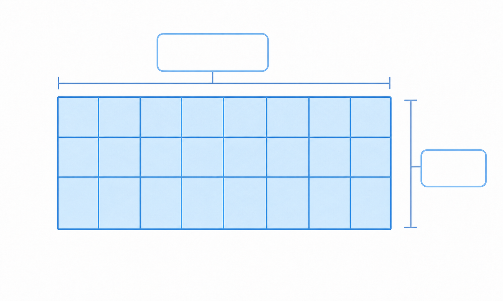

- Status: `generated`
- Grade/family: `P3` / `area-decimals`
- Need/kind: `core` / `area-grid`
- Prompt: 晨晨画了一个长方形，长8厘米、宽3厘米。面积是多少？

### pep-primary-p3-l-fi-102

Image pending: `candidates/P3/area-decimals/pep-primary-p3-l-fi-102.png`

- Status: `missing`
- Grade/family: `P3` / `area-decimals`
- Need/kind: `core` / `area-grid`
- Prompt: 种植区有一张长方形标签，长10厘米、宽6厘米。标签面积是多少？

### pep-primary-p3-l-fi-103

Image pending: `candidates/P3/area-decimals/pep-primary-p3-l-fi-103.png`

- Status: `missing`
- Grade/family: `P3` / `area-decimals`
- Need/kind: `core` / `area-grid`
- Prompt: 一块长方形纸板长3厘米、宽3厘米，它的面积是多少平方厘米？

### pep-primary-p3-l-fi-104

Image pending: `candidates/P3/area-decimals/pep-primary-p3-l-fi-104.png`

- Status: `missing`
- Grade/family: `P3` / `area-decimals`
- Need/kind: `core` / `area-grid`
- Prompt: 第104小组：一个长方形长8厘米、宽6厘米，面积是多少？

### pep-primary-p3-l-fi-105

Image pending: `candidates/P3/area-decimals/pep-primary-p3-l-fi-105.png`

- Status: `missing`
- Grade/family: `P3` / `area-decimals`
- Need/kind: `core` / `area-grid`
- Prompt: 第105小组：一个长方形长9厘米、宽2厘米，面积是多少？

### pep-primary-p3-l-fi-106

Image pending: `candidates/P3/area-decimals/pep-primary-p3-l-fi-106.png`

- Status: `missing`
- Grade/family: `P3` / `area-decimals`
- Need/kind: `core` / `area-grid`
- Prompt: 第106小组：一个长方形长10厘米、宽4厘米，面积是多少？

### pep-primary-p3-l-fi-107

Image pending: `candidates/P3/area-decimals/pep-primary-p3-l-fi-107.png`

- Status: `missing`
- Grade/family: `P3` / `area-decimals`
- Need/kind: `core` / `area-grid`
- Prompt: 第107小组：一个长方形长11厘米、宽6厘米，面积是多少？

### pep-primary-p3-l-fi-108

Image pending: `candidates/P3/area-decimals/pep-primary-p3-l-fi-108.png`

- Status: `missing`
- Grade/family: `P3` / `area-decimals`
- Need/kind: `core` / `area-grid`
- Prompt: 第108小组：一个长方形长3厘米、宽2厘米，面积是多少？

### pep-primary-p3-l-fi-109

Image pending: `candidates/P3/area-decimals/pep-primary-p3-l-fi-109.png`

- Status: `missing`
- Grade/family: `P3` / `area-decimals`
- Need/kind: `core` / `area-grid`
- Prompt: 第109小组：一个长方形长4厘米、宽4厘米，面积是多少？

### pep-primary-p3-l-fi-110

Image pending: `candidates/P3/area-decimals/pep-primary-p3-l-fi-110.png`

- Status: `missing`
- Grade/family: `P3` / `area-decimals`
- Need/kind: `core` / `area-grid`
- Prompt: 第110小组：一个长方形长5厘米、宽6厘米，面积是多少？

### pep-primary-p3-l-fi-111

Image pending: `candidates/P3/area-decimals/pep-primary-p3-l-fi-111.png`

- Status: `missing`
- Grade/family: `P3` / `area-decimals`
- Need/kind: `core` / `area-grid`
- Prompt: 第111小组：一个长方形长6厘米、宽2厘米，面积是多少？

### pep-primary-p3-l-fi-112

Image pending: `candidates/P3/area-decimals/pep-primary-p3-l-fi-112.png`

- Status: `missing`
- Grade/family: `P3` / `area-decimals`
- Need/kind: `core` / `area-grid`
- Prompt: 第112小组：一个长方形长7厘米、宽4厘米，面积是多少？

### pep-primary-p3-l-fi-113

Image pending: `candidates/P3/area-decimals/pep-primary-p3-l-fi-113.png`

- Status: `missing`
- Grade/family: `P3` / `area-decimals`
- Need/kind: `core` / `area-grid`
- Prompt: 第113小组：一个长方形长8厘米、宽6厘米，面积是多少？

### pep-primary-p3-l-fi-114

Image pending: `candidates/P3/area-decimals/pep-primary-p3-l-fi-114.png`

- Status: `missing`
- Grade/family: `P3` / `area-decimals`
- Need/kind: `core` / `area-grid`
- Prompt: 第114小组：一个长方形长9厘米、宽2厘米，面积是多少？

### pep-primary-p3-l-fi-115

Image pending: `candidates/P3/area-decimals/pep-primary-p3-l-fi-115.png`

- Status: `missing`
- Grade/family: `P3` / `area-decimals`
- Need/kind: `core` / `area-grid`
- Prompt: 第115小组：一个长方形长10厘米、宽4厘米，面积是多少？

### pep-primary-p3-l-fi-116

Image pending: `candidates/P3/area-decimals/pep-primary-p3-l-fi-116.png`

- Status: `missing`
- Grade/family: `P3` / `area-decimals`
- Need/kind: `core` / `area-grid`
- Prompt: 第116小组：一个长方形长11厘米、宽6厘米，面积是多少？

### pep-primary-p3-l-fi-117

Image pending: `candidates/P3/area-decimals/pep-primary-p3-l-fi-117.png`

- Status: `missing`
- Grade/family: `P3` / `area-decimals`
- Need/kind: `core` / `area-grid`
- Prompt: 小林画了一个长方形，长9厘米、宽2厘米。面积是多少？

### pep-primary-p3-l-fi-118

Image pending: `candidates/P3/area-decimals/pep-primary-p3-l-fi-118.png`

- Status: `missing`
- Grade/family: `P3` / `area-decimals`
- Need/kind: `core` / `area-grid`
- Prompt: 第118小组：一个长方形长4厘米、宽4厘米，面积是多少？

### pep-primary-p3-l-fi-119

Image pending: `candidates/P3/area-decimals/pep-primary-p3-l-fi-119.png`

- Status: `missing`
- Grade/family: `P3` / `area-decimals`
- Need/kind: `core` / `area-grid`
- Prompt: 第119小组：一个长方形长5厘米、宽6厘米，面积是多少？

### pep-primary-p3-l-fi-120

Image pending: `candidates/P3/area-decimals/pep-primary-p3-l-fi-120.png`

- Status: `missing`
- Grade/family: `P3` / `area-decimals`
- Need/kind: `core` / `area-grid`
- Prompt: 第120小组：一个长方形长6厘米、宽2厘米，面积是多少？

### pep-primary-p3-l-fi-121

Image pending: `candidates/P3/area-decimals/pep-primary-p3-l-fi-121.png`

- Status: `missing`
- Grade/family: `P3` / `area-decimals`
- Need/kind: `core` / `area-grid`
- Prompt: 第121小组：一个长方形长7厘米、宽4厘米，面积是多少？

### pep-primary-p3-l-fi-122

Image pending: `candidates/P3/area-decimals/pep-primary-p3-l-fi-122.png`

- Status: `missing`
- Grade/family: `P3` / `area-decimals`
- Need/kind: `core` / `area-grid`
- Prompt: 第122小组：一个长方形长8厘米、宽6厘米，面积是多少？

### pep-primary-p3-l-fi-123

Image pending: `candidates/P3/area-decimals/pep-primary-p3-l-fi-123.png`

- Status: `missing`
- Grade/family: `P3` / `area-decimals`
- Need/kind: `core` / `area-grid`
- Prompt: 第123小组：一个长方形长9厘米、宽2厘米，面积是多少？

### pep-primary-p3-l-fi-124

Image pending: `candidates/P3/area-decimals/pep-primary-p3-l-fi-124.png`

- Status: `missing`
- Grade/family: `P3` / `area-decimals`
- Need/kind: `core` / `area-grid`
- Prompt: 第124小组：一个长方形长10厘米、宽4厘米，面积是多少？

### pep-primary-p3-l-fi-125

Image pending: `candidates/P3/area-decimals/pep-primary-p3-l-fi-125.png`

- Status: `missing`
- Grade/family: `P3` / `area-decimals`
- Need/kind: `core` / `area-grid`
- Prompt: 第125小组：一个长方形长11厘米、宽6厘米，面积是多少？

### pep-primary-p3-l-fi-126

Image pending: `candidates/P3/area-decimals/pep-primary-p3-l-fi-126.png`

- Status: `missing`
- Grade/family: `P3` / `area-decimals`
- Need/kind: `core` / `area-grid`
- Prompt: 第126小组：一个长方形长3厘米、宽2厘米，面积是多少？

### pep-primary-p3-l-fi-127

Image pending: `candidates/P3/area-decimals/pep-primary-p3-l-fi-127.png`

- Status: `missing`
- Grade/family: `P3` / `area-decimals`
- Need/kind: `core` / `area-grid`
- Prompt: 第127小组：一个长方形长4厘米、宽4厘米，面积是多少？

### pep-primary-p3-l-fi-128

Image pending: `candidates/P3/area-decimals/pep-primary-p3-l-fi-128.png`

- Status: `missing`
- Grade/family: `P3` / `area-decimals`
- Need/kind: `core` / `area-grid`
- Prompt: 第128小组：一个长方形长5厘米、宽6厘米，面积是多少？

### pep-primary-p3-l-fi-129

Image pending: `candidates/P3/area-decimals/pep-primary-p3-l-fi-129.png`

- Status: `missing`
- Grade/family: `P3` / `area-decimals`
- Need/kind: `core` / `area-grid`
- Prompt: 第129小组：一个长方形长6厘米、宽2厘米，面积是多少？

### pep-primary-p3-l-fi-130

Image pending: `candidates/P3/area-decimals/pep-primary-p3-l-fi-130.png`

- Status: `missing`
- Grade/family: `P3` / `area-decimals`
- Need/kind: `core` / `area-grid`
- Prompt: 第130小组：一个长方形长7厘米、宽4厘米，面积是多少？

### pep-primary-p3-l-fi-131

Image pending: `candidates/P3/area-decimals/pep-primary-p3-l-fi-131.png`

- Status: `missing`
- Grade/family: `P3` / `area-decimals`
- Need/kind: `core` / `area-grid`
- Prompt: 第131小组：一个长方形长8厘米、宽6厘米，面积是多少？

### pep-primary-p3-l-fi-132

Image pending: `candidates/P3/area-decimals/pep-primary-p3-l-fi-132.png`

- Status: `missing`
- Grade/family: `P3` / `area-decimals`
- Need/kind: `core` / `area-grid`
- Prompt: 第132小组：一个长方形长9厘米、宽2厘米，面积是多少？

### pep-primary-p3-l-fi-133

Image pending: `candidates/P3/area-decimals/pep-primary-p3-l-fi-133.png`

- Status: `missing`
- Grade/family: `P3` / `area-decimals`
- Need/kind: `core` / `area-grid`
- Prompt: 第133小组：一个长方形长10厘米、宽4厘米，面积是多少？

### pep-primary-p3-l-fi-134

Image pending: `candidates/P3/area-decimals/pep-primary-p3-l-fi-134.png`

- Status: `missing`
- Grade/family: `P3` / `area-decimals`
- Need/kind: `core` / `area-grid`
- Prompt: 手工桌有一张长方形标签，长9厘米、宽7厘米。标签面积是多少？

### pep-primary-p3-l-fi-135

Image pending: `candidates/P3/area-decimals/pep-primary-p3-l-fi-135.png`

- Status: `missing`
- Grade/family: `P3` / `area-decimals`
- Need/kind: `core` / `area-grid`
- Prompt: 第135小组：一个长方形长3厘米、宽2厘米，面积是多少？

### pep-primary-p3-l-fi-136

Image pending: `candidates/P3/area-decimals/pep-primary-p3-l-fi-136.png`

- Status: `missing`
- Grade/family: `P3` / `area-decimals`
- Need/kind: `core` / `area-grid`
- Prompt: 第136小组：一个长方形长4厘米、宽4厘米，面积是多少？

### pep-primary-p3-l-fi-137

Image pending: `candidates/P3/area-decimals/pep-primary-p3-l-fi-137.png`

- Status: `missing`
- Grade/family: `P3` / `area-decimals`
- Need/kind: `core` / `area-grid`
- Prompt: 第137小组：一个长方形长5厘米、宽6厘米，面积是多少？

### pep-primary-p3-l-fi-138

Image pending: `candidates/P3/area-decimals/pep-primary-p3-l-fi-138.png`

- Status: `missing`
- Grade/family: `P3` / `area-decimals`
- Need/kind: `core` / `area-grid`
- Prompt: 第138小组：一个长方形长6厘米、宽2厘米，面积是多少？

### pep-primary-p3-l-fi-139

Image pending: `candidates/P3/area-decimals/pep-primary-p3-l-fi-139.png`

- Status: `missing`
- Grade/family: `P3` / `area-decimals`
- Need/kind: `core` / `area-grid`
- Prompt: 第139小组：一个长方形长7厘米、宽4厘米，面积是多少？

### pep-primary-p3-l-fi-140

Image pending: `candidates/P3/area-decimals/pep-primary-p3-l-fi-140.png`

- Status: `missing`
- Grade/family: `P3` / `area-decimals`
- Need/kind: `core` / `area-grid`
- Prompt: 第140小组：一个长方形长8厘米、宽6厘米，面积是多少？

### pep-primary-p3-l-fi-141

Image pending: `candidates/P3/area-decimals/pep-primary-p3-l-fi-141.png`

- Status: `missing`
- Grade/family: `P3` / `area-decimals`
- Need/kind: `core` / `area-grid`
- Prompt: 第141小组：一个长方形长9厘米、宽2厘米，面积是多少？

### pep-primary-p3-l-fi-142

Image pending: `candidates/P3/area-decimals/pep-primary-p3-l-fi-142.png`

- Status: `missing`
- Grade/family: `P3` / `area-decimals`
- Need/kind: `core` / `area-grid`
- Prompt: 第142小组：一个长方形长10厘米、宽4厘米，面积是多少？

### pep-primary-p3-l-fi-143

Image pending: `candidates/P3/area-decimals/pep-primary-p3-l-fi-143.png`

- Status: `missing`
- Grade/family: `P3` / `area-decimals`
- Need/kind: `core` / `area-grid`
- Prompt: 第143小组：一个长方形长11厘米、宽6厘米，面积是多少？

### pep-primary-p3-l-fi-144

Image pending: `candidates/P3/area-decimals/pep-primary-p3-l-fi-144.png`

- Status: `missing`
- Grade/family: `P3` / `area-decimals`
- Need/kind: `core` / `area-grid`
- Prompt: 第144小组：一个长方形长3厘米、宽2厘米，面积是多少？

### pep-primary-p3-l-fi-145

Image pending: `candidates/P3/area-decimals/pep-primary-p3-l-fi-145.png`

- Status: `missing`
- Grade/family: `P3` / `area-decimals`
- Need/kind: `core` / `area-grid`
- Prompt: 第145小组：一个长方形长4厘米、宽4厘米，面积是多少？

### pep-primary-p3-l-fi-146

Image pending: `candidates/P3/area-decimals/pep-primary-p3-l-fi-146.png`

- Status: `missing`
- Grade/family: `P3` / `area-decimals`
- Need/kind: `core` / `area-grid`
- Prompt: 第146小组：一个长方形长5厘米、宽6厘米，面积是多少？

### pep-primary-p3-l-fi-147

Image pending: `candidates/P3/area-decimals/pep-primary-p3-l-fi-147.png`

- Status: `missing`
- Grade/family: `P3` / `area-decimals`
- Need/kind: `core` / `area-grid`
- Prompt: 第147小组：一个长方形长6厘米、宽2厘米，面积是多少？

### pep-primary-p3-l-fi-148

Image pending: `candidates/P3/area-decimals/pep-primary-p3-l-fi-148.png`

- Status: `missing`
- Grade/family: `P3` / `area-decimals`
- Need/kind: `core` / `area-grid`
- Prompt: 第148小组：一个长方形长7厘米、宽4厘米，面积是多少？

### pep-primary-p3-l-fi-149

Image pending: `candidates/P3/area-decimals/pep-primary-p3-l-fi-149.png`

- Status: `missing`
- Grade/family: `P3` / `area-decimals`
- Need/kind: `core` / `area-grid`
- Prompt: 第149小组：一个长方形长8厘米、宽6厘米，面积是多少？

### pep-primary-p3-l-fi-150

Image pending: `candidates/P3/area-decimals/pep-primary-p3-l-fi-150.png`

- Status: `missing`
- Grade/family: `P3` / `area-decimals`
- Need/kind: `core` / `area-grid`
- Prompt: 一块长方形纸板长8厘米、宽4厘米，它的面积是多少平方厘米？

## P4 / angles-geometry

### pep-primary-p4-u-fi-076

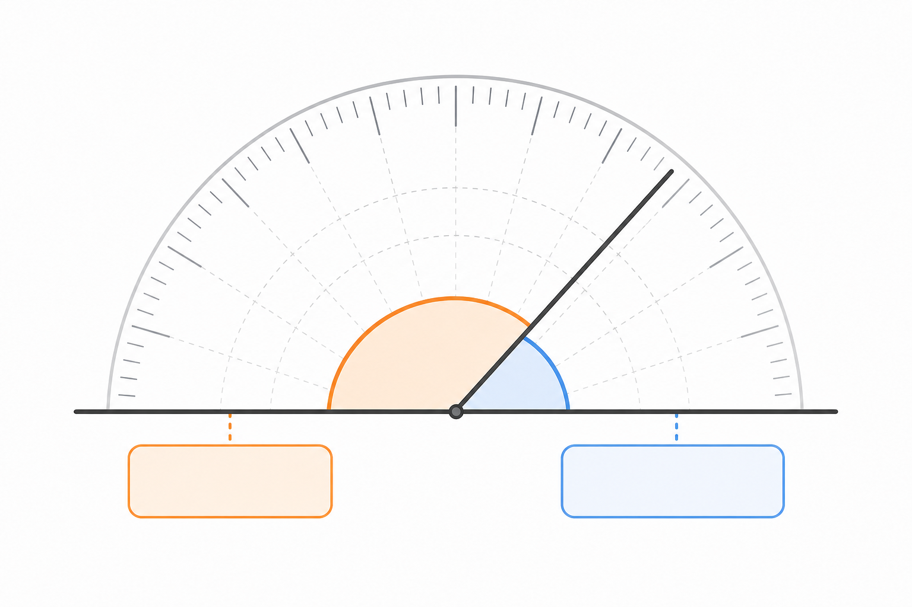

- Status: `generated`
- Grade/family: `P4` / `angles-geometry`
- Need/kind: `core` / `angle`
- Prompt: 乐乐画了两个组成平角的角，其中一个是45°，另一个是多少度？

### pep-primary-p4-u-fi-077

Image pending: `candidates/P4/angles-geometry/pep-primary-p4-u-fi-077.png`

- Status: `missing`
- Grade/family: `P4` / `angles-geometry`
- Need/kind: `core` / `angle`
- Prompt: 一条直线上的两个相邻角和为180°，已知一个角是51°，另一个角是多少？

### pep-primary-p4-u-fi-078

Image pending: `candidates/P4/angles-geometry/pep-primary-p4-u-fi-078.png`

- Status: `missing`
- Grade/family: `P4` / `angles-geometry`
- Need/kind: `core` / `angle`
- Prompt: 手工桌的角度卡显示一个角为57°，它的邻补角是多少度？

### pep-primary-p4-u-fi-079

Image pending: `candidates/P4/angles-geometry/pep-primary-p4-u-fi-079.png`

- Status: `missing`
- Grade/family: `P4` / `angles-geometry`
- Need/kind: `core` / `angle`
- Prompt: 第79小组：两个角组成一个平角，其中一个角是60°，另一个角是多少度？

### pep-primary-p4-u-fi-080

Image pending: `candidates/P4/angles-geometry/pep-primary-p4-u-fi-080.png`

- Status: `missing`
- Grade/family: `P4` / `angles-geometry`
- Need/kind: `core` / `angle`
- Prompt: 第80小组：两个角组成一个平角，其中一个角是65°，另一个角是多少度？

### pep-primary-p4-u-fi-081

Image pending: `candidates/P4/angles-geometry/pep-primary-p4-u-fi-081.png`

- Status: `missing`
- Grade/family: `P4` / `angles-geometry`
- Need/kind: `core` / `angle`
- Prompt: 第81小组：两个角组成一个平角，其中一个角是70°，另一个角是多少度？

### pep-primary-p4-u-fi-082

Image pending: `candidates/P4/angles-geometry/pep-primary-p4-u-fi-082.png`

- Status: `missing`
- Grade/family: `P4` / `angles-geometry`
- Need/kind: `core` / `angle`
- Prompt: 第82小组：两个角组成一个平角，其中一个角是75°，另一个角是多少度？

### pep-primary-p4-u-fi-083

Image pending: `candidates/P4/angles-geometry/pep-primary-p4-u-fi-083.png`

- Status: `missing`
- Grade/family: `P4` / `angles-geometry`
- Need/kind: `core` / `angle`
- Prompt: 第83小组：两个角组成一个平角，其中一个角是80°，另一个角是多少度？

### pep-primary-p4-u-fi-084

Image pending: `candidates/P4/angles-geometry/pep-primary-p4-u-fi-084.png`

- Status: `missing`
- Grade/family: `P4` / `angles-geometry`
- Need/kind: `core` / `angle`
- Prompt: 浩浩画了两个组成平角的角，其中一个是88°，另一个是多少度？

### pep-primary-p4-u-fi-085

Image pending: `candidates/P4/angles-geometry/pep-primary-p4-u-fi-085.png`

- Status: `missing`
- Grade/family: `P4` / `angles-geometry`
- Need/kind: `core` / `angle`
- Prompt: 第85小组：两个角组成一个平角，其中一个角是90°，另一个角是多少度？

### pep-primary-p4-u-fi-086

Image pending: `candidates/P4/angles-geometry/pep-primary-p4-u-fi-086.png`

- Status: `missing`
- Grade/family: `P4` / `angles-geometry`
- Need/kind: `core` / `angle`
- Prompt: 第86小组：两个角组成一个平角，其中一个角是95°，另一个角是多少度？

### pep-primary-p4-u-fi-087

Image pending: `candidates/P4/angles-geometry/pep-primary-p4-u-fi-087.png`

- Status: `missing`
- Grade/family: `P4` / `angles-geometry`
- Need/kind: `core` / `angle`
- Prompt: 第87小组：两个角组成一个平角，其中一个角是100°，另一个角是多少度？

### pep-primary-p4-u-fi-088

Image pending: `candidates/P4/angles-geometry/pep-primary-p4-u-fi-088.png`

- Status: `missing`
- Grade/family: `P4` / `angles-geometry`
- Need/kind: `core` / `angle`
- Prompt: 第88小组：两个角组成一个平角，其中一个角是105°，另一个角是多少度？

### pep-primary-p4-u-fi-089

Image pending: `candidates/P4/angles-geometry/pep-primary-p4-u-fi-089.png`

- Status: `missing`
- Grade/family: `P4` / `angles-geometry`
- Need/kind: `core` / `angle`
- Prompt: 第89小组：两个角组成一个平角，其中一个角是110°，另一个角是多少度？

### pep-primary-p4-u-fi-090

Image pending: `candidates/P4/angles-geometry/pep-primary-p4-u-fi-090.png`

- Status: `missing`
- Grade/family: `P4` / `angles-geometry`
- Need/kind: `core` / `angle`
- Prompt: 第90小组：两个角组成一个平角，其中一个角是115°，另一个角是多少度？

### pep-primary-p4-u-fi-091

Image pending: `candidates/P4/angles-geometry/pep-primary-p4-u-fi-091.png`

- Status: `missing`
- Grade/family: `P4` / `angles-geometry`
- Need/kind: `core` / `angle`
- Prompt: 第91小组：两个角组成一个平角，其中一个角是120°，另一个角是多少度？

### pep-primary-p4-u-fi-092

Image pending: `candidates/P4/angles-geometry/pep-primary-p4-u-fi-092.png`

- Status: `missing`
- Grade/family: `P4` / `angles-geometry`
- Need/kind: `core` / `angle`
- Prompt: 一条直线上的两个相邻角和为180°，已知一个角是129°，另一个角是多少？

### pep-primary-p4-u-fi-093

Image pending: `candidates/P4/angles-geometry/pep-primary-p4-u-fi-093.png`

- Status: `missing`
- Grade/family: `P4` / `angles-geometry`
- Need/kind: `core` / `angle`
- Prompt: 第93小组：两个角组成一个平角，其中一个角是130°，另一个角是多少度？

### pep-primary-p4-u-fi-094

Image pending: `candidates/P4/angles-geometry/pep-primary-p4-u-fi-094.png`

- Status: `missing`
- Grade/family: `P4` / `angles-geometry`
- Need/kind: `core` / `angle`
- Prompt: 第94小组：两个角组成一个平角，其中一个角是135°，另一个角是多少度？

### pep-primary-p4-u-fi-095

Image pending: `candidates/P4/angles-geometry/pep-primary-p4-u-fi-095.png`

- Status: `missing`
- Grade/family: `P4` / `angles-geometry`
- Need/kind: `core` / `angle`
- Prompt: 第95小组：两个角组成一个平角，其中一个角是140°，另一个角是多少度？

### pep-primary-p4-u-fi-096

Image pending: `candidates/P4/angles-geometry/pep-primary-p4-u-fi-096.png`

- Status: `missing`
- Grade/family: `P4` / `angles-geometry`
- Need/kind: `core` / `angle`
- Prompt: 第96小组：两个角组成一个平角，其中一个角是25°，另一个角是多少度？

### pep-primary-p4-u-fi-097

Image pending: `candidates/P4/angles-geometry/pep-primary-p4-u-fi-097.png`

- Status: `missing`
- Grade/family: `P4` / `angles-geometry`
- Need/kind: `core` / `angle`
- Prompt: 第97小组：两个角组成一个平角，其中一个角是30°，另一个角是多少度？

### pep-primary-p4-u-fi-098

Image pending: `candidates/P4/angles-geometry/pep-primary-p4-u-fi-098.png`

- Status: `missing`
- Grade/family: `P4` / `angles-geometry`
- Need/kind: `core` / `angle`
- Prompt: 第98小组：两个角组成一个平角，其中一个角是35°，另一个角是多少度？

### pep-primary-p4-u-fi-099

Image pending: `candidates/P4/angles-geometry/pep-primary-p4-u-fi-099.png`

- Status: `missing`
- Grade/family: `P4` / `angles-geometry`
- Need/kind: `core` / `angle`
- Prompt: 第99小组：两个角组成一个平角，其中一个角是40°，另一个角是多少度？

### pep-primary-p4-u-fi-100

Image pending: `candidates/P4/angles-geometry/pep-primary-p4-u-fi-100.png`

- Status: `missing`
- Grade/family: `P4` / `angles-geometry`
- Need/kind: `core` / `angle`
- Prompt: 数学角的角度卡显示一个角为60°，它的邻补角是多少度？

### pep-primary-p4-u-mc-051

Image pending: `candidates/P4/angles-geometry/pep-primary-p4-u-mc-051.png`

- Status: `missing`
- Grade/family: `P4` / `angles-geometry`
- Need/kind: `core` / `angle`
- Prompt: 一条直线上的两个相邻角和为180°，已知一个角是138°，另一个角是多少？

### pep-primary-p4-u-mc-052

Image pending: `candidates/P4/angles-geometry/pep-primary-p4-u-mc-052.png`

- Status: `missing`
- Grade/family: `P4` / `angles-geometry`
- Need/kind: `core` / `angle`
- Prompt: 第52小组：两个角组成一个平角，其中一个角是45°，另一个角是多少度？

### pep-primary-p4-u-mc-053

Image pending: `candidates/P4/angles-geometry/pep-primary-p4-u-mc-053.png`

- Status: `missing`
- Grade/family: `P4` / `angles-geometry`
- Need/kind: `core` / `angle`
- Prompt: 第53小组：两个角组成一个平角，其中一个角是50°，另一个角是多少度？

### pep-primary-p4-u-mc-054

Image pending: `candidates/P4/angles-geometry/pep-primary-p4-u-mc-054.png`

- Status: `missing`
- Grade/family: `P4` / `angles-geometry`
- Need/kind: `core` / `angle`
- Prompt: 第54小组：两个角组成一个平角，其中一个角是55°，另一个角是多少度？

### pep-primary-p4-u-mc-055

Image pending: `candidates/P4/angles-geometry/pep-primary-p4-u-mc-055.png`

- Status: `missing`
- Grade/family: `P4` / `angles-geometry`
- Need/kind: `core` / `angle`
- Prompt: 第55小组：两个角组成一个平角，其中一个角是60°，另一个角是多少度？

### pep-primary-p4-u-mc-056

Image pending: `candidates/P4/angles-geometry/pep-primary-p4-u-mc-056.png`

- Status: `missing`
- Grade/family: `P4` / `angles-geometry`
- Need/kind: `core` / `angle`
- Prompt: 第56小组：两个角组成一个平角，其中一个角是65°，另一个角是多少度？

### pep-primary-p4-u-mc-057

Image pending: `candidates/P4/angles-geometry/pep-primary-p4-u-mc-057.png`

- Status: `missing`
- Grade/family: `P4` / `angles-geometry`
- Need/kind: `core` / `angle`
- Prompt: 第57小组：两个角组成一个平角，其中一个角是70°，另一个角是多少度？

### pep-primary-p4-u-mc-058

Image pending: `candidates/P4/angles-geometry/pep-primary-p4-u-mc-058.png`

- Status: `missing`
- Grade/family: `P4` / `angles-geometry`
- Need/kind: `core` / `angle`
- Prompt: 第58小组：两个角组成一个平角，其中一个角是75°，另一个角是多少度？

### pep-primary-p4-u-mc-059

Image pending: `candidates/P4/angles-geometry/pep-primary-p4-u-mc-059.png`

- Status: `missing`
- Grade/family: `P4` / `angles-geometry`
- Need/kind: `core` / `angle`
- Prompt: 第59小组：两个角组成一个平角，其中一个角是80°，另一个角是多少度？

### pep-primary-p4-u-mc-060

Image pending: `candidates/P4/angles-geometry/pep-primary-p4-u-mc-060.png`

- Status: `missing`
- Grade/family: `P4` / `angles-geometry`
- Need/kind: `core` / `angle`
- Prompt: 第60小组：两个角组成一个平角，其中一个角是85°，另一个角是多少度？

### pep-primary-p4-u-mc-061

Image pending: `candidates/P4/angles-geometry/pep-primary-p4-u-mc-061.png`

- Status: `missing`
- Grade/family: `P4` / `angles-geometry`
- Need/kind: `core` / `angle`
- Prompt: 第61小组：两个角组成一个平角，其中一个角是90°，另一个角是多少度？

### pep-primary-p4-u-mc-062

Image pending: `candidates/P4/angles-geometry/pep-primary-p4-u-mc-062.png`

- Status: `missing`
- Grade/family: `P4` / `angles-geometry`
- Need/kind: `core` / `angle`
- Prompt: 第62小组：两个角组成一个平角，其中一个角是95°，另一个角是多少度？

### pep-primary-p4-u-mc-063

Image pending: `candidates/P4/angles-geometry/pep-primary-p4-u-mc-063.png`

- Status: `missing`
- Grade/family: `P4` / `angles-geometry`
- Need/kind: `core` / `angle`
- Prompt: 第63小组：两个角组成一个平角，其中一个角是100°，另一个角是多少度？

### pep-primary-p4-u-mc-064

Image pending: `candidates/P4/angles-geometry/pep-primary-p4-u-mc-064.png`

- Status: `missing`
- Grade/family: `P4` / `angles-geometry`
- Need/kind: `core` / `angle`
- Prompt: 第64小组：两个角组成一个平角，其中一个角是105°，另一个角是多少度？

### pep-primary-p4-u-mc-065

Image pending: `candidates/P4/angles-geometry/pep-primary-p4-u-mc-065.png`

- Status: `missing`
- Grade/family: `P4` / `angles-geometry`
- Need/kind: `core` / `angle`
- Prompt: 第65小组：两个角组成一个平角，其中一个角是110°，另一个角是多少度？

### pep-primary-p4-u-mc-066

Image pending: `candidates/P4/angles-geometry/pep-primary-p4-u-mc-066.png`

- Status: `missing`
- Grade/family: `P4` / `angles-geometry`
- Need/kind: `core` / `angle`
- Prompt: 第66小组：两个角组成一个平角，其中一个角是115°，另一个角是多少度？

### pep-primary-p4-u-mc-067

Image pending: `candidates/P4/angles-geometry/pep-primary-p4-u-mc-067.png`

- Status: `missing`
- Grade/family: `P4` / `angles-geometry`
- Need/kind: `core` / `angle`
- Prompt: 第67小组：两个角组成一个平角，其中一个角是120°，另一个角是多少度？

### pep-primary-p4-u-mc-068

Image pending: `candidates/P4/angles-geometry/pep-primary-p4-u-mc-068.png`

- Status: `missing`
- Grade/family: `P4` / `angles-geometry`
- Need/kind: `core` / `angle`
- Prompt: 第68小组：两个角组成一个平角，其中一个角是125°，另一个角是多少度？

### pep-primary-p4-u-mc-069

Image pending: `candidates/P4/angles-geometry/pep-primary-p4-u-mc-069.png`

- Status: `missing`
- Grade/family: `P4` / `angles-geometry`
- Need/kind: `core` / `angle`
- Prompt: 第69小组：两个角组成一个平角，其中一个角是130°，另一个角是多少度？

### pep-primary-p4-u-mc-070

Image pending: `candidates/P4/angles-geometry/pep-primary-p4-u-mc-070.png`

- Status: `missing`
- Grade/family: `P4` / `angles-geometry`
- Need/kind: `core` / `angle`
- Prompt: 第70小组：两个角组成一个平角，其中一个角是135°，另一个角是多少度？

### pep-primary-p4-u-mc-071

Image pending: `candidates/P4/angles-geometry/pep-primary-p4-u-mc-071.png`

- Status: `missing`
- Grade/family: `P4` / `angles-geometry`
- Need/kind: `core` / `angle`
- Prompt: 第71小组：两个角组成一个平角，其中一个角是140°，另一个角是多少度？

### pep-primary-p4-u-mc-072

Image pending: `candidates/P4/angles-geometry/pep-primary-p4-u-mc-072.png`

- Status: `missing`
- Grade/family: `P4` / `angles-geometry`
- Need/kind: `core` / `angle`
- Prompt: 第72小组：两个角组成一个平角，其中一个角是25°，另一个角是多少度？

### pep-primary-p4-u-mc-073

Image pending: `candidates/P4/angles-geometry/pep-primary-p4-u-mc-073.png`

- Status: `missing`
- Grade/family: `P4` / `angles-geometry`
- Need/kind: `core` / `angle`
- Prompt: 第73小组：两个角组成一个平角，其中一个角是30°，另一个角是多少度？

### pep-primary-p4-u-mc-074

Image pending: `candidates/P4/angles-geometry/pep-primary-p4-u-mc-074.png`

- Status: `missing`
- Grade/family: `P4` / `angles-geometry`
- Need/kind: `core` / `angle`
- Prompt: 第74小组：两个角组成一个平角，其中一个角是35°，另一个角是多少度？

### pep-primary-p4-u-mc-075

Image pending: `candidates/P4/angles-geometry/pep-primary-p4-u-mc-075.png`

- Status: `missing`
- Grade/family: `P4` / `angles-geometry`
- Need/kind: `core` / `angle`
- Prompt: 种植区的角度卡显示一个角为39°，它的邻补角是多少度？

## P4 / perimeter-area-lines

### pep-primary-p4-l-sa-151

- Status: `generated`
- Grade/family: `P4` / `perimeter-area-lines`
- Need/kind: `core` / `area-grid`
- Prompt: 乐乐给长9厘米、宽7厘米的长方形卡片贴边框，边框长多少厘米？

### pep-primary-p4-l-sa-152

Image pending: `candidates/P4/perimeter-area-lines/pep-primary-p4-l-sa-152.png`

- Status: `missing`
- Grade/family: `P4` / `perimeter-area-lines`
- Need/kind: `core` / `area-grid`
- Prompt: 数学角有一块长方形展示板，长11厘米、宽3厘米，周长是多少？

### pep-primary-p4-l-sa-153

Image pending: `candidates/P4/perimeter-area-lines/pep-primary-p4-l-sa-153.png`

- Status: `missing`
- Grade/family: `P4` / `perimeter-area-lines`
- Need/kind: `core` / `area-grid`
- Prompt: 一张长方形纸长13厘米、宽6厘米，沿边走一圈是多少厘米？

### pep-primary-p4-l-sa-154

Image pending: `candidates/P4/perimeter-area-lines/pep-primary-p4-l-sa-154.png`

- Status: `missing`
- Grade/family: `P4` / `perimeter-area-lines`
- Need/kind: `core` / `area-grid`
- Prompt: 第154小组：一个长方形长6厘米、宽3厘米，周长是多少？

### pep-primary-p4-l-sa-155

Image pending: `candidates/P4/perimeter-area-lines/pep-primary-p4-l-sa-155.png`

- Status: `missing`
- Grade/family: `P4` / `perimeter-area-lines`
- Need/kind: `core` / `area-grid`
- Prompt: 第155小组：一个长方形长7厘米、宽5厘米，周长是多少？

### pep-primary-p4-l-sa-156

Image pending: `candidates/P4/perimeter-area-lines/pep-primary-p4-l-sa-156.png`

- Status: `missing`
- Grade/family: `P4` / `perimeter-area-lines`
- Need/kind: `core` / `area-grid`
- Prompt: 第156小组：一个长方形长8厘米、宽7厘米，周长是多少？

### pep-primary-p4-l-sa-157

Image pending: `candidates/P4/perimeter-area-lines/pep-primary-p4-l-sa-157.png`

- Status: `missing`
- Grade/family: `P4` / `perimeter-area-lines`
- Need/kind: `core` / `area-grid`
- Prompt: 第157小组：一个长方形长9厘米、宽9厘米，周长是多少？

### pep-primary-p4-l-sa-158

Image pending: `candidates/P4/perimeter-area-lines/pep-primary-p4-l-sa-158.png`

- Status: `missing`
- Grade/family: `P4` / `perimeter-area-lines`
- Need/kind: `core` / `area-grid`
- Prompt: 第158小组：一个长方形长10厘米、宽4厘米，周长是多少？

### pep-primary-p4-l-sa-159

Image pending: `candidates/P4/perimeter-area-lines/pep-primary-p4-l-sa-159.png`

- Status: `missing`
- Grade/family: `P4` / `perimeter-area-lines`
- Need/kind: `core` / `area-grid`
- Prompt: 第159小组：一个长方形长11厘米、宽6厘米，周长是多少？

### pep-primary-p4-l-sa-160

Image pending: `candidates/P4/perimeter-area-lines/pep-primary-p4-l-sa-160.png`

- Status: `missing`
- Grade/family: `P4` / `perimeter-area-lines`
- Need/kind: `core` / `area-grid`
- Prompt: 第160小组：一个长方形长12厘米、宽8厘米，周长是多少？

### pep-primary-p4-l-sa-161

Image pending: `candidates/P4/perimeter-area-lines/pep-primary-p4-l-sa-161.png`

- Status: `missing`
- Grade/family: `P4` / `perimeter-area-lines`
- Need/kind: `core` / `area-grid`
- Prompt: 第161小组：一个长方形长13厘米、宽3厘米，周长是多少？

### pep-primary-p4-l-sa-162

Image pending: `candidates/P4/perimeter-area-lines/pep-primary-p4-l-sa-162.png`

- Status: `missing`
- Grade/family: `P4` / `perimeter-area-lines`
- Need/kind: `core` / `area-grid`
- Prompt: 第162小组：一个长方形长5厘米、宽5厘米，周长是多少？

### pep-primary-p4-l-sa-163

Image pending: `candidates/P4/perimeter-area-lines/pep-primary-p4-l-sa-163.png`

- Status: `missing`
- Grade/family: `P4` / `perimeter-area-lines`
- Need/kind: `core` / `area-grid`
- Prompt: 第163小组：一个长方形长6厘米、宽7厘米，周长是多少？

### pep-primary-p4-l-sa-164

Image pending: `candidates/P4/perimeter-area-lines/pep-primary-p4-l-sa-164.png`

- Status: `missing`
- Grade/family: `P4` / `perimeter-area-lines`
- Need/kind: `core` / `area-grid`
- Prompt: 第164小组：一个长方形长7厘米、宽9厘米，周长是多少？

### pep-primary-p4-l-sa-165

Image pending: `candidates/P4/perimeter-area-lines/pep-primary-p4-l-sa-165.png`

- Status: `missing`
- Grade/family: `P4` / `perimeter-area-lines`
- Need/kind: `core` / `area-grid`
- Prompt: 第165小组：一个长方形长8厘米、宽4厘米，周长是多少？

### pep-primary-p4-l-sa-166

Image pending: `candidates/P4/perimeter-area-lines/pep-primary-p4-l-sa-166.png`

- Status: `missing`
- Grade/family: `P4` / `perimeter-area-lines`
- Need/kind: `core` / `area-grid`
- Prompt: 第166小组：一个长方形长9厘米、宽6厘米，周长是多少？

### pep-primary-p4-l-sa-167

Image pending: `candidates/P4/perimeter-area-lines/pep-primary-p4-l-sa-167.png`

- Status: `missing`
- Grade/family: `P4` / `perimeter-area-lines`
- Need/kind: `core` / `area-grid`
- Prompt: 浩浩给长10厘米、宽7厘米的长方形卡片贴边框，边框长多少厘米？

### pep-primary-p4-l-sa-168

Image pending: `candidates/P4/perimeter-area-lines/pep-primary-p4-l-sa-168.png`

- Status: `missing`
- Grade/family: `P4` / `perimeter-area-lines`
- Need/kind: `core` / `area-grid`
- Prompt: 第168小组：一个长方形长11厘米、宽3厘米，周长是多少？

### pep-primary-p4-l-sa-169

Image pending: `candidates/P4/perimeter-area-lines/pep-primary-p4-l-sa-169.png`

- Status: `missing`
- Grade/family: `P4` / `perimeter-area-lines`
- Need/kind: `core` / `area-grid`
- Prompt: 第169小组：一个长方形长12厘米、宽5厘米，周长是多少？

### pep-primary-p4-l-sa-170

Image pending: `candidates/P4/perimeter-area-lines/pep-primary-p4-l-sa-170.png`

- Status: `missing`
- Grade/family: `P4` / `perimeter-area-lines`
- Need/kind: `core` / `area-grid`
- Prompt: 第170小组：一个长方形长13厘米、宽7厘米，周长是多少？

### pep-primary-p4-l-sa-171

Image pending: `candidates/P4/perimeter-area-lines/pep-primary-p4-l-sa-171.png`

- Status: `missing`
- Grade/family: `P4` / `perimeter-area-lines`
- Need/kind: `core` / `area-grid`
- Prompt: 第171小组：一个长方形长5厘米、宽9厘米，周长是多少？

### pep-primary-p4-l-sa-172

Image pending: `candidates/P4/perimeter-area-lines/pep-primary-p4-l-sa-172.png`

- Status: `missing`
- Grade/family: `P4` / `perimeter-area-lines`
- Need/kind: `core` / `area-grid`
- Prompt: 第172小组：一个长方形长6厘米、宽4厘米，周长是多少？

### pep-primary-p4-l-sa-173

Image pending: `candidates/P4/perimeter-area-lines/pep-primary-p4-l-sa-173.png`

- Status: `missing`
- Grade/family: `P4` / `perimeter-area-lines`
- Need/kind: `core` / `area-grid`
- Prompt: 第173小组：一个长方形长7厘米、宽6厘米，周长是多少？

### pep-primary-p4-l-sa-174

Image pending: `candidates/P4/perimeter-area-lines/pep-primary-p4-l-sa-174.png`

- Status: `missing`
- Grade/family: `P4` / `perimeter-area-lines`
- Need/kind: `core` / `area-grid`
- Prompt: 第174小组：一个长方形长8厘米、宽8厘米，周长是多少？

### pep-primary-p4-l-sa-175

Image pending: `candidates/P4/perimeter-area-lines/pep-primary-p4-l-sa-175.png`

- Status: `missing`
- Grade/family: `P4` / `perimeter-area-lines`
- Need/kind: `core` / `area-grid`
- Prompt: 第175小组：一个长方形长9厘米、宽3厘米，周长是多少？

### pep-primary-p4-l-sa-176

Image pending: `candidates/P4/perimeter-area-lines/pep-primary-p4-l-sa-176.png`

- Status: `missing`
- Grade/family: `P4` / `perimeter-area-lines`
- Need/kind: `core` / `area-grid`
- Prompt: 第176小组：一个长方形长10厘米、宽5厘米，周长是多少？

### pep-primary-p4-l-sa-177

Image pending: `candidates/P4/perimeter-area-lines/pep-primary-p4-l-sa-177.png`

- Status: `missing`
- Grade/family: `P4` / `perimeter-area-lines`
- Need/kind: `core` / `area-grid`
- Prompt: 第177小组：一个长方形长11厘米、宽7厘米，周长是多少？

### pep-primary-p4-l-sa-178

Image pending: `candidates/P4/perimeter-area-lines/pep-primary-p4-l-sa-178.png`

- Status: `missing`
- Grade/family: `P4` / `perimeter-area-lines`
- Need/kind: `core` / `area-grid`
- Prompt: 第178小组：一个长方形长12厘米、宽9厘米，周长是多少？

### pep-primary-p4-l-sa-179

Image pending: `candidates/P4/perimeter-area-lines/pep-primary-p4-l-sa-179.png`

- Status: `missing`
- Grade/family: `P4` / `perimeter-area-lines`
- Need/kind: `core` / `area-grid`
- Prompt: 第179小组：一个长方形长13厘米、宽4厘米，周长是多少？

### pep-primary-p4-l-sa-180

Image pending: `candidates/P4/perimeter-area-lines/pep-primary-p4-l-sa-180.png`

- Status: `missing`
- Grade/family: `P4` / `perimeter-area-lines`
- Need/kind: `core` / `area-grid`
- Prompt: 第180小组：一个长方形长5厘米、宽6厘米，周长是多少？

### pep-primary-p4-l-sa-181

Image pending: `candidates/P4/perimeter-area-lines/pep-primary-p4-l-sa-181.png`

- Status: `missing`
- Grade/family: `P4` / `perimeter-area-lines`
- Need/kind: `core` / `area-grid`
- Prompt: 第181小组：一个长方形长6厘米、宽8厘米，周长是多少？

### pep-primary-p4-l-sa-182

Image pending: `candidates/P4/perimeter-area-lines/pep-primary-p4-l-sa-182.png`

- Status: `missing`
- Grade/family: `P4` / `perimeter-area-lines`
- Need/kind: `core` / `area-grid`
- Prompt: 第182小组：一个长方形长7厘米、宽3厘米，周长是多少？

### pep-primary-p4-l-sa-183

Image pending: `candidates/P4/perimeter-area-lines/pep-primary-p4-l-sa-183.png`

- Status: `missing`
- Grade/family: `P4` / `perimeter-area-lines`
- Need/kind: `core` / `area-grid`
- Prompt: 第183小组：一个长方形长8厘米、宽5厘米，周长是多少？

### pep-primary-p4-l-sa-184

Image pending: `candidates/P4/perimeter-area-lines/pep-primary-p4-l-sa-184.png`

- Status: `missing`
- Grade/family: `P4` / `perimeter-area-lines`
- Need/kind: `core` / `area-grid`
- Prompt: 阅读区有一块长方形展示板，长10厘米、宽7厘米，周长是多少？

### pep-primary-p4-l-sa-185

Image pending: `candidates/P4/perimeter-area-lines/pep-primary-p4-l-sa-185.png`

- Status: `missing`
- Grade/family: `P4` / `perimeter-area-lines`
- Need/kind: `core` / `area-grid`
- Prompt: 第185小组：一个长方形长10厘米、宽9厘米，周长是多少？

### pep-primary-p4-l-sa-186

Image pending: `candidates/P4/perimeter-area-lines/pep-primary-p4-l-sa-186.png`

- Status: `missing`
- Grade/family: `P4` / `perimeter-area-lines`
- Need/kind: `core` / `area-grid`
- Prompt: 第186小组：一个长方形长11厘米、宽4厘米，周长是多少？

### pep-primary-p4-l-sa-187

Image pending: `candidates/P4/perimeter-area-lines/pep-primary-p4-l-sa-187.png`

- Status: `missing`
- Grade/family: `P4` / `perimeter-area-lines`
- Need/kind: `core` / `area-grid`
- Prompt: 第187小组：一个长方形长12厘米、宽6厘米，周长是多少？

### pep-primary-p4-l-sa-188

Image pending: `candidates/P4/perimeter-area-lines/pep-primary-p4-l-sa-188.png`

- Status: `missing`
- Grade/family: `P4` / `perimeter-area-lines`
- Need/kind: `core` / `area-grid`
- Prompt: 第188小组：一个长方形长13厘米、宽8厘米，周长是多少？

### pep-primary-p4-l-sa-189

Image pending: `candidates/P4/perimeter-area-lines/pep-primary-p4-l-sa-189.png`

- Status: `missing`
- Grade/family: `P4` / `perimeter-area-lines`
- Need/kind: `core` / `area-grid`
- Prompt: 第189小组：一个长方形长5厘米、宽3厘米，周长是多少？

### pep-primary-p4-l-sa-190

Image pending: `candidates/P4/perimeter-area-lines/pep-primary-p4-l-sa-190.png`

- Status: `missing`
- Grade/family: `P4` / `perimeter-area-lines`
- Need/kind: `core` / `area-grid`
- Prompt: 第190小组：一个长方形长6厘米、宽5厘米，周长是多少？

### pep-primary-p4-l-sa-191

Image pending: `candidates/P4/perimeter-area-lines/pep-primary-p4-l-sa-191.png`

- Status: `missing`
- Grade/family: `P4` / `perimeter-area-lines`
- Need/kind: `core` / `area-grid`
- Prompt: 第191小组：一个长方形长7厘米、宽7厘米，周长是多少？

### pep-primary-p4-l-sa-192

Image pending: `candidates/P4/perimeter-area-lines/pep-primary-p4-l-sa-192.png`

- Status: `missing`
- Grade/family: `P4` / `perimeter-area-lines`
- Need/kind: `core` / `area-grid`
- Prompt: 第192小组：一个长方形长8厘米、宽9厘米，周长是多少？

### pep-primary-p4-l-sa-193

Image pending: `candidates/P4/perimeter-area-lines/pep-primary-p4-l-sa-193.png`

- Status: `missing`
- Grade/family: `P4` / `perimeter-area-lines`
- Need/kind: `core` / `area-grid`
- Prompt: 第193小组：一个长方形长9厘米、宽4厘米，周长是多少？

### pep-primary-p4-l-sa-194

Image pending: `candidates/P4/perimeter-area-lines/pep-primary-p4-l-sa-194.png`

- Status: `missing`
- Grade/family: `P4` / `perimeter-area-lines`
- Need/kind: `core` / `area-grid`
- Prompt: 第194小组：一个长方形长10厘米、宽6厘米，周长是多少？

### pep-primary-p4-l-sa-195

Image pending: `candidates/P4/perimeter-area-lines/pep-primary-p4-l-sa-195.png`

- Status: `missing`
- Grade/family: `P4` / `perimeter-area-lines`
- Need/kind: `core` / `area-grid`
- Prompt: 第195小组：一个长方形长11厘米、宽8厘米，周长是多少？

### pep-primary-p4-l-sa-196

Image pending: `candidates/P4/perimeter-area-lines/pep-primary-p4-l-sa-196.png`

- Status: `missing`
- Grade/family: `P4` / `perimeter-area-lines`
- Need/kind: `core` / `area-grid`
- Prompt: 第196小组：一个长方形长12厘米、宽3厘米，周长是多少？

### pep-primary-p4-l-sa-197

Image pending: `candidates/P4/perimeter-area-lines/pep-primary-p4-l-sa-197.png`

- Status: `missing`
- Grade/family: `P4` / `perimeter-area-lines`
- Need/kind: `core` / `area-grid`
- Prompt: 第197小组：一个长方形长13厘米、宽5厘米，周长是多少？

### pep-primary-p4-l-sa-198

Image pending: `candidates/P4/perimeter-area-lines/pep-primary-p4-l-sa-198.png`

- Status: `missing`
- Grade/family: `P4` / `perimeter-area-lines`
- Need/kind: `core` / `area-grid`
- Prompt: 第198小组：一个长方形长5厘米、宽7厘米，周长是多少？

### pep-primary-p4-l-sa-199

Image pending: `candidates/P4/perimeter-area-lines/pep-primary-p4-l-sa-199.png`

- Status: `missing`
- Grade/family: `P4` / `perimeter-area-lines`
- Need/kind: `core` / `area-grid`
- Prompt: 第199小组：一个长方形长6厘米、宽9厘米，周长是多少？

### pep-primary-p4-l-sa-200

Image pending: `candidates/P4/perimeter-area-lines/pep-primary-p4-l-sa-200.png`

- Status: `missing`
- Grade/family: `P4` / `perimeter-area-lines`
- Need/kind: `core` / `area-grid`
- Prompt: 一张长方形纸长9厘米、宽5厘米，沿边走一圈是多少厘米？

## P5 / polygon-area

### pep-primary-p5-u-fi-061

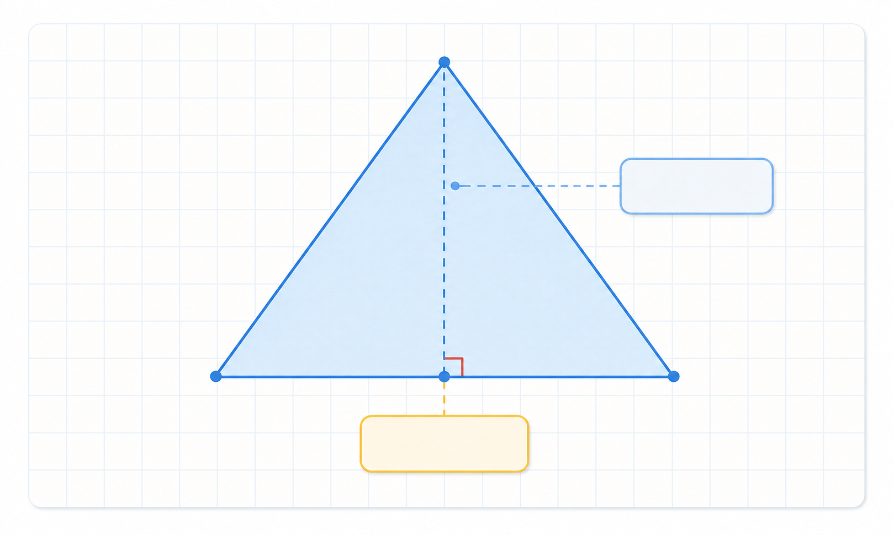

- Status: `generated`
- Grade/family: `P5` / `polygon-area`
- Need/kind: `core` / `area-grid`
- Prompt: 乐乐剪出一个三角形，底是6厘米，高是9厘米，面积是多少？

### pep-primary-p5-u-fi-062

Image pending: `candidates/P5/polygon-area/pep-primary-p5-u-fi-062.png`

- Status: `missing`
- Grade/family: `P5` / `polygon-area`
- Need/kind: `core` / `area-grid`
- Prompt: 运动场展示的三角形标着底8厘米、高4厘米。它的面积是多少？

### pep-primary-p5-u-fi-063

Image pending: `candidates/P5/polygon-area/pep-primary-p5-u-fi-063.png`

- Status: `missing`
- Grade/family: `P5` / `polygon-area`
- Need/kind: `core` / `area-grid`
- Prompt: 一块三角形纸板的底为10厘米，高为7厘米，面积是多少平方厘米？

### pep-primary-p5-u-fi-064

Image pending: `candidates/P5/polygon-area/pep-primary-p5-u-fi-064.png`

- Status: `missing`
- Grade/family: `P5` / `polygon-area`
- Need/kind: `core` / `area-grid`
- Prompt: 第64小组：一个三角形的底是10厘米，高是4厘米，面积是多少？

### pep-primary-p5-u-fi-065

Image pending: `candidates/P5/polygon-area/pep-primary-p5-u-fi-065.png`

- Status: `missing`
- Grade/family: `P5` / `polygon-area`
- Need/kind: `core` / `area-grid`
- Prompt: 第65小组：一个三角形的底是11厘米，高是6厘米，面积是多少？

### pep-primary-p5-u-fi-066

Image pending: `candidates/P5/polygon-area/pep-primary-p5-u-fi-066.png`

- Status: `missing`
- Grade/family: `P5` / `polygon-area`
- Need/kind: `core` / `area-grid`
- Prompt: 第66小组：一个三角形的底是12厘米，高是8厘米，面积是多少？

### pep-primary-p5-u-fi-067

Image pending: `candidates/P5/polygon-area/pep-primary-p5-u-fi-067.png`

- Status: `missing`
- Grade/family: `P5` / `polygon-area`
- Need/kind: `core` / `area-grid`
- Prompt: 第67小组：一个三角形的底是13厘米，高是10厘米，面积是多少？

### pep-primary-p5-u-fi-068

Image pending: `candidates/P5/polygon-area/pep-primary-p5-u-fi-068.png`

- Status: `missing`
- Grade/family: `P5` / `polygon-area`
- Need/kind: `core` / `area-grid`
- Prompt: 第68小组：一个三角形的底是14厘米，高是4厘米，面积是多少？

### pep-primary-p5-u-fi-069

Image pending: `candidates/P5/polygon-area/pep-primary-p5-u-fi-069.png`

- Status: `missing`
- Grade/family: `P5` / `polygon-area`
- Need/kind: `core` / `area-grid`
- Prompt: 第69小组：一个三角形的底是15厘米，高是6厘米，面积是多少？

### pep-primary-p5-u-fi-070

Image pending: `candidates/P5/polygon-area/pep-primary-p5-u-fi-070.png`

- Status: `missing`
- Grade/family: `P5` / `polygon-area`
- Need/kind: `core` / `area-grid`
- Prompt: 第70小组：一个三角形的底是6厘米，高是8厘米，面积是多少？

### pep-primary-p5-u-fi-071

Image pending: `candidates/P5/polygon-area/pep-primary-p5-u-fi-071.png`

- Status: `missing`
- Grade/family: `P5` / `polygon-area`
- Need/kind: `core` / `area-grid`
- Prompt: 第71小组：一个三角形的底是7厘米，高是10厘米，面积是多少？

### pep-primary-p5-u-fi-072

Image pending: `candidates/P5/polygon-area/pep-primary-p5-u-fi-072.png`

- Status: `missing`
- Grade/family: `P5` / `polygon-area`
- Need/kind: `core` / `area-grid`
- Prompt: 第72小组：一个三角形的底是8厘米，高是4厘米，面积是多少？

### pep-primary-p5-u-fi-073

Image pending: `candidates/P5/polygon-area/pep-primary-p5-u-fi-073.png`

- Status: `missing`
- Grade/family: `P5` / `polygon-area`
- Need/kind: `core` / `area-grid`
- Prompt: 第73小组：一个三角形的底是9厘米，高是6厘米，面积是多少？

### pep-primary-p5-u-fi-074

Image pending: `candidates/P5/polygon-area/pep-primary-p5-u-fi-074.png`

- Status: `missing`
- Grade/family: `P5` / `polygon-area`
- Need/kind: `core` / `area-grid`
- Prompt: 浩浩剪出一个三角形，底是12厘米，高是6厘米，面积是多少？

### pep-primary-p5-u-fi-075

Image pending: `candidates/P5/polygon-area/pep-primary-p5-u-fi-075.png`

- Status: `missing`
- Grade/family: `P5` / `polygon-area`
- Need/kind: `core` / `area-grid`
- Prompt: 第75小组：一个三角形的底是11厘米，高是10厘米，面积是多少？

### pep-primary-p5-u-fi-076

Image pending: `candidates/P5/polygon-area/pep-primary-p5-u-fi-076.png`

- Status: `missing`
- Grade/family: `P5` / `polygon-area`
- Need/kind: `core` / `area-grid`
- Prompt: 第76小组：一个三角形的底是12厘米，高是4厘米，面积是多少？

### pep-primary-p5-u-fi-077

Image pending: `candidates/P5/polygon-area/pep-primary-p5-u-fi-077.png`

- Status: `missing`
- Grade/family: `P5` / `polygon-area`
- Need/kind: `core` / `area-grid`
- Prompt: 第77小组：一个三角形的底是13厘米，高是6厘米，面积是多少？

### pep-primary-p5-u-fi-078

Image pending: `candidates/P5/polygon-area/pep-primary-p5-u-fi-078.png`

- Status: `missing`
- Grade/family: `P5` / `polygon-area`
- Need/kind: `core` / `area-grid`
- Prompt: 第78小组：一个三角形的底是14厘米，高是8厘米，面积是多少？

### pep-primary-p5-u-fi-079

Image pending: `candidates/P5/polygon-area/pep-primary-p5-u-fi-079.png`

- Status: `missing`
- Grade/family: `P5` / `polygon-area`
- Need/kind: `core` / `area-grid`
- Prompt: 第79小组：一个三角形的底是15厘米，高是10厘米，面积是多少？

### pep-primary-p5-u-fi-080

Image pending: `candidates/P5/polygon-area/pep-primary-p5-u-fi-080.png`

- Status: `missing`
- Grade/family: `P5` / `polygon-area`
- Need/kind: `core` / `area-grid`
- Prompt: 第80小组：一个三角形的底是6厘米，高是4厘米，面积是多少？

### pep-primary-p5-u-fi-081

Image pending: `candidates/P5/polygon-area/pep-primary-p5-u-fi-081.png`

- Status: `missing`
- Grade/family: `P5` / `polygon-area`
- Need/kind: `core` / `area-grid`
- Prompt: 第81小组：一个三角形的底是7厘米，高是6厘米，面积是多少？

### pep-primary-p5-u-fi-082

Image pending: `candidates/P5/polygon-area/pep-primary-p5-u-fi-082.png`

- Status: `missing`
- Grade/family: `P5` / `polygon-area`
- Need/kind: `core` / `area-grid`
- Prompt: 第82小组：一个三角形的底是8厘米，高是8厘米，面积是多少？

### pep-primary-p5-u-fi-083

Image pending: `candidates/P5/polygon-area/pep-primary-p5-u-fi-083.png`

- Status: `missing`
- Grade/family: `P5` / `polygon-area`
- Need/kind: `core` / `area-grid`
- Prompt: 第83小组：一个三角形的底是9厘米，高是10厘米，面积是多少？

### pep-primary-p5-u-fi-084

Image pending: `candidates/P5/polygon-area/pep-primary-p5-u-fi-084.png`

- Status: `missing`
- Grade/family: `P5` / `polygon-area`
- Need/kind: `core` / `area-grid`
- Prompt: 第84小组：一个三角形的底是10厘米，高是4厘米，面积是多少？

### pep-primary-p5-u-fi-085

Image pending: `candidates/P5/polygon-area/pep-primary-p5-u-fi-085.png`

- Status: `missing`
- Grade/family: `P5` / `polygon-area`
- Need/kind: `core` / `area-grid`
- Prompt: 第85小组：一个三角形的底是11厘米，高是6厘米，面积是多少？

### pep-primary-p5-u-fi-086

Image pending: `candidates/P5/polygon-area/pep-primary-p5-u-fi-086.png`

- Status: `missing`
- Grade/family: `P5` / `polygon-area`
- Need/kind: `core` / `area-grid`
- Prompt: 第86小组：一个三角形的底是12厘米，高是8厘米，面积是多少？

### pep-primary-p5-u-fi-087

Image pending: `candidates/P5/polygon-area/pep-primary-p5-u-fi-087.png`

- Status: `missing`
- Grade/family: `P5` / `polygon-area`
- Need/kind: `core` / `area-grid`
- Prompt: 图书角展示的三角形标着底6厘米、高9厘米。它的面积是多少？

### pep-primary-p5-u-fi-088

Image pending: `candidates/P5/polygon-area/pep-primary-p5-u-fi-088.png`

- Status: `missing`
- Grade/family: `P5` / `polygon-area`
- Need/kind: `core` / `area-grid`
- Prompt: 第88小组：一个三角形的底是14厘米，高是4厘米，面积是多少？

### pep-primary-p5-u-fi-089

Image pending: `candidates/P5/polygon-area/pep-primary-p5-u-fi-089.png`

- Status: `missing`
- Grade/family: `P5` / `polygon-area`
- Need/kind: `core` / `area-grid`
- Prompt: 第89小组：一个三角形的底是15厘米，高是6厘米，面积是多少？

### pep-primary-p5-u-fi-090

Image pending: `candidates/P5/polygon-area/pep-primary-p5-u-fi-090.png`

- Status: `missing`
- Grade/family: `P5` / `polygon-area`
- Need/kind: `core` / `area-grid`
- Prompt: 第90小组：一个三角形的底是6厘米，高是8厘米，面积是多少？

### pep-primary-p5-u-fi-091

Image pending: `candidates/P5/polygon-area/pep-primary-p5-u-fi-091.png`

- Status: `missing`
- Grade/family: `P5` / `polygon-area`
- Need/kind: `core` / `area-grid`
- Prompt: 第91小组：一个三角形的底是7厘米，高是10厘米，面积是多少？

### pep-primary-p5-u-fi-092

Image pending: `candidates/P5/polygon-area/pep-primary-p5-u-fi-092.png`

- Status: `missing`
- Grade/family: `P5` / `polygon-area`
- Need/kind: `core` / `area-grid`
- Prompt: 第92小组：一个三角形的底是8厘米，高是4厘米，面积是多少？

### pep-primary-p5-u-fi-093

Image pending: `candidates/P5/polygon-area/pep-primary-p5-u-fi-093.png`

- Status: `missing`
- Grade/family: `P5` / `polygon-area`
- Need/kind: `core` / `area-grid`
- Prompt: 第93小组：一个三角形的底是9厘米，高是6厘米，面积是多少？

### pep-primary-p5-u-fi-094

Image pending: `candidates/P5/polygon-area/pep-primary-p5-u-fi-094.png`

- Status: `missing`
- Grade/family: `P5` / `polygon-area`
- Need/kind: `core` / `area-grid`
- Prompt: 第94小组：一个三角形的底是10厘米，高是8厘米，面积是多少？

### pep-primary-p5-u-fi-095

Image pending: `candidates/P5/polygon-area/pep-primary-p5-u-fi-095.png`

- Status: `missing`
- Grade/family: `P5` / `polygon-area`
- Need/kind: `core` / `area-grid`
- Prompt: 第95小组：一个三角形的底是11厘米，高是10厘米，面积是多少？

### pep-primary-p5-u-fi-096

Image pending: `candidates/P5/polygon-area/pep-primary-p5-u-fi-096.png`

- Status: `missing`
- Grade/family: `P5` / `polygon-area`
- Need/kind: `core` / `area-grid`
- Prompt: 第96小组：一个三角形的底是12厘米，高是4厘米，面积是多少？

### pep-primary-p5-u-fi-097

Image pending: `candidates/P5/polygon-area/pep-primary-p5-u-fi-097.png`

- Status: `missing`
- Grade/family: `P5` / `polygon-area`
- Need/kind: `core` / `area-grid`
- Prompt: 第97小组：一个三角形的底是13厘米，高是6厘米，面积是多少？

### pep-primary-p5-u-fi-098

Image pending: `candidates/P5/polygon-area/pep-primary-p5-u-fi-098.png`

- Status: `missing`
- Grade/family: `P5` / `polygon-area`
- Need/kind: `core` / `area-grid`
- Prompt: 第98小组：一个三角形的底是14厘米，高是8厘米，面积是多少？

### pep-primary-p5-u-fi-099

Image pending: `candidates/P5/polygon-area/pep-primary-p5-u-fi-099.png`

- Status: `missing`
- Grade/family: `P5` / `polygon-area`
- Need/kind: `core` / `area-grid`
- Prompt: 第99小组：一个三角形的底是15厘米，高是10厘米，面积是多少？

### pep-primary-p5-u-fi-100

Image pending: `candidates/P5/polygon-area/pep-primary-p5-u-fi-100.png`

- Status: `missing`
- Grade/family: `P5` / `polygon-area`
- Need/kind: `core` / `area-grid`
- Prompt: 一块三角形纸板的底为10厘米，高为4厘米，面积是多少平方厘米？

### pep-primary-p5-u-mc-051

Image pending: `candidates/P5/polygon-area/pep-primary-p5-u-mc-051.png`

- Status: `missing`
- Grade/family: `P5` / `polygon-area`
- Need/kind: `core` / `area-grid`
- Prompt: 第51小组：一个三角形的底是7厘米，高是10厘米，面积是多少？

### pep-primary-p5-u-mc-052

Image pending: `candidates/P5/polygon-area/pep-primary-p5-u-mc-052.png`

- Status: `missing`
- Grade/family: `P5` / `polygon-area`
- Need/kind: `core` / `area-grid`
- Prompt: 第52小组：一个三角形的底是8厘米，高是4厘米，面积是多少？

### pep-primary-p5-u-mc-053

Image pending: `candidates/P5/polygon-area/pep-primary-p5-u-mc-053.png`

- Status: `missing`
- Grade/family: `P5` / `polygon-area`
- Need/kind: `core` / `area-grid`
- Prompt: 第53小组：一个三角形的底是9厘米，高是6厘米，面积是多少？

### pep-primary-p5-u-mc-054

Image pending: `candidates/P5/polygon-area/pep-primary-p5-u-mc-054.png`

- Status: `missing`
- Grade/family: `P5` / `polygon-area`
- Need/kind: `core` / `area-grid`
- Prompt: 第54小组：一个三角形的底是10厘米，高是8厘米，面积是多少？

### pep-primary-p5-u-mc-055

Image pending: `candidates/P5/polygon-area/pep-primary-p5-u-mc-055.png`

- Status: `missing`
- Grade/family: `P5` / `polygon-area`
- Need/kind: `core` / `area-grid`
- Prompt: 第55小组：一个三角形的底是11厘米，高是10厘米，面积是多少？

### pep-primary-p5-u-mc-056

Image pending: `candidates/P5/polygon-area/pep-primary-p5-u-mc-056.png`

- Status: `missing`
- Grade/family: `P5` / `polygon-area`
- Need/kind: `core` / `area-grid`
- Prompt: 第56小组：一个三角形的底是12厘米，高是4厘米，面积是多少？

### pep-primary-p5-u-mc-057

Image pending: `candidates/P5/polygon-area/pep-primary-p5-u-mc-057.png`

- Status: `missing`
- Grade/family: `P5` / `polygon-area`
- Need/kind: `core` / `area-grid`
- Prompt: 第57小组：一个三角形的底是13厘米，高是6厘米，面积是多少？

### pep-primary-p5-u-mc-058

Image pending: `candidates/P5/polygon-area/pep-primary-p5-u-mc-058.png`

- Status: `missing`
- Grade/family: `P5` / `polygon-area`
- Need/kind: `core` / `area-grid`
- Prompt: 第58小组：一个三角形的底是14厘米，高是8厘米，面积是多少？

### pep-primary-p5-u-mc-059

Image pending: `candidates/P5/polygon-area/pep-primary-p5-u-mc-059.png`

- Status: `missing`
- Grade/family: `P5` / `polygon-area`
- Need/kind: `core` / `area-grid`
- Prompt: 第59小组：一个三角形的底是15厘米，高是10厘米，面积是多少？

### pep-primary-p5-u-mc-060

Image pending: `candidates/P5/polygon-area/pep-primary-p5-u-mc-060.png`

- Status: `missing`
- Grade/family: `P5` / `polygon-area`
- Need/kind: `core` / `area-grid`
- Prompt: 第60小组：一个三角形的底是6厘米，高是4厘米，面积是多少？

## P5 / volume-data

### pep-primary-p5-l-sa-151

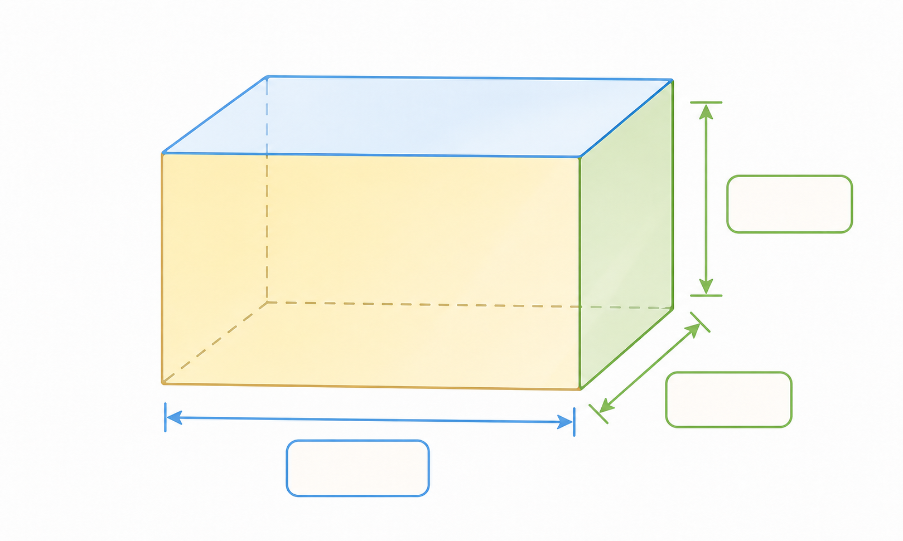

- Status: `generated`
- Grade/family: `P5` / `volume-data`
- Need/kind: `core` / `solid`
- Prompt: 第151小组：一个长方体长4厘米、宽4厘米、高3厘米，体积是多少？

### pep-primary-p5-l-sa-152

Image pending: `candidates/P5/volume-data/pep-primary-p5-l-sa-152.png`

- Status: `missing`
- Grade/family: `P5` / `volume-data`
- Need/kind: `core` / `solid`
- Prompt: 第152小组：一个长方体长5厘米、宽6厘米、高2厘米，体积是多少？

### pep-primary-p5-l-sa-153

Image pending: `candidates/P5/volume-data/pep-primary-p5-l-sa-153.png`

- Status: `missing`
- Grade/family: `P5` / `volume-data`
- Need/kind: `core` / `solid`
- Prompt: 第153小组：一个长方体长6厘米、宽3厘米、高5厘米，体积是多少？

### pep-primary-p5-l-sa-154

Image pending: `candidates/P5/volume-data/pep-primary-p5-l-sa-154.png`

- Status: `missing`
- Grade/family: `P5` / `volume-data`
- Need/kind: `core` / `solid`
- Prompt: 浩浩搭了一个长方体，长7厘米、宽4厘米、高2厘米，体积是多少？

### pep-primary-p5-l-sa-155

Image pending: `candidates/P5/volume-data/pep-primary-p5-l-sa-155.png`

- Status: `missing`
- Grade/family: `P5` / `volume-data`
- Need/kind: `core` / `solid`
- Prompt: 第155小组：一个长方体长8厘米、宽2厘米、高3厘米，体积是多少？

### pep-primary-p5-l-sa-156

Image pending: `candidates/P5/volume-data/pep-primary-p5-l-sa-156.png`

- Status: `missing`
- Grade/family: `P5` / `volume-data`
- Need/kind: `core` / `solid`
- Prompt: 第156小组：一个长方体长3厘米、宽4厘米、高2厘米，体积是多少？

### pep-primary-p5-l-sa-157

Image pending: `candidates/P5/volume-data/pep-primary-p5-l-sa-157.png`

- Status: `missing`
- Grade/family: `P5` / `volume-data`
- Need/kind: `core` / `solid`
- Prompt: 第157小组：一个长方体长4厘米、宽6厘米、高5厘米，体积是多少？

### pep-primary-p5-l-sa-158

Image pending: `candidates/P5/volume-data/pep-primary-p5-l-sa-158.png`

- Status: `missing`
- Grade/family: `P5` / `volume-data`
- Need/kind: `core` / `solid`
- Prompt: 第158小组：一个长方体长5厘米、宽3厘米、高4厘米，体积是多少？

### pep-primary-p5-l-sa-159

Image pending: `candidates/P5/volume-data/pep-primary-p5-l-sa-159.png`

- Status: `missing`
- Grade/family: `P5` / `volume-data`
- Need/kind: `core` / `solid`
- Prompt: 第159小组：一个长方体长6厘米、宽5厘米、高3厘米，体积是多少？

### pep-primary-p5-l-sa-160

Image pending: `candidates/P5/volume-data/pep-primary-p5-l-sa-160.png`

- Status: `missing`
- Grade/family: `P5` / `volume-data`
- Need/kind: `core` / `solid`
- Prompt: 第160小组：一个长方体长7厘米、宽2厘米、高2厘米，体积是多少？

### pep-primary-p5-l-sa-161

Image pending: `candidates/P5/volume-data/pep-primary-p5-l-sa-161.png`

- Status: `missing`
- Grade/family: `P5` / `volume-data`
- Need/kind: `core` / `solid`
- Prompt: 第161小组：一个长方体长8厘米、宽4厘米、高5厘米，体积是多少？

### pep-primary-p5-l-sa-162

Image pending: `candidates/P5/volume-data/pep-primary-p5-l-sa-162.png`

- Status: `missing`
- Grade/family: `P5` / `volume-data`
- Need/kind: `core` / `solid`
- Prompt: 第162小组：一个长方体长3厘米、宽6厘米、高4厘米，体积是多少？

### pep-primary-p5-l-sa-163

Image pending: `candidates/P5/volume-data/pep-primary-p5-l-sa-163.png`

- Status: `missing`
- Grade/family: `P5` / `volume-data`
- Need/kind: `core` / `solid`
- Prompt: 第163小组：一个长方体长4厘米、宽3厘米、高3厘米，体积是多少？

### pep-primary-p5-l-sa-164

Image pending: `candidates/P5/volume-data/pep-primary-p5-l-sa-164.png`

- Status: `missing`
- Grade/family: `P5` / `volume-data`
- Need/kind: `core` / `solid`
- Prompt: 第164小组：一个长方体长5厘米、宽5厘米、高2厘米，体积是多少？

### pep-primary-p5-l-sa-165

Image pending: `candidates/P5/volume-data/pep-primary-p5-l-sa-165.png`

- Status: `missing`
- Grade/family: `P5` / `volume-data`
- Need/kind: `core` / `solid`
- Prompt: 第165小组：一个长方体长6厘米、宽2厘米、高5厘米，体积是多少？

### pep-primary-p5-l-sa-166

Image pending: `candidates/P5/volume-data/pep-primary-p5-l-sa-166.png`

- Status: `missing`
- Grade/family: `P5` / `volume-data`
- Need/kind: `core` / `solid`
- Prompt: 第166小组：一个长方体长7厘米、宽4厘米、高4厘米，体积是多少？

### pep-primary-p5-l-sa-167

Image pending: `candidates/P5/volume-data/pep-primary-p5-l-sa-167.png`

- Status: `missing`
- Grade/family: `P5` / `volume-data`
- Need/kind: `core` / `solid`
- Prompt: 第167小组：一个长方体长8厘米、宽6厘米、高3厘米，体积是多少？

### pep-primary-p5-l-sa-168

Image pending: `candidates/P5/volume-data/pep-primary-p5-l-sa-168.png`

- Status: `missing`
- Grade/family: `P5` / `volume-data`
- Need/kind: `core` / `solid`
- Prompt: 第168小组：一个长方体长3厘米、宽3厘米、高2厘米，体积是多少？

### pep-primary-p5-l-sa-169

Image pending: `candidates/P5/volume-data/pep-primary-p5-l-sa-169.png`

- Status: `missing`
- Grade/family: `P5` / `volume-data`
- Need/kind: `core` / `solid`
- Prompt: 第169小组：一个长方体长4厘米、宽5厘米、高5厘米，体积是多少？

### pep-primary-p5-l-sa-170

Image pending: `candidates/P5/volume-data/pep-primary-p5-l-sa-170.png`

- Status: `missing`
- Grade/family: `P5` / `volume-data`
- Need/kind: `core` / `solid`
- Prompt: 第170小组：一个长方体长5厘米、宽2厘米、高4厘米，体积是多少？

### pep-primary-p5-l-sa-171

Image pending: `candidates/P5/volume-data/pep-primary-p5-l-sa-171.png`

- Status: `missing`
- Grade/family: `P5` / `volume-data`
- Need/kind: `core` / `solid`
- Prompt: 第171小组：一个长方体长6厘米、宽4厘米、高3厘米，体积是多少？

### pep-primary-p5-l-sa-172

Image pending: `candidates/P5/volume-data/pep-primary-p5-l-sa-172.png`

- Status: `missing`
- Grade/family: `P5` / `volume-data`
- Need/kind: `core` / `solid`
- Prompt: 第172小组：一个长方体长7厘米、宽6厘米、高2厘米，体积是多少？

### pep-primary-p5-l-sa-173

Image pending: `candidates/P5/volume-data/pep-primary-p5-l-sa-173.png`

- Status: `missing`
- Grade/family: `P5` / `volume-data`
- Need/kind: `core` / `solid`
- Prompt: 第173小组：一个长方体长8厘米、宽3厘米、高5厘米，体积是多少？

### pep-primary-p5-l-sa-174

Image pending: `candidates/P5/volume-data/pep-primary-p5-l-sa-174.png`

- Status: `missing`
- Grade/family: `P5` / `volume-data`
- Need/kind: `core` / `solid`
- Prompt: 第174小组：一个长方体长3厘米、宽5厘米、高4厘米，体积是多少？

### pep-primary-p5-l-sa-175

Image pending: `candidates/P5/volume-data/pep-primary-p5-l-sa-175.png`

- Status: `missing`
- Grade/family: `P5` / `volume-data`
- Need/kind: `core` / `solid`
- Prompt: 第175小组：一个长方体长4厘米、宽2厘米、高3厘米，体积是多少？

### pep-primary-p5-l-sa-176

Image pending: `candidates/P5/volume-data/pep-primary-p5-l-sa-176.png`

- Status: `missing`
- Grade/family: `P5` / `volume-data`
- Need/kind: `core` / `solid`
- Prompt: 第176小组：一个长方体长5厘米、宽4厘米、高2厘米，体积是多少？

### pep-primary-p5-l-sa-177

Image pending: `candidates/P5/volume-data/pep-primary-p5-l-sa-177.png`

- Status: `missing`
- Grade/family: `P5` / `volume-data`
- Need/kind: `core` / `solid`
- Prompt: 阅读区有个长方体盒子，长7厘米、宽6厘米、高4厘米。它的体积是多少？

### pep-primary-p5-l-sa-178

Image pending: `candidates/P5/volume-data/pep-primary-p5-l-sa-178.png`

- Status: `missing`
- Grade/family: `P5` / `volume-data`
- Need/kind: `core` / `solid`
- Prompt: 第178小组：一个长方体长7厘米、宽3厘米、高4厘米，体积是多少？

### pep-primary-p5-l-sa-179

Image pending: `candidates/P5/volume-data/pep-primary-p5-l-sa-179.png`

- Status: `missing`
- Grade/family: `P5` / `volume-data`
- Need/kind: `core` / `solid`
- Prompt: 第179小组：一个长方体长8厘米、宽5厘米、高3厘米，体积是多少？

### pep-primary-p5-l-sa-180

Image pending: `candidates/P5/volume-data/pep-primary-p5-l-sa-180.png`

- Status: `missing`
- Grade/family: `P5` / `volume-data`
- Need/kind: `core` / `solid`
- Prompt: 第180小组：一个长方体长3厘米、宽2厘米、高2厘米，体积是多少？

### pep-primary-p5-l-sa-181

Image pending: `candidates/P5/volume-data/pep-primary-p5-l-sa-181.png`

- Status: `missing`
- Grade/family: `P5` / `volume-data`
- Need/kind: `core` / `solid`
- Prompt: 第181小组：一个长方体长4厘米、宽4厘米、高5厘米，体积是多少？

### pep-primary-p5-l-sa-182

Image pending: `candidates/P5/volume-data/pep-primary-p5-l-sa-182.png`

- Status: `missing`
- Grade/family: `P5` / `volume-data`
- Need/kind: `core` / `solid`
- Prompt: 第182小组：一个长方体长5厘米、宽6厘米、高4厘米，体积是多少？

### pep-primary-p5-l-sa-183

Image pending: `candidates/P5/volume-data/pep-primary-p5-l-sa-183.png`

- Status: `missing`
- Grade/family: `P5` / `volume-data`
- Need/kind: `core` / `solid`
- Prompt: 第183小组：一个长方体长6厘米、宽3厘米、高3厘米，体积是多少？

### pep-primary-p5-l-sa-184

Image pending: `candidates/P5/volume-data/pep-primary-p5-l-sa-184.png`

- Status: `missing`
- Grade/family: `P5` / `volume-data`
- Need/kind: `core` / `solid`
- Prompt: 第184小组：一个长方体长7厘米、宽5厘米、高2厘米，体积是多少？

### pep-primary-p5-l-sa-185

Image pending: `candidates/P5/volume-data/pep-primary-p5-l-sa-185.png`

- Status: `missing`
- Grade/family: `P5` / `volume-data`
- Need/kind: `core` / `solid`
- Prompt: 第185小组：一个长方体长8厘米、宽2厘米、高5厘米，体积是多少？

### pep-primary-p5-l-sa-186

Image pending: `candidates/P5/volume-data/pep-primary-p5-l-sa-186.png`

- Status: `missing`
- Grade/family: `P5` / `volume-data`
- Need/kind: `core` / `solid`
- Prompt: 第186小组：一个长方体长3厘米、宽4厘米、高4厘米，体积是多少？

### pep-primary-p5-l-sa-187

Image pending: `candidates/P5/volume-data/pep-primary-p5-l-sa-187.png`

- Status: `missing`
- Grade/family: `P5` / `volume-data`
- Need/kind: `core` / `solid`
- Prompt: 第187小组：一个长方体长4厘米、宽6厘米、高3厘米，体积是多少？

### pep-primary-p5-l-sa-188

Image pending: `candidates/P5/volume-data/pep-primary-p5-l-sa-188.png`

- Status: `missing`
- Grade/family: `P5` / `volume-data`
- Need/kind: `core` / `solid`
- Prompt: 第188小组：一个长方体长5厘米、宽3厘米、高2厘米，体积是多少？

### pep-primary-p5-l-sa-189

Image pending: `candidates/P5/volume-data/pep-primary-p5-l-sa-189.png`

- Status: `missing`
- Grade/family: `P5` / `volume-data`
- Need/kind: `core` / `solid`
- Prompt: 第189小组：一个长方体长6厘米、宽5厘米、高5厘米，体积是多少？

### pep-primary-p5-l-sa-190

Image pending: `candidates/P5/volume-data/pep-primary-p5-l-sa-190.png`

- Status: `missing`
- Grade/family: `P5` / `volume-data`
- Need/kind: `core` / `solid`
- Prompt: 第190小组：一个长方体长7厘米、宽2厘米、高4厘米，体积是多少？

### pep-primary-p5-l-sa-191

Image pending: `candidates/P5/volume-data/pep-primary-p5-l-sa-191.png`

- Status: `missing`
- Grade/family: `P5` / `volume-data`
- Need/kind: `core` / `solid`
- Prompt: 第191小组：一个长方体长8厘米、宽4厘米、高3厘米，体积是多少？

### pep-primary-p5-l-sa-192

Image pending: `candidates/P5/volume-data/pep-primary-p5-l-sa-192.png`

- Status: `missing`
- Grade/family: `P5` / `volume-data`
- Need/kind: `core` / `solid`
- Prompt: 第192小组：一个长方体长3厘米、宽6厘米、高2厘米，体积是多少？

### pep-primary-p5-l-sa-193

Image pending: `candidates/P5/volume-data/pep-primary-p5-l-sa-193.png`

- Status: `missing`
- Grade/family: `P5` / `volume-data`
- Need/kind: `core` / `solid`
- Prompt: 第193小组：一个长方体长4厘米、宽3厘米、高5厘米，体积是多少？

### pep-primary-p5-l-sa-194

Image pending: `candidates/P5/volume-data/pep-primary-p5-l-sa-194.png`

- Status: `missing`
- Grade/family: `P5` / `volume-data`
- Need/kind: `core` / `solid`
- Prompt: 第194小组：一个长方体长5厘米、宽5厘米、高4厘米，体积是多少？

### pep-primary-p5-l-sa-195

Image pending: `candidates/P5/volume-data/pep-primary-p5-l-sa-195.png`

- Status: `missing`
- Grade/family: `P5` / `volume-data`
- Need/kind: `core` / `solid`
- Prompt: 第195小组：一个长方体长6厘米、宽2厘米、高3厘米，体积是多少？

### pep-primary-p5-l-sa-196

Image pending: `candidates/P5/volume-data/pep-primary-p5-l-sa-196.png`

- Status: `missing`
- Grade/family: `P5` / `volume-data`
- Need/kind: `core` / `solid`
- Prompt: 第196小组：一个长方体长7厘米、宽4厘米、高2厘米，体积是多少？

### pep-primary-p5-l-sa-197

Image pending: `candidates/P5/volume-data/pep-primary-p5-l-sa-197.png`

- Status: `missing`
- Grade/family: `P5` / `volume-data`
- Need/kind: `core` / `solid`
- Prompt: 第197小组：一个长方体长8厘米、宽6厘米、高5厘米，体积是多少？

### pep-primary-p5-l-sa-198

Image pending: `candidates/P5/volume-data/pep-primary-p5-l-sa-198.png`

- Status: `missing`
- Grade/family: `P5` / `volume-data`
- Need/kind: `core` / `solid`
- Prompt: 第198小组：一个长方体长3厘米、宽3厘米、高4厘米，体积是多少？

### pep-primary-p5-l-sa-199

Image pending: `candidates/P5/volume-data/pep-primary-p5-l-sa-199.png`

- Status: `missing`
- Grade/family: `P5` / `volume-data`
- Need/kind: `core` / `solid`
- Prompt: 第199小组：一个长方体长4厘米、宽5厘米、高3厘米，体积是多少？

### pep-primary-p5-l-sa-200

Image pending: `candidates/P5/volume-data/pep-primary-p5-l-sa-200.png`

- Status: `missing`
- Grade/family: `P5` / `volume-data`
- Need/kind: `core` / `solid`
- Prompt: 一块长方体积木的长、宽、高分别是7厘米、3厘米、2厘米，体积是多少立方厘米？

## P6 / coordinate-data

### pep-primary-p6-u-fi-061

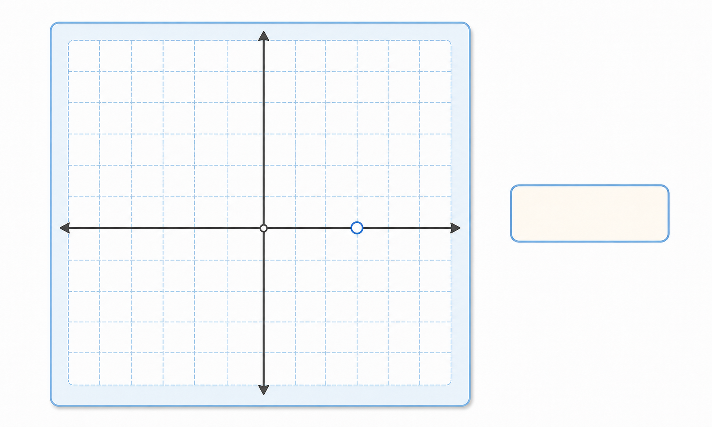

- Status: `generated`
- Grade/family: `P6` / `coordinate-data`
- Need/kind: `core` / `coordinate-plane`
- Prompt: 第61小组：点A的横坐标是2，纵坐标是0，请写出它的数对。

### pep-primary-p6-u-fi-062

Image pending: `candidates/P6/coordinate-data/pep-primary-p6-u-fi-062.png`

- Status: `missing`
- Grade/family: `P6` / `coordinate-data`
- Need/kind: `core` / `coordinate-plane`
- Prompt: 第62小组：点A的横坐标是3，纵坐标是2，请写出它的数对。

### pep-primary-p6-u-fi-063

Image pending: `candidates/P6/coordinate-data/pep-primary-p6-u-fi-063.png`

- Status: `missing`
- Grade/family: `P6` / `coordinate-data`
- Need/kind: `core` / `coordinate-plane`
- Prompt: 第63小组：点A的横坐标是-3，纵坐标是-2，请写出它的数对。

### pep-primary-p6-u-fi-064

Image pending: `candidates/P6/coordinate-data/pep-primary-p6-u-fi-064.png`

- Status: `missing`
- Grade/family: `P6` / `coordinate-data`
- Need/kind: `core` / `coordinate-plane`
- Prompt: 第64小组：点A的横坐标是-2，纵坐标是0，请写出它的数对。

### pep-primary-p6-u-fi-065

Image pending: `candidates/P6/coordinate-data/pep-primary-p6-u-fi-065.png`

- Status: `missing`
- Grade/family: `P6` / `coordinate-data`
- Need/kind: `core` / `coordinate-plane`
- Prompt: 第65小组：点A的横坐标是-1，纵坐标是2，请写出它的数对。

### pep-primary-p6-u-fi-066

Image pending: `candidates/P6/coordinate-data/pep-primary-p6-u-fi-066.png`

- Status: `missing`
- Grade/family: `P6` / `coordinate-data`
- Need/kind: `core` / `coordinate-plane`
- Prompt: 第66小组：点A的横坐标是0，纵坐标是-2，请写出它的数对。

### pep-primary-p6-u-fi-067

Image pending: `candidates/P6/coordinate-data/pep-primary-p6-u-fi-067.png`

- Status: `missing`
- Grade/family: `P6` / `coordinate-data`
- Need/kind: `core` / `coordinate-plane`
- Prompt: 第67小组：点A的横坐标是1，纵坐标是0，请写出它的数对。

### pep-primary-p6-u-fi-068

Image pending: `candidates/P6/coordinate-data/pep-primary-p6-u-fi-068.png`

- Status: `missing`
- Grade/family: `P6` / `coordinate-data`
- Need/kind: `core` / `coordinate-plane`
- Prompt: 第68小组：点A的横坐标是2，纵坐标是2，请写出它的数对。

### pep-primary-p6-u-fi-069

Image pending: `candidates/P6/coordinate-data/pep-primary-p6-u-fi-069.png`

- Status: `missing`
- Grade/family: `P6` / `coordinate-data`
- Need/kind: `core` / `coordinate-plane`
- Prompt: 第69小组：点A的横坐标是3，纵坐标是-2，请写出它的数对。

### pep-primary-p6-u-fi-070

Image pending: `candidates/P6/coordinate-data/pep-primary-p6-u-fi-070.png`

- Status: `missing`
- Grade/family: `P6` / `coordinate-data`
- Need/kind: `core` / `coordinate-plane`
- Prompt: 第70小组：点A的横坐标是-3，纵坐标是0，请写出它的数对。

### pep-primary-p6-u-fi-071

Image pending: `candidates/P6/coordinate-data/pep-primary-p6-u-fi-071.png`

- Status: `missing`
- Grade/family: `P6` / `coordinate-data`
- Need/kind: `core` / `coordinate-plane`
- Prompt: 第71小组：点A的横坐标是-2，纵坐标是2，请写出它的数对。

### pep-primary-p6-u-fi-072

Image pending: `candidates/P6/coordinate-data/pep-primary-p6-u-fi-072.png`

- Status: `missing`
- Grade/family: `P6` / `coordinate-data`
- Need/kind: `core` / `coordinate-plane`
- Prompt: 第72小组：点A的横坐标是-1，纵坐标是-2，请写出它的数对。

### pep-primary-p6-u-fi-073

Image pending: `candidates/P6/coordinate-data/pep-primary-p6-u-fi-073.png`

- Status: `missing`
- Grade/family: `P6` / `coordinate-data`
- Need/kind: `core` / `coordinate-plane`
- Prompt: 第73小组：点A的横坐标是0，纵坐标是0，请写出它的数对。

### pep-primary-p6-u-fi-074

Image pending: `candidates/P6/coordinate-data/pep-primary-p6-u-fi-074.png`

- Status: `missing`
- Grade/family: `P6` / `coordinate-data`
- Need/kind: `core` / `coordinate-plane`
- Prompt: 第74小组：点A的横坐标是1，纵坐标是2，请写出它的数对。

### pep-primary-p6-u-fi-075

Image pending: `candidates/P6/coordinate-data/pep-primary-p6-u-fi-075.png`

- Status: `missing`
- Grade/family: `P6` / `coordinate-data`
- Need/kind: `core` / `coordinate-plane`
- Prompt: 第75小组：点A的横坐标是2，纵坐标是-2，请写出它的数对。

### pep-primary-p6-u-fi-076

Image pending: `candidates/P6/coordinate-data/pep-primary-p6-u-fi-076.png`

- Status: `missing`
- Grade/family: `P6` / `coordinate-data`
- Need/kind: `core` / `coordinate-plane`
- Prompt: 第76小组：点A的横坐标是3，纵坐标是0，请写出它的数对。

### pep-primary-p6-u-fi-077

Image pending: `candidates/P6/coordinate-data/pep-primary-p6-u-fi-077.png`

- Status: `missing`
- Grade/family: `P6` / `coordinate-data`
- Need/kind: `core` / `coordinate-plane`
- Prompt: 第77小组：点A的横坐标是-3，纵坐标是2，请写出它的数对。

### pep-primary-p6-u-fi-078

Image pending: `candidates/P6/coordinate-data/pep-primary-p6-u-fi-078.png`

- Status: `missing`
- Grade/family: `P6` / `coordinate-data`
- Need/kind: `core` / `coordinate-plane`
- Prompt: 第78小组：点A的横坐标是-2，纵坐标是-2，请写出它的数对。

### pep-primary-p6-u-fi-079

Image pending: `candidates/P6/coordinate-data/pep-primary-p6-u-fi-079.png`

- Status: `missing`
- Grade/family: `P6` / `coordinate-data`
- Need/kind: `core` / `coordinate-plane`
- Prompt: 第79小组：点A的横坐标是-1，纵坐标是0，请写出它的数对。

### pep-primary-p6-u-fi-080

Image pending: `candidates/P6/coordinate-data/pep-primary-p6-u-fi-080.png`

- Status: `missing`
- Grade/family: `P6` / `coordinate-data`
- Need/kind: `core` / `coordinate-plane`
- Prompt: 第80小组：点A的横坐标是0，纵坐标是2，请写出它的数对。

### pep-primary-p6-u-fi-081

Image pending: `candidates/P6/coordinate-data/pep-primary-p6-u-fi-081.png`

- Status: `missing`
- Grade/family: `P6` / `coordinate-data`
- Need/kind: `core` / `coordinate-plane`
- Prompt: 第81小组：点A的横坐标是1，纵坐标是-2，请写出它的数对。

### pep-primary-p6-u-fi-082

Image pending: `candidates/P6/coordinate-data/pep-primary-p6-u-fi-082.png`

- Status: `missing`
- Grade/family: `P6` / `coordinate-data`
- Need/kind: `core` / `coordinate-plane`
- Prompt: 第82小组：点A的横坐标是2，纵坐标是0，请写出它的数对。

### pep-primary-p6-u-fi-083

Image pending: `candidates/P6/coordinate-data/pep-primary-p6-u-fi-083.png`

- Status: `missing`
- Grade/family: `P6` / `coordinate-data`
- Need/kind: `core` / `coordinate-plane`
- Prompt: 第83小组：点A的横坐标是3，纵坐标是2，请写出它的数对。

### pep-primary-p6-u-fi-084

Image pending: `candidates/P6/coordinate-data/pep-primary-p6-u-fi-084.png`

- Status: `missing`
- Grade/family: `P6` / `coordinate-data`
- Need/kind: `core` / `coordinate-plane`
- Prompt: 第84小组：点A的横坐标是-3，纵坐标是-2，请写出它的数对。

### pep-primary-p6-u-fi-085

Image pending: `candidates/P6/coordinate-data/pep-primary-p6-u-fi-085.png`

- Status: `missing`
- Grade/family: `P6` / `coordinate-data`
- Need/kind: `core` / `coordinate-plane`
- Prompt: 第85小组：点A的横坐标是-2，纵坐标是0，请写出它的数对。

### pep-primary-p6-u-fi-086

Image pending: `candidates/P6/coordinate-data/pep-primary-p6-u-fi-086.png`

- Status: `missing`
- Grade/family: `P6` / `coordinate-data`
- Need/kind: `core` / `coordinate-plane`
- Prompt: 第86小组：点A的横坐标是-1，纵坐标是2，请写出它的数对。

### pep-primary-p6-u-fi-087

Image pending: `candidates/P6/coordinate-data/pep-primary-p6-u-fi-087.png`

- Status: `missing`
- Grade/family: `P6` / `coordinate-data`
- Need/kind: `core` / `coordinate-plane`
- Prompt: 第87小组：点A的横坐标是0，纵坐标是-2，请写出它的数对。

### pep-primary-p6-u-fi-088

Image pending: `candidates/P6/coordinate-data/pep-primary-p6-u-fi-088.png`

- Status: `missing`
- Grade/family: `P6` / `coordinate-data`
- Need/kind: `core` / `coordinate-plane`
- Prompt: 第88小组：点A的横坐标是1，纵坐标是0，请写出它的数对。

### pep-primary-p6-u-fi-089

Image pending: `candidates/P6/coordinate-data/pep-primary-p6-u-fi-089.png`

- Status: `missing`
- Grade/family: `P6` / `coordinate-data`
- Need/kind: `core` / `coordinate-plane`
- Prompt: 第89小组：点A的横坐标是2，纵坐标是2，请写出它的数对。

### pep-primary-p6-u-fi-090

Image pending: `candidates/P6/coordinate-data/pep-primary-p6-u-fi-090.png`

- Status: `missing`
- Grade/family: `P6` / `coordinate-data`
- Need/kind: `core` / `coordinate-plane`
- Prompt: 第90小组：点A的横坐标是3，纵坐标是-2，请写出它的数对。

### pep-primary-p6-u-fi-091

Image pending: `candidates/P6/coordinate-data/pep-primary-p6-u-fi-091.png`

- Status: `missing`
- Grade/family: `P6` / `coordinate-data`
- Need/kind: `core` / `coordinate-plane`
- Prompt: 第91小组：点A的横坐标是-3，纵坐标是0，请写出它的数对。

### pep-primary-p6-u-fi-092

Image pending: `candidates/P6/coordinate-data/pep-primary-p6-u-fi-092.png`

- Status: `missing`
- Grade/family: `P6` / `coordinate-data`
- Need/kind: `core` / `coordinate-plane`
- Prompt: 第92小组：点A的横坐标是-2，纵坐标是2，请写出它的数对。

### pep-primary-p6-u-fi-093

Image pending: `candidates/P6/coordinate-data/pep-primary-p6-u-fi-093.png`

- Status: `missing`
- Grade/family: `P6` / `coordinate-data`
- Need/kind: `core` / `coordinate-plane`
- Prompt: 第93小组：点A的横坐标是-1，纵坐标是-2，请写出它的数对。

### pep-primary-p6-u-fi-094

Image pending: `candidates/P6/coordinate-data/pep-primary-p6-u-fi-094.png`

- Status: `missing`
- Grade/family: `P6` / `coordinate-data`
- Need/kind: `core` / `coordinate-plane`
- Prompt: 第94小组：点A的横坐标是0，纵坐标是0，请写出它的数对。

### pep-primary-p6-u-fi-095

Image pending: `candidates/P6/coordinate-data/pep-primary-p6-u-fi-095.png`

- Status: `missing`
- Grade/family: `P6` / `coordinate-data`
- Need/kind: `core` / `coordinate-plane`
- Prompt: 第95小组：点A的横坐标是1，纵坐标是2，请写出它的数对。

### pep-primary-p6-u-fi-096

Image pending: `candidates/P6/coordinate-data/pep-primary-p6-u-fi-096.png`

- Status: `missing`
- Grade/family: `P6` / `coordinate-data`
- Need/kind: `core` / `coordinate-plane`
- Prompt: 第96小组：点A的横坐标是2，纵坐标是-2，请写出它的数对。

### pep-primary-p6-u-fi-097

Image pending: `candidates/P6/coordinate-data/pep-primary-p6-u-fi-097.png`

- Status: `missing`
- Grade/family: `P6` / `coordinate-data`
- Need/kind: `core` / `coordinate-plane`
- Prompt: 第97小组：点A的横坐标是3，纵坐标是0，请写出它的数对。

### pep-primary-p6-u-fi-098

Image pending: `candidates/P6/coordinate-data/pep-primary-p6-u-fi-098.png`

- Status: `missing`
- Grade/family: `P6` / `coordinate-data`
- Need/kind: `core` / `coordinate-plane`
- Prompt: 第98小组：点A的横坐标是-3，纵坐标是2，请写出它的数对。

### pep-primary-p6-u-fi-099

Image pending: `candidates/P6/coordinate-data/pep-primary-p6-u-fi-099.png`

- Status: `missing`
- Grade/family: `P6` / `coordinate-data`
- Need/kind: `core` / `coordinate-plane`
- Prompt: 第99小组：点A的横坐标是-2，纵坐标是-2，请写出它的数对。

### pep-primary-p6-u-fi-100

Image pending: `candidates/P6/coordinate-data/pep-primary-p6-u-fi-100.png`

- Status: `missing`
- Grade/family: `P6` / `coordinate-data`
- Need/kind: `core` / `coordinate-plane`
- Prompt: 第100小组：点A的横坐标是-1，纵坐标是0，请写出它的数对。

### pep-primary-p6-u-mc-051

Image pending: `candidates/P6/coordinate-data/pep-primary-p6-u-mc-051.png`

- Status: `missing`
- Grade/family: `P6` / `coordinate-data`
- Need/kind: `core` / `coordinate-plane`
- Prompt: 第51小组：点A的横坐标是-1，纵坐标是-2，请写出它的数对。

### pep-primary-p6-u-mc-052

Image pending: `candidates/P6/coordinate-data/pep-primary-p6-u-mc-052.png`

- Status: `missing`
- Grade/family: `P6` / `coordinate-data`
- Need/kind: `core` / `coordinate-plane`
- Prompt: 第52小组：点A的横坐标是0，纵坐标是0，请写出它的数对。

### pep-primary-p6-u-mc-053

Image pending: `candidates/P6/coordinate-data/pep-primary-p6-u-mc-053.png`

- Status: `missing`
- Grade/family: `P6` / `coordinate-data`
- Need/kind: `core` / `coordinate-plane`
- Prompt: 第53小组：点A的横坐标是1，纵坐标是2，请写出它的数对。

### pep-primary-p6-u-mc-054

Image pending: `candidates/P6/coordinate-data/pep-primary-p6-u-mc-054.png`

- Status: `missing`
- Grade/family: `P6` / `coordinate-data`
- Need/kind: `core` / `coordinate-plane`
- Prompt: 第54小组：点A的横坐标是2，纵坐标是-2，请写出它的数对。

### pep-primary-p6-u-mc-055

Image pending: `candidates/P6/coordinate-data/pep-primary-p6-u-mc-055.png`

- Status: `missing`
- Grade/family: `P6` / `coordinate-data`
- Need/kind: `core` / `coordinate-plane`
- Prompt: 第55小组：点A的横坐标是3，纵坐标是0，请写出它的数对。

### pep-primary-p6-u-mc-056

Image pending: `candidates/P6/coordinate-data/pep-primary-p6-u-mc-056.png`

- Status: `missing`
- Grade/family: `P6` / `coordinate-data`
- Need/kind: `core` / `coordinate-plane`
- Prompt: 第56小组：点A的横坐标是-3，纵坐标是2，请写出它的数对。

### pep-primary-p6-u-mc-057

Image pending: `candidates/P6/coordinate-data/pep-primary-p6-u-mc-057.png`

- Status: `missing`
- Grade/family: `P6` / `coordinate-data`
- Need/kind: `core` / `coordinate-plane`
- Prompt: 第57小组：点A的横坐标是-2，纵坐标是-2，请写出它的数对。

### pep-primary-p6-u-mc-058

Image pending: `candidates/P6/coordinate-data/pep-primary-p6-u-mc-058.png`

- Status: `missing`
- Grade/family: `P6` / `coordinate-data`
- Need/kind: `core` / `coordinate-plane`
- Prompt: 第58小组：点A的横坐标是-1，纵坐标是0，请写出它的数对。

### pep-primary-p6-u-mc-059

Image pending: `candidates/P6/coordinate-data/pep-primary-p6-u-mc-059.png`

- Status: `missing`
- Grade/family: `P6` / `coordinate-data`
- Need/kind: `core` / `coordinate-plane`
- Prompt: 第59小组：点A的横坐标是0，纵坐标是2，请写出它的数对。

### pep-primary-p6-u-mc-060

Image pending: `candidates/P6/coordinate-data/pep-primary-p6-u-mc-060.png`

- Status: `missing`
- Grade/family: `P6` / `coordinate-data`
- Need/kind: `core` / `coordinate-plane`
- Prompt: 第60小组：点A的横坐标是1，纵坐标是-2，请写出它的数对。

## P6 / negative-review

### pep-primary-p6-l-sa-151

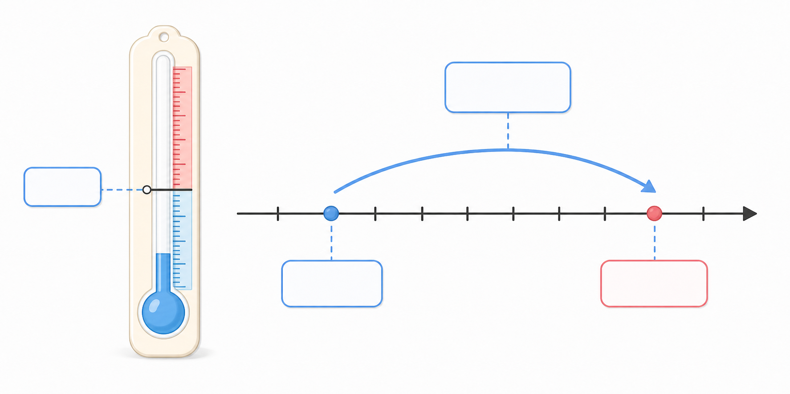

- Status: `generated`
- Grade/family: `P6` / `negative-review`
- Need/kind: `core` / `number-line`
- Prompt: 第151小组：气温是-3°C，升高9°C后是多少摄氏度？

### pep-primary-p6-l-sa-152

Image pending: `candidates/P6/negative-review/pep-primary-p6-l-sa-152.png`

- Status: `missing`
- Grade/family: `P6` / `negative-review`
- Need/kind: `core` / `number-line`
- Prompt: 第152小组：气温是-2°C，升高3°C后是多少摄氏度？

### pep-primary-p6-l-sa-153

Image pending: `candidates/P6/negative-review/pep-primary-p6-l-sa-153.png`

- Status: `missing`
- Grade/family: `P6` / `negative-review`
- Need/kind: `core` / `number-line`
- Prompt: 第153小组：气温是-1°C，升高5°C后是多少摄氏度？

### pep-primary-p6-l-sa-154

Image pending: `candidates/P6/negative-review/pep-primary-p6-l-sa-154.png`

- Status: `missing`
- Grade/family: `P6` / `negative-review`
- Need/kind: `core` / `number-line`
- Prompt: 第154小组：气温是0°C，升高7°C后是多少摄氏度？

### pep-primary-p6-l-sa-155

Image pending: `candidates/P6/negative-review/pep-primary-p6-l-sa-155.png`

- Status: `missing`
- Grade/family: `P6` / `negative-review`
- Need/kind: `core` / `number-line`
- Prompt: 第155小组：气温是1°C，升高9°C后是多少摄氏度？

### pep-primary-p6-l-sa-156

Image pending: `candidates/P6/negative-review/pep-primary-p6-l-sa-156.png`

- Status: `missing`
- Grade/family: `P6` / `negative-review`
- Need/kind: `core` / `number-line`
- Prompt: 第156小组：气温是-10°C，升高3°C后是多少摄氏度？

### pep-primary-p6-l-sa-157

Image pending: `candidates/P6/negative-review/pep-primary-p6-l-sa-157.png`

- Status: `missing`
- Grade/family: `P6` / `negative-review`
- Need/kind: `core` / `number-line`
- Prompt: 第157小组：气温是-9°C，升高5°C后是多少摄氏度？

### pep-primary-p6-l-sa-158

Image pending: `candidates/P6/negative-review/pep-primary-p6-l-sa-158.png`

- Status: `missing`
- Grade/family: `P6` / `negative-review`
- Need/kind: `core` / `number-line`
- Prompt: 第158小组：气温是-8°C，升高7°C后是多少摄氏度？

### pep-primary-p6-l-sa-159

Image pending: `candidates/P6/negative-review/pep-primary-p6-l-sa-159.png`

- Status: `missing`
- Grade/family: `P6` / `negative-review`
- Need/kind: `core` / `number-line`
- Prompt: 第159小组：气温是-7°C，升高9°C后是多少摄氏度？

### pep-primary-p6-l-sa-160

Image pending: `candidates/P6/negative-review/pep-primary-p6-l-sa-160.png`

- Status: `missing`
- Grade/family: `P6` / `negative-review`
- Need/kind: `core` / `number-line`
- Prompt: 第160小组：气温是-6°C，升高3°C后是多少摄氏度？

### pep-primary-p6-l-sa-161

Image pending: `candidates/P6/negative-review/pep-primary-p6-l-sa-161.png`

- Status: `missing`
- Grade/family: `P6` / `negative-review`
- Need/kind: `core` / `number-line`
- Prompt: 第161小组：气温是-5°C，升高5°C后是多少摄氏度？

### pep-primary-p6-l-sa-162

Image pending: `candidates/P6/negative-review/pep-primary-p6-l-sa-162.png`

- Status: `missing`
- Grade/family: `P6` / `negative-review`
- Need/kind: `core` / `number-line`
- Prompt: 第162小组：气温是-4°C，升高7°C后是多少摄氏度？

### pep-primary-p6-l-sa-163

Image pending: `candidates/P6/negative-review/pep-primary-p6-l-sa-163.png`

- Status: `missing`
- Grade/family: `P6` / `negative-review`
- Need/kind: `core` / `number-line`
- Prompt: 第163小组：气温是-3°C，升高9°C后是多少摄氏度？

### pep-primary-p6-l-sa-164

Image pending: `candidates/P6/negative-review/pep-primary-p6-l-sa-164.png`

- Status: `missing`
- Grade/family: `P6` / `negative-review`
- Need/kind: `core` / `number-line`
- Prompt: 第164小组：气温是-2°C，升高3°C后是多少摄氏度？

### pep-primary-p6-l-sa-165

Image pending: `candidates/P6/negative-review/pep-primary-p6-l-sa-165.png`

- Status: `missing`
- Grade/family: `P6` / `negative-review`
- Need/kind: `core` / `number-line`
- Prompt: 第165小组：气温是-1°C，升高5°C后是多少摄氏度？

### pep-primary-p6-l-sa-166

Image pending: `candidates/P6/negative-review/pep-primary-p6-l-sa-166.png`

- Status: `missing`
- Grade/family: `P6` / `negative-review`
- Need/kind: `core` / `number-line`
- Prompt: 第166小组：气温是0°C，升高7°C后是多少摄氏度？

### pep-primary-p6-l-sa-167

Image pending: `candidates/P6/negative-review/pep-primary-p6-l-sa-167.png`

- Status: `missing`
- Grade/family: `P6` / `negative-review`
- Need/kind: `core` / `number-line`
- Prompt: 第167小组：气温是1°C，升高9°C后是多少摄氏度？

### pep-primary-p6-l-sa-168

Image pending: `candidates/P6/negative-review/pep-primary-p6-l-sa-168.png`

- Status: `missing`
- Grade/family: `P6` / `negative-review`
- Need/kind: `core` / `number-line`
- Prompt: 第168小组：气温是-10°C，升高3°C后是多少摄氏度？

### pep-primary-p6-l-sa-169

Image pending: `candidates/P6/negative-review/pep-primary-p6-l-sa-169.png`

- Status: `missing`
- Grade/family: `P6` / `negative-review`
- Need/kind: `core` / `number-line`
- Prompt: 第169小组：气温是-9°C，升高5°C后是多少摄氏度？

### pep-primary-p6-l-sa-170

Image pending: `candidates/P6/negative-review/pep-primary-p6-l-sa-170.png`

- Status: `missing`
- Grade/family: `P6` / `negative-review`
- Need/kind: `core` / `number-line`
- Prompt: 第170小组：气温是-8°C，升高7°C后是多少摄氏度？

### pep-primary-p6-l-sa-171

Image pending: `candidates/P6/negative-review/pep-primary-p6-l-sa-171.png`

- Status: `missing`
- Grade/family: `P6` / `negative-review`
- Need/kind: `core` / `number-line`
- Prompt: 第171小组：气温是-7°C，升高9°C后是多少摄氏度？

### pep-primary-p6-l-sa-172

Image pending: `candidates/P6/negative-review/pep-primary-p6-l-sa-172.png`

- Status: `missing`
- Grade/family: `P6` / `negative-review`
- Need/kind: `core` / `number-line`
- Prompt: 第172小组：气温是-6°C，升高3°C后是多少摄氏度？

### pep-primary-p6-l-sa-173

Image pending: `candidates/P6/negative-review/pep-primary-p6-l-sa-173.png`

- Status: `missing`
- Grade/family: `P6` / `negative-review`
- Need/kind: `core` / `number-line`
- Prompt: 第173小组：气温是-5°C，升高5°C后是多少摄氏度？

### pep-primary-p6-l-sa-174

Image pending: `candidates/P6/negative-review/pep-primary-p6-l-sa-174.png`

- Status: `missing`
- Grade/family: `P6` / `negative-review`
- Need/kind: `core` / `number-line`
- Prompt: 第174小组：气温是-4°C，升高7°C后是多少摄氏度？

### pep-primary-p6-l-sa-175

Image pending: `candidates/P6/negative-review/pep-primary-p6-l-sa-175.png`

- Status: `missing`
- Grade/family: `P6` / `negative-review`
- Need/kind: `core` / `number-line`
- Prompt: 第175小组：气温是-3°C，升高9°C后是多少摄氏度？

### pep-primary-p6-l-sa-176

Image pending: `candidates/P6/negative-review/pep-primary-p6-l-sa-176.png`

- Status: `missing`
- Grade/family: `P6` / `negative-review`
- Need/kind: `core` / `number-line`
- Prompt: 第176小组：气温是-2°C，升高3°C后是多少摄氏度？

### pep-primary-p6-l-sa-177

Image pending: `candidates/P6/negative-review/pep-primary-p6-l-sa-177.png`

- Status: `missing`
- Grade/family: `P6` / `negative-review`
- Need/kind: `core` / `number-line`
- Prompt: 第177小组：气温是-1°C，升高5°C后是多少摄氏度？

### pep-primary-p6-l-sa-178

Image pending: `candidates/P6/negative-review/pep-primary-p6-l-sa-178.png`

- Status: `missing`
- Grade/family: `P6` / `negative-review`
- Need/kind: `core` / `number-line`
- Prompt: 第178小组：气温是0°C，升高7°C后是多少摄氏度？

### pep-primary-p6-l-sa-179

Image pending: `candidates/P6/negative-review/pep-primary-p6-l-sa-179.png`

- Status: `missing`
- Grade/family: `P6` / `negative-review`
- Need/kind: `core` / `number-line`
- Prompt: 第179小组：气温是1°C，升高9°C后是多少摄氏度？

### pep-primary-p6-l-sa-180

Image pending: `candidates/P6/negative-review/pep-primary-p6-l-sa-180.png`

- Status: `missing`
- Grade/family: `P6` / `negative-review`
- Need/kind: `core` / `number-line`
- Prompt: 第180小组：气温是-10°C，升高3°C后是多少摄氏度？

### pep-primary-p6-l-sa-181

Image pending: `candidates/P6/negative-review/pep-primary-p6-l-sa-181.png`

- Status: `missing`
- Grade/family: `P6` / `negative-review`
- Need/kind: `core` / `number-line`
- Prompt: 第181小组：气温是-9°C，升高5°C后是多少摄氏度？

### pep-primary-p6-l-sa-182

Image pending: `candidates/P6/negative-review/pep-primary-p6-l-sa-182.png`

- Status: `missing`
- Grade/family: `P6` / `negative-review`
- Need/kind: `core` / `number-line`
- Prompt: 第182小组：气温是-8°C，升高7°C后是多少摄氏度？

### pep-primary-p6-l-sa-183

Image pending: `candidates/P6/negative-review/pep-primary-p6-l-sa-183.png`

- Status: `missing`
- Grade/family: `P6` / `negative-review`
- Need/kind: `core` / `number-line`
- Prompt: 第183小组：气温是-7°C，升高9°C后是多少摄氏度？

### pep-primary-p6-l-sa-184

Image pending: `candidates/P6/negative-review/pep-primary-p6-l-sa-184.png`

- Status: `missing`
- Grade/family: `P6` / `negative-review`
- Need/kind: `core` / `number-line`
- Prompt: 第184小组：气温是-6°C，升高3°C后是多少摄氏度？

### pep-primary-p6-l-sa-185

Image pending: `candidates/P6/negative-review/pep-primary-p6-l-sa-185.png`

- Status: `missing`
- Grade/family: `P6` / `negative-review`
- Need/kind: `core` / `number-line`
- Prompt: 第185小组：气温是-5°C，升高5°C后是多少摄氏度？

### pep-primary-p6-l-sa-186

Image pending: `candidates/P6/negative-review/pep-primary-p6-l-sa-186.png`

- Status: `missing`
- Grade/family: `P6` / `negative-review`
- Need/kind: `core` / `number-line`
- Prompt: 第186小组：气温是-4°C，升高7°C后是多少摄氏度？

### pep-primary-p6-l-sa-187

Image pending: `candidates/P6/negative-review/pep-primary-p6-l-sa-187.png`

- Status: `missing`
- Grade/family: `P6` / `negative-review`
- Need/kind: `core` / `number-line`
- Prompt: 第187小组：气温是-3°C，升高9°C后是多少摄氏度？

### pep-primary-p6-l-sa-188

Image pending: `candidates/P6/negative-review/pep-primary-p6-l-sa-188.png`

- Status: `missing`
- Grade/family: `P6` / `negative-review`
- Need/kind: `core` / `number-line`
- Prompt: 第188小组：气温是-2°C，升高3°C后是多少摄氏度？

### pep-primary-p6-l-sa-189

Image pending: `candidates/P6/negative-review/pep-primary-p6-l-sa-189.png`

- Status: `missing`
- Grade/family: `P6` / `negative-review`
- Need/kind: `core` / `number-line`
- Prompt: 第189小组：气温是-1°C，升高5°C后是多少摄氏度？

### pep-primary-p6-l-sa-190

Image pending: `candidates/P6/negative-review/pep-primary-p6-l-sa-190.png`

- Status: `missing`
- Grade/family: `P6` / `negative-review`
- Need/kind: `core` / `number-line`
- Prompt: 第190小组：气温是0°C，升高7°C后是多少摄氏度？

### pep-primary-p6-l-sa-191

Image pending: `candidates/P6/negative-review/pep-primary-p6-l-sa-191.png`

- Status: `missing`
- Grade/family: `P6` / `negative-review`
- Need/kind: `core` / `number-line`
- Prompt: 第191小组：气温是1°C，升高9°C后是多少摄氏度？

### pep-primary-p6-l-sa-192

Image pending: `candidates/P6/negative-review/pep-primary-p6-l-sa-192.png`

- Status: `missing`
- Grade/family: `P6` / `negative-review`
- Need/kind: `core` / `number-line`
- Prompt: 第192小组：气温是-10°C，升高3°C后是多少摄氏度？

### pep-primary-p6-l-sa-193

Image pending: `candidates/P6/negative-review/pep-primary-p6-l-sa-193.png`

- Status: `missing`
- Grade/family: `P6` / `negative-review`
- Need/kind: `core` / `number-line`
- Prompt: 第193小组：气温是-9°C，升高5°C后是多少摄氏度？

### pep-primary-p6-l-sa-194

Image pending: `candidates/P6/negative-review/pep-primary-p6-l-sa-194.png`

- Status: `missing`
- Grade/family: `P6` / `negative-review`
- Need/kind: `core` / `number-line`
- Prompt: 第194小组：气温是-8°C，升高7°C后是多少摄氏度？

### pep-primary-p6-l-sa-195

Image pending: `candidates/P6/negative-review/pep-primary-p6-l-sa-195.png`

- Status: `missing`
- Grade/family: `P6` / `negative-review`
- Need/kind: `core` / `number-line`
- Prompt: 第195小组：气温是-7°C，升高9°C后是多少摄氏度？

### pep-primary-p6-l-sa-196

Image pending: `candidates/P6/negative-review/pep-primary-p6-l-sa-196.png`

- Status: `missing`
- Grade/family: `P6` / `negative-review`
- Need/kind: `core` / `number-line`
- Prompt: 第196小组：气温是-6°C，升高3°C后是多少摄氏度？

### pep-primary-p6-l-sa-197

Image pending: `candidates/P6/negative-review/pep-primary-p6-l-sa-197.png`

- Status: `missing`
- Grade/family: `P6` / `negative-review`
- Need/kind: `core` / `number-line`
- Prompt: 第197小组：气温是-5°C，升高5°C后是多少摄氏度？

### pep-primary-p6-l-sa-198

Image pending: `candidates/P6/negative-review/pep-primary-p6-l-sa-198.png`

- Status: `missing`
- Grade/family: `P6` / `negative-review`
- Need/kind: `core` / `number-line`
- Prompt: 第198小组：气温是-4°C，升高7°C后是多少摄氏度？

### pep-primary-p6-l-sa-199

Image pending: `candidates/P6/negative-review/pep-primary-p6-l-sa-199.png`

- Status: `missing`
- Grade/family: `P6` / `negative-review`
- Need/kind: `core` / `number-line`
- Prompt: 第199小组：气温是-3°C，升高9°C后是多少摄氏度？

### pep-primary-p6-l-sa-200

Image pending: `candidates/P6/negative-review/pep-primary-p6-l-sa-200.png`

- Status: `missing`
- Grade/family: `P6` / `negative-review`
- Need/kind: `core` / `number-line`
- Prompt: 第200小组：气温是-2°C，升高3°C后是多少摄氏度？

## P1 / addition-subtraction

### pep-primary-p1-l-fi-101

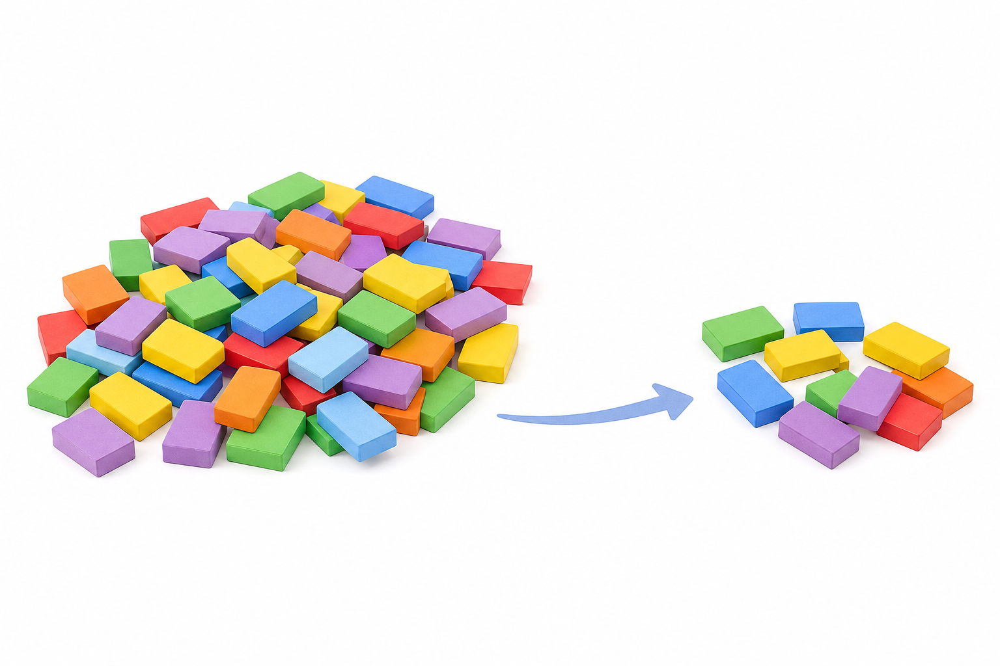

- Status: `generated`
- Grade/family: `P1` / `addition-subtraction`
- Need/kind: `recommended` / `counters`
- Prompt: 晨晨原来有66张积木，送出10张，现在有多少张？

### pep-primary-p1-l-fi-102

Image pending: `candidates/P1/addition-subtraction/pep-primary-p1-l-fi-102.png`

- Status: `missing`
- Grade/family: `P1` / `addition-subtraction`
- Need/kind: `recommended` / `counters`
- Prompt: 种植区记录了72个作品，后来撤下15个，现在记录多少个？

### pep-primary-p1-l-fi-103

Image pending: `candidates/P1/addition-subtraction/pep-primary-p1-l-fi-103.png`

- Status: `missing`
- Grade/family: `P1` / `addition-subtraction`
- Need/kind: `recommended` / `counters`
- Prompt: 一袋材料先有78个，活动中用掉20个，活动后有多少个？

### pep-primary-p1-l-fi-104

Image pending: `candidates/P1/addition-subtraction/pep-primary-p1-l-fi-104.png`

- Status: `missing`
- Grade/family: `P1` / `addition-subtraction`
- Need/kind: `recommended` / `counters`
- Prompt: 种植区记录了58个作品，后来撤下7个，现在记录多少个？

### pep-primary-p1-l-fi-105

Image pending: `candidates/P1/addition-subtraction/pep-primary-p1-l-fi-105.png`

- Status: `missing`
- Grade/family: `P1` / `addition-subtraction`
- Need/kind: `recommended` / `counters`
- Prompt: 一袋材料先有64个，活动中用掉12个，活动后有多少个？

### pep-primary-p1-l-fi-106

Image pending: `candidates/P1/addition-subtraction/pep-primary-p1-l-fi-106.png`

- Status: `missing`
- Grade/family: `P1` / `addition-subtraction`
- Need/kind: `recommended` / `counters`
- Prompt: 小林原来有70张练习本，送出17张，现在有多少张？

### pep-primary-p1-l-fi-107

Image pending: `candidates/P1/addition-subtraction/pep-primary-p1-l-fi-107.png`

- Status: `missing`
- Grade/family: `P1` / `addition-subtraction`
- Need/kind: `recommended` / `counters`
- Prompt: 手工桌记录了76个作品，后来撤下5个，现在记录多少个？

### pep-primary-p1-l-fi-108

Image pending: `candidates/P1/addition-subtraction/pep-primary-p1-l-fi-108.png`

- Status: `missing`
- Grade/family: `P1` / `addition-subtraction`
- Need/kind: `recommended` / `counters`
- Prompt: 一袋材料先有34个，活动中用掉10个，活动后有多少个？

### pep-primary-p1-l-fi-109

Image pending: `candidates/P1/addition-subtraction/pep-primary-p1-l-fi-109.png`

- Status: `missing`
- Grade/family: `P1` / `addition-subtraction`
- Need/kind: `recommended` / `counters`
- Prompt: 乐乐原来有40张奖章，送出15张，现在有多少张？

### pep-primary-p1-l-fi-110

Image pending: `candidates/P1/addition-subtraction/pep-primary-p1-l-fi-110.png`

- Status: `missing`
- Grade/family: `P1` / `addition-subtraction`
- Need/kind: `recommended` / `counters`
- Prompt: 第110小组：计算：50-14=？

### pep-primary-p1-l-fi-111

Image pending: `candidates/P1/addition-subtraction/pep-primary-p1-l-fi-111.png`

- Status: `missing`
- Grade/family: `P1` / `addition-subtraction`
- Need/kind: `recommended` / `counters`
- Prompt: 第111小组：计算：57+19=？

### pep-primary-p1-l-fi-112

Image pending: `candidates/P1/addition-subtraction/pep-primary-p1-l-fi-112.png`

- Status: `missing`
- Grade/family: `P1` / `addition-subtraction`
- Need/kind: `recommended` / `counters`
- Prompt: 第112小组：计算：64-6=？

### pep-primary-p1-l-fi-113

Image pending: `candidates/P1/addition-subtraction/pep-primary-p1-l-fi-113.png`

- Status: `missing`
- Grade/family: `P1` / `addition-subtraction`
- Need/kind: `recommended` / `counters`
- Prompt: 第113小组：计算：71+11=？

### pep-primary-p1-l-fi-114

Image pending: `candidates/P1/addition-subtraction/pep-primary-p1-l-fi-114.png`

- Status: `missing`
- Grade/family: `P1` / `addition-subtraction`
- Need/kind: `recommended` / `counters`
- Prompt: 第114小组：计算：78-16=？

### pep-primary-p1-l-fi-115

Image pending: `candidates/P1/addition-subtraction/pep-primary-p1-l-fi-115.png`

- Status: `missing`
- Grade/family: `P1` / `addition-subtraction`
- Need/kind: `recommended` / `counters`
- Prompt: 第115小组：计算：35+21=？

### pep-primary-p1-l-fi-116

Image pending: `candidates/P1/addition-subtraction/pep-primary-p1-l-fi-116.png`

- Status: `missing`
- Grade/family: `P1` / `addition-subtraction`
- Need/kind: `recommended` / `counters`
- Prompt: 第116小组：计算：42-8=？

### pep-primary-p1-l-fi-117

Image pending: `candidates/P1/addition-subtraction/pep-primary-p1-l-fi-117.png`

- Status: `missing`
- Grade/family: `P1` / `addition-subtraction`
- Need/kind: `recommended` / `counters`
- Prompt: 第117小组：计算：49+13=？

### pep-primary-p1-l-fi-118

Image pending: `candidates/P1/addition-subtraction/pep-primary-p1-l-fi-118.png`

- Status: `missing`
- Grade/family: `P1` / `addition-subtraction`
- Need/kind: `recommended` / `counters`
- Prompt: 第118小组：计算：56-18=？

### pep-primary-p1-l-fi-119

Image pending: `candidates/P1/addition-subtraction/pep-primary-p1-l-fi-119.png`

- Status: `missing`
- Grade/family: `P1` / `addition-subtraction`
- Need/kind: `recommended` / `counters`
- Prompt: 第119小组：计算：63+5=？

### pep-primary-p1-l-fi-120

Image pending: `candidates/P1/addition-subtraction/pep-primary-p1-l-fi-120.png`

- Status: `missing`
- Grade/family: `P1` / `addition-subtraction`
- Need/kind: `recommended` / `counters`
- Prompt: 第120小组：计算：70-10=？

### pep-primary-p1-l-fi-121

Image pending: `candidates/P1/addition-subtraction/pep-primary-p1-l-fi-121.png`

- Status: `missing`
- Grade/family: `P1` / `addition-subtraction`
- Need/kind: `recommended` / `counters`
- Prompt: 第121小组：计算：77+15=？

### pep-primary-p1-l-fi-122

Image pending: `candidates/P1/addition-subtraction/pep-primary-p1-l-fi-122.png`

- Status: `missing`
- Grade/family: `P1` / `addition-subtraction`
- Need/kind: `recommended` / `counters`
- Prompt: 第122小组：计算：34-20=？

### pep-primary-p1-l-fi-123

Image pending: `candidates/P1/addition-subtraction/pep-primary-p1-l-fi-123.png`

- Status: `missing`
- Grade/family: `P1` / `addition-subtraction`
- Need/kind: `recommended` / `counters`
- Prompt: 第123小组：计算：41+7=？

### pep-primary-p1-l-fi-124

Image pending: `candidates/P1/addition-subtraction/pep-primary-p1-l-fi-124.png`

- Status: `missing`
- Grade/family: `P1` / `addition-subtraction`
- Need/kind: `recommended` / `counters`
- Prompt: 小林原来有40张练习本，送出20张，现在有多少张？

### pep-primary-p1-l-fi-125

Image pending: `candidates/P1/addition-subtraction/pep-primary-p1-l-fi-125.png`

- Status: `missing`
- Grade/family: `P1` / `addition-subtraction`
- Need/kind: `recommended` / `counters`
- Prompt: 第125小组：计算：55+17=？

### pep-primary-p1-l-fi-126

Image pending: `candidates/P1/addition-subtraction/pep-primary-p1-l-fi-126.png`

- Status: `missing`
- Grade/family: `P1` / `addition-subtraction`
- Need/kind: `recommended` / `counters`
- Prompt: 第126小组：计算：62-4=？

### pep-primary-p1-l-fi-127

Image pending: `candidates/P1/addition-subtraction/pep-primary-p1-l-fi-127.png`

- Status: `missing`
- Grade/family: `P1` / `addition-subtraction`
- Need/kind: `recommended` / `counters`
- Prompt: 第127小组：计算：69+9=？

### pep-primary-p1-l-fi-128

Image pending: `candidates/P1/addition-subtraction/pep-primary-p1-l-fi-128.png`

- Status: `missing`
- Grade/family: `P1` / `addition-subtraction`
- Need/kind: `recommended` / `counters`
- Prompt: 第128小组：计算：76-14=？

### pep-primary-p1-l-fi-129

Image pending: `candidates/P1/addition-subtraction/pep-primary-p1-l-fi-129.png`

- Status: `missing`
- Grade/family: `P1` / `addition-subtraction`
- Need/kind: `recommended` / `counters`
- Prompt: 第129小组：计算：33+19=？

### pep-primary-p1-l-fi-130

Image pending: `candidates/P1/addition-subtraction/pep-primary-p1-l-fi-130.png`

- Status: `missing`
- Grade/family: `P1` / `addition-subtraction`
- Need/kind: `recommended` / `counters`
- Prompt: 第130小组：计算：40-6=？

### pep-primary-p1-l-fi-131

Image pending: `candidates/P1/addition-subtraction/pep-primary-p1-l-fi-131.png`

- Status: `missing`
- Grade/family: `P1` / `addition-subtraction`
- Need/kind: `recommended` / `counters`
- Prompt: 第131小组：计算：47+11=？

### pep-primary-p1-l-fi-132

Image pending: `candidates/P1/addition-subtraction/pep-primary-p1-l-fi-132.png`

- Status: `missing`
- Grade/family: `P1` / `addition-subtraction`
- Need/kind: `recommended` / `counters`
- Prompt: 第132小组：计算：54-16=？

### pep-primary-p1-l-fi-133

Image pending: `candidates/P1/addition-subtraction/pep-primary-p1-l-fi-133.png`

- Status: `missing`
- Grade/family: `P1` / `addition-subtraction`
- Need/kind: `recommended` / `counters`
- Prompt: 第133小组：计算：61+21=？

### pep-primary-p1-l-fi-134

Image pending: `candidates/P1/addition-subtraction/pep-primary-p1-l-fi-134.png`

- Status: `missing`
- Grade/family: `P1` / `addition-subtraction`
- Need/kind: `recommended` / `counters`
- Prompt: 第134小组：计算：68-8=？

### pep-primary-p1-l-fi-135

Image pending: `candidates/P1/addition-subtraction/pep-primary-p1-l-fi-135.png`

- Status: `missing`
- Grade/family: `P1` / `addition-subtraction`
- Need/kind: `recommended` / `counters`
- Prompt: 第135小组：计算：75+13=？

### pep-primary-p1-l-fi-136

Image pending: `candidates/P1/addition-subtraction/pep-primary-p1-l-fi-136.png`

- Status: `missing`
- Grade/family: `P1` / `addition-subtraction`
- Need/kind: `recommended` / `counters`
- Prompt: 第136小组：计算：32-18=？

### pep-primary-p1-l-fi-137

Image pending: `candidates/P1/addition-subtraction/pep-primary-p1-l-fi-137.png`

- Status: `missing`
- Grade/family: `P1` / `addition-subtraction`
- Need/kind: `recommended` / `counters`
- Prompt: 第137小组：计算：39+5=？

### pep-primary-p1-l-fi-138

Image pending: `candidates/P1/addition-subtraction/pep-primary-p1-l-fi-138.png`

- Status: `missing`
- Grade/family: `P1` / `addition-subtraction`
- Need/kind: `recommended` / `counters`
- Prompt: 第138小组：计算：46-10=？

### pep-primary-p1-l-fi-139

Image pending: `candidates/P1/addition-subtraction/pep-primary-p1-l-fi-139.png`

- Status: `missing`
- Grade/family: `P1` / `addition-subtraction`
- Need/kind: `recommended` / `counters`
- Prompt: 第139小组：计算：53+15=？

### pep-primary-p1-l-fi-140

Image pending: `candidates/P1/addition-subtraction/pep-primary-p1-l-fi-140.png`

- Status: `missing`
- Grade/family: `P1` / `addition-subtraction`
- Need/kind: `recommended` / `counters`
- Prompt: 第140小组：计算：60-20=？

### pep-primary-p1-l-fi-141

Image pending: `candidates/P1/addition-subtraction/pep-primary-p1-l-fi-141.png`

- Status: `missing`
- Grade/family: `P1` / `addition-subtraction`
- Need/kind: `recommended` / `counters`
- Prompt: 第141小组：计算：67+7=？

### pep-primary-p1-l-fi-142

Image pending: `candidates/P1/addition-subtraction/pep-primary-p1-l-fi-142.png`

- Status: `missing`
- Grade/family: `P1` / `addition-subtraction`
- Need/kind: `recommended` / `counters`
- Prompt: 第142小组：计算：74-12=？

### pep-primary-p1-l-fi-143

Image pending: `candidates/P1/addition-subtraction/pep-primary-p1-l-fi-143.png`

- Status: `missing`
- Grade/family: `P1` / `addition-subtraction`
- Need/kind: `recommended` / `counters`
- Prompt: 第143小组：计算：31+17=？

### pep-primary-p1-l-fi-144

Image pending: `candidates/P1/addition-subtraction/pep-primary-p1-l-fi-144.png`

- Status: `missing`
- Grade/family: `P1` / `addition-subtraction`
- Need/kind: `recommended` / `counters`
- Prompt: 第144小组：计算：38-4=？

### pep-primary-p1-l-fi-145

Image pending: `candidates/P1/addition-subtraction/pep-primary-p1-l-fi-145.png`

- Status: `missing`
- Grade/family: `P1` / `addition-subtraction`
- Need/kind: `recommended` / `counters`
- Prompt: 第145小组：计算：45+9=？

### pep-primary-p1-l-fi-146

Image pending: `candidates/P1/addition-subtraction/pep-primary-p1-l-fi-146.png`

- Status: `missing`
- Grade/family: `P1` / `addition-subtraction`
- Need/kind: `recommended` / `counters`
- Prompt: 第146小组：计算：52-14=？

### pep-primary-p1-l-fi-147

Image pending: `candidates/P1/addition-subtraction/pep-primary-p1-l-fi-147.png`

- Status: `missing`
- Grade/family: `P1` / `addition-subtraction`
- Need/kind: `recommended` / `counters`
- Prompt: 手工桌记录了60个作品，后来撤下11个，现在记录多少个？

### pep-primary-p1-l-fi-148

Image pending: `candidates/P1/addition-subtraction/pep-primary-p1-l-fi-148.png`

- Status: `missing`
- Grade/family: `P1` / `addition-subtraction`
- Need/kind: `recommended` / `counters`
- Prompt: 第148小组：计算：66-6=？

### pep-primary-p1-l-fi-149

Image pending: `candidates/P1/addition-subtraction/pep-primary-p1-l-fi-149.png`

- Status: `missing`
- Grade/family: `P1` / `addition-subtraction`
- Need/kind: `recommended` / `counters`
- Prompt: 第149小组：计算：73+11=？

### pep-primary-p1-l-fi-150

Image pending: `candidates/P1/addition-subtraction/pep-primary-p1-l-fi-150.png`

- Status: `missing`
- Grade/family: `P1` / `addition-subtraction`
- Need/kind: `recommended` / `counters`
- Prompt: 第150小组：计算：30-16=？

## P2 / division-remainder

### pep-primary-p2-l-fi-101

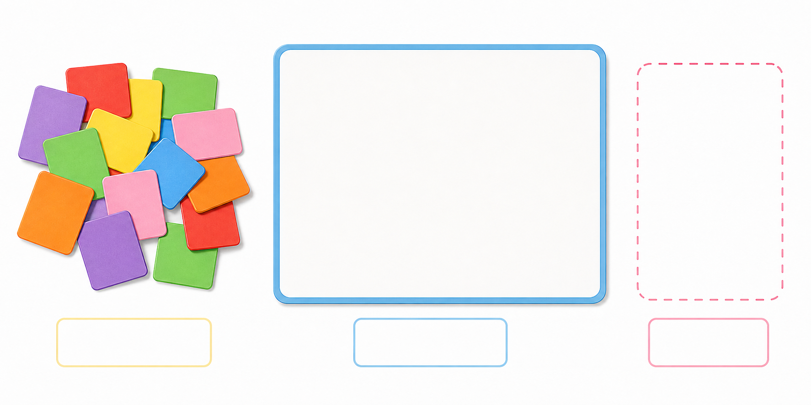

- Status: `generated`
- Grade/family: `P2` / `division-remainder`
- Need/kind: `recommended` / `sharing-groups`
- Prompt: 小林把23张卡片按每6张一份整理，商和余数是多少？

### pep-primary-p2-l-fi-102

Image pending: `candidates/P2/division-remainder/pep-primary-p2-l-fi-102.png`

- Status: `missing`
- Grade/family: `P2` / `division-remainder`
- Need/kind: `recommended` / `sharing-groups`
- Prompt: 晨晨把39张彩笔按每4张一份整理，商和余数是多少？

### pep-primary-p2-l-fi-103

Image pending: `candidates/P2/division-remainder/pep-primary-p2-l-fi-103.png`

- Status: `missing`
- Grade/family: `P2` / `division-remainder`
- Need/kind: `recommended` / `sharing-groups`
- Prompt: 第103小组：把47个物品按每组7个分组，商和余数是多少？

### pep-primary-p2-l-fi-104

Image pending: `candidates/P2/division-remainder/pep-primary-p2-l-fi-104.png`

- Status: `missing`
- Grade/family: `P2` / `division-remainder`
- Need/kind: `recommended` / `sharing-groups`
- Prompt: 种植区有54个材料，每7个装一袋，可以装几袋，还剩几个？

### pep-primary-p2-l-fi-105

Image pending: `candidates/P2/division-remainder/pep-primary-p2-l-fi-105.png`

- Status: `missing`
- Grade/family: `P2` / `division-remainder`
- Need/kind: `recommended` / `sharing-groups`
- Prompt: 第105小组：把7个物品按每组2个分组，商和余数是多少？

### pep-primary-p2-l-fi-106

Image pending: `candidates/P2/division-remainder/pep-primary-p2-l-fi-106.png`

- Status: `missing`
- Grade/family: `P2` / `division-remainder`
- Need/kind: `recommended` / `sharing-groups`
- Prompt: 第106小组：把16个物品按每组3个分组，商和余数是多少？

### pep-primary-p2-l-fi-107

Image pending: `candidates/P2/division-remainder/pep-primary-p2-l-fi-107.png`

- Status: `missing`
- Grade/family: `P2` / `division-remainder`
- Need/kind: `recommended` / `sharing-groups`
- Prompt: 第107小组：把31个物品按每组4个分组，商和余数是多少？

### pep-primary-p2-l-fi-108

Image pending: `candidates/P2/division-remainder/pep-primary-p2-l-fi-108.png`

- Status: `missing`
- Grade/family: `P2` / `division-remainder`
- Need/kind: `recommended` / `sharing-groups`
- Prompt: 第108小组：把48个物品按每组5个分组，商和余数是多少？

### pep-primary-p2-l-fi-109

Image pending: `candidates/P2/division-remainder/pep-primary-p2-l-fi-109.png`

- Status: `missing`
- Grade/family: `P2` / `division-remainder`
- Need/kind: `recommended` / `sharing-groups`
- Prompt: 第109小组：把25个物品按每组6个分组，商和余数是多少？

### pep-primary-p2-l-fi-110

Image pending: `candidates/P2/division-remainder/pep-primary-p2-l-fi-110.png`

- Status: `missing`
- Grade/family: `P2` / `division-remainder`
- Need/kind: `recommended` / `sharing-groups`
- Prompt: 第110小组：把47个物品按每组7个分组，商和余数是多少？

### pep-primary-p2-l-fi-111

Image pending: `candidates/P2/division-remainder/pep-primary-p2-l-fi-111.png`

- Status: `missing`
- Grade/family: `P2` / `division-remainder`
- Need/kind: `recommended` / `sharing-groups`
- Prompt: 第111小组：把71个物品按每组8个分组，商和余数是多少？

### pep-primary-p2-l-fi-112

Image pending: `candidates/P2/division-remainder/pep-primary-p2-l-fi-112.png`

- Status: `missing`
- Grade/family: `P2` / `division-remainder`
- Need/kind: `recommended` / `sharing-groups`
- Prompt: 把7个模型平均按每组2个分组，结果怎样表示？

### pep-primary-p2-l-fi-113

Image pending: `candidates/P2/division-remainder/pep-primary-p2-l-fi-113.png`

- Status: `missing`
- Grade/family: `P2` / `division-remainder`
- Need/kind: `recommended` / `sharing-groups`
- Prompt: 第113小组：把17个物品按每组3个分组，商和余数是多少？

### pep-primary-p2-l-fi-114

Image pending: `candidates/P2/division-remainder/pep-primary-p2-l-fi-114.png`

- Status: `missing`
- Grade/family: `P2` / `division-remainder`
- Need/kind: `recommended` / `sharing-groups`
- Prompt: 第114小组：把30个物品按每组4个分组，商和余数是多少？

### pep-primary-p2-l-fi-115

Image pending: `candidates/P2/division-remainder/pep-primary-p2-l-fi-115.png`

- Status: `missing`
- Grade/family: `P2` / `division-remainder`
- Need/kind: `recommended` / `sharing-groups`
- Prompt: 数学角有43个材料，每8个装一袋，可以装几袋，还剩几个？

### pep-primary-p2-l-fi-116

Image pending: `candidates/P2/division-remainder/pep-primary-p2-l-fi-116.png`

- Status: `missing`
- Grade/family: `P2` / `division-remainder`
- Need/kind: `recommended` / `sharing-groups`
- Prompt: 第116小组：把26个物品按每组6个分组，商和余数是多少？

### pep-primary-p2-l-fi-117

Image pending: `candidates/P2/division-remainder/pep-primary-p2-l-fi-117.png`

- Status: `missing`
- Grade/family: `P2` / `division-remainder`
- Need/kind: `recommended` / `sharing-groups`
- Prompt: 第117小组：把47个物品按每组7个分组，商和余数是多少？

### pep-primary-p2-l-fi-118

Image pending: `candidates/P2/division-remainder/pep-primary-p2-l-fi-118.png`

- Status: `missing`
- Grade/family: `P2` / `division-remainder`
- Need/kind: `recommended` / `sharing-groups`
- Prompt: 第118小组：把70个物品按每组8个分组，商和余数是多少？

### pep-primary-p2-l-fi-119

Image pending: `candidates/P2/division-remainder/pep-primary-p2-l-fi-119.png`

- Status: `missing`
- Grade/family: `P2` / `division-remainder`
- Need/kind: `recommended` / `sharing-groups`
- Prompt: 第119小组：把7个物品按每组2个分组，商和余数是多少？

### pep-primary-p2-l-fi-120

Image pending: `candidates/P2/division-remainder/pep-primary-p2-l-fi-120.png`

- Status: `missing`
- Grade/family: `P2` / `division-remainder`
- Need/kind: `recommended` / `sharing-groups`
- Prompt: 把68个模型平均按每组7个分组，结果怎样表示？

### pep-primary-p2-l-fi-121

Image pending: `candidates/P2/division-remainder/pep-primary-p2-l-fi-121.png`

- Status: `missing`
- Grade/family: `P2` / `division-remainder`
- Need/kind: `recommended` / `sharing-groups`
- Prompt: 第121小组：把29个物品按每组4个分组，商和余数是多少？

### pep-primary-p2-l-fi-122

Image pending: `candidates/P2/division-remainder/pep-primary-p2-l-fi-122.png`

- Status: `missing`
- Grade/family: `P2` / `division-remainder`
- Need/kind: `recommended` / `sharing-groups`
- Prompt: 第122小组：把47个物品按每组5个分组，商和余数是多少？

### pep-primary-p2-l-fi-123

Image pending: `candidates/P2/division-remainder/pep-primary-p2-l-fi-123.png`

- Status: `missing`
- Grade/family: `P2` / `division-remainder`
- Need/kind: `recommended` / `sharing-groups`
- Prompt: 第123小组：把27个物品按每组6个分组，商和余数是多少？

### pep-primary-p2-l-fi-124

Image pending: `candidates/P2/division-remainder/pep-primary-p2-l-fi-124.png`

- Status: `missing`
- Grade/family: `P2` / `division-remainder`
- Need/kind: `recommended` / `sharing-groups`
- Prompt: 手工桌有17个材料，每2个装一袋，可以装几袋，还剩几个？

### pep-primary-p2-l-fi-125

Image pending: `candidates/P2/division-remainder/pep-primary-p2-l-fi-125.png`

- Status: `missing`
- Grade/family: `P2` / `division-remainder`
- Need/kind: `recommended` / `sharing-groups`
- Prompt: 第125小组：把69个物品按每组8个分组，商和余数是多少？

### pep-primary-p2-l-fi-126

Image pending: `candidates/P2/division-remainder/pep-primary-p2-l-fi-126.png`

- Status: `missing`
- Grade/family: `P2` / `division-remainder`
- Need/kind: `recommended` / `sharing-groups`
- Prompt: 浩浩把61张花盆按每7张一份整理，商和余数是多少？

### pep-primary-p2-l-fi-127

Image pending: `candidates/P2/division-remainder/pep-primary-p2-l-fi-127.png`

- Status: `missing`
- Grade/family: `P2` / `division-remainder`
- Need/kind: `recommended` / `sharing-groups`
- Prompt: 第127小组：把16个物品按每组3个分组，商和余数是多少？

### pep-primary-p2-l-fi-128

Image pending: `candidates/P2/division-remainder/pep-primary-p2-l-fi-128.png`

- Status: `missing`
- Grade/family: `P2` / `division-remainder`
- Need/kind: `recommended` / `sharing-groups`
- Prompt: 阅读区有18个材料，每3个装一袋，可以装几袋，还剩几个？

### pep-primary-p2-l-fi-129

Image pending: `candidates/P2/division-remainder/pep-primary-p2-l-fi-129.png`

- Status: `missing`
- Grade/family: `P2` / `division-remainder`
- Need/kind: `recommended` / `sharing-groups`
- Prompt: 第129小组：把49个物品按每组5个分组，商和余数是多少？

### pep-primary-p2-l-fi-130

Image pending: `candidates/P2/division-remainder/pep-primary-p2-l-fi-130.png`

- Status: `missing`
- Grade/family: `P2` / `division-remainder`
- Need/kind: `recommended` / `sharing-groups`
- Prompt: 第130小组：把28个物品按每组6个分组，商和余数是多少？

### pep-primary-p2-l-fi-131

Image pending: `candidates/P2/division-remainder/pep-primary-p2-l-fi-131.png`

- Status: `missing`
- Grade/family: `P2` / `division-remainder`
- Need/kind: `recommended` / `sharing-groups`
- Prompt: 第131小组：把47个物品按每组7个分组，商和余数是多少？

### pep-primary-p2-l-fi-132

Image pending: `candidates/P2/division-remainder/pep-primary-p2-l-fi-132.png`

- Status: `missing`
- Grade/family: `P2` / `division-remainder`
- Need/kind: `recommended` / `sharing-groups`
- Prompt: 第132小组：把68个物品按每组8个分组，商和余数是多少？

### pep-primary-p2-l-fi-133

Image pending: `candidates/P2/division-remainder/pep-primary-p2-l-fi-133.png`

- Status: `missing`
- Grade/family: `P2` / `division-remainder`
- Need/kind: `recommended` / `sharing-groups`
- Prompt: 第133小组：把7个物品按每组2个分组，商和余数是多少？

### pep-primary-p2-l-fi-134

Image pending: `candidates/P2/division-remainder/pep-primary-p2-l-fi-134.png`

- Status: `missing`
- Grade/family: `P2` / `division-remainder`
- Need/kind: `recommended` / `sharing-groups`
- Prompt: 第134小组：把17个物品按每组3个分组，商和余数是多少？

### pep-primary-p2-l-fi-135

Image pending: `candidates/P2/division-remainder/pep-primary-p2-l-fi-135.png`

- Status: `missing`
- Grade/family: `P2` / `division-remainder`
- Need/kind: `recommended` / `sharing-groups`
- Prompt: 第135小组：把31个物品按每组4个分组，商和余数是多少？

### pep-primary-p2-l-fi-136

Image pending: `candidates/P2/division-remainder/pep-primary-p2-l-fi-136.png`

- Status: `missing`
- Grade/family: `P2` / `division-remainder`
- Need/kind: `recommended` / `sharing-groups`
- Prompt: 第136小组：把46个物品按每组5个分组，商和余数是多少？

### pep-primary-p2-l-fi-137

Image pending: `candidates/P2/division-remainder/pep-primary-p2-l-fi-137.png`

- Status: `missing`
- Grade/family: `P2` / `division-remainder`
- Need/kind: `recommended` / `sharing-groups`
- Prompt: 第137小组：把29个物品按每组6个分组，商和余数是多少？

### pep-primary-p2-l-fi-138

Image pending: `candidates/P2/division-remainder/pep-primary-p2-l-fi-138.png`

- Status: `missing`
- Grade/family: `P2` / `division-remainder`
- Need/kind: `recommended` / `sharing-groups`
- Prompt: 第138小组：把47个物品按每组7个分组，商和余数是多少？

### pep-primary-p2-l-fi-139

Image pending: `candidates/P2/division-remainder/pep-primary-p2-l-fi-139.png`

- Status: `missing`
- Grade/family: `P2` / `division-remainder`
- Need/kind: `recommended` / `sharing-groups`
- Prompt: 第139小组：把67个物品按每组8个分组，商和余数是多少？

### pep-primary-p2-l-fi-140

Image pending: `candidates/P2/division-remainder/pep-primary-p2-l-fi-140.png`

- Status: `missing`
- Grade/family: `P2` / `division-remainder`
- Need/kind: `recommended` / `sharing-groups`
- Prompt: 把6个模型平均按每组2个分组，结果怎样表示？

### pep-primary-p2-l-fi-141

Image pending: `candidates/P2/division-remainder/pep-primary-p2-l-fi-141.png`

- Status: `missing`
- Grade/family: `P2` / `division-remainder`
- Need/kind: `recommended` / `sharing-groups`
- Prompt: 晨晨把26张书签按每4张一份整理，商和余数是多少？

### pep-primary-p2-l-fi-142

Image pending: `candidates/P2/division-remainder/pep-primary-p2-l-fi-142.png`

- Status: `missing`
- Grade/family: `P2` / `division-remainder`
- Need/kind: `recommended` / `sharing-groups`
- Prompt: 第142小组：把30个物品按每组4个分组，商和余数是多少？

### pep-primary-p2-l-fi-143

Image pending: `candidates/P2/division-remainder/pep-primary-p2-l-fi-143.png`

- Status: `missing`
- Grade/family: `P2` / `division-remainder`
- Need/kind: `recommended` / `sharing-groups`
- Prompt: 第143小组：把48个物品按每组5个分组，商和余数是多少？

### pep-primary-p2-l-fi-144

Image pending: `candidates/P2/division-remainder/pep-primary-p2-l-fi-144.png`

- Status: `missing`
- Grade/family: `P2` / `division-remainder`
- Need/kind: `recommended` / `sharing-groups`
- Prompt: 第144小组：把24个物品按每组6个分组，商和余数是多少？

### pep-primary-p2-l-fi-145

Image pending: `candidates/P2/division-remainder/pep-primary-p2-l-fi-145.png`

- Status: `missing`
- Grade/family: `P2` / `division-remainder`
- Need/kind: `recommended` / `sharing-groups`
- Prompt: 第145小组：把47个物品按每组7个分组，商和余数是多少？

### pep-primary-p2-l-fi-146

Image pending: `candidates/P2/division-remainder/pep-primary-p2-l-fi-146.png`

- Status: `missing`
- Grade/family: `P2` / `division-remainder`
- Need/kind: `recommended` / `sharing-groups`
- Prompt: 第146小组：把66个物品按每组8个分组，商和余数是多少？

### pep-primary-p2-l-fi-147

Image pending: `candidates/P2/division-remainder/pep-primary-p2-l-fi-147.png`

- Status: `missing`
- Grade/family: `P2` / `division-remainder`
- Need/kind: `recommended` / `sharing-groups`
- Prompt: 把30个模型平均按每组5个分组，结果怎样表示？

### pep-primary-p2-l-fi-148

Image pending: `candidates/P2/division-remainder/pep-primary-p2-l-fi-148.png`

- Status: `missing`
- Grade/family: `P2` / `division-remainder`
- Need/kind: `recommended` / `sharing-groups`
- Prompt: 第148小组：把16个物品按每组3个分组，商和余数是多少？

### pep-primary-p2-l-fi-149

Image pending: `candidates/P2/division-remainder/pep-primary-p2-l-fi-149.png`

- Status: `missing`
- Grade/family: `P2` / `division-remainder`
- Need/kind: `recommended` / `sharing-groups`
- Prompt: 第149小组：把29个物品按每组4个分组，商和余数是多少？

### pep-primary-p2-l-fi-150

Image pending: `candidates/P2/division-remainder/pep-primary-p2-l-fi-150.png`

- Status: `missing`
- Grade/family: `P2` / `division-remainder`
- Need/kind: `recommended` / `sharing-groups`
- Prompt: 第150小组：把45个物品按每组5个分组，商和余数是多少？

## P3 / measurement-time-geometry

### pep-primary-p3-u-fi-076

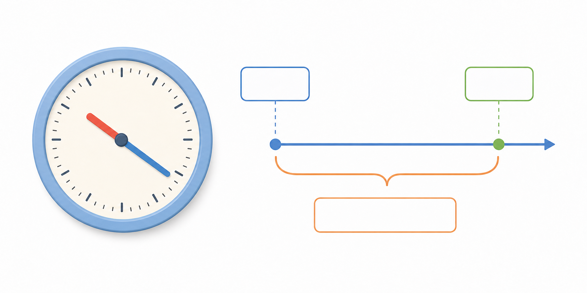

- Status: `generated`
- Grade/family: `P3` / `measurement-time-geometry`
- Need/kind: `recommended` / `clock`
- Prompt: 乐乐从10:00开始练习口算，练习了46分钟。练习时间是多少分钟？

### pep-primary-p3-u-fi-077

Image pending: `candidates/P3/measurement-time-geometry/pep-primary-p3-u-fi-077.png`

- Status: `missing`
- Grade/family: `P3` / `measurement-time-geometry`
- Need/kind: `recommended` / `clock`
- Prompt: 运动场的小活动在12:00开始，持续52分钟。活动持续了多久？

### pep-primary-p3-u-fi-078

Image pending: `candidates/P3/measurement-time-geometry/pep-primary-p3-u-fi-078.png`

- Status: `missing`
- Grade/family: `P3` / `measurement-time-geometry`
- Need/kind: `recommended` / `clock`
- Prompt: 阅读时间从9:00开始，记录表写着持续18分钟。持续时间是多少？

### pep-primary-p3-u-fi-079

Image pending: `candidates/P3/measurement-time-geometry/pep-primary-p3-u-fi-079.png`

- Status: `missing`
- Grade/family: `P3` / `measurement-time-geometry`
- Need/kind: `recommended` / `clock`
- Prompt: 第79小组：阅读活动从12:00开始，持续50分钟。活动持续了多少分钟？

### pep-primary-p3-u-fi-080

Image pending: `candidates/P3/measurement-time-geometry/pep-primary-p3-u-fi-080.png`

- Status: `missing`
- Grade/family: `P3` / `measurement-time-geometry`
- Need/kind: `recommended` / `clock`
- Prompt: 第80小组：阅读活动从8:00开始，持续15分钟。活动持续了多少分钟？

### pep-primary-p3-u-fi-081

Image pending: `candidates/P3/measurement-time-geometry/pep-primary-p3-u-fi-081.png`

- Status: `missing`
- Grade/family: `P3` / `measurement-time-geometry`
- Need/kind: `recommended` / `clock`
- Prompt: 第81小组：阅读活动从9:00开始，持续20分钟。活动持续了多少分钟？

### pep-primary-p3-u-fi-082

Image pending: `candidates/P3/measurement-time-geometry/pep-primary-p3-u-fi-082.png`

- Status: `missing`
- Grade/family: `P3` / `measurement-time-geometry`
- Need/kind: `recommended` / `clock`
- Prompt: 第82小组：阅读活动从10:00开始，持续25分钟。活动持续了多少分钟？

### pep-primary-p3-u-fi-083

Image pending: `candidates/P3/measurement-time-geometry/pep-primary-p3-u-fi-083.png`

- Status: `missing`
- Grade/family: `P3` / `measurement-time-geometry`
- Need/kind: `recommended` / `clock`
- Prompt: 第83小组：阅读活动从11:00开始，持续30分钟。活动持续了多少分钟？

### pep-primary-p3-u-fi-084

Image pending: `candidates/P3/measurement-time-geometry/pep-primary-p3-u-fi-084.png`

- Status: `missing`
- Grade/family: `P3` / `measurement-time-geometry`
- Need/kind: `recommended` / `clock`
- Prompt: 浩浩从11:00开始练习口算，练习了49分钟。练习时间是多少分钟？

### pep-primary-p3-u-fi-085

Image pending: `candidates/P3/measurement-time-geometry/pep-primary-p3-u-fi-085.png`

- Status: `missing`
- Grade/family: `P3` / `measurement-time-geometry`
- Need/kind: `recommended` / `clock`
- Prompt: 第85小组：阅读活动从8:00开始，持续40分钟。活动持续了多少分钟？

### pep-primary-p3-u-fi-086

Image pending: `candidates/P3/measurement-time-geometry/pep-primary-p3-u-fi-086.png`

- Status: `missing`
- Grade/family: `P3` / `measurement-time-geometry`
- Need/kind: `recommended` / `clock`
- Prompt: 第86小组：阅读活动从9:00开始，持续45分钟。活动持续了多少分钟？

### pep-primary-p3-u-fi-087

Image pending: `candidates/P3/measurement-time-geometry/pep-primary-p3-u-fi-087.png`

- Status: `missing`
- Grade/family: `P3` / `measurement-time-geometry`
- Need/kind: `recommended` / `clock`
- Prompt: 第87小组：阅读活动从10:00开始，持续50分钟。活动持续了多少分钟？

### pep-primary-p3-u-fi-088

Image pending: `candidates/P3/measurement-time-geometry/pep-primary-p3-u-fi-088.png`

- Status: `missing`
- Grade/family: `P3` / `measurement-time-geometry`
- Need/kind: `recommended` / `clock`
- Prompt: 第88小组：阅读活动从11:00开始，持续15分钟。活动持续了多少分钟？

### pep-primary-p3-u-fi-089

Image pending: `candidates/P3/measurement-time-geometry/pep-primary-p3-u-fi-089.png`

- Status: `missing`
- Grade/family: `P3` / `measurement-time-geometry`
- Need/kind: `recommended` / `clock`
- Prompt: 第89小组：阅读活动从12:00开始，持续20分钟。活动持续了多少分钟？

### pep-primary-p3-u-fi-090

Image pending: `candidates/P3/measurement-time-geometry/pep-primary-p3-u-fi-090.png`

- Status: `missing`
- Grade/family: `P3` / `measurement-time-geometry`
- Need/kind: `recommended` / `clock`
- Prompt: 第90小组：阅读活动从8:00开始，持续25分钟。活动持续了多少分钟？

### pep-primary-p3-u-fi-091

Image pending: `candidates/P3/measurement-time-geometry/pep-primary-p3-u-fi-091.png`

- Status: `missing`
- Grade/family: `P3` / `measurement-time-geometry`
- Need/kind: `recommended` / `clock`
- Prompt: 第91小组：阅读活动从9:00开始，持续30分钟。活动持续了多少分钟？

### pep-primary-p3-u-fi-092

Image pending: `candidates/P3/measurement-time-geometry/pep-primary-p3-u-fi-092.png`

- Status: `missing`
- Grade/family: `P3` / `measurement-time-geometry`
- Need/kind: `recommended` / `clock`
- Prompt: 图书角的小活动在10:00开始，持续50分钟。活动持续了多久？

### pep-primary-p3-u-fi-093

Image pending: `candidates/P3/measurement-time-geometry/pep-primary-p3-u-fi-093.png`

- Status: `missing`
- Grade/family: `P3` / `measurement-time-geometry`
- Need/kind: `recommended` / `clock`
- Prompt: 第93小组：阅读活动从11:00开始，持续40分钟。活动持续了多少分钟？

### pep-primary-p3-u-fi-094

Image pending: `candidates/P3/measurement-time-geometry/pep-primary-p3-u-fi-094.png`

- Status: `missing`
- Grade/family: `P3` / `measurement-time-geometry`
- Need/kind: `recommended` / `clock`
- Prompt: 第94小组：阅读活动从12:00开始，持续45分钟。活动持续了多少分钟？

### pep-primary-p3-u-fi-095

Image pending: `candidates/P3/measurement-time-geometry/pep-primary-p3-u-fi-095.png`

- Status: `missing`
- Grade/family: `P3` / `measurement-time-geometry`
- Need/kind: `recommended` / `clock`
- Prompt: 第95小组：阅读活动从8:00开始，持续50分钟。活动持续了多少分钟？

### pep-primary-p3-u-fi-096

Image pending: `candidates/P3/measurement-time-geometry/pep-primary-p3-u-fi-096.png`

- Status: `missing`
- Grade/family: `P3` / `measurement-time-geometry`
- Need/kind: `recommended` / `clock`
- Prompt: 第96小组：阅读活动从9:00开始，持续15分钟。活动持续了多少分钟？

### pep-primary-p3-u-fi-097

Image pending: `candidates/P3/measurement-time-geometry/pep-primary-p3-u-fi-097.png`

- Status: `missing`
- Grade/family: `P3` / `measurement-time-geometry`
- Need/kind: `recommended` / `clock`
- Prompt: 第97小组：阅读活动从10:00开始，持续20分钟。活动持续了多少分钟？

### pep-primary-p3-u-fi-098

Image pending: `candidates/P3/measurement-time-geometry/pep-primary-p3-u-fi-098.png`

- Status: `missing`
- Grade/family: `P3` / `measurement-time-geometry`
- Need/kind: `recommended` / `clock`
- Prompt: 第98小组：阅读活动从11:00开始，持续25分钟。活动持续了多少分钟？

### pep-primary-p3-u-fi-099

Image pending: `candidates/P3/measurement-time-geometry/pep-primary-p3-u-fi-099.png`

- Status: `missing`
- Grade/family: `P3` / `measurement-time-geometry`
- Need/kind: `recommended` / `clock`
- Prompt: 第99小组：阅读活动从12:00开始，持续30分钟。活动持续了多少分钟？

### pep-primary-p3-u-fi-100

Image pending: `candidates/P3/measurement-time-geometry/pep-primary-p3-u-fi-100.png`

- Status: `missing`
- Grade/family: `P3` / `measurement-time-geometry`
- Need/kind: `recommended` / `clock`
- Prompt: 阅读时间从9:00开始，记录表写着持续51分钟。持续时间是多少？

### pep-primary-p3-u-mc-051

Image pending: `candidates/P3/measurement-time-geometry/pep-primary-p3-u-mc-051.png`

- Status: `missing`
- Grade/family: `P3` / `measurement-time-geometry`
- Need/kind: `recommended` / `clock`
- Prompt: 晨晨从9:00开始练习口算，练习了35分钟。练习时间是多少分钟？

### pep-primary-p3-u-mc-052

Image pending: `candidates/P3/measurement-time-geometry/pep-primary-p3-u-mc-052.png`

- Status: `missing`
- Grade/family: `P3` / `measurement-time-geometry`
- Need/kind: `recommended` / `clock`
- Prompt: 科学桌的小活动在11:00开始，持续41分钟。活动持续了多久？

### pep-primary-p3-u-mc-053

Image pending: `candidates/P3/measurement-time-geometry/pep-primary-p3-u-mc-053.png`

- Status: `missing`
- Grade/family: `P3` / `measurement-time-geometry`
- Need/kind: `recommended` / `clock`
- Prompt: 阅读时间从8:00开始，记录表写着持续47分钟。持续时间是多少？

### pep-primary-p3-u-mc-054

Image pending: `candidates/P3/measurement-time-geometry/pep-primary-p3-u-mc-054.png`

- Status: `missing`
- Grade/family: `P3` / `measurement-time-geometry`
- Need/kind: `recommended` / `clock`
- Prompt: 第54小组：阅读活动从12:00开始，持续45分钟。活动持续了多少分钟？

### pep-primary-p3-u-mc-055

Image pending: `candidates/P3/measurement-time-geometry/pep-primary-p3-u-mc-055.png`

- Status: `missing`
- Grade/family: `P3` / `measurement-time-geometry`
- Need/kind: `recommended` / `clock`
- Prompt: 第55小组：阅读活动从8:00开始，持续50分钟。活动持续了多少分钟？

### pep-primary-p3-u-mc-056

Image pending: `candidates/P3/measurement-time-geometry/pep-primary-p3-u-mc-056.png`

- Status: `missing`
- Grade/family: `P3` / `measurement-time-geometry`
- Need/kind: `recommended` / `clock`
- Prompt: 第56小组：阅读活动从9:00开始，持续15分钟。活动持续了多少分钟？

### pep-primary-p3-u-mc-057

Image pending: `candidates/P3/measurement-time-geometry/pep-primary-p3-u-mc-057.png`

- Status: `missing`
- Grade/family: `P3` / `measurement-time-geometry`
- Need/kind: `recommended` / `clock`
- Prompt: 第57小组：阅读活动从10:00开始，持续20分钟。活动持续了多少分钟？

### pep-primary-p3-u-mc-058

Image pending: `candidates/P3/measurement-time-geometry/pep-primary-p3-u-mc-058.png`

- Status: `missing`
- Grade/family: `P3` / `measurement-time-geometry`
- Need/kind: `recommended` / `clock`
- Prompt: 第58小组：阅读活动从11:00开始，持续25分钟。活动持续了多少分钟？

### pep-primary-p3-u-mc-059

Image pending: `candidates/P3/measurement-time-geometry/pep-primary-p3-u-mc-059.png`

- Status: `missing`
- Grade/family: `P3` / `measurement-time-geometry`
- Need/kind: `recommended` / `clock`
- Prompt: 第59小组：阅读活动从12:00开始，持续30分钟。活动持续了多少分钟？

### pep-primary-p3-u-mc-060

Image pending: `candidates/P3/measurement-time-geometry/pep-primary-p3-u-mc-060.png`

- Status: `missing`
- Grade/family: `P3` / `measurement-time-geometry`
- Need/kind: `recommended` / `clock`
- Prompt: 第60小组：阅读活动从8:00开始，持续35分钟。活动持续了多少分钟？

### pep-primary-p3-u-mc-061

Image pending: `candidates/P3/measurement-time-geometry/pep-primary-p3-u-mc-061.png`

- Status: `missing`
- Grade/family: `P3` / `measurement-time-geometry`
- Need/kind: `recommended` / `clock`
- Prompt: 第61小组：阅读活动从9:00开始，持续40分钟。活动持续了多少分钟？

### pep-primary-p3-u-mc-062

Image pending: `candidates/P3/measurement-time-geometry/pep-primary-p3-u-mc-062.png`

- Status: `missing`
- Grade/family: `P3` / `measurement-time-geometry`
- Need/kind: `recommended` / `clock`
- Prompt: 第62小组：阅读活动从10:00开始，持续45分钟。活动持续了多少分钟？

### pep-primary-p3-u-mc-063

Image pending: `candidates/P3/measurement-time-geometry/pep-primary-p3-u-mc-063.png`

- Status: `missing`
- Grade/family: `P3` / `measurement-time-geometry`
- Need/kind: `recommended` / `clock`
- Prompt: 第63小组：阅读活动从11:00开始，持续50分钟。活动持续了多少分钟？

### pep-primary-p3-u-mc-064

Image pending: `candidates/P3/measurement-time-geometry/pep-primary-p3-u-mc-064.png`

- Status: `missing`
- Grade/family: `P3` / `measurement-time-geometry`
- Need/kind: `recommended` / `clock`
- Prompt: 第64小组：阅读活动从12:00开始，持续15分钟。活动持续了多少分钟？

### pep-primary-p3-u-mc-065

Image pending: `candidates/P3/measurement-time-geometry/pep-primary-p3-u-mc-065.png`

- Status: `missing`
- Grade/family: `P3` / `measurement-time-geometry`
- Need/kind: `recommended` / `clock`
- Prompt: 第65小组：阅读活动从8:00开始，持续20分钟。活动持续了多少分钟？

### pep-primary-p3-u-mc-066

Image pending: `candidates/P3/measurement-time-geometry/pep-primary-p3-u-mc-066.png`

- Status: `missing`
- Grade/family: `P3` / `measurement-time-geometry`
- Need/kind: `recommended` / `clock`
- Prompt: 第66小组：阅读活动从9:00开始，持续25分钟。活动持续了多少分钟？

### pep-primary-p3-u-mc-067

Image pending: `candidates/P3/measurement-time-geometry/pep-primary-p3-u-mc-067.png`

- Status: `missing`
- Grade/family: `P3` / `measurement-time-geometry`
- Need/kind: `recommended` / `clock`
- Prompt: 第67小组：阅读活动从10:00开始，持续30分钟。活动持续了多少分钟？

### pep-primary-p3-u-mc-068

Image pending: `candidates/P3/measurement-time-geometry/pep-primary-p3-u-mc-068.png`

- Status: `missing`
- Grade/family: `P3` / `measurement-time-geometry`
- Need/kind: `recommended` / `clock`
- Prompt: 第68小组：阅读活动从11:00开始，持续35分钟。活动持续了多少分钟？

### pep-primary-p3-u-mc-069

Image pending: `candidates/P3/measurement-time-geometry/pep-primary-p3-u-mc-069.png`

- Status: `missing`
- Grade/family: `P3` / `measurement-time-geometry`
- Need/kind: `recommended` / `clock`
- Prompt: 第69小组：阅读活动从12:00开始，持续40分钟。活动持续了多少分钟？

### pep-primary-p3-u-mc-070

Image pending: `candidates/P3/measurement-time-geometry/pep-primary-p3-u-mc-070.png`

- Status: `missing`
- Grade/family: `P3` / `measurement-time-geometry`
- Need/kind: `recommended` / `clock`
- Prompt: 第70小组：阅读活动从8:00开始，持续45分钟。活动持续了多少分钟？

### pep-primary-p3-u-mc-071

Image pending: `candidates/P3/measurement-time-geometry/pep-primary-p3-u-mc-071.png`

- Status: `missing`
- Grade/family: `P3` / `measurement-time-geometry`
- Need/kind: `recommended` / `clock`
- Prompt: 第71小组：阅读活动从9:00开始，持续50分钟。活动持续了多少分钟？

### pep-primary-p3-u-mc-072

Image pending: `candidates/P3/measurement-time-geometry/pep-primary-p3-u-mc-072.png`

- Status: `missing`
- Grade/family: `P3` / `measurement-time-geometry`
- Need/kind: `recommended` / `clock`
- Prompt: 第72小组：阅读活动从10:00开始，持续15分钟。活动持续了多少分钟？

### pep-primary-p3-u-mc-073

Image pending: `candidates/P3/measurement-time-geometry/pep-primary-p3-u-mc-073.png`

- Status: `missing`
- Grade/family: `P3` / `measurement-time-geometry`
- Need/kind: `recommended` / `clock`
- Prompt: 第73小组：阅读活动从11:00开始，持续20分钟。活动持续了多少分钟？

### pep-primary-p3-u-mc-074

Image pending: `candidates/P3/measurement-time-geometry/pep-primary-p3-u-mc-074.png`

- Status: `missing`
- Grade/family: `P3` / `measurement-time-geometry`
- Need/kind: `recommended` / `clock`
- Prompt: 第74小组：阅读活动从12:00开始，持续25分钟。活动持续了多少分钟？

### pep-primary-p3-u-mc-075

Image pending: `candidates/P3/measurement-time-geometry/pep-primary-p3-u-mc-075.png`

- Status: `missing`
- Grade/family: `P3` / `measurement-time-geometry`
- Need/kind: `recommended` / `clock`
- Prompt: 阅读时间从8:00开始，记录表写着持续40分钟。持续时间是多少？

## P3 / statistics-review

### pep-primary-p3-l-sa-151

- Status: `generated`
- Grade/family: `P3` / `statistics-review`
- Need/kind: `recommended` / `bar-chart`
- Prompt: 浩浩三次跳绳成绩是6下、8下、10下，平均每次多少下？

### pep-primary-p3-l-sa-152

Image pending: `candidates/P3/statistics-review/pep-primary-p3-l-sa-152.png`

- Status: `missing`
- Grade/family: `P3` / `statistics-review`
- Need/kind: `recommended` / `bar-chart`
- Prompt: 乐乐三次跳绳成绩是12下、14下、16下，平均每次多少下？

### pep-primary-p3-l-sa-153

Image pending: `candidates/P3/statistics-review/pep-primary-p3-l-sa-153.png`

- Status: `missing`
- Grade/family: `P3` / `statistics-review`
- Need/kind: `recommended` / `bar-chart`
- Prompt: 小辰在数学角整理三盒彩笔，分别有6支、8支、10支，平均每盒有多少支？

### pep-primary-p3-l-sa-154

Image pending: `candidates/P3/statistics-review/pep-primary-p3-l-sa-154.png`

- Status: `missing`
- Grade/family: `P3` / `statistics-review`
- Need/kind: `recommended` / `bar-chart`
- Prompt: 美术柜记录了三组数据：8、10、12。这三个数的平均数是多少？

### pep-primary-p3-l-sa-155

Image pending: `candidates/P3/statistics-review/pep-primary-p3-l-sa-155.png`

- Status: `missing`
- Grade/family: `P3` / `statistics-review`
- Need/kind: `recommended` / `bar-chart`
- Prompt: 佳佳在科学桌整理三盒彩笔，分别有6支、8支、10支，平均每盒有多少支？

### pep-primary-p3-l-sa-156

Image pending: `candidates/P3/statistics-review/pep-primary-p3-l-sa-156.png`

- Status: `missing`
- Grade/family: `P3` / `statistics-review`
- Need/kind: `recommended` / `bar-chart`
- Prompt: 第156小组：求8、10、12这三个数的平均数。

### pep-primary-p3-l-sa-157

Image pending: `candidates/P3/statistics-review/pep-primary-p3-l-sa-157.png`

- Status: `missing`
- Grade/family: `P3` / `statistics-review`
- Need/kind: `recommended` / `bar-chart`
- Prompt: 第157小组：求9、11、13这三个数的平均数。

### pep-primary-p3-l-sa-158

Image pending: `candidates/P3/statistics-review/pep-primary-p3-l-sa-158.png`

- Status: `missing`
- Grade/family: `P3` / `statistics-review`
- Need/kind: `recommended` / `bar-chart`
- Prompt: 第158小组：求10、12、14这三个数的平均数。

### pep-primary-p3-l-sa-159

Image pending: `candidates/P3/statistics-review/pep-primary-p3-l-sa-159.png`

- Status: `missing`
- Grade/family: `P3` / `statistics-review`
- Need/kind: `recommended` / `bar-chart`
- Prompt: 第159小组：求11、13、15这三个数的平均数。

### pep-primary-p3-l-sa-160

Image pending: `candidates/P3/statistics-review/pep-primary-p3-l-sa-160.png`

- Status: `missing`
- Grade/family: `P3` / `statistics-review`
- Need/kind: `recommended` / `bar-chart`
- Prompt: 图书角记录了三组数据：12、14、16。这三个数的平均数是多少？

### pep-primary-p3-l-sa-161

Image pending: `candidates/P3/statistics-review/pep-primary-p3-l-sa-161.png`

- Status: `missing`
- Grade/family: `P3` / `statistics-review`
- Need/kind: `recommended` / `bar-chart`
- Prompt: 小林三次跳绳成绩是6下、8下、10下，平均每次多少下？

### pep-primary-p3-l-sa-162

Image pending: `candidates/P3/statistics-review/pep-primary-p3-l-sa-162.png`

- Status: `missing`
- Grade/family: `P3` / `statistics-review`
- Need/kind: `recommended` / `bar-chart`
- Prompt: 小雅在美术柜整理三盒彩笔，分别有8支、10支、12支，平均每盒有多少支？

### pep-primary-p3-l-sa-163

Image pending: `candidates/P3/statistics-review/pep-primary-p3-l-sa-163.png`

- Status: `missing`
- Grade/family: `P3` / `statistics-review`
- Need/kind: `recommended` / `bar-chart`
- Prompt: 种植区记录了三组数据：10、12、14。这三个数的平均数是多少？

### pep-primary-p3-l-sa-164

Image pending: `candidates/P3/statistics-review/pep-primary-p3-l-sa-164.png`

- Status: `missing`
- Grade/family: `P3` / `statistics-review`
- Need/kind: `recommended` / `bar-chart`
- Prompt: 第164小组：求8、10、12这三个数的平均数。

### pep-primary-p3-l-sa-165

Image pending: `candidates/P3/statistics-review/pep-primary-p3-l-sa-165.png`

- Status: `missing`
- Grade/family: `P3` / `statistics-review`
- Need/kind: `recommended` / `bar-chart`
- Prompt: 第165小组：求9、11、13这三个数的平均数。

### pep-primary-p3-l-sa-166

Image pending: `candidates/P3/statistics-review/pep-primary-p3-l-sa-166.png`

- Status: `missing`
- Grade/family: `P3` / `statistics-review`
- Need/kind: `recommended` / `bar-chart`
- Prompt: 第166小组：求10、12、14这三个数的平均数。

### pep-primary-p3-l-sa-167

Image pending: `candidates/P3/statistics-review/pep-primary-p3-l-sa-167.png`

- Status: `missing`
- Grade/family: `P3` / `statistics-review`
- Need/kind: `recommended` / `bar-chart`
- Prompt: 安安在阅读区整理三盒彩笔，分别有7支、9支、11支，平均每盒有多少支？

### pep-primary-p3-l-sa-168

Image pending: `candidates/P3/statistics-review/pep-primary-p3-l-sa-168.png`

- Status: `missing`
- Grade/family: `P3` / `statistics-review`
- Need/kind: `recommended` / `bar-chart`
- Prompt: 乐乐三次跳绳成绩是8下、10下、12下，平均每次多少下？

### pep-primary-p3-l-sa-169

Image pending: `candidates/P3/statistics-review/pep-primary-p3-l-sa-169.png`

- Status: `missing`
- Grade/family: `P3` / `statistics-review`
- Need/kind: `recommended` / `bar-chart`
- Prompt: 第169小组：求5、7、9这三个数的平均数。

### pep-primary-p3-l-sa-170

Image pending: `candidates/P3/statistics-review/pep-primary-p3-l-sa-170.png`

- Status: `missing`
- Grade/family: `P3` / `statistics-review`
- Need/kind: `recommended` / `bar-chart`
- Prompt: 第170小组：求6、8、10这三个数的平均数。

### pep-primary-p3-l-sa-171

Image pending: `candidates/P3/statistics-review/pep-primary-p3-l-sa-171.png`

- Status: `missing`
- Grade/family: `P3` / `statistics-review`
- Need/kind: `recommended` / `bar-chart`
- Prompt: 第171小组：求7、9、11这三个数的平均数。

### pep-primary-p3-l-sa-172

Image pending: `candidates/P3/statistics-review/pep-primary-p3-l-sa-172.png`

- Status: `missing`
- Grade/family: `P3` / `statistics-review`
- Need/kind: `recommended` / `bar-chart`
- Prompt: 第172小组：求8、10、12这三个数的平均数。

### pep-primary-p3-l-sa-173

Image pending: `candidates/P3/statistics-review/pep-primary-p3-l-sa-173.png`

- Status: `missing`
- Grade/family: `P3` / `statistics-review`
- Need/kind: `recommended` / `bar-chart`
- Prompt: 第173小组：求9、11、13这三个数的平均数。

### pep-primary-p3-l-sa-174

Image pending: `candidates/P3/statistics-review/pep-primary-p3-l-sa-174.png`

- Status: `missing`
- Grade/family: `P3` / `statistics-review`
- Need/kind: `recommended` / `bar-chart`
- Prompt: 第174小组：求10、12、14这三个数的平均数。

### pep-primary-p3-l-sa-175

Image pending: `candidates/P3/statistics-review/pep-primary-p3-l-sa-175.png`

- Status: `missing`
- Grade/family: `P3` / `statistics-review`
- Need/kind: `recommended` / `bar-chart`
- Prompt: 第175小组：求11、13、15这三个数的平均数。

### pep-primary-p3-l-sa-176

Image pending: `candidates/P3/statistics-review/pep-primary-p3-l-sa-176.png`

- Status: `missing`
- Grade/family: `P3` / `statistics-review`
- Need/kind: `recommended` / `bar-chart`
- Prompt: 第176小组：求4、6、8这三个数的平均数。

### pep-primary-p3-l-sa-177

Image pending: `candidates/P3/statistics-review/pep-primary-p3-l-sa-177.png`

- Status: `missing`
- Grade/family: `P3` / `statistics-review`
- Need/kind: `recommended` / `bar-chart`
- Prompt: 第177小组：求5、7、9这三个数的平均数。

### pep-primary-p3-l-sa-178

Image pending: `candidates/P3/statistics-review/pep-primary-p3-l-sa-178.png`

- Status: `missing`
- Grade/family: `P3` / `statistics-review`
- Need/kind: `recommended` / `bar-chart`
- Prompt: 第178小组：求6、8、10这三个数的平均数。

### pep-primary-p3-l-sa-179

Image pending: `candidates/P3/statistics-review/pep-primary-p3-l-sa-179.png`

- Status: `missing`
- Grade/family: `P3` / `statistics-review`
- Need/kind: `recommended` / `bar-chart`
- Prompt: 第179小组：求7、9、11这三个数的平均数。

### pep-primary-p3-l-sa-180

Image pending: `candidates/P3/statistics-review/pep-primary-p3-l-sa-180.png`

- Status: `missing`
- Grade/family: `P3` / `statistics-review`
- Need/kind: `recommended` / `bar-chart`
- Prompt: 第180小组：求8、10、12这三个数的平均数。

### pep-primary-p3-l-sa-181

Image pending: `candidates/P3/statistics-review/pep-primary-p3-l-sa-181.png`

- Status: `missing`
- Grade/family: `P3` / `statistics-review`
- Need/kind: `recommended` / `bar-chart`
- Prompt: 第181小组：求9、11、13这三个数的平均数。

### pep-primary-p3-l-sa-182

Image pending: `candidates/P3/statistics-review/pep-primary-p3-l-sa-182.png`

- Status: `missing`
- Grade/family: `P3` / `statistics-review`
- Need/kind: `recommended` / `bar-chart`
- Prompt: 第182小组：求10、12、14这三个数的平均数。

### pep-primary-p3-l-sa-183

Image pending: `candidates/P3/statistics-review/pep-primary-p3-l-sa-183.png`

- Status: `missing`
- Grade/family: `P3` / `statistics-review`
- Need/kind: `recommended` / `bar-chart`
- Prompt: 第183小组：求11、13、15这三个数的平均数。

### pep-primary-p3-l-sa-184

Image pending: `candidates/P3/statistics-review/pep-primary-p3-l-sa-184.png`

- Status: `missing`
- Grade/family: `P3` / `statistics-review`
- Need/kind: `recommended` / `bar-chart`
- Prompt: 运动场记录了三组数据：9、11、13。这三个数的平均数是多少？

### pep-primary-p3-l-sa-185

Image pending: `candidates/P3/statistics-review/pep-primary-p3-l-sa-185.png`

- Status: `missing`
- Grade/family: `P3` / `statistics-review`
- Need/kind: `recommended` / `bar-chart`
- Prompt: 第185小组：求5、7、9这三个数的平均数。

### pep-primary-p3-l-sa-186

Image pending: `candidates/P3/statistics-review/pep-primary-p3-l-sa-186.png`

- Status: `missing`
- Grade/family: `P3` / `statistics-review`
- Need/kind: `recommended` / `bar-chart`
- Prompt: 第186小组：求6、8、10这三个数的平均数。

### pep-primary-p3-l-sa-187

Image pending: `candidates/P3/statistics-review/pep-primary-p3-l-sa-187.png`

- Status: `missing`
- Grade/family: `P3` / `statistics-review`
- Need/kind: `recommended` / `bar-chart`
- Prompt: 第187小组：求7、9、11这三个数的平均数。

### pep-primary-p3-l-sa-188

Image pending: `candidates/P3/statistics-review/pep-primary-p3-l-sa-188.png`

- Status: `missing`
- Grade/family: `P3` / `statistics-review`
- Need/kind: `recommended` / `bar-chart`
- Prompt: 第188小组：求8、10、12这三个数的平均数。

### pep-primary-p3-l-sa-189

Image pending: `candidates/P3/statistics-review/pep-primary-p3-l-sa-189.png`

- Status: `missing`
- Grade/family: `P3` / `statistics-review`
- Need/kind: `recommended` / `bar-chart`
- Prompt: 第189小组：求9、11、13这三个数的平均数。

### pep-primary-p3-l-sa-190

Image pending: `candidates/P3/statistics-review/pep-primary-p3-l-sa-190.png`

- Status: `missing`
- Grade/family: `P3` / `statistics-review`
- Need/kind: `recommended` / `bar-chart`
- Prompt: 第190小组：求10、12、14这三个数的平均数。

### pep-primary-p3-l-sa-191

Image pending: `candidates/P3/statistics-review/pep-primary-p3-l-sa-191.png`

- Status: `missing`
- Grade/family: `P3` / `statistics-review`
- Need/kind: `recommended` / `bar-chart`
- Prompt: 第191小组：求11、13、15这三个数的平均数。

### pep-primary-p3-l-sa-192

Image pending: `candidates/P3/statistics-review/pep-primary-p3-l-sa-192.png`

- Status: `missing`
- Grade/family: `P3` / `statistics-review`
- Need/kind: `recommended` / `bar-chart`
- Prompt: 第192小组：求4、6、8这三个数的平均数。

### pep-primary-p3-l-sa-193

Image pending: `candidates/P3/statistics-review/pep-primary-p3-l-sa-193.png`

- Status: `missing`
- Grade/family: `P3` / `statistics-review`
- Need/kind: `recommended` / `bar-chart`
- Prompt: 第193小组：求5、7、9这三个数的平均数。

### pep-primary-p3-l-sa-194

Image pending: `candidates/P3/statistics-review/pep-primary-p3-l-sa-194.png`

- Status: `missing`
- Grade/family: `P3` / `statistics-review`
- Need/kind: `recommended` / `bar-chart`
- Prompt: 第194小组：求6、8、10这三个数的平均数。

### pep-primary-p3-l-sa-195

Image pending: `candidates/P3/statistics-review/pep-primary-p3-l-sa-195.png`

- Status: `missing`
- Grade/family: `P3` / `statistics-review`
- Need/kind: `recommended` / `bar-chart`
- Prompt: 第195小组：求7、9、11这三个数的平均数。

### pep-primary-p3-l-sa-196

Image pending: `candidates/P3/statistics-review/pep-primary-p3-l-sa-196.png`

- Status: `missing`
- Grade/family: `P3` / `statistics-review`
- Need/kind: `recommended` / `bar-chart`
- Prompt: 第196小组：求8、10、12这三个数的平均数。

### pep-primary-p3-l-sa-197

Image pending: `candidates/P3/statistics-review/pep-primary-p3-l-sa-197.png`

- Status: `missing`
- Grade/family: `P3` / `statistics-review`
- Need/kind: `recommended` / `bar-chart`
- Prompt: 第197小组：求9、11、13这三个数的平均数。

### pep-primary-p3-l-sa-198

Image pending: `candidates/P3/statistics-review/pep-primary-p3-l-sa-198.png`

- Status: `missing`
- Grade/family: `P3` / `statistics-review`
- Need/kind: `recommended` / `bar-chart`
- Prompt: 第198小组：求10、12、14这三个数的平均数。

### pep-primary-p3-l-sa-199

Image pending: `candidates/P3/statistics-review/pep-primary-p3-l-sa-199.png`

- Status: `missing`
- Grade/family: `P3` / `statistics-review`
- Need/kind: `recommended` / `bar-chart`
- Prompt: 第199小组：求11、13、15这三个数的平均数。

### pep-primary-p3-l-sa-200

Image pending: `candidates/P3/statistics-review/pep-primary-p3-l-sa-200.png`

- Status: `missing`
- Grade/family: `P3` / `statistics-review`
- Need/kind: `recommended` / `bar-chart`
- Prompt: 第200小组：求4、6、8这三个数的平均数。

## P4 / decimals-average

### pep-primary-p4-l-fi-101

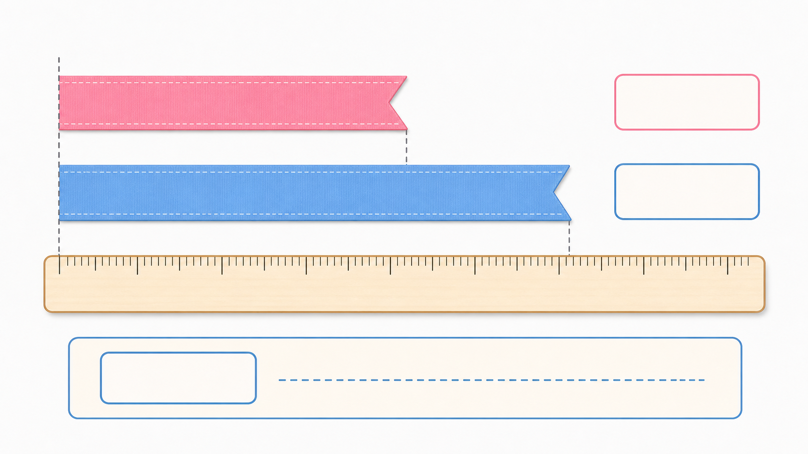

- Status: `generated`
- Grade/family: `P4` / `decimals-average`
- Need/kind: `recommended` / `bar-chart`
- Prompt: 小林量到两段彩带分别长1.5米和2.7米，一共长多少米？

### pep-primary-p4-l-fi-102

Image pending: `candidates/P4/decimals-average/pep-primary-p4-l-fi-102.png`

- Status: `missing`
- Grade/family: `P4` / `decimals-average`
- Need/kind: `recommended` / `bar-chart`
- Prompt: 浩浩量到两段彩带分别长1米和2.3米，一共长多少米？

### pep-primary-p4-l-fi-103

Image pending: `candidates/P4/decimals-average/pep-primary-p4-l-fi-103.png`

- Status: `missing`
- Grade/family: `P4` / `decimals-average`
- Need/kind: `recommended` / `bar-chart`
- Prompt: 图书角记录两次用水量为1.2升和2.6升，合计多少升？

### pep-primary-p4-l-fi-104

Image pending: `candidates/P4/decimals-average/pep-primary-p4-l-fi-104.png`

- Status: `missing`
- Grade/family: `P4` / `decimals-average`
- Need/kind: `recommended` / `bar-chart`
- Prompt: 两盒彩泥质量分别是1.4千克和2千克，总质量是多少千克？

### pep-primary-p4-l-fi-105

Image pending: `candidates/P4/decimals-average/pep-primary-p4-l-fi-105.png`

- Status: `missing`
- Grade/family: `P4` / `decimals-average`
- Need/kind: `recommended` / `bar-chart`
- Prompt: 晨晨量到两段彩带分别长1.6米和2.3米，一共长多少米？

### pep-primary-p4-l-fi-106

Image pending: `candidates/P4/decimals-average/pep-primary-p4-l-fi-106.png`

- Status: `missing`
- Grade/family: `P4` / `decimals-average`
- Need/kind: `recommended` / `bar-chart`
- Prompt: 第106小组：计算：1.7+2.5=？

### pep-primary-p4-l-fi-107

Image pending: `candidates/P4/decimals-average/pep-primary-p4-l-fi-107.png`

- Status: `missing`
- Grade/family: `P4` / `decimals-average`
- Need/kind: `recommended` / `bar-chart`
- Prompt: 第107小组：计算：1.8+2.7=？

### pep-primary-p4-l-fi-108

Image pending: `candidates/P4/decimals-average/pep-primary-p4-l-fi-108.png`

- Status: `missing`
- Grade/family: `P4` / `decimals-average`
- Need/kind: `recommended` / `bar-chart`
- Prompt: 晨晨量到两段彩带分别长1米和2米，一共长多少米？

### pep-primary-p4-l-fi-109

Image pending: `candidates/P4/decimals-average/pep-primary-p4-l-fi-109.png`

- Status: `missing`
- Grade/family: `P4` / `decimals-average`
- Need/kind: `recommended` / `bar-chart`
- Prompt: 第109小组：计算：1.1+2.2=？

### pep-primary-p4-l-fi-110

Image pending: `candidates/P4/decimals-average/pep-primary-p4-l-fi-110.png`

- Status: `missing`
- Grade/family: `P4` / `decimals-average`
- Need/kind: `recommended` / `bar-chart`
- Prompt: 第110小组：计算：1.2+2.4=？

### pep-primary-p4-l-fi-111

Image pending: `candidates/P4/decimals-average/pep-primary-p4-l-fi-111.png`

- Status: `missing`
- Grade/family: `P4` / `decimals-average`
- Need/kind: `recommended` / `bar-chart`
- Prompt: 第111小组：计算：1.3+2.6=？

### pep-primary-p4-l-fi-112

Image pending: `candidates/P4/decimals-average/pep-primary-p4-l-fi-112.png`

- Status: `missing`
- Grade/family: `P4` / `decimals-average`
- Need/kind: `recommended` / `bar-chart`
- Prompt: 第112小组：计算：1.4+2.8=？

### pep-primary-p4-l-fi-113

Image pending: `candidates/P4/decimals-average/pep-primary-p4-l-fi-113.png`

- Status: `missing`
- Grade/family: `P4` / `decimals-average`
- Need/kind: `recommended` / `bar-chart`
- Prompt: 第113小组：计算：1.5+2.1=？

### pep-primary-p4-l-fi-114

Image pending: `candidates/P4/decimals-average/pep-primary-p4-l-fi-114.png`

- Status: `missing`
- Grade/family: `P4` / `decimals-average`
- Need/kind: `recommended` / `bar-chart`
- Prompt: 第114小组：计算：1.6+2.3=？

### pep-primary-p4-l-fi-115

Image pending: `candidates/P4/decimals-average/pep-primary-p4-l-fi-115.png`

- Status: `missing`
- Grade/family: `P4` / `decimals-average`
- Need/kind: `recommended` / `bar-chart`
- Prompt: 第115小组：计算：1.7+2.5=？

### pep-primary-p4-l-fi-116

Image pending: `candidates/P4/decimals-average/pep-primary-p4-l-fi-116.png`

- Status: `missing`
- Grade/family: `P4` / `decimals-average`
- Need/kind: `recommended` / `bar-chart`
- Prompt: 第116小组：计算：1.8+2.7=？

### pep-primary-p4-l-fi-117

Image pending: `candidates/P4/decimals-average/pep-primary-p4-l-fi-117.png`

- Status: `missing`
- Grade/family: `P4` / `decimals-average`
- Need/kind: `recommended` / `bar-chart`
- Prompt: 种植区记录两次用水量为1.1升和2.1升，合计多少升？

### pep-primary-p4-l-fi-118

Image pending: `candidates/P4/decimals-average/pep-primary-p4-l-fi-118.png`

- Status: `missing`
- Grade/family: `P4` / `decimals-average`
- Need/kind: `recommended` / `bar-chart`
- Prompt: 第118小组：计算：1.1+2.2=？

### pep-primary-p4-l-fi-119

Image pending: `candidates/P4/decimals-average/pep-primary-p4-l-fi-119.png`

- Status: `missing`
- Grade/family: `P4` / `decimals-average`
- Need/kind: `recommended` / `bar-chart`
- Prompt: 第119小组：计算：1.2+2.4=？

### pep-primary-p4-l-fi-120

Image pending: `candidates/P4/decimals-average/pep-primary-p4-l-fi-120.png`

- Status: `missing`
- Grade/family: `P4` / `decimals-average`
- Need/kind: `recommended` / `bar-chart`
- Prompt: 第120小组：计算：1.3+2.6=？

### pep-primary-p4-l-fi-121

Image pending: `candidates/P4/decimals-average/pep-primary-p4-l-fi-121.png`

- Status: `missing`
- Grade/family: `P4` / `decimals-average`
- Need/kind: `recommended` / `bar-chart`
- Prompt: 第121小组：计算：1.4+2.8=？

### pep-primary-p4-l-fi-122

Image pending: `candidates/P4/decimals-average/pep-primary-p4-l-fi-122.png`

- Status: `missing`
- Grade/family: `P4` / `decimals-average`
- Need/kind: `recommended` / `bar-chart`
- Prompt: 第122小组：计算：1.5+2.1=？

### pep-primary-p4-l-fi-123

Image pending: `candidates/P4/decimals-average/pep-primary-p4-l-fi-123.png`

- Status: `missing`
- Grade/family: `P4` / `decimals-average`
- Need/kind: `recommended` / `bar-chart`
- Prompt: 第123小组：计算：1.6+2.3=？

### pep-primary-p4-l-fi-124

Image pending: `candidates/P4/decimals-average/pep-primary-p4-l-fi-124.png`

- Status: `missing`
- Grade/family: `P4` / `decimals-average`
- Need/kind: `recommended` / `bar-chart`
- Prompt: 第124小组：计算：1.7+2.5=？

### pep-primary-p4-l-fi-125

Image pending: `candidates/P4/decimals-average/pep-primary-p4-l-fi-125.png`

- Status: `missing`
- Grade/family: `P4` / `decimals-average`
- Need/kind: `recommended` / `bar-chart`
- Prompt: 第125小组：计算：1.8+2.7=？

### pep-primary-p4-l-fi-126

Image pending: `candidates/P4/decimals-average/pep-primary-p4-l-fi-126.png`

- Status: `missing`
- Grade/family: `P4` / `decimals-average`
- Need/kind: `recommended` / `bar-chart`
- Prompt: 两盒彩泥质量分别是1.2千克和2.2千克，总质量是多少千克？

### pep-primary-p4-l-fi-127

Image pending: `candidates/P4/decimals-average/pep-primary-p4-l-fi-127.png`

- Status: `missing`
- Grade/family: `P4` / `decimals-average`
- Need/kind: `recommended` / `bar-chart`
- Prompt: 第127小组：计算：1.1+2.2=？

### pep-primary-p4-l-fi-128

Image pending: `candidates/P4/decimals-average/pep-primary-p4-l-fi-128.png`

- Status: `missing`
- Grade/family: `P4` / `decimals-average`
- Need/kind: `recommended` / `bar-chart`
- Prompt: 第128小组：计算：1.2+2.4=？

### pep-primary-p4-l-fi-129

Image pending: `candidates/P4/decimals-average/pep-primary-p4-l-fi-129.png`

- Status: `missing`
- Grade/family: `P4` / `decimals-average`
- Need/kind: `recommended` / `bar-chart`
- Prompt: 第129小组：计算：1.3+2.6=？

### pep-primary-p4-l-fi-130

Image pending: `candidates/P4/decimals-average/pep-primary-p4-l-fi-130.png`

- Status: `missing`
- Grade/family: `P4` / `decimals-average`
- Need/kind: `recommended` / `bar-chart`
- Prompt: 第130小组：计算：1.4+2.8=？

### pep-primary-p4-l-fi-131

Image pending: `candidates/P4/decimals-average/pep-primary-p4-l-fi-131.png`

- Status: `missing`
- Grade/family: `P4` / `decimals-average`
- Need/kind: `recommended` / `bar-chart`
- Prompt: 第131小组：计算：1.5+2.1=？

### pep-primary-p4-l-fi-132

Image pending: `candidates/P4/decimals-average/pep-primary-p4-l-fi-132.png`

- Status: `missing`
- Grade/family: `P4` / `decimals-average`
- Need/kind: `recommended` / `bar-chart`
- Prompt: 第132小组：计算：1.6+2.3=？

### pep-primary-p4-l-fi-133

Image pending: `candidates/P4/decimals-average/pep-primary-p4-l-fi-133.png`

- Status: `missing`
- Grade/family: `P4` / `decimals-average`
- Need/kind: `recommended` / `bar-chart`
- Prompt: 第133小组：计算：1.7+2.5=？

### pep-primary-p4-l-fi-134

Image pending: `candidates/P4/decimals-average/pep-primary-p4-l-fi-134.png`

- Status: `missing`
- Grade/family: `P4` / `decimals-average`
- Need/kind: `recommended` / `bar-chart`
- Prompt: 手工桌记录两次用水量为1.3升和2.2升，合计多少升？

### pep-primary-p4-l-fi-135

Image pending: `candidates/P4/decimals-average/pep-primary-p4-l-fi-135.png`

- Status: `missing`
- Grade/family: `P4` / `decimals-average`
- Need/kind: `recommended` / `bar-chart`
- Prompt: 运动场记录两次用水量为1.4升和2.4升，合计多少升？

### pep-primary-p4-l-fi-136

Image pending: `candidates/P4/decimals-average/pep-primary-p4-l-fi-136.png`

- Status: `missing`
- Grade/family: `P4` / `decimals-average`
- Need/kind: `recommended` / `bar-chart`
- Prompt: 第136小组：计算：1.1+2.2=？

### pep-primary-p4-l-fi-137

Image pending: `candidates/P4/decimals-average/pep-primary-p4-l-fi-137.png`

- Status: `missing`
- Grade/family: `P4` / `decimals-average`
- Need/kind: `recommended` / `bar-chart`
- Prompt: 第137小组：计算：1.2+2.4=？

### pep-primary-p4-l-fi-138

Image pending: `candidates/P4/decimals-average/pep-primary-p4-l-fi-138.png`

- Status: `missing`
- Grade/family: `P4` / `decimals-average`
- Need/kind: `recommended` / `bar-chart`
- Prompt: 第138小组：计算：1.3+2.6=？

### pep-primary-p4-l-fi-139

Image pending: `candidates/P4/decimals-average/pep-primary-p4-l-fi-139.png`

- Status: `missing`
- Grade/family: `P4` / `decimals-average`
- Need/kind: `recommended` / `bar-chart`
- Prompt: 第139小组：计算：1.4+2.8=？

### pep-primary-p4-l-fi-140

Image pending: `candidates/P4/decimals-average/pep-primary-p4-l-fi-140.png`

- Status: `missing`
- Grade/family: `P4` / `decimals-average`
- Need/kind: `recommended` / `bar-chart`
- Prompt: 第140小组：计算：1.5+2.1=？

### pep-primary-p4-l-fi-141

Image pending: `candidates/P4/decimals-average/pep-primary-p4-l-fi-141.png`

- Status: `missing`
- Grade/family: `P4` / `decimals-average`
- Need/kind: `recommended` / `bar-chart`
- Prompt: 第141小组：计算：1.6+2.3=？

### pep-primary-p4-l-fi-142

Image pending: `candidates/P4/decimals-average/pep-primary-p4-l-fi-142.png`

- Status: `missing`
- Grade/family: `P4` / `decimals-average`
- Need/kind: `recommended` / `bar-chart`
- Prompt: 第142小组：计算：1.7+2.5=？

### pep-primary-p4-l-fi-143

Image pending: `candidates/P4/decimals-average/pep-primary-p4-l-fi-143.png`

- Status: `missing`
- Grade/family: `P4` / `decimals-average`
- Need/kind: `recommended` / `bar-chart`
- Prompt: 第143小组：计算：1.8+2.7=？

### pep-primary-p4-l-fi-144

Image pending: `candidates/P4/decimals-average/pep-primary-p4-l-fi-144.png`

- Status: `missing`
- Grade/family: `P4` / `decimals-average`
- Need/kind: `recommended` / `bar-chart`
- Prompt: 两盒彩泥质量分别是1.5千克和2.5千克，总质量是多少千克？

### pep-primary-p4-l-fi-145

Image pending: `candidates/P4/decimals-average/pep-primary-p4-l-fi-145.png`

- Status: `missing`
- Grade/family: `P4` / `decimals-average`
- Need/kind: `recommended` / `bar-chart`
- Prompt: 第145小组：计算：1.1+2.2=？

### pep-primary-p4-l-fi-146

Image pending: `candidates/P4/decimals-average/pep-primary-p4-l-fi-146.png`

- Status: `missing`
- Grade/family: `P4` / `decimals-average`
- Need/kind: `recommended` / `bar-chart`
- Prompt: 第146小组：计算：1.2+2.4=？

### pep-primary-p4-l-fi-147

Image pending: `candidates/P4/decimals-average/pep-primary-p4-l-fi-147.png`

- Status: `missing`
- Grade/family: `P4` / `decimals-average`
- Need/kind: `recommended` / `bar-chart`
- Prompt: 第147小组：计算：1.3+2.6=？

### pep-primary-p4-l-fi-148

Image pending: `candidates/P4/decimals-average/pep-primary-p4-l-fi-148.png`

- Status: `missing`
- Grade/family: `P4` / `decimals-average`
- Need/kind: `recommended` / `bar-chart`
- Prompt: 第148小组：计算：1.4+2.8=？

### pep-primary-p4-l-fi-149

Image pending: `candidates/P4/decimals-average/pep-primary-p4-l-fi-149.png`

- Status: `missing`
- Grade/family: `P4` / `decimals-average`
- Need/kind: `recommended` / `bar-chart`
- Prompt: 第149小组：计算：1.5+2.1=？

### pep-primary-p4-l-fi-150

Image pending: `candidates/P4/decimals-average/pep-primary-p4-l-fi-150.png`

- Status: `missing`
- Grade/family: `P4` / `decimals-average`
- Need/kind: `recommended` / `bar-chart`
- Prompt: 两盒彩泥质量分别是1.2千克和2.8千克，总质量是多少千克？

## P5 / factors-fractions

### pep-primary-p5-l-fi-101

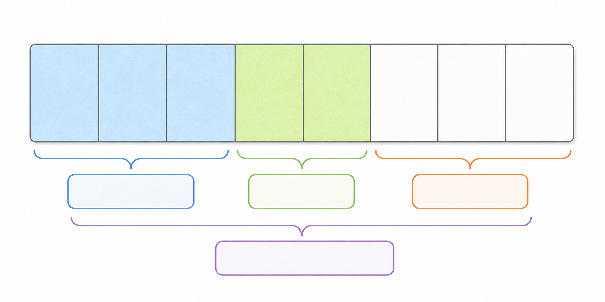

- Status: `generated`
- Grade/family: `P5` / `factors-fractions`
- Need/kind: `recommended` / `fraction-area`
- Prompt: 晨晨先完成3/8页练习，又完成2/8页，一共完成几分之几页？

### pep-primary-p5-l-fi-102

Image pending: `candidates/P5/factors-fractions/pep-primary-p5-l-fi-102.png`

- Status: `missing`
- Grade/family: `P5` / `factors-fractions`
- Need/kind: `recommended` / `fraction-area`
- Prompt: 两段同样长的纸带分别占全长的2/10和2/10，合起来是多少？

### pep-primary-p5-l-fi-103

Image pending: `candidates/P5/factors-fractions/pep-primary-p5-l-fi-103.png`

- Status: `missing`
- Grade/family: `P5` / `factors-fractions`
- Need/kind: `recommended` / `fraction-area`
- Prompt: 阅读区的记录显示两次用料为1/6包和2/6包，一共用了多少包？

### pep-primary-p5-l-fi-104

Image pending: `candidates/P5/factors-fractions/pep-primary-p5-l-fi-104.png`

- Status: `missing`
- Grade/family: `P5` / `factors-fractions`
- Need/kind: `recommended` / `fraction-area`
- Prompt: 第104小组：计算：3/8+2/8=？

### pep-primary-p5-l-fi-105

Image pending: `candidates/P5/factors-fractions/pep-primary-p5-l-fi-105.png`

- Status: `missing`
- Grade/family: `P5` / `factors-fractions`
- Need/kind: `recommended` / `fraction-area`
- Prompt: 第105小组：计算：1/9+1/9=？

### pep-primary-p5-l-fi-106

Image pending: `candidates/P5/factors-fractions/pep-primary-p5-l-fi-106.png`

- Status: `missing`
- Grade/family: `P5` / `factors-fractions`
- Need/kind: `recommended` / `fraction-area`
- Prompt: 第106小组：计算：2/10+3/10=？

### pep-primary-p5-l-fi-107

Image pending: `candidates/P5/factors-fractions/pep-primary-p5-l-fi-107.png`

- Status: `missing`
- Grade/family: `P5` / `factors-fractions`
- Need/kind: `recommended` / `fraction-area`
- Prompt: 第107小组：计算：3/11+2/11=？

### pep-primary-p5-l-fi-108

Image pending: `candidates/P5/factors-fractions/pep-primary-p5-l-fi-108.png`

- Status: `missing`
- Grade/family: `P5` / `factors-fractions`
- Need/kind: `recommended` / `fraction-area`
- Prompt: 第108小组：计算：1/6+1/6=？

### pep-primary-p5-l-fi-109

Image pending: `candidates/P5/factors-fractions/pep-primary-p5-l-fi-109.png`

- Status: `missing`
- Grade/family: `P5` / `factors-fractions`
- Need/kind: `recommended` / `fraction-area`
- Prompt: 第109小组：计算：2/7+3/7=？

### pep-primary-p5-l-fi-110

Image pending: `candidates/P5/factors-fractions/pep-primary-p5-l-fi-110.png`

- Status: `missing`
- Grade/family: `P5` / `factors-fractions`
- Need/kind: `recommended` / `fraction-area`
- Prompt: 第110小组：计算：3/8+2/8=？

### pep-primary-p5-l-fi-111

Image pending: `candidates/P5/factors-fractions/pep-primary-p5-l-fi-111.png`

- Status: `missing`
- Grade/family: `P5` / `factors-fractions`
- Need/kind: `recommended` / `fraction-area`
- Prompt: 小林先完成1/9页练习，又完成1/9页，一共完成几分之几页？

### pep-primary-p5-l-fi-112

Image pending: `candidates/P5/factors-fractions/pep-primary-p5-l-fi-112.png`

- Status: `missing`
- Grade/family: `P5` / `factors-fractions`
- Need/kind: `recommended` / `fraction-area`
- Prompt: 第112小组：计算：2/10+3/10=？

### pep-primary-p5-l-fi-113

Image pending: `candidates/P5/factors-fractions/pep-primary-p5-l-fi-113.png`

- Status: `missing`
- Grade/family: `P5` / `factors-fractions`
- Need/kind: `recommended` / `fraction-area`
- Prompt: 第113小组：计算：3/11+2/11=？

### pep-primary-p5-l-fi-114

Image pending: `candidates/P5/factors-fractions/pep-primary-p5-l-fi-114.png`

- Status: `missing`
- Grade/family: `P5` / `factors-fractions`
- Need/kind: `recommended` / `fraction-area`
- Prompt: 第114小组：计算：1/6+1/6=？

### pep-primary-p5-l-fi-115

Image pending: `candidates/P5/factors-fractions/pep-primary-p5-l-fi-115.png`

- Status: `missing`
- Grade/family: `P5` / `factors-fractions`
- Need/kind: `recommended` / `fraction-area`
- Prompt: 第115小组：计算：2/7+3/7=？

### pep-primary-p5-l-fi-116

Image pending: `candidates/P5/factors-fractions/pep-primary-p5-l-fi-116.png`

- Status: `missing`
- Grade/family: `P5` / `factors-fractions`
- Need/kind: `recommended` / `fraction-area`
- Prompt: 第116小组：计算：3/8+2/8=？

### pep-primary-p5-l-fi-117

Image pending: `candidates/P5/factors-fractions/pep-primary-p5-l-fi-117.png`

- Status: `missing`
- Grade/family: `P5` / `factors-fractions`
- Need/kind: `recommended` / `fraction-area`
- Prompt: 第117小组：计算：1/9+1/9=？

### pep-primary-p5-l-fi-118

Image pending: `candidates/P5/factors-fractions/pep-primary-p5-l-fi-118.png`

- Status: `missing`
- Grade/family: `P5` / `factors-fractions`
- Need/kind: `recommended` / `fraction-area`
- Prompt: 第118小组：计算：2/10+3/10=？

### pep-primary-p5-l-fi-119

Image pending: `candidates/P5/factors-fractions/pep-primary-p5-l-fi-119.png`

- Status: `missing`
- Grade/family: `P5` / `factors-fractions`
- Need/kind: `recommended` / `fraction-area`
- Prompt: 第119小组：计算：3/11+2/11=？

### pep-primary-p5-l-fi-120

Image pending: `candidates/P5/factors-fractions/pep-primary-p5-l-fi-120.png`

- Status: `missing`
- Grade/family: `P5` / `factors-fractions`
- Need/kind: `recommended` / `fraction-area`
- Prompt: 第120小组：计算：1/6+1/6=？

### pep-primary-p5-l-fi-121

Image pending: `candidates/P5/factors-fractions/pep-primary-p5-l-fi-121.png`

- Status: `missing`
- Grade/family: `P5` / `factors-fractions`
- Need/kind: `recommended` / `fraction-area`
- Prompt: 两段同样长的纸带分别占全长的3/8和1/8，合起来是多少？

### pep-primary-p5-l-fi-122

Image pending: `candidates/P5/factors-fractions/pep-primary-p5-l-fi-122.png`

- Status: `missing`
- Grade/family: `P5` / `factors-fractions`
- Need/kind: `recommended` / `fraction-area`
- Prompt: 第122小组：计算：3/8+2/8=？

### pep-primary-p5-l-fi-123

Image pending: `candidates/P5/factors-fractions/pep-primary-p5-l-fi-123.png`

- Status: `missing`
- Grade/family: `P5` / `factors-fractions`
- Need/kind: `recommended` / `fraction-area`
- Prompt: 第123小组：计算：1/9+1/9=？

### pep-primary-p5-l-fi-124

Image pending: `candidates/P5/factors-fractions/pep-primary-p5-l-fi-124.png`

- Status: `missing`
- Grade/family: `P5` / `factors-fractions`
- Need/kind: `recommended` / `fraction-area`
- Prompt: 第124小组：计算：2/10+3/10=？

### pep-primary-p5-l-fi-125

Image pending: `candidates/P5/factors-fractions/pep-primary-p5-l-fi-125.png`

- Status: `missing`
- Grade/family: `P5` / `factors-fractions`
- Need/kind: `recommended` / `fraction-area`
- Prompt: 第125小组：计算：3/11+2/11=？

### pep-primary-p5-l-fi-126

Image pending: `candidates/P5/factors-fractions/pep-primary-p5-l-fi-126.png`

- Status: `missing`
- Grade/family: `P5` / `factors-fractions`
- Need/kind: `recommended` / `fraction-area`
- Prompt: 第126小组：计算：1/6+1/6=？

### pep-primary-p5-l-fi-127

Image pending: `candidates/P5/factors-fractions/pep-primary-p5-l-fi-127.png`

- Status: `missing`
- Grade/family: `P5` / `factors-fractions`
- Need/kind: `recommended` / `fraction-area`
- Prompt: 第127小组：计算：2/7+3/7=？

### pep-primary-p5-l-fi-128

Image pending: `candidates/P5/factors-fractions/pep-primary-p5-l-fi-128.png`

- Status: `missing`
- Grade/family: `P5` / `factors-fractions`
- Need/kind: `recommended` / `fraction-area`
- Prompt: 第128小组：计算：3/8+2/8=？

### pep-primary-p5-l-fi-129

Image pending: `candidates/P5/factors-fractions/pep-primary-p5-l-fi-129.png`

- Status: `missing`
- Grade/family: `P5` / `factors-fractions`
- Need/kind: `recommended` / `fraction-area`
- Prompt: 第129小组：计算：1/9+1/9=？

### pep-primary-p5-l-fi-130

Image pending: `candidates/P5/factors-fractions/pep-primary-p5-l-fi-130.png`

- Status: `missing`
- Grade/family: `P5` / `factors-fractions`
- Need/kind: `recommended` / `fraction-area`
- Prompt: 科学桌的记录显示两次用料为1/6包和2/6包，一共用了多少包？

### pep-primary-p5-l-sa-131

Image pending: `candidates/P5/factors-fractions/pep-primary-p5-l-sa-131.png`

- Status: `missing`
- Grade/family: `P5` / `factors-fractions`
- Need/kind: `recommended` / `fraction-area`
- Prompt: 乐乐先完成3/8页练习，又完成2/8页，一共完成几分之几页？

### pep-primary-p5-l-sa-132

Image pending: `candidates/P5/factors-fractions/pep-primary-p5-l-sa-132.png`

- Status: `missing`
- Grade/family: `P5` / `factors-fractions`
- Need/kind: `recommended` / `fraction-area`
- Prompt: 两段同样长的纸带分别占全长的2/10和2/10，合起来是多少？

### pep-primary-p5-l-sa-133

Image pending: `candidates/P5/factors-fractions/pep-primary-p5-l-sa-133.png`

- Status: `missing`
- Grade/family: `P5` / `factors-fractions`
- Need/kind: `recommended` / `fraction-area`
- Prompt: 美术柜的记录显示两次用料为1/6包和2/6包，一共用了多少包？

### pep-primary-p5-l-sa-134

Image pending: `candidates/P5/factors-fractions/pep-primary-p5-l-sa-134.png`

- Status: `missing`
- Grade/family: `P5` / `factors-fractions`
- Need/kind: `recommended` / `fraction-area`
- Prompt: 第134小组：计算：3/8+2/8=？

### pep-primary-p5-l-sa-135

Image pending: `candidates/P5/factors-fractions/pep-primary-p5-l-sa-135.png`

- Status: `missing`
- Grade/family: `P5` / `factors-fractions`
- Need/kind: `recommended` / `fraction-area`
- Prompt: 第135小组：计算：1/9+1/9=？

### pep-primary-p5-l-sa-136

Image pending: `candidates/P5/factors-fractions/pep-primary-p5-l-sa-136.png`

- Status: `missing`
- Grade/family: `P5` / `factors-fractions`
- Need/kind: `recommended` / `fraction-area`
- Prompt: 第136小组：计算：2/10+3/10=？

### pep-primary-p5-l-sa-137

Image pending: `candidates/P5/factors-fractions/pep-primary-p5-l-sa-137.png`

- Status: `missing`
- Grade/family: `P5` / `factors-fractions`
- Need/kind: `recommended` / `fraction-area`
- Prompt: 第137小组：计算：3/11+2/11=？

### pep-primary-p5-l-sa-138

Image pending: `candidates/P5/factors-fractions/pep-primary-p5-l-sa-138.png`

- Status: `missing`
- Grade/family: `P5` / `factors-fractions`
- Need/kind: `recommended` / `fraction-area`
- Prompt: 第138小组：计算：1/6+1/6=？

### pep-primary-p5-l-sa-139

Image pending: `candidates/P5/factors-fractions/pep-primary-p5-l-sa-139.png`

- Status: `missing`
- Grade/family: `P5` / `factors-fractions`
- Need/kind: `recommended` / `fraction-area`
- Prompt: 第139小组：计算：2/7+3/7=？

### pep-primary-p5-l-sa-140

Image pending: `candidates/P5/factors-fractions/pep-primary-p5-l-sa-140.png`

- Status: `missing`
- Grade/family: `P5` / `factors-fractions`
- Need/kind: `recommended` / `fraction-area`
- Prompt: 第140小组：计算：3/8+2/8=？

### pep-primary-p5-l-sa-141

Image pending: `candidates/P5/factors-fractions/pep-primary-p5-l-sa-141.png`

- Status: `missing`
- Grade/family: `P5` / `factors-fractions`
- Need/kind: `recommended` / `fraction-area`
- Prompt: 第141小组：计算：1/9+1/9=？

### pep-primary-p5-l-sa-142

Image pending: `candidates/P5/factors-fractions/pep-primary-p5-l-sa-142.png`

- Status: `missing`
- Grade/family: `P5` / `factors-fractions`
- Need/kind: `recommended` / `fraction-area`
- Prompt: 第142小组：计算：2/10+3/10=？

### pep-primary-p5-l-sa-143

Image pending: `candidates/P5/factors-fractions/pep-primary-p5-l-sa-143.png`

- Status: `missing`
- Grade/family: `P5` / `factors-fractions`
- Need/kind: `recommended` / `fraction-area`
- Prompt: 第143小组：计算：3/11+2/11=？

### pep-primary-p5-l-sa-144

Image pending: `candidates/P5/factors-fractions/pep-primary-p5-l-sa-144.png`

- Status: `missing`
- Grade/family: `P5` / `factors-fractions`
- Need/kind: `recommended` / `fraction-area`
- Prompt: 第144小组：计算：1/6+1/6=？

### pep-primary-p5-l-sa-145

Image pending: `candidates/P5/factors-fractions/pep-primary-p5-l-sa-145.png`

- Status: `missing`
- Grade/family: `P5` / `factors-fractions`
- Need/kind: `recommended` / `fraction-area`
- Prompt: 第145小组：计算：2/7+3/7=？

### pep-primary-p5-l-sa-146

Image pending: `candidates/P5/factors-fractions/pep-primary-p5-l-sa-146.png`

- Status: `missing`
- Grade/family: `P5` / `factors-fractions`
- Need/kind: `recommended` / `fraction-area`
- Prompt: 第146小组：计算：3/8+2/8=？

### pep-primary-p5-l-sa-147

Image pending: `candidates/P5/factors-fractions/pep-primary-p5-l-sa-147.png`

- Status: `missing`
- Grade/family: `P5` / `factors-fractions`
- Need/kind: `recommended` / `fraction-area`
- Prompt: 第147小组：计算：1/9+1/9=？

### pep-primary-p5-l-sa-148

Image pending: `candidates/P5/factors-fractions/pep-primary-p5-l-sa-148.png`

- Status: `missing`
- Grade/family: `P5` / `factors-fractions`
- Need/kind: `recommended` / `fraction-area`
- Prompt: 第148小组：计算：2/10+3/10=？

### pep-primary-p5-l-sa-149

Image pending: `candidates/P5/factors-fractions/pep-primary-p5-l-sa-149.png`

- Status: `missing`
- Grade/family: `P5` / `factors-fractions`
- Need/kind: `recommended` / `fraction-area`
- Prompt: 第149小组：计算：3/11+2/11=？

### pep-primary-p5-l-sa-150

Image pending: `candidates/P5/factors-fractions/pep-primary-p5-l-sa-150.png`

- Status: `missing`
- Grade/family: `P5` / `factors-fractions`
- Need/kind: `recommended` / `fraction-area`
- Prompt: 第150小组：计算：1/6+1/6=？

## P6 / percent-fractions

### pep-primary-p6-u-mc-001

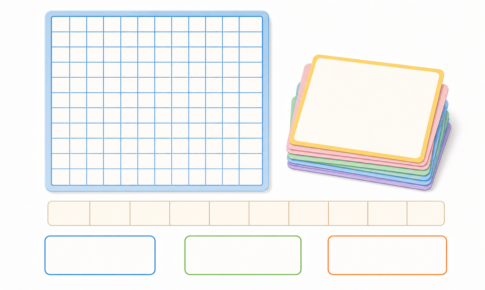

- Status: `generated`
- Grade/family: `P6` / `percent-fractions`
- Need/kind: `recommended` / `percent-model`
- Prompt: 小林有90张练习卡，完成了20%。完成了多少张？

### pep-primary-p6-u-mc-002

Image pending: `candidates/P6/percent-fractions/pep-primary-p6-u-mc-002.png`

- Status: `missing`
- Grade/family: `P6` / `percent-fractions`
- Need/kind: `recommended` / `percent-model`
- Prompt: 晨晨有190张练习卡，完成了50%。完成了多少张？

### pep-primary-p6-u-mc-003

Image pending: `candidates/P6/percent-fractions/pep-primary-p6-u-mc-003.png`

- Status: `missing`
- Grade/family: `P6` / `percent-fractions`
- Need/kind: `recommended` / `percent-model`
- Prompt: 科学桌准备90个材料，其中20%已经分类。已经分类多少个？

### pep-primary-p6-u-mc-004

Image pending: `candidates/P6/percent-fractions/pep-primary-p6-u-mc-004.png`

- Status: `missing`
- Grade/family: `P6` / `percent-fractions`
- Need/kind: `recommended` / `percent-model`
- Prompt: 一份调查共有110人参加，50%选择了A项。选择A项的有多少人？

### pep-primary-p6-u-mc-005

Image pending: `candidates/P6/percent-fractions/pep-primary-p6-u-mc-005.png`

- Status: `missing`
- Grade/family: `P6` / `percent-fractions`
- Need/kind: `recommended` / `percent-model`
- Prompt: 数学角准备170个材料，其中20%已经分类。已经分类多少个？

### pep-primary-p6-u-mc-006

Image pending: `candidates/P6/percent-fractions/pep-primary-p6-u-mc-006.png`

- Status: `missing`
- Grade/family: `P6` / `percent-fractions`
- Need/kind: `recommended` / `percent-model`
- Prompt: 一份调查共有190人参加，50%选择了A项。选择A项的有多少人？

### pep-primary-p6-u-mc-007

Image pending: `candidates/P6/percent-fractions/pep-primary-p6-u-mc-007.png`

- Status: `missing`
- Grade/family: `P6` / `percent-fractions`
- Need/kind: `recommended` / `percent-model`
- Prompt: 浩浩有90张练习卡，完成了20%。完成了多少张？

### pep-primary-p6-u-mc-008

Image pending: `candidates/P6/percent-fractions/pep-primary-p6-u-mc-008.png`

- Status: `missing`
- Grade/family: `P6` / `percent-fractions`
- Need/kind: `recommended` / `percent-model`
- Prompt: 阅读区准备110个材料，其中50%已经分类。已经分类多少个？

### pep-primary-p6-u-mc-009

Image pending: `candidates/P6/percent-fractions/pep-primary-p6-u-mc-009.png`

- Status: `missing`
- Grade/family: `P6` / `percent-fractions`
- Need/kind: `recommended` / `percent-model`
- Prompt: 一份调查共有130人参加，20%选择了A项。选择A项的有多少人？

### pep-primary-p6-u-mc-010

Image pending: `candidates/P6/percent-fractions/pep-primary-p6-u-mc-010.png`

- Status: `missing`
- Grade/family: `P6` / `percent-fractions`
- Need/kind: `recommended` / `percent-model`
- Prompt: 晨晨有150张练习卡，完成了50%。完成了多少张？

### pep-primary-p6-u-mc-011

Image pending: `candidates/P6/percent-fractions/pep-primary-p6-u-mc-011.png`

- Status: `missing`
- Grade/family: `P6` / `percent-fractions`
- Need/kind: `recommended` / `percent-model`
- Prompt: 第11小组：190的50%是多少？

### pep-primary-p6-u-mc-012

Image pending: `candidates/P6/percent-fractions/pep-primary-p6-u-mc-012.png`

- Status: `missing`
- Grade/family: `P6` / `percent-fractions`
- Need/kind: `recommended` / `percent-model`
- Prompt: 第12小组：80的10%是多少？

### pep-primary-p6-u-mc-013

Image pending: `candidates/P6/percent-fractions/pep-primary-p6-u-mc-013.png`

- Status: `missing`
- Grade/family: `P6` / `percent-fractions`
- Need/kind: `recommended` / `percent-model`
- Prompt: 第13小组：90的20%是多少？

### pep-primary-p6-u-mc-014

Image pending: `candidates/P6/percent-fractions/pep-primary-p6-u-mc-014.png`

- Status: `missing`
- Grade/family: `P6` / `percent-fractions`
- Need/kind: `recommended` / `percent-model`
- Prompt: 第14小组：100的25%是多少？

### pep-primary-p6-u-mc-015

Image pending: `candidates/P6/percent-fractions/pep-primary-p6-u-mc-015.png`

- Status: `missing`
- Grade/family: `P6` / `percent-fractions`
- Need/kind: `recommended` / `percent-model`
- Prompt: 第15小组：110的50%是多少？

### pep-primary-p6-u-mc-016

Image pending: `candidates/P6/percent-fractions/pep-primary-p6-u-mc-016.png`

- Status: `missing`
- Grade/family: `P6` / `percent-fractions`
- Need/kind: `recommended` / `percent-model`
- Prompt: 第16小组：120的10%是多少？

### pep-primary-p6-u-mc-017

Image pending: `candidates/P6/percent-fractions/pep-primary-p6-u-mc-017.png`

- Status: `missing`
- Grade/family: `P6` / `percent-fractions`
- Need/kind: `recommended` / `percent-model`
- Prompt: 第17小组：130的20%是多少？

### pep-primary-p6-u-mc-018

Image pending: `candidates/P6/percent-fractions/pep-primary-p6-u-mc-018.png`

- Status: `missing`
- Grade/family: `P6` / `percent-fractions`
- Need/kind: `recommended` / `percent-model`
- Prompt: 第18小组：140的25%是多少？

### pep-primary-p6-u-mc-019

Image pending: `candidates/P6/percent-fractions/pep-primary-p6-u-mc-019.png`

- Status: `missing`
- Grade/family: `P6` / `percent-fractions`
- Need/kind: `recommended` / `percent-model`
- Prompt: 第19小组：150的50%是多少？

### pep-primary-p6-u-mc-020

Image pending: `candidates/P6/percent-fractions/pep-primary-p6-u-mc-020.png`

- Status: `missing`
- Grade/family: `P6` / `percent-fractions`
- Need/kind: `recommended` / `percent-model`
- Prompt: 第20小组：160的10%是多少？

### pep-primary-p6-u-mc-021

Image pending: `candidates/P6/percent-fractions/pep-primary-p6-u-mc-021.png`

- Status: `missing`
- Grade/family: `P6` / `percent-fractions`
- Need/kind: `recommended` / `percent-model`
- Prompt: 美术柜准备180个材料，其中25%已经分类。已经分类多少个？

### pep-primary-p6-u-mc-022

Image pending: `candidates/P6/percent-fractions/pep-primary-p6-u-mc-022.png`

- Status: `missing`
- Grade/family: `P6` / `percent-fractions`
- Need/kind: `recommended` / `percent-model`
- Prompt: 第22小组：180的25%是多少？

### pep-primary-p6-u-mc-023

Image pending: `candidates/P6/percent-fractions/pep-primary-p6-u-mc-023.png`

- Status: `missing`
- Grade/family: `P6` / `percent-fractions`
- Need/kind: `recommended` / `percent-model`
- Prompt: 第23小组：190的50%是多少？

### pep-primary-p6-u-mc-024

Image pending: `candidates/P6/percent-fractions/pep-primary-p6-u-mc-024.png`

- Status: `missing`
- Grade/family: `P6` / `percent-fractions`
- Need/kind: `recommended` / `percent-model`
- Prompt: 第24小组：80的10%是多少？

### pep-primary-p6-u-mc-025

Image pending: `candidates/P6/percent-fractions/pep-primary-p6-u-mc-025.png`

- Status: `missing`
- Grade/family: `P6` / `percent-fractions`
- Need/kind: `recommended` / `percent-model`
- Prompt: 第25小组：90的20%是多少？

### pep-primary-p6-u-mc-026

Image pending: `candidates/P6/percent-fractions/pep-primary-p6-u-mc-026.png`

- Status: `missing`
- Grade/family: `P6` / `percent-fractions`
- Need/kind: `recommended` / `percent-model`
- Prompt: 第26小组：100的25%是多少？

### pep-primary-p6-u-mc-027

Image pending: `candidates/P6/percent-fractions/pep-primary-p6-u-mc-027.png`

- Status: `missing`
- Grade/family: `P6` / `percent-fractions`
- Need/kind: `recommended` / `percent-model`
- Prompt: 第27小组：110的50%是多少？

### pep-primary-p6-u-mc-028

Image pending: `candidates/P6/percent-fractions/pep-primary-p6-u-mc-028.png`

- Status: `missing`
- Grade/family: `P6` / `percent-fractions`
- Need/kind: `recommended` / `percent-model`
- Prompt: 第28小组：120的10%是多少？

### pep-primary-p6-u-mc-029

Image pending: `candidates/P6/percent-fractions/pep-primary-p6-u-mc-029.png`

- Status: `missing`
- Grade/family: `P6` / `percent-fractions`
- Need/kind: `recommended` / `percent-model`
- Prompt: 第29小组：130的20%是多少？

### pep-primary-p6-u-mc-030

Image pending: `candidates/P6/percent-fractions/pep-primary-p6-u-mc-030.png`

- Status: `missing`
- Grade/family: `P6` / `percent-fractions`
- Need/kind: `recommended` / `percent-model`
- Prompt: 第30小组：140的25%是多少？

### pep-primary-p6-u-mc-031

Image pending: `candidates/P6/percent-fractions/pep-primary-p6-u-mc-031.png`

- Status: `missing`
- Grade/family: `P6` / `percent-fractions`
- Need/kind: `recommended` / `percent-model`
- Prompt: 第31小组：150的50%是多少？

### pep-primary-p6-u-mc-032

Image pending: `candidates/P6/percent-fractions/pep-primary-p6-u-mc-032.png`

- Status: `missing`
- Grade/family: `P6` / `percent-fractions`
- Need/kind: `recommended` / `percent-model`
- Prompt: 第32小组：160的10%是多少？

### pep-primary-p6-u-mc-033

Image pending: `candidates/P6/percent-fractions/pep-primary-p6-u-mc-033.png`

- Status: `missing`
- Grade/family: `P6` / `percent-fractions`
- Need/kind: `recommended` / `percent-model`
- Prompt: 第33小组：170的20%是多少？

### pep-primary-p6-u-mc-034

Image pending: `candidates/P6/percent-fractions/pep-primary-p6-u-mc-034.png`

- Status: `missing`
- Grade/family: `P6` / `percent-fractions`
- Need/kind: `recommended` / `percent-model`
- Prompt: 第34小组：180的25%是多少？

### pep-primary-p6-u-mc-035

Image pending: `candidates/P6/percent-fractions/pep-primary-p6-u-mc-035.png`

- Status: `missing`
- Grade/family: `P6` / `percent-fractions`
- Need/kind: `recommended` / `percent-model`
- Prompt: 第35小组：190的50%是多少？

### pep-primary-p6-u-mc-036

Image pending: `candidates/P6/percent-fractions/pep-primary-p6-u-mc-036.png`

- Status: `missing`
- Grade/family: `P6` / `percent-fractions`
- Need/kind: `recommended` / `percent-model`
- Prompt: 第36小组：80的10%是多少？

### pep-primary-p6-u-mc-037

Image pending: `candidates/P6/percent-fractions/pep-primary-p6-u-mc-037.png`

- Status: `missing`
- Grade/family: `P6` / `percent-fractions`
- Need/kind: `recommended` / `percent-model`
- Prompt: 第37小组：90的20%是多少？

### pep-primary-p6-u-mc-038

Image pending: `candidates/P6/percent-fractions/pep-primary-p6-u-mc-038.png`

- Status: `missing`
- Grade/family: `P6` / `percent-fractions`
- Need/kind: `recommended` / `percent-model`
- Prompt: 第38小组：100的25%是多少？

### pep-primary-p6-u-mc-039

Image pending: `candidates/P6/percent-fractions/pep-primary-p6-u-mc-039.png`

- Status: `missing`
- Grade/family: `P6` / `percent-fractions`
- Need/kind: `recommended` / `percent-model`
- Prompt: 第39小组：110的50%是多少？

### pep-primary-p6-u-mc-040

Image pending: `candidates/P6/percent-fractions/pep-primary-p6-u-mc-040.png`

- Status: `missing`
- Grade/family: `P6` / `percent-fractions`
- Need/kind: `recommended` / `percent-model`
- Prompt: 第40小组：120的10%是多少？

### pep-primary-p6-u-mc-041

Image pending: `candidates/P6/percent-fractions/pep-primary-p6-u-mc-041.png`

- Status: `missing`
- Grade/family: `P6` / `percent-fractions`
- Need/kind: `recommended` / `percent-model`
- Prompt: 一份调查共有150人参加，50%选择了A项。选择A项的有多少人？

### pep-primary-p6-u-mc-042

Image pending: `candidates/P6/percent-fractions/pep-primary-p6-u-mc-042.png`

- Status: `missing`
- Grade/family: `P6` / `percent-fractions`
- Need/kind: `recommended` / `percent-model`
- Prompt: 第42小组：140的25%是多少？

### pep-primary-p6-u-mc-043

Image pending: `candidates/P6/percent-fractions/pep-primary-p6-u-mc-043.png`

- Status: `missing`
- Grade/family: `P6` / `percent-fractions`
- Need/kind: `recommended` / `percent-model`
- Prompt: 第43小组：150的50%是多少？

### pep-primary-p6-u-mc-044

Image pending: `candidates/P6/percent-fractions/pep-primary-p6-u-mc-044.png`

- Status: `missing`
- Grade/family: `P6` / `percent-fractions`
- Need/kind: `recommended` / `percent-model`
- Prompt: 第44小组：160的10%是多少？

### pep-primary-p6-u-mc-045

Image pending: `candidates/P6/percent-fractions/pep-primary-p6-u-mc-045.png`

- Status: `missing`
- Grade/family: `P6` / `percent-fractions`
- Need/kind: `recommended` / `percent-model`
- Prompt: 第45小组：170的20%是多少？

### pep-primary-p6-u-mc-046

Image pending: `candidates/P6/percent-fractions/pep-primary-p6-u-mc-046.png`

- Status: `missing`
- Grade/family: `P6` / `percent-fractions`
- Need/kind: `recommended` / `percent-model`
- Prompt: 第46小组：180的25%是多少？

### pep-primary-p6-u-mc-047

Image pending: `candidates/P6/percent-fractions/pep-primary-p6-u-mc-047.png`

- Status: `missing`
- Grade/family: `P6` / `percent-fractions`
- Need/kind: `recommended` / `percent-model`
- Prompt: 第47小组：190的50%是多少？

### pep-primary-p6-u-mc-048

Image pending: `candidates/P6/percent-fractions/pep-primary-p6-u-mc-048.png`

- Status: `missing`
- Grade/family: `P6` / `percent-fractions`
- Need/kind: `recommended` / `percent-model`
- Prompt: 第48小组：80的10%是多少？

### pep-primary-p6-u-mc-049

Image pending: `candidates/P6/percent-fractions/pep-primary-p6-u-mc-049.png`

- Status: `missing`
- Grade/family: `P6` / `percent-fractions`
- Need/kind: `recommended` / `percent-model`
- Prompt: 第49小组：90的20%是多少？

### pep-primary-p6-u-mc-050

Image pending: `candidates/P6/percent-fractions/pep-primary-p6-u-mc-050.png`

- Status: `missing`
- Grade/family: `P6` / `percent-fractions`
- Need/kind: `recommended` / `percent-model`
- Prompt: 第50小组：100的25%是多少？

## P6 / ratio-proportion

### pep-primary-p6-l-fi-101

- Status: `generated`
- Grade/family: `P6` / `ratio-proportion`
- Need/kind: `recommended` / `ratio-bar`
- Prompt: 乐乐把30升饮料按2:3分成两份，较大的那份是多少升？

### pep-primary-p6-l-fi-102

Image pending: `candidates/P6/ratio-proportion/pep-primary-p6-l-fi-102.png`

- Status: `missing`
- Grade/family: `P6` / `ratio-proportion`
- Need/kind: `recommended` / `ratio-bar`
- Prompt: 运动场有15米彩带，按2:3剪成两段，较长的一段是多少米？

### pep-primary-p6-l-fi-103

Image pending: `candidates/P6/ratio-proportion/pep-primary-p6-l-fi-103.png`

- Status: `missing`
- Grade/family: `P6` / `ratio-proportion`
- Need/kind: `recommended` / `ratio-bar`
- Prompt: 婷婷把25个奖章按2:3分给两组，人数多的一组分到多少个？

### pep-primary-p6-l-fi-104

Image pending: `candidates/P6/ratio-proportion/pep-primary-p6-l-fi-104.png`

- Status: `missing`
- Grade/family: `P6` / `ratio-proportion`
- Need/kind: `recommended` / `ratio-bar`
- Prompt: 第104小组：把30升饮料按2:3分成两部分，较大的部分是多少升？

### pep-primary-p6-l-fi-105

Image pending: `candidates/P6/ratio-proportion/pep-primary-p6-l-fi-105.png`

- Status: `missing`
- Grade/family: `P6` / `ratio-proportion`
- Need/kind: `recommended` / `ratio-bar`
- Prompt: 第105小组：把10升饮料按2:3分成两部分，较大的部分是多少升？

### pep-primary-p6-l-fi-106

Image pending: `candidates/P6/ratio-proportion/pep-primary-p6-l-fi-106.png`

- Status: `missing`
- Grade/family: `P6` / `ratio-proportion`
- Need/kind: `recommended` / `ratio-bar`
- Prompt: 第106小组：把15升饮料按2:3分成两部分，较大的部分是多少升？

### pep-primary-p6-l-fi-107

Image pending: `candidates/P6/ratio-proportion/pep-primary-p6-l-fi-107.png`

- Status: `missing`
- Grade/family: `P6` / `ratio-proportion`
- Need/kind: `recommended` / `ratio-bar`
- Prompt: 第107小组：把20升饮料按2:3分成两部分，较大的部分是多少升？

### pep-primary-p6-l-fi-108

Image pending: `candidates/P6/ratio-proportion/pep-primary-p6-l-fi-108.png`

- Status: `missing`
- Grade/family: `P6` / `ratio-proportion`
- Need/kind: `recommended` / `ratio-bar`
- Prompt: 第108小组：把25升饮料按2:3分成两部分，较大的部分是多少升？

### pep-primary-p6-l-fi-109

Image pending: `candidates/P6/ratio-proportion/pep-primary-p6-l-fi-109.png`

- Status: `missing`
- Grade/family: `P6` / `ratio-proportion`
- Need/kind: `recommended` / `ratio-bar`
- Prompt: 第109小组：把30升饮料按2:3分成两部分，较大的部分是多少升？

### pep-primary-p6-l-fi-110

Image pending: `candidates/P6/ratio-proportion/pep-primary-p6-l-fi-110.png`

- Status: `missing`
- Grade/family: `P6` / `ratio-proportion`
- Need/kind: `recommended` / `ratio-bar`
- Prompt: 第110小组：把10升饮料按2:3分成两部分，较大的部分是多少升？

### pep-primary-p6-l-fi-111

Image pending: `candidates/P6/ratio-proportion/pep-primary-p6-l-fi-111.png`

- Status: `missing`
- Grade/family: `P6` / `ratio-proportion`
- Need/kind: `recommended` / `ratio-bar`
- Prompt: 浩浩把20升饮料按2:3分成两份，较大的那份是多少升？

### pep-primary-p6-l-fi-112

Image pending: `candidates/P6/ratio-proportion/pep-primary-p6-l-fi-112.png`

- Status: `missing`
- Grade/family: `P6` / `ratio-proportion`
- Need/kind: `recommended` / `ratio-bar`
- Prompt: 第112小组：把20升饮料按2:3分成两部分，较大的部分是多少升？

### pep-primary-p6-l-fi-113

Image pending: `candidates/P6/ratio-proportion/pep-primary-p6-l-fi-113.png`

- Status: `missing`
- Grade/family: `P6` / `ratio-proportion`
- Need/kind: `recommended` / `ratio-bar`
- Prompt: 第113小组：把25升饮料按2:3分成两部分，较大的部分是多少升？

### pep-primary-p6-l-fi-114

Image pending: `candidates/P6/ratio-proportion/pep-primary-p6-l-fi-114.png`

- Status: `missing`
- Grade/family: `P6` / `ratio-proportion`
- Need/kind: `recommended` / `ratio-bar`
- Prompt: 第114小组：把30升饮料按2:3分成两部分，较大的部分是多少升？

### pep-primary-p6-l-fi-115

Image pending: `candidates/P6/ratio-proportion/pep-primary-p6-l-fi-115.png`

- Status: `missing`
- Grade/family: `P6` / `ratio-proportion`
- Need/kind: `recommended` / `ratio-bar`
- Prompt: 第115小组：把10升饮料按2:3分成两部分，较大的部分是多少升？

### pep-primary-p6-l-fi-116

Image pending: `candidates/P6/ratio-proportion/pep-primary-p6-l-fi-116.png`

- Status: `missing`
- Grade/family: `P6` / `ratio-proportion`
- Need/kind: `recommended` / `ratio-bar`
- Prompt: 第116小组：把15升饮料按2:3分成两部分，较大的部分是多少升？

### pep-primary-p6-l-fi-117

Image pending: `candidates/P6/ratio-proportion/pep-primary-p6-l-fi-117.png`

- Status: `missing`
- Grade/family: `P6` / `ratio-proportion`
- Need/kind: `recommended` / `ratio-bar`
- Prompt: 第117小组：把20升饮料按2:3分成两部分，较大的部分是多少升？

### pep-primary-p6-l-fi-118

Image pending: `candidates/P6/ratio-proportion/pep-primary-p6-l-fi-118.png`

- Status: `missing`
- Grade/family: `P6` / `ratio-proportion`
- Need/kind: `recommended` / `ratio-bar`
- Prompt: 第118小组：把25升饮料按2:3分成两部分，较大的部分是多少升？

### pep-primary-p6-l-fi-119

Image pending: `candidates/P6/ratio-proportion/pep-primary-p6-l-fi-119.png`

- Status: `missing`
- Grade/family: `P6` / `ratio-proportion`
- Need/kind: `recommended` / `ratio-bar`
- Prompt: 第119小组：把30升饮料按2:3分成两部分，较大的部分是多少升？

### pep-primary-p6-l-fi-120

Image pending: `candidates/P6/ratio-proportion/pep-primary-p6-l-fi-120.png`

- Status: `missing`
- Grade/family: `P6` / `ratio-proportion`
- Need/kind: `recommended` / `ratio-bar`
- Prompt: 第120小组：把10升饮料按2:3分成两部分，较大的部分是多少升？

### pep-primary-p6-l-fi-121

Image pending: `candidates/P6/ratio-proportion/pep-primary-p6-l-fi-121.png`

- Status: `missing`
- Grade/family: `P6` / `ratio-proportion`
- Need/kind: `recommended` / `ratio-bar`
- Prompt: 图书角有25米彩带，按2:3剪成两段，较长的一段是多少米？

### pep-primary-p6-l-fi-122

Image pending: `candidates/P6/ratio-proportion/pep-primary-p6-l-fi-122.png`

- Status: `missing`
- Grade/family: `P6` / `ratio-proportion`
- Need/kind: `recommended` / `ratio-bar`
- Prompt: 第122小组：把20升饮料按2:3分成两部分，较大的部分是多少升？

### pep-primary-p6-l-fi-123

Image pending: `candidates/P6/ratio-proportion/pep-primary-p6-l-fi-123.png`

- Status: `missing`
- Grade/family: `P6` / `ratio-proportion`
- Need/kind: `recommended` / `ratio-bar`
- Prompt: 第123小组：把25升饮料按2:3分成两部分，较大的部分是多少升？

### pep-primary-p6-l-fi-124

Image pending: `candidates/P6/ratio-proportion/pep-primary-p6-l-fi-124.png`

- Status: `missing`
- Grade/family: `P6` / `ratio-proportion`
- Need/kind: `recommended` / `ratio-bar`
- Prompt: 第124小组：把30升饮料按2:3分成两部分，较大的部分是多少升？

### pep-primary-p6-l-fi-125

Image pending: `candidates/P6/ratio-proportion/pep-primary-p6-l-fi-125.png`

- Status: `missing`
- Grade/family: `P6` / `ratio-proportion`
- Need/kind: `recommended` / `ratio-bar`
- Prompt: 第125小组：把10升饮料按2:3分成两部分，较大的部分是多少升？

### pep-primary-p6-l-fi-126

Image pending: `candidates/P6/ratio-proportion/pep-primary-p6-l-fi-126.png`

- Status: `missing`
- Grade/family: `P6` / `ratio-proportion`
- Need/kind: `recommended` / `ratio-bar`
- Prompt: 第126小组：把15升饮料按2:3分成两部分，较大的部分是多少升？

### pep-primary-p6-l-fi-127

Image pending: `candidates/P6/ratio-proportion/pep-primary-p6-l-fi-127.png`

- Status: `missing`
- Grade/family: `P6` / `ratio-proportion`
- Need/kind: `recommended` / `ratio-bar`
- Prompt: 第127小组：把20升饮料按2:3分成两部分，较大的部分是多少升？

### pep-primary-p6-l-fi-128

Image pending: `candidates/P6/ratio-proportion/pep-primary-p6-l-fi-128.png`

- Status: `missing`
- Grade/family: `P6` / `ratio-proportion`
- Need/kind: `recommended` / `ratio-bar`
- Prompt: 第128小组：把25升饮料按2:3分成两部分，较大的部分是多少升？

### pep-primary-p6-l-fi-129

Image pending: `candidates/P6/ratio-proportion/pep-primary-p6-l-fi-129.png`

- Status: `missing`
- Grade/family: `P6` / `ratio-proportion`
- Need/kind: `recommended` / `ratio-bar`
- Prompt: 第129小组：把30升饮料按2:3分成两部分，较大的部分是多少升？

### pep-primary-p6-l-fi-130

Image pending: `candidates/P6/ratio-proportion/pep-primary-p6-l-fi-130.png`

- Status: `missing`
- Grade/family: `P6` / `ratio-proportion`
- Need/kind: `recommended` / `ratio-bar`
- Prompt: 小雨把25个花盆按2:3分给两组，人数多的一组分到多少个？

### pep-primary-p6-l-sa-131

Image pending: `candidates/P6/ratio-proportion/pep-primary-p6-l-sa-131.png`

- Status: `missing`
- Grade/family: `P6` / `ratio-proportion`
- Need/kind: `recommended` / `ratio-bar`
- Prompt: 晨晨把10升饮料按2:3分成两份，较大的那份是多少升？

### pep-primary-p6-l-sa-132

Image pending: `candidates/P6/ratio-proportion/pep-primary-p6-l-sa-132.png`

- Status: `missing`
- Grade/family: `P6` / `ratio-proportion`
- Need/kind: `recommended` / `ratio-bar`
- Prompt: 第132小组：把20升饮料按2:3分成两部分，较大的部分是多少升？

### pep-primary-p6-l-sa-133

Image pending: `candidates/P6/ratio-proportion/pep-primary-p6-l-sa-133.png`

- Status: `missing`
- Grade/family: `P6` / `ratio-proportion`
- Need/kind: `recommended` / `ratio-bar`
- Prompt: 第133小组：把25升饮料按2:3分成两部分，较大的部分是多少升？

### pep-primary-p6-l-sa-134

Image pending: `candidates/P6/ratio-proportion/pep-primary-p6-l-sa-134.png`

- Status: `missing`
- Grade/family: `P6` / `ratio-proportion`
- Need/kind: `recommended` / `ratio-bar`
- Prompt: 第134小组：把30升饮料按2:3分成两部分，较大的部分是多少升？

### pep-primary-p6-l-sa-135

Image pending: `candidates/P6/ratio-proportion/pep-primary-p6-l-sa-135.png`

- Status: `missing`
- Grade/family: `P6` / `ratio-proportion`
- Need/kind: `recommended` / `ratio-bar`
- Prompt: 第135小组：把10升饮料按2:3分成两部分，较大的部分是多少升？

### pep-primary-p6-l-sa-136

Image pending: `candidates/P6/ratio-proportion/pep-primary-p6-l-sa-136.png`

- Status: `missing`
- Grade/family: `P6` / `ratio-proportion`
- Need/kind: `recommended` / `ratio-bar`
- Prompt: 第136小组：把15升饮料按2:3分成两部分，较大的部分是多少升？

### pep-primary-p6-l-sa-137

Image pending: `candidates/P6/ratio-proportion/pep-primary-p6-l-sa-137.png`

- Status: `missing`
- Grade/family: `P6` / `ratio-proportion`
- Need/kind: `recommended` / `ratio-bar`
- Prompt: 第137小组：把20升饮料按2:3分成两部分，较大的部分是多少升？

### pep-primary-p6-l-sa-138

Image pending: `candidates/P6/ratio-proportion/pep-primary-p6-l-sa-138.png`

- Status: `missing`
- Grade/family: `P6` / `ratio-proportion`
- Need/kind: `recommended` / `ratio-bar`
- Prompt: 第138小组：把25升饮料按2:3分成两部分，较大的部分是多少升？

### pep-primary-p6-l-sa-139

Image pending: `candidates/P6/ratio-proportion/pep-primary-p6-l-sa-139.png`

- Status: `missing`
- Grade/family: `P6` / `ratio-proportion`
- Need/kind: `recommended` / `ratio-bar`
- Prompt: 第139小组：把30升饮料按2:3分成两部分，较大的部分是多少升？

### pep-primary-p6-l-sa-140

Image pending: `candidates/P6/ratio-proportion/pep-primary-p6-l-sa-140.png`

- Status: `missing`
- Grade/family: `P6` / `ratio-proportion`
- Need/kind: `recommended` / `ratio-bar`
- Prompt: 第140小组：把10升饮料按2:3分成两部分，较大的部分是多少升？

### pep-primary-p6-l-sa-141

Image pending: `candidates/P6/ratio-proportion/pep-primary-p6-l-sa-141.png`

- Status: `missing`
- Grade/family: `P6` / `ratio-proportion`
- Need/kind: `recommended` / `ratio-bar`
- Prompt: 第141小组：把15升饮料按2:3分成两部分，较大的部分是多少升？

### pep-primary-p6-l-sa-142

Image pending: `candidates/P6/ratio-proportion/pep-primary-p6-l-sa-142.png`

- Status: `missing`
- Grade/family: `P6` / `ratio-proportion`
- Need/kind: `recommended` / `ratio-bar`
- Prompt: 第142小组：把20升饮料按2:3分成两部分，较大的部分是多少升？

### pep-primary-p6-l-sa-143

Image pending: `candidates/P6/ratio-proportion/pep-primary-p6-l-sa-143.png`

- Status: `missing`
- Grade/family: `P6` / `ratio-proportion`
- Need/kind: `recommended` / `ratio-bar`
- Prompt: 第143小组：把25升饮料按2:3分成两部分，较大的部分是多少升？

### pep-primary-p6-l-sa-144

Image pending: `candidates/P6/ratio-proportion/pep-primary-p6-l-sa-144.png`

- Status: `missing`
- Grade/family: `P6` / `ratio-proportion`
- Need/kind: `recommended` / `ratio-bar`
- Prompt: 第144小组：把30升饮料按2:3分成两部分，较大的部分是多少升？

### pep-primary-p6-l-sa-145

Image pending: `candidates/P6/ratio-proportion/pep-primary-p6-l-sa-145.png`

- Status: `missing`
- Grade/family: `P6` / `ratio-proportion`
- Need/kind: `recommended` / `ratio-bar`
- Prompt: 第145小组：把10升饮料按2:3分成两部分，较大的部分是多少升？

### pep-primary-p6-l-sa-146

Image pending: `candidates/P6/ratio-proportion/pep-primary-p6-l-sa-146.png`

- Status: `missing`
- Grade/family: `P6` / `ratio-proportion`
- Need/kind: `recommended` / `ratio-bar`
- Prompt: 第146小组：把15升饮料按2:3分成两部分，较大的部分是多少升？

### pep-primary-p6-l-sa-147

Image pending: `candidates/P6/ratio-proportion/pep-primary-p6-l-sa-147.png`

- Status: `missing`
- Grade/family: `P6` / `ratio-proportion`
- Need/kind: `recommended` / `ratio-bar`
- Prompt: 第147小组：把20升饮料按2:3分成两部分，较大的部分是多少升？

### pep-primary-p6-l-sa-148

Image pending: `candidates/P6/ratio-proportion/pep-primary-p6-l-sa-148.png`

- Status: `missing`
- Grade/family: `P6` / `ratio-proportion`
- Need/kind: `recommended` / `ratio-bar`
- Prompt: 第148小组：把25升饮料按2:3分成两部分，较大的部分是多少升？

### pep-primary-p6-l-sa-149

Image pending: `candidates/P6/ratio-proportion/pep-primary-p6-l-sa-149.png`

- Status: `missing`
- Grade/family: `P6` / `ratio-proportion`
- Need/kind: `recommended` / `ratio-bar`
- Prompt: 第149小组：把30升饮料按2:3分成两部分，较大的部分是多少升？

### pep-primary-p6-l-sa-150

Image pending: `candidates/P6/ratio-proportion/pep-primary-p6-l-sa-150.png`

- Status: `missing`
- Grade/family: `P6` / `ratio-proportion`
- Need/kind: `recommended` / `ratio-bar`
- Prompt: 第150小组：把10升饮料按2:3分成两部分，较大的部分是多少升？

## P4 / large-numbers-multiplication

### pep-primary-p4-u-mc-001

- Status: `generated`
- Grade/family: `P4` / `large-numbers-multiplication`
- Need/kind: `optional` / `array`
- Prompt: 手工桌每箱有29本练习本，准备33箱，一共有多少本？

### pep-primary-p4-u-mc-002

Image pending: `candidates/P4/large-numbers-multiplication/pep-primary-p4-u-mc-002.png`

- Status: `missing`
- Grade/family: `P4` / `large-numbers-multiplication`
- Need/kind: `optional` / `array`
- Prompt: 佳佳统计每排13个座位，共37排，一共有多少个座位？

### pep-primary-p4-u-mc-003

Image pending: `candidates/P4/large-numbers-multiplication/pep-primary-p4-u-mc-003.png`

- Status: `missing`
- Grade/family: `P4` / `large-numbers-multiplication`
- Need/kind: `optional` / `array`
- Prompt: 仓库每包有15张卡片，41包共有多少张卡片？

### pep-primary-p4-u-mc-004

Image pending: `candidates/P4/large-numbers-multiplication/pep-primary-p4-u-mc-004.png`

- Status: `missing`
- Grade/family: `P4` / `large-numbers-multiplication`
- Need/kind: `optional` / `array`
- Prompt: 第4小组：计算：16x32=？

### pep-primary-p4-u-mc-005

Image pending: `candidates/P4/large-numbers-multiplication/pep-primary-p4-u-mc-005.png`

- Status: `missing`
- Grade/family: `P4` / `large-numbers-multiplication`
- Need/kind: `optional` / `array`
- Prompt: 第5小组：计算：17x35=？

### pep-primary-p4-u-mc-006

Image pending: `candidates/P4/large-numbers-multiplication/pep-primary-p4-u-mc-006.png`

- Status: `missing`
- Grade/family: `P4` / `large-numbers-multiplication`
- Need/kind: `optional` / `array`
- Prompt: 第6小组：计算：18x38=？

### pep-primary-p4-u-mc-007

Image pending: `candidates/P4/large-numbers-multiplication/pep-primary-p4-u-mc-007.png`

- Status: `missing`
- Grade/family: `P4` / `large-numbers-multiplication`
- Need/kind: `optional` / `array`
- Prompt: 第7小组：计算：19x41=？

### pep-primary-p4-u-mc-008

Image pending: `candidates/P4/large-numbers-multiplication/pep-primary-p4-u-mc-008.png`

- Status: `missing`
- Grade/family: `P4` / `large-numbers-multiplication`
- Need/kind: `optional` / `array`
- Prompt: 第8小组：计算：20x44=？

### pep-primary-p4-u-mc-009

Image pending: `candidates/P4/large-numbers-multiplication/pep-primary-p4-u-mc-009.png`

- Status: `missing`
- Grade/family: `P4` / `large-numbers-multiplication`
- Need/kind: `optional` / `array`
- Prompt: 第9小组：计算：21x47=？

### pep-primary-p4-u-mc-010

Image pending: `candidates/P4/large-numbers-multiplication/pep-primary-p4-u-mc-010.png`

- Status: `missing`
- Grade/family: `P4` / `large-numbers-multiplication`
- Need/kind: `optional` / `array`
- Prompt: 第10小组：计算：22x20=？

### pep-primary-p4-u-mc-011

Image pending: `candidates/P4/large-numbers-multiplication/pep-primary-p4-u-mc-011.png`

- Status: `missing`
- Grade/family: `P4` / `large-numbers-multiplication`
- Need/kind: `optional` / `array`
- Prompt: 第11小组：计算：23x23=？

### pep-primary-p4-u-mc-012

Image pending: `candidates/P4/large-numbers-multiplication/pep-primary-p4-u-mc-012.png`

- Status: `missing`
- Grade/family: `P4` / `large-numbers-multiplication`
- Need/kind: `optional` / `array`
- Prompt: 第12小组：计算：24x26=？

### pep-primary-p4-u-mc-013

Image pending: `candidates/P4/large-numbers-multiplication/pep-primary-p4-u-mc-013.png`

- Status: `missing`
- Grade/family: `P4` / `large-numbers-multiplication`
- Need/kind: `optional` / `array`
- Prompt: 第13小组：计算：25x29=？

### pep-primary-p4-u-mc-014

Image pending: `candidates/P4/large-numbers-multiplication/pep-primary-p4-u-mc-014.png`

- Status: `missing`
- Grade/family: `P4` / `large-numbers-multiplication`
- Need/kind: `optional` / `array`
- Prompt: 第14小组：计算：26x32=？

### pep-primary-p4-u-mc-015

Image pending: `candidates/P4/large-numbers-multiplication/pep-primary-p4-u-mc-015.png`

- Status: `missing`
- Grade/family: `P4` / `large-numbers-multiplication`
- Need/kind: `optional` / `array`
- Prompt: 第15小组：计算：27x35=？

### pep-primary-p4-u-mc-016

Image pending: `candidates/P4/large-numbers-multiplication/pep-primary-p4-u-mc-016.png`

- Status: `missing`
- Grade/family: `P4` / `large-numbers-multiplication`
- Need/kind: `optional` / `array`
- Prompt: 第16小组：计算：28x38=？

### pep-primary-p4-u-mc-017

Image pending: `candidates/P4/large-numbers-multiplication/pep-primary-p4-u-mc-017.png`

- Status: `missing`
- Grade/family: `P4` / `large-numbers-multiplication`
- Need/kind: `optional` / `array`
- Prompt: 第17小组：计算：29x41=？

### pep-primary-p4-u-mc-018

Image pending: `candidates/P4/large-numbers-multiplication/pep-primary-p4-u-mc-018.png`

- Status: `missing`
- Grade/family: `P4` / `large-numbers-multiplication`
- Need/kind: `optional` / `array`
- Prompt: 第18小组：计算：12x44=？

### pep-primary-p4-u-mc-019

Image pending: `candidates/P4/large-numbers-multiplication/pep-primary-p4-u-mc-019.png`

- Status: `missing`
- Grade/family: `P4` / `large-numbers-multiplication`
- Need/kind: `optional` / `array`
- Prompt: 第19小组：计算：13x47=？

### pep-primary-p4-u-mc-020

Image pending: `candidates/P4/large-numbers-multiplication/pep-primary-p4-u-mc-020.png`

- Status: `missing`
- Grade/family: `P4` / `large-numbers-multiplication`
- Need/kind: `optional` / `array`
- Prompt: 第20小组：计算：14x20=？

### pep-primary-p4-u-mc-021

Image pending: `candidates/P4/large-numbers-multiplication/pep-primary-p4-u-mc-021.png`

- Status: `missing`
- Grade/family: `P4` / `large-numbers-multiplication`
- Need/kind: `optional` / `array`
- Prompt: 第21小组：计算：15x23=？

### pep-primary-p4-u-mc-022

Image pending: `candidates/P4/large-numbers-multiplication/pep-primary-p4-u-mc-022.png`

- Status: `missing`
- Grade/family: `P4` / `large-numbers-multiplication`
- Need/kind: `optional` / `array`
- Prompt: 第22小组：计算：16x26=？

### pep-primary-p4-u-mc-023

Image pending: `candidates/P4/large-numbers-multiplication/pep-primary-p4-u-mc-023.png`

- Status: `missing`
- Grade/family: `P4` / `large-numbers-multiplication`
- Need/kind: `optional` / `array`
- Prompt: 第23小组：计算：17x29=？

### pep-primary-p4-u-mc-024

Image pending: `candidates/P4/large-numbers-multiplication/pep-primary-p4-u-mc-024.png`

- Status: `missing`
- Grade/family: `P4` / `large-numbers-multiplication`
- Need/kind: `optional` / `array`
- Prompt: 第24小组：计算：18x32=？

### pep-primary-p4-u-mc-025

Image pending: `candidates/P4/large-numbers-multiplication/pep-primary-p4-u-mc-025.png`

- Status: `missing`
- Grade/family: `P4` / `large-numbers-multiplication`
- Need/kind: `optional` / `array`
- Prompt: 第25小组：计算：19x35=？

### pep-primary-p4-u-mc-026

Image pending: `candidates/P4/large-numbers-multiplication/pep-primary-p4-u-mc-026.png`

- Status: `missing`
- Grade/family: `P4` / `large-numbers-multiplication`
- Need/kind: `optional` / `array`
- Prompt: 数学角每箱有21本练习本，准备21箱，一共有多少本？

### pep-primary-p4-u-mc-027

Image pending: `candidates/P4/large-numbers-multiplication/pep-primary-p4-u-mc-027.png`

- Status: `missing`
- Grade/family: `P4` / `large-numbers-multiplication`
- Need/kind: `optional` / `array`
- Prompt: 第27小组：计算：21x41=？

### pep-primary-p4-u-mc-028

Image pending: `candidates/P4/large-numbers-multiplication/pep-primary-p4-u-mc-028.png`

- Status: `missing`
- Grade/family: `P4` / `large-numbers-multiplication`
- Need/kind: `optional` / `array`
- Prompt: 第28小组：计算：22x44=？

### pep-primary-p4-u-mc-029

Image pending: `candidates/P4/large-numbers-multiplication/pep-primary-p4-u-mc-029.png`

- Status: `missing`
- Grade/family: `P4` / `large-numbers-multiplication`
- Need/kind: `optional` / `array`
- Prompt: 第29小组：计算：23x47=？

### pep-primary-p4-u-mc-030

Image pending: `candidates/P4/large-numbers-multiplication/pep-primary-p4-u-mc-030.png`

- Status: `missing`
- Grade/family: `P4` / `large-numbers-multiplication`
- Need/kind: `optional` / `array`
- Prompt: 第30小组：计算：24x20=？

### pep-primary-p4-u-mc-031

Image pending: `candidates/P4/large-numbers-multiplication/pep-primary-p4-u-mc-031.png`

- Status: `missing`
- Grade/family: `P4` / `large-numbers-multiplication`
- Need/kind: `optional` / `array`
- Prompt: 第31小组：计算：25x23=？

### pep-primary-p4-u-mc-032

Image pending: `candidates/P4/large-numbers-multiplication/pep-primary-p4-u-mc-032.png`

- Status: `missing`
- Grade/family: `P4` / `large-numbers-multiplication`
- Need/kind: `optional` / `array`
- Prompt: 第32小组：计算：26x26=？

### pep-primary-p4-u-mc-033

Image pending: `candidates/P4/large-numbers-multiplication/pep-primary-p4-u-mc-033.png`

- Status: `missing`
- Grade/family: `P4` / `large-numbers-multiplication`
- Need/kind: `optional` / `array`
- Prompt: 第33小组：计算：27x29=？

### pep-primary-p4-u-mc-034

Image pending: `candidates/P4/large-numbers-multiplication/pep-primary-p4-u-mc-034.png`

- Status: `missing`
- Grade/family: `P4` / `large-numbers-multiplication`
- Need/kind: `optional` / `array`
- Prompt: 第34小组：计算：28x32=？

### pep-primary-p4-u-mc-035

Image pending: `candidates/P4/large-numbers-multiplication/pep-primary-p4-u-mc-035.png`

- Status: `missing`
- Grade/family: `P4` / `large-numbers-multiplication`
- Need/kind: `optional` / `array`
- Prompt: 第35小组：计算：29x35=？

### pep-primary-p4-u-mc-036

Image pending: `candidates/P4/large-numbers-multiplication/pep-primary-p4-u-mc-036.png`

- Status: `missing`
- Grade/family: `P4` / `large-numbers-multiplication`
- Need/kind: `optional` / `array`
- Prompt: 第36小组：计算：12x38=？

### pep-primary-p4-u-mc-037

Image pending: `candidates/P4/large-numbers-multiplication/pep-primary-p4-u-mc-037.png`

- Status: `missing`
- Grade/family: `P4` / `large-numbers-multiplication`
- Need/kind: `optional` / `array`
- Prompt: 第37小组：计算：13x41=？

### pep-primary-p4-u-mc-038

Image pending: `candidates/P4/large-numbers-multiplication/pep-primary-p4-u-mc-038.png`

- Status: `missing`
- Grade/family: `P4` / `large-numbers-multiplication`
- Need/kind: `optional` / `array`
- Prompt: 第38小组：计算：14x44=？

### pep-primary-p4-u-mc-039

Image pending: `candidates/P4/large-numbers-multiplication/pep-primary-p4-u-mc-039.png`

- Status: `missing`
- Grade/family: `P4` / `large-numbers-multiplication`
- Need/kind: `optional` / `array`
- Prompt: 第39小组：计算：15x47=？

### pep-primary-p4-u-mc-040

Image pending: `candidates/P4/large-numbers-multiplication/pep-primary-p4-u-mc-040.png`

- Status: `missing`
- Grade/family: `P4` / `large-numbers-multiplication`
- Need/kind: `optional` / `array`
- Prompt: 第40小组：计算：16x20=？

### pep-primary-p4-u-mc-041

Image pending: `candidates/P4/large-numbers-multiplication/pep-primary-p4-u-mc-041.png`

- Status: `missing`
- Grade/family: `P4` / `large-numbers-multiplication`
- Need/kind: `optional` / `array`
- Prompt: 第41小组：计算：17x23=？

### pep-primary-p4-u-mc-042

Image pending: `candidates/P4/large-numbers-multiplication/pep-primary-p4-u-mc-042.png`

- Status: `missing`
- Grade/family: `P4` / `large-numbers-multiplication`
- Need/kind: `optional` / `array`
- Prompt: 第42小组：计算：18x26=？

### pep-primary-p4-u-mc-043

Image pending: `candidates/P4/large-numbers-multiplication/pep-primary-p4-u-mc-043.png`

- Status: `missing`
- Grade/family: `P4` / `large-numbers-multiplication`
- Need/kind: `optional` / `array`
- Prompt: 第43小组：计算：19x29=？

### pep-primary-p4-u-mc-044

Image pending: `candidates/P4/large-numbers-multiplication/pep-primary-p4-u-mc-044.png`

- Status: `missing`
- Grade/family: `P4` / `large-numbers-multiplication`
- Need/kind: `optional` / `array`
- Prompt: 第44小组：计算：20x32=？

### pep-primary-p4-u-mc-045

Image pending: `candidates/P4/large-numbers-multiplication/pep-primary-p4-u-mc-045.png`

- Status: `missing`
- Grade/family: `P4` / `large-numbers-multiplication`
- Need/kind: `optional` / `array`
- Prompt: 第45小组：计算：21x35=？

### pep-primary-p4-u-mc-046

Image pending: `candidates/P4/large-numbers-multiplication/pep-primary-p4-u-mc-046.png`

- Status: `missing`
- Grade/family: `P4` / `large-numbers-multiplication`
- Need/kind: `optional` / `array`
- Prompt: 第46小组：计算：22x38=？

### pep-primary-p4-u-mc-047

Image pending: `candidates/P4/large-numbers-multiplication/pep-primary-p4-u-mc-047.png`

- Status: `missing`
- Grade/family: `P4` / `large-numbers-multiplication`
- Need/kind: `optional` / `array`
- Prompt: 第47小组：计算：23x41=？

### pep-primary-p4-u-mc-048

Image pending: `candidates/P4/large-numbers-multiplication/pep-primary-p4-u-mc-048.png`

- Status: `missing`
- Grade/family: `P4` / `large-numbers-multiplication`
- Need/kind: `optional` / `array`
- Prompt: 第48小组：计算：24x44=？

### pep-primary-p4-u-mc-049

Image pending: `candidates/P4/large-numbers-multiplication/pep-primary-p4-u-mc-049.png`

- Status: `missing`
- Grade/family: `P4` / `large-numbers-multiplication`
- Need/kind: `optional` / `array`
- Prompt: 第49小组：计算：25x47=？

### pep-primary-p4-u-mc-050

Image pending: `candidates/P4/large-numbers-multiplication/pep-primary-p4-u-mc-050.png`

- Status: `missing`
- Grade/family: `P4` / `large-numbers-multiplication`
- Need/kind: `optional` / `array`
- Prompt: 第50小组：计算：26x20=？

## P5 / decimals-equations

### pep-primary-p5-u-mc-001

- Status: `generated`
- Grade/family: `P5` / `decimals-equations`
- Need/kind: `optional` / `counters`
- Prompt: 小林买了4本同价练习本，又买了4元的书签，共用24元。每本练习本多少元？

### pep-primary-p5-u-mc-002

Image pending: `candidates/P5/decimals-equations/pep-primary-p5-u-mc-002.png`

- Status: `missing`
- Grade/family: `P5` / `decimals-equations`
- Need/kind: `optional` / `counters`
- Prompt: 一个数乘3再加11等于38，这个数是多少？

### pep-primary-p5-u-mc-003

Image pending: `candidates/P5/decimals-equations/pep-primary-p5-u-mc-003.png`

- Status: `missing`
- Grade/family: `P5` / `decimals-equations`
- Need/kind: `optional` / `counters`
- Prompt: 阅读区的等量关系是5x+6=26，求x的值。

### pep-primary-p5-u-mc-004

Image pending: `candidates/P5/decimals-equations/pep-primary-p5-u-mc-004.png`

- Status: `missing`
- Grade/family: `P5` / `decimals-equations`
- Need/kind: `optional` / `counters`
- Prompt: 小林买了2本同价练习本，又买了10元的书签，共用24元。每本练习本多少元？

### pep-primary-p5-u-mc-005

Image pending: `candidates/P5/decimals-equations/pep-primary-p5-u-mc-005.png`

- Status: `missing`
- Grade/family: `P5` / `decimals-equations`
- Need/kind: `optional` / `counters`
- Prompt: 一个数乘4再加5等于45，这个数是多少？

### pep-primary-p5-u-mc-006

Image pending: `candidates/P5/decimals-equations/pep-primary-p5-u-mc-006.png`

- Status: `missing`
- Grade/family: `P5` / `decimals-equations`
- Need/kind: `optional` / `counters`
- Prompt: 科学桌的等量关系是6x+9=39，求x的值。

### pep-primary-p5-u-mc-007

Image pending: `candidates/P5/decimals-equations/pep-primary-p5-u-mc-007.png`

- Status: `missing`
- Grade/family: `P5` / `decimals-equations`
- Need/kind: `optional` / `counters`
- Prompt: 乐乐买了3本同价练习本，又买了4元的书签，共用28元。每本练习本多少元？

### pep-primary-p5-u-mc-008

Image pending: `candidates/P5/decimals-equations/pep-primary-p5-u-mc-008.png`

- Status: `missing`
- Grade/family: `P5` / `decimals-equations`
- Need/kind: `optional` / `counters`
- Prompt: 第8小组：解方程：5x+10=25。x是多少？

### pep-primary-p5-u-mc-009

Image pending: `candidates/P5/decimals-equations/pep-primary-p5-u-mc-009.png`

- Status: `missing`
- Grade/family: `P5` / `decimals-equations`
- Need/kind: `optional` / `counters`
- Prompt: 第9小组：解方程：6x+4=34。x是多少？

### pep-primary-p5-u-mc-010

Image pending: `candidates/P5/decimals-equations/pep-primary-p5-u-mc-010.png`

- Status: `missing`
- Grade/family: `P5` / `decimals-equations`
- Need/kind: `optional` / `counters`
- Prompt: 第10小组：解方程：2x+7=21。x是多少？

### pep-primary-p5-u-mc-011

Image pending: `candidates/P5/decimals-equations/pep-primary-p5-u-mc-011.png`

- Status: `missing`
- Grade/family: `P5` / `decimals-equations`
- Need/kind: `optional` / `counters`
- Prompt: 第11小组：解方程：3x+10=37。x是多少？

### pep-primary-p5-u-mc-012

Image pending: `candidates/P5/decimals-equations/pep-primary-p5-u-mc-012.png`

- Status: `missing`
- Grade/family: `P5` / `decimals-equations`
- Need/kind: `optional` / `counters`
- Prompt: 第12小组：解方程：4x+4=16。x是多少？

### pep-primary-p5-u-mc-013

Image pending: `candidates/P5/decimals-equations/pep-primary-p5-u-mc-013.png`

- Status: `missing`
- Grade/family: `P5` / `decimals-equations`
- Need/kind: `optional` / `counters`
- Prompt: 第13小组：解方程：5x+7=32。x是多少？

### pep-primary-p5-u-mc-014

Image pending: `candidates/P5/decimals-equations/pep-primary-p5-u-mc-014.png`

- Status: `missing`
- Grade/family: `P5` / `decimals-equations`
- Need/kind: `optional` / `counters`
- Prompt: 第14小组：解方程：6x+10=52。x是多少？

### pep-primary-p5-u-mc-015

Image pending: `candidates/P5/decimals-equations/pep-primary-p5-u-mc-015.png`

- Status: `missing`
- Grade/family: `P5` / `decimals-equations`
- Need/kind: `optional` / `counters`
- Prompt: 第15小组：解方程：2x+4=22。x是多少？

### pep-primary-p5-u-mc-016

Image pending: `candidates/P5/decimals-equations/pep-primary-p5-u-mc-016.png`

- Status: `missing`
- Grade/family: `P5` / `decimals-equations`
- Need/kind: `optional` / `counters`
- Prompt: 晨晨买了6本同价练习本，又买了10元的书签，共用58元。每本练习本多少元？

### pep-primary-p5-u-mc-017

Image pending: `candidates/P5/decimals-equations/pep-primary-p5-u-mc-017.png`

- Status: `missing`
- Grade/family: `P5` / `decimals-equations`
- Need/kind: `optional` / `counters`
- Prompt: 第17小组：解方程：4x+10=30。x是多少？

### pep-primary-p5-u-mc-018

Image pending: `candidates/P5/decimals-equations/pep-primary-p5-u-mc-018.png`

- Status: `missing`
- Grade/family: `P5` / `decimals-equations`
- Need/kind: `optional` / `counters`
- Prompt: 第18小组：解方程：5x+4=39。x是多少？

### pep-primary-p5-u-mc-019

Image pending: `candidates/P5/decimals-equations/pep-primary-p5-u-mc-019.png`

- Status: `missing`
- Grade/family: `P5` / `decimals-equations`
- Need/kind: `optional` / `counters`
- Prompt: 第19小组：解方程：6x+7=61。x是多少？

### pep-primary-p5-u-mc-020

Image pending: `candidates/P5/decimals-equations/pep-primary-p5-u-mc-020.png`

- Status: `missing`
- Grade/family: `P5` / `decimals-equations`
- Need/kind: `optional` / `counters`
- Prompt: 第20小组：解方程：2x+10=16。x是多少？

### pep-primary-p5-u-mc-021

Image pending: `candidates/P5/decimals-equations/pep-primary-p5-u-mc-021.png`

- Status: `missing`
- Grade/family: `P5` / `decimals-equations`
- Need/kind: `optional` / `counters`
- Prompt: 一个数乘5再加11等于41，这个数是多少？

### pep-primary-p5-u-mc-022

Image pending: `candidates/P5/decimals-equations/pep-primary-p5-u-mc-022.png`

- Status: `missing`
- Grade/family: `P5` / `decimals-equations`
- Need/kind: `optional` / `counters`
- Prompt: 第22小组：解方程：4x+7=35。x是多少？

### pep-primary-p5-u-mc-023

Image pending: `candidates/P5/decimals-equations/pep-primary-p5-u-mc-023.png`

- Status: `missing`
- Grade/family: `P5` / `decimals-equations`
- Need/kind: `optional` / `counters`
- Prompt: 第23小组：解方程：5x+10=55。x是多少？

### pep-primary-p5-u-mc-024

Image pending: `candidates/P5/decimals-equations/pep-primary-p5-u-mc-024.png`

- Status: `missing`
- Grade/family: `P5` / `decimals-equations`
- Need/kind: `optional` / `counters`
- Prompt: 第24小组：解方程：6x+4=22。x是多少？

### pep-primary-p5-u-mc-025

Image pending: `candidates/P5/decimals-equations/pep-primary-p5-u-mc-025.png`

- Status: `missing`
- Grade/family: `P5` / `decimals-equations`
- Need/kind: `optional` / `counters`
- Prompt: 第25小组：解方程：2x+7=17。x是多少？

### pep-primary-p5-u-mc-026

Image pending: `candidates/P5/decimals-equations/pep-primary-p5-u-mc-026.png`

- Status: `missing`
- Grade/family: `P5` / `decimals-equations`
- Need/kind: `optional` / `counters`
- Prompt: 第26小组：解方程：3x+10=31。x是多少？

### pep-primary-p5-u-mc-027

Image pending: `candidates/P5/decimals-equations/pep-primary-p5-u-mc-027.png`

- Status: `missing`
- Grade/family: `P5` / `decimals-equations`
- Need/kind: `optional` / `counters`
- Prompt: 第27小组：解方程：4x+4=40。x是多少？

### pep-primary-p5-u-mc-028

Image pending: `candidates/P5/decimals-equations/pep-primary-p5-u-mc-028.png`

- Status: `missing`
- Grade/family: `P5` / `decimals-equations`
- Need/kind: `optional` / `counters`
- Prompt: 第28小组：解方程：5x+7=22。x是多少？

### pep-primary-p5-u-mc-029

Image pending: `candidates/P5/decimals-equations/pep-primary-p5-u-mc-029.png`

- Status: `missing`
- Grade/family: `P5` / `decimals-equations`
- Need/kind: `optional` / `counters`
- Prompt: 第29小组：解方程：6x+10=40。x是多少？

### pep-primary-p5-u-mc-030

Image pending: `candidates/P5/decimals-equations/pep-primary-p5-u-mc-030.png`

- Status: `missing`
- Grade/family: `P5` / `decimals-equations`
- Need/kind: `optional` / `counters`
- Prompt: 第30小组：解方程：2x+4=18。x是多少？

### pep-primary-p5-u-mc-031

Image pending: `candidates/P5/decimals-equations/pep-primary-p5-u-mc-031.png`

- Status: `missing`
- Grade/family: `P5` / `decimals-equations`
- Need/kind: `optional` / `counters`
- Prompt: 第31小组：解方程：3x+7=34。x是多少？

### pep-primary-p5-u-mc-032

Image pending: `candidates/P5/decimals-equations/pep-primary-p5-u-mc-032.png`

- Status: `missing`
- Grade/family: `P5` / `decimals-equations`
- Need/kind: `optional` / `counters`
- Prompt: 第32小组：解方程：4x+10=22。x是多少？

### pep-primary-p5-u-mc-033

Image pending: `candidates/P5/decimals-equations/pep-primary-p5-u-mc-033.png`

- Status: `missing`
- Grade/family: `P5` / `decimals-equations`
- Need/kind: `optional` / `counters`
- Prompt: 第33小组：解方程：5x+4=29。x是多少？

### pep-primary-p5-u-mc-034

Image pending: `candidates/P5/decimals-equations/pep-primary-p5-u-mc-034.png`

- Status: `missing`
- Grade/family: `P5` / `decimals-equations`
- Need/kind: `optional` / `counters`
- Prompt: 第34小组：解方程：6x+7=49。x是多少？

### pep-primary-p5-u-mc-035

Image pending: `candidates/P5/decimals-equations/pep-primary-p5-u-mc-035.png`

- Status: `missing`
- Grade/family: `P5` / `decimals-equations`
- Need/kind: `optional` / `counters`
- Prompt: 第35小组：解方程：2x+10=28。x是多少？

### pep-primary-p5-u-mc-036

Image pending: `candidates/P5/decimals-equations/pep-primary-p5-u-mc-036.png`

- Status: `missing`
- Grade/family: `P5` / `decimals-equations`
- Need/kind: `optional` / `counters`
- Prompt: 一个数乘2再加8等于26，这个数是多少？

### pep-primary-p5-u-mc-037

Image pending: `candidates/P5/decimals-equations/pep-primary-p5-u-mc-037.png`

- Status: `missing`
- Grade/family: `P5` / `decimals-equations`
- Need/kind: `optional` / `counters`
- Prompt: 第37小组：解方程：4x+7=27。x是多少？

### pep-primary-p5-u-mc-038

Image pending: `candidates/P5/decimals-equations/pep-primary-p5-u-mc-038.png`

- Status: `missing`
- Grade/family: `P5` / `decimals-equations`
- Need/kind: `optional` / `counters`
- Prompt: 第38小组：解方程：5x+10=45。x是多少？

### pep-primary-p5-u-mc-039

Image pending: `candidates/P5/decimals-equations/pep-primary-p5-u-mc-039.png`

- Status: `missing`
- Grade/family: `P5` / `decimals-equations`
- Need/kind: `optional` / `counters`
- Prompt: 第39小组：解方程：6x+4=58。x是多少？

### pep-primary-p5-u-mc-040

Image pending: `candidates/P5/decimals-equations/pep-primary-p5-u-mc-040.png`

- Status: `missing`
- Grade/family: `P5` / `decimals-equations`
- Need/kind: `optional` / `counters`
- Prompt: 图书角的等量关系是2x+12=32，求x的值。

### pep-primary-p5-u-mc-041

Image pending: `candidates/P5/decimals-equations/pep-primary-p5-u-mc-041.png`

- Status: `missing`
- Grade/family: `P5` / `decimals-equations`
- Need/kind: `optional` / `counters`
- Prompt: 种植区的等量关系是6x+9=51，求x的值。

### pep-primary-p5-u-mc-042

Image pending: `candidates/P5/decimals-equations/pep-primary-p5-u-mc-042.png`

- Status: `missing`
- Grade/family: `P5` / `decimals-equations`
- Need/kind: `optional` / `counters`
- Prompt: 第42小组：解方程：4x+4=32。x是多少？

### pep-primary-p5-u-mc-043

Image pending: `candidates/P5/decimals-equations/pep-primary-p5-u-mc-043.png`

- Status: `missing`
- Grade/family: `P5` / `decimals-equations`
- Need/kind: `optional` / `counters`
- Prompt: 第43小组：解方程：5x+7=52。x是多少？

### pep-primary-p5-u-mc-044

Image pending: `candidates/P5/decimals-equations/pep-primary-p5-u-mc-044.png`

- Status: `missing`
- Grade/family: `P5` / `decimals-equations`
- Need/kind: `optional` / `counters`
- Prompt: 第44小组：解方程：6x+10=28。x是多少？

### pep-primary-p5-u-mc-045

Image pending: `candidates/P5/decimals-equations/pep-primary-p5-u-mc-045.png`

- Status: `missing`
- Grade/family: `P5` / `decimals-equations`
- Need/kind: `optional` / `counters`
- Prompt: 第45小组：解方程：2x+4=14。x是多少？

### pep-primary-p5-u-mc-046

Image pending: `candidates/P5/decimals-equations/pep-primary-p5-u-mc-046.png`

- Status: `missing`
- Grade/family: `P5` / `decimals-equations`
- Need/kind: `optional` / `counters`
- Prompt: 第46小组：解方程：3x+7=28。x是多少？

### pep-primary-p5-u-mc-047

Image pending: `candidates/P5/decimals-equations/pep-primary-p5-u-mc-047.png`

- Status: `missing`
- Grade/family: `P5` / `decimals-equations`
- Need/kind: `optional` / `counters`
- Prompt: 第47小组：解方程：4x+10=46。x是多少？

### pep-primary-p5-u-mc-048

Image pending: `candidates/P5/decimals-equations/pep-primary-p5-u-mc-048.png`

- Status: `missing`
- Grade/family: `P5` / `decimals-equations`
- Need/kind: `optional` / `counters`
- Prompt: 第48小组：解方程：5x+4=19。x是多少？

### pep-primary-p5-u-mc-049

Image pending: `candidates/P5/decimals-equations/pep-primary-p5-u-mc-049.png`

- Status: `missing`
- Grade/family: `P5` / `decimals-equations`
- Need/kind: `optional` / `counters`
- Prompt: 第49小组：解方程：6x+7=37。x是多少？

### pep-primary-p5-u-mc-050

Image pending: `candidates/P5/decimals-equations/pep-primary-p5-u-mc-050.png`

- Status: `missing`
- Grade/family: `P5` / `decimals-equations`
- Need/kind: `optional` / `counters`
- Prompt: 第50小组：解方程：2x+10=24。x是多少？
